# qhyccd-rs Design Documentation

## Overview

`qhyccd-rs` is a comprehensive Rust library that provides safe, idiomatic bindings to the QHYCCD SDK for controlling QHYCCD astronomical cameras, filter wheels, and focusers. The library wraps the C-based QHYCCD SDK with a type-safe interface and includes a powerful simulation mode for development and testing without physical hardware.

## Project Structure

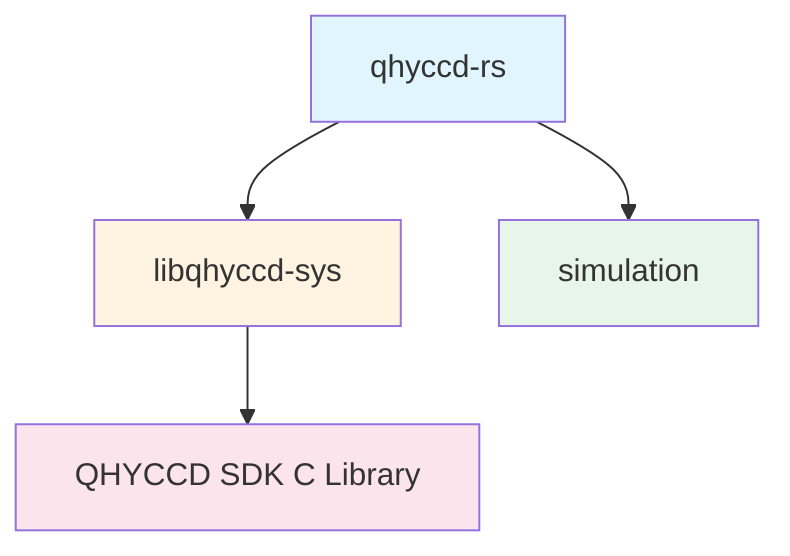
```mermaid
graph TD
    A[qhyccd-rs] --> B[libqhyccd-sys]
    A --> C[simulation]
    B --> D[QHYCCD SDK C Library]

    style A fill:#e1f5ff
    style B fill:#fff4e1
    style C fill:#e8f5e9
    style D fill:#fce4ec
```

### Crates

1. **qhyccd-rs** (main crate)
   - Safe, high-level Rust API
   - Typed error handling with `thiserror` (`QHYError`)
   - Logging with `tracing`
   - Optional simulation feature

2. **libqhyccd-sys** (FFI bindings)
   - Low-level C FFI bindings
   - Direct mapping to QHYCCD SDK functions
   - Minimal dependencies

## Architecture

### High-Level Architecture

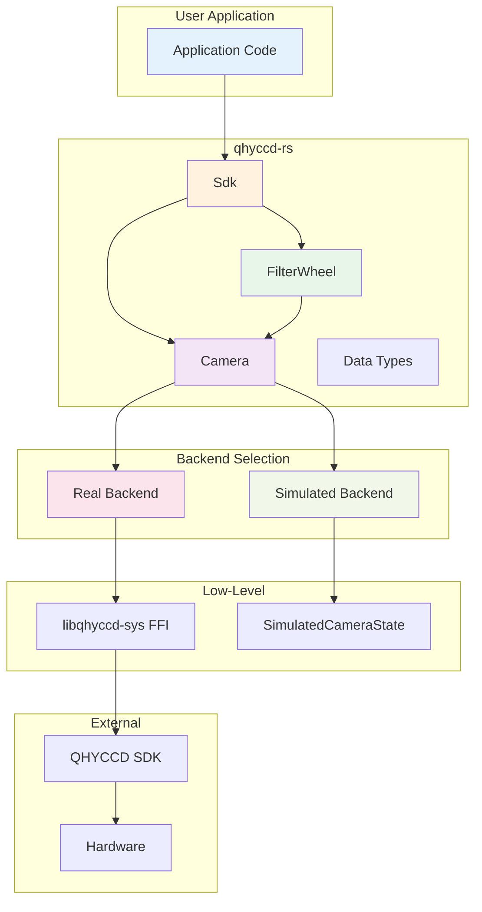
```mermaid
graph TB
    subgraph "User Application"
        APP[Application Code]
    end

    subgraph "qhyccd-rs"
        SDK[Sdk]
        CAM[Camera]
        FW[FilterWheel]
        TYPES[Data Types]
    end

    subgraph "Backend Selection"
        REAL[Real Backend]
        SIM[Simulated Backend]
    end

    subgraph "Low-Level"
        FFI[libqhyccd-sys FFI]
        SIMSTATE[SimulatedCameraState]
    end

    subgraph "External"
        QHYSDK[QHYCCD SDK]
        HW[Hardware]
    end

    APP --> SDK
    SDK --> CAM
    SDK --> FW
    FW --> CAM

    CAM --> REAL
    CAM --> SIM

    REAL --> FFI
    SIM --> SIMSTATE

    FFI --> QHYSDK
    QHYSDK --> HW

    style APP fill:#e3f2fd
    style SDK fill:#fff3e0
    style CAM fill:#f3e5f5
    style FW fill:#e8f5e9
    style REAL fill:#fce4ec
    style SIM fill:#f1f8e9
```

### Core Components

#### 1. Sdk - Entry Point and Resource Manager

The `Sdk` struct is the entry point for the library. It manages SDK initialization, device discovery, and resource cleanup.

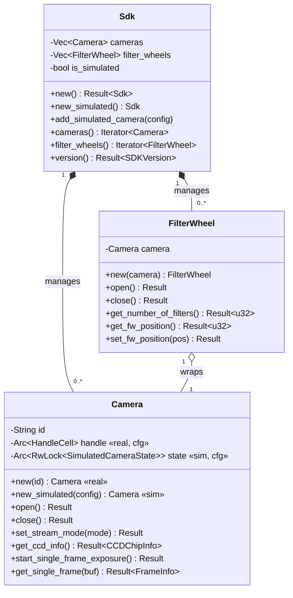
```mermaid
classDiagram
    class Sdk {
        -Vec~Camera~ cameras
        -Vec~FilterWheel~ filter_wheels
        -bool is_simulated
        +new() Result~Sdk~
        +new_simulated() Sdk
        +add_simulated_camera(config)
        +cameras() Iterator~Camera~
        +filter_wheels() Iterator~FilterWheel~
        +version() Result~SDKVersion~
    }

    class Camera {
        -String id
        -Arc~HandleCell~ handle «real, cfg»
        -Arc~RwLock~SimulatedCameraState~~ state «sim, cfg»
        +new(id) Camera «real»
        +new_simulated(config) Camera «sim»
        +open() Result
        +close() Result
        +set_stream_mode(mode) Result
        +get_ccd_info() Result~CCDChipInfo~
        +start_single_frame_exposure() Result
        +get_single_frame(buf) Result~FrameInfo~
    }

    class FilterWheel {
        -Camera camera
        +new(camera) FilterWheel
        +open() Result
        +close() Result
        +get_number_of_filters() Result~u32~
        +get_fw_position() Result~u32~
        +set_fw_position(pos) Result
    }

    Sdk "1" *-- "0..*" Camera : manages
    Sdk "1" *-- "0..*" FilterWheel : manages
    FilterWheel "1" o-- "1" Camera : wraps
```

**Responsibilities:**
- Initialize/release QHYCCD SDK resources
- Scan and enumerate connected devices
- Create Camera and FilterWheel instances
- Provide SDK version information
- Manage simulation mode

**Lifecycle:**
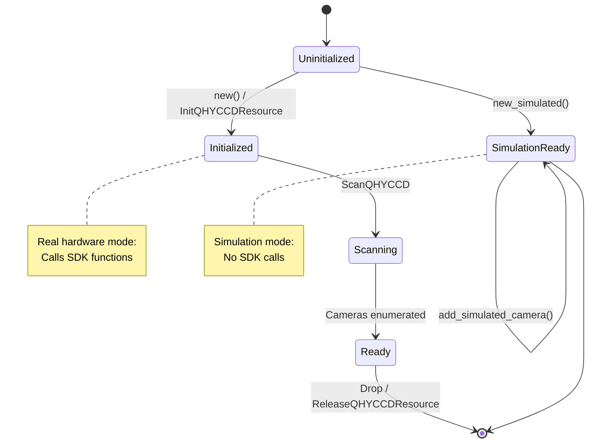
```mermaid
stateDiagram-v2
    [*] --> Uninitialized
    Uninitialized --> Initialized: new() / InitQHYCCDResource
    Initialized --> Scanning: ScanQHYCCD
    Scanning --> Ready: Cameras enumerated
    Ready --> [*]: Drop / ReleaseQHYCCDResource

    note right of Initialized
        Real hardware mode:
        Calls SDK functions
    end note

    Uninitialized --> SimulationReady: new_simulated()
    SimulationReady --> SimulationReady: add_simulated_camera()
    SimulationReady --> [*]

    note right of SimulationReady
        Simulation mode:
        No SDK calls
    end note
```

**Implementation Details:**

The `Sdk::new()` behavior changes based on the `simulation` feature flag:

- **Without simulation feature**: Calls `InitQHYCCDResource()`, scans for real hardware via `ScanQHYCCD()`, and enumerates connected devices.
- **With simulation feature**: Automatically creates a default simulated QHY178M camera with a 7-position filter wheel and cooler support.

The `Drop` implementation ensures `ReleaseQHYCCDResource()` is called when the SDK is destroyed, preventing resource leaks.

#### 2. Camera - Device Control

The `Camera` struct represents a single camera device and provides all control functionality.

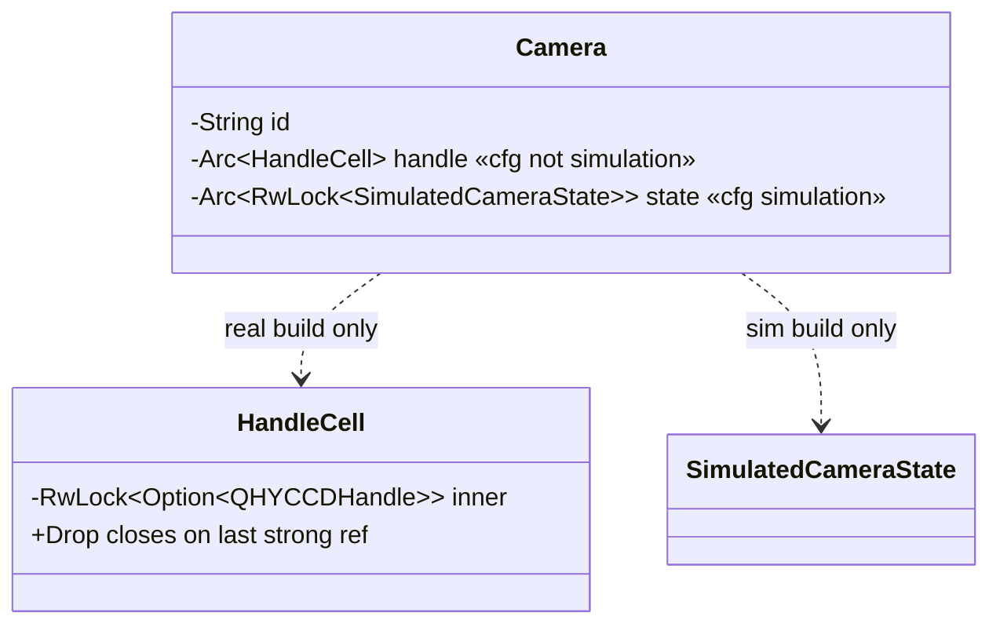
```mermaid
classDiagram
    class Camera {
        -String id
        -Arc~HandleCell~ handle «cfg not simulation»
        -Arc~RwLock~SimulatedCameraState~~ state «cfg simulation»
    }

    class HandleCell {
        -RwLock~Option~QHYCCDHandle~~ inner
        +Drop closes on last strong ref
    }

    Camera ..> HandleCell : real build only
    Camera ..> SimulatedCameraState : sim build only
```

**Backend Pattern (compile-time `#[cfg]` fork):**

The real/simulated backend is selected at **compile time** by the `simulation`
feature, matching the sibling `zwo-rs` / `svbony-rs` crates. Exactly one backend
field exists per build — `handle` without the feature, `state` with it:

```rust
pub struct Camera {
    id: String,
    #[cfg(not(feature = "simulation"))]
    handle: Arc<HandleCell>, // shared open-handle cell; Drop-closes on last ref
    #[cfg(feature = "simulation")]
    state: Arc<RwLock<SimulatedCameraState>>,
}
```

Every public method on `Camera` forks with two `#[cfg]` blocks — the real block
calls `libqhyccd-sys` FFI (via `crate::sys`), the simulation block updates
`SimulatedCameraState`. The FFI block is compiled **out** entirely under
`simulation`, so a simulated build has no FFI arm to test (as in zwo/svbony) and
the hard-to-cover FFI path never counts as uncovered.

**FFI-arm behaviour the simulation does not reproduce is hardware-verified, not
sim-verified.** Because the real arm is compiled out under `simulation`, any SDK
return semantics the simulated backend does not model are validated only against
physical hardware / ConformU-on-real. Concretely: `ExpQHYCCDSingleFrame` can
return `QHYCCD_READ_DIRECTLY` (`0x2001`) rather than `QHYCCD_SUCCESS` on the
cameras/modes where the frame is already captured — a *success* return meaning
"read it immediately." `start_single_frame_exposure` accepts it as success
(matching INDI's indi-qhy; only `QHYCCD_ERROR` is a failure), but the
`simulation` arm always succeeds, so no test in this crate exercises that branch.
When touching an FFI arm, treat the SDK's non-`SUCCESS`/non-`ERROR` returns as a
hardware-only concern the suite will not catch.

This replaced an earlier **runtime `CameraBackend` enum** (both arms always
compiled) plus a `#[automock]` FFI-mock test layer (`src/mocks.rs`), removed in
Phase 4 of the [convention-alignment plan](../../../docs/plans/archive/qhyccd-convention-alignment.md).
The backend stays **`Arc`-shared** (not a single-owner `Mutex` like zwo's
`SimState`) because a QHY filter wheel drives the *same* camera handle, so
`Camera: Clone` + handle-sharing with its `FilterWheel` is SDK-forced (Phase 1).

**Camera Operations:**

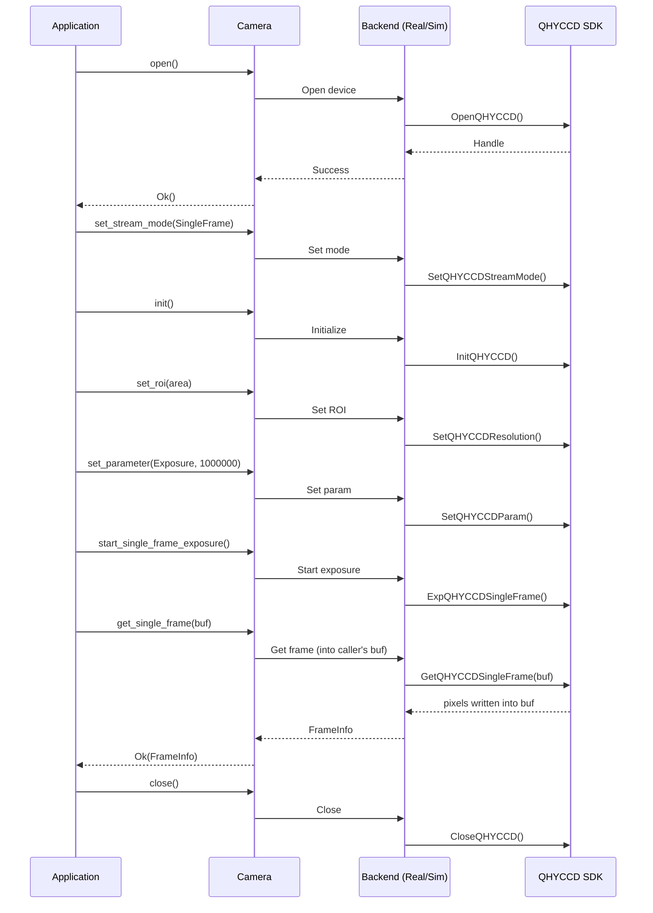
```mermaid
sequenceDiagram
    participant App as Application
    participant Cam as Camera
    participant Backend as Backend (Real/Sim)
    participant SDK as QHYCCD SDK

    App->>Cam: open()
    Cam->>Backend: Open device
    Backend->>SDK: OpenQHYCCD()
    SDK-->>Backend: Handle
    Backend-->>Cam: Success
    Cam-->>App: Ok()

    App->>Cam: set_stream_mode(SingleFrame)
    Cam->>Backend: Set mode
    Backend->>SDK: SetQHYCCDStreamMode()

    App->>Cam: init()
    Cam->>Backend: Initialize
    Backend->>SDK: InitQHYCCD()

    App->>Cam: set_roi(area)
    Cam->>Backend: Set ROI
    Backend->>SDK: SetQHYCCDResolution()

    App->>Cam: set_parameter(Exposure, 1000000)
    Cam->>Backend: Set param
    Backend->>SDK: SetQHYCCDParam()

    App->>Cam: start_single_frame_exposure()
    Cam->>Backend: Start exposure
    Backend->>SDK: ExpQHYCCDSingleFrame()

    App->>Cam: get_single_frame(buf)
    Cam->>Backend: Get frame (into caller's buf)
    Backend->>SDK: GetQHYCCDSingleFrame(buf)
    SDK-->>Backend: pixels written into buf
    Backend-->>Cam: FrameInfo
    Cam-->>App: Ok(FrameInfo)

    App->>Cam: close()
    Cam->>Backend: Close
    Backend->>SDK: CloseQHYCCD()
```

**Camera State Machine:**

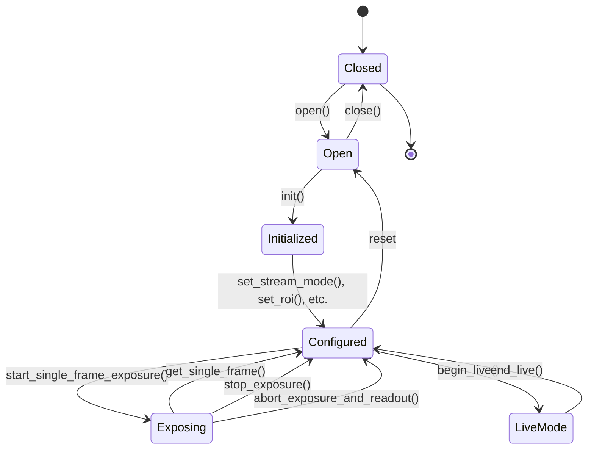
```mermaid
stateDiagram-v2
    [*] --> Closed
    Closed --> Open: open()
    Open --> Initialized: init()
    Initialized --> Configured: set_stream_mode(), set_roi(), etc.
    Configured --> Exposing: start_single_frame_exposure()
    Configured --> LiveMode: begin_live()
    Exposing --> Configured: get_single_frame()
    Exposing --> Configured: stop_exposure()
    Exposing --> Configured: abort_exposure_and_readout()
    LiveMode --> Configured: end_live()
    Configured --> Open: reset
    Open --> Closed: close()
    Closed --> [*]
```

**Key Methods:**

The `Camera` struct provides methods for:
- Device lifecycle: `open()`, `close()`, `init()`, `is_open()`
- Configuration: `set_stream_mode()`, `set_roi()`, `set_bin_mode()`, `set_bit_mode()`, `set_debayer()`
- Parameter control: `is_control_available()`, `set_parameter()`, `get_parameter()`, `get_parameter_min_max_step()`, `set_if_available()`
- Information: `get_ccd_info()`, `get_effective_area()`, `get_overscan_area()`, `get_firmware_version()`, `get_model()`, `get_type()`
- Imaging: `start_single_frame_exposure()`, `get_single_frame()`, `begin_live()`, `get_live_frame()`, `end_live()`, `get_remaining_exposure_us()`, `stop_exposure()`, `abort_exposure_and_readout()`
- Readout modes: `get_number_of_readout_modes()`, `get_readout_mode_name()`, `get_readout_mode_resolution()`, `set_readout_mode()`, `get_readout_mode()`
- Filter wheel: `is_cfw_plugged_in()`

#### 3. FilterWheel - Filter Control

The `FilterWheel` wraps a `Camera` instance to provide filter wheel control functionality. This design reflects the hardware reality: QHYCCD filter wheels are directly connected to cameras and controlled through the camera interface.

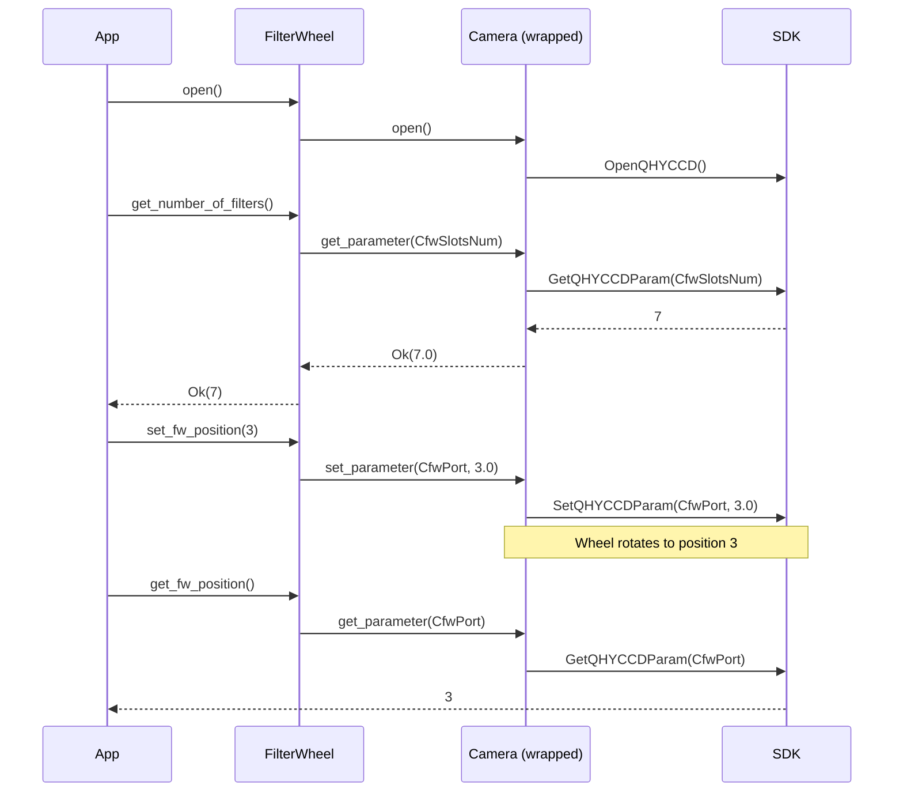
```mermaid
sequenceDiagram
    participant App
    participant FW as FilterWheel
    participant Cam as Camera (wrapped)
    participant SDK

    App->>FW: open()
    FW->>Cam: open()
    Cam->>SDK: OpenQHYCCD()

    App->>FW: get_number_of_filters()
    FW->>Cam: get_parameter(CfwSlotsNum)
    Cam->>SDK: GetQHYCCDParam(CfwSlotsNum)
    SDK-->>Cam: 7
    Cam-->>FW: Ok(7.0)
    FW-->>App: Ok(7)

    App->>FW: set_fw_position(3)
    FW->>Cam: set_parameter(CfwPort, 3.0)
    Cam->>SDK: SetQHYCCDParam(CfwPort, 3.0)
    Note over Cam,SDK: Wheel rotates to position 3

    App->>FW: get_fw_position()
    FW->>Cam: get_parameter(CfwPort)
    Cam->>SDK: GetQHYCCDParam(CfwPort)
    SDK-->>App: 3
```

**Implementation:**

The `FilterWheel` struct contains a single `Camera` field and delegates all operations to it. Filter wheel operations are implemented using the camera parameter API:
- `CfwSlotsNum` control: Returns the number of filter positions
- `CfwPort` control: Gets/sets the current filter position (0-indexed, uses ASCII encoding internally)

### Type System

#### Core Data Structures

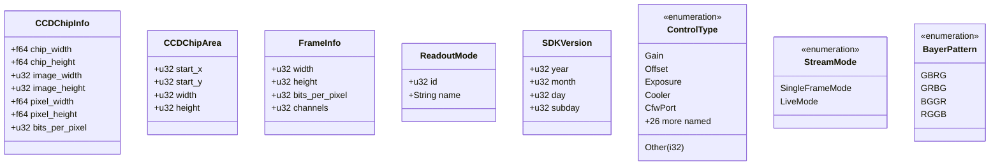
```mermaid
classDiagram
    class CCDChipInfo {
        +f64 chip_width
        +f64 chip_height
        +u32 image_width
        +u32 image_height
        +f64 pixel_width
        +f64 pixel_height
        +u32 bits_per_pixel
    }

    class CCDChipArea {
        +u32 start_x
        +u32 start_y
        +u32 width
        +u32 height
    }

    class FrameInfo {
        +u32 width
        +u32 height
        +u32 bits_per_pixel
        +u32 channels
    }

    class ReadoutMode {
        +u32 id
        +String name
    }

    class SDKVersion {
        +u32 year
        +u32 month
        +u32 day
        +u32 subday
    }

    class ControlType {
        <<enumeration>>
        Gain
        Offset
        Exposure
        Cooler
        CfwPort
        +26 more named
        Other(i32)
    }

    class StreamMode {
        <<enumeration>>
        SingleFrameMode
        LiveMode
    }

    class BayerPattern {
        <<enumeration>>
        GBRG
        GRBG
        BGGR
        RGGB
    }
```

**CCDChipInfo:**
Describes the physical sensor characteristics. Returned by `get_ccd_info()`. Contains dimensions in millimeters, pixel counts, pixel sizes in micrometers, and maximum bit depth.

**CCDChipArea:**
Defines rectangular regions on the sensor. Used for:
- ROI (Region of Interest) via `set_roi()`
- Effective imaging area via `get_effective_area()`
- Overscan area via `get_overscan_area()`

**FrameInfo:**
Describes a downloaded frame's dimensions (`width`, `height`, `bits_per_pixel`, `channels`). The pixel bytes are **not** carried here — `get_single_frame` / `get_live_frame` write them into a **caller-owned `&mut [u8]`** buffer (the `zwo-rs` / `svbony-rs` convention, since Phase 5), returning `FrameInfo` for the layout. The valid byte count is the frame's own size; the pixel structure depends on `bits_per_pixel` (8 or 16) and `channels` (1 for mono, 3 for debayered color). A buffer shorter than the frame is rejected with `QHYError::BufferTooSmall` before any pixels are written.

**ControlType:**
A small **semantic subset** of the SDK's `CONTROL_ID`s — the ~31 controls actually referenced across the workspace — plus an `Other(i32)` escape hatch carrying the raw id for any control not named. The discriminant values still match the SDK's own `CONTROL_ID` numbering, exposed via `to_raw` (renamed from the former exhaustive `Control` enum in Phase 2 of the convention-alignment plan). Named controls include:
- Basic imaging: Gain, Offset, Exposure, Brightness, Speed, TransferBit, UsbTraffic
- Color: Wbr, Wbb, Wbg (white balance), CamColor, CamIsColor
- Temperature/cooler: Cooler, CurTemp, CurPWM, ManualPWM
- Binning modes: CamBin1x1mode through CamBin8x8mode
- Frame / bit modes: CamSingleFrameMode, CamLiveVideoMode, Cam8bits, Cam16bits, OutputDataActualBits
- Filter wheel: CfwPort, CfwSlotsNum
- Misc capabilities: CamMechanicalShutter, DDR

**StreamMode:**
Two imaging modes:
- `SingleFrameMode` (0): Long exposure mode for single frames
- `LiveMode` (1): Continuous video streaming

**BayerPattern:**
Color filter array patterns for color cameras. Implements `TryFrom<u32>` for conversion from SDK values.

#### Error Handling

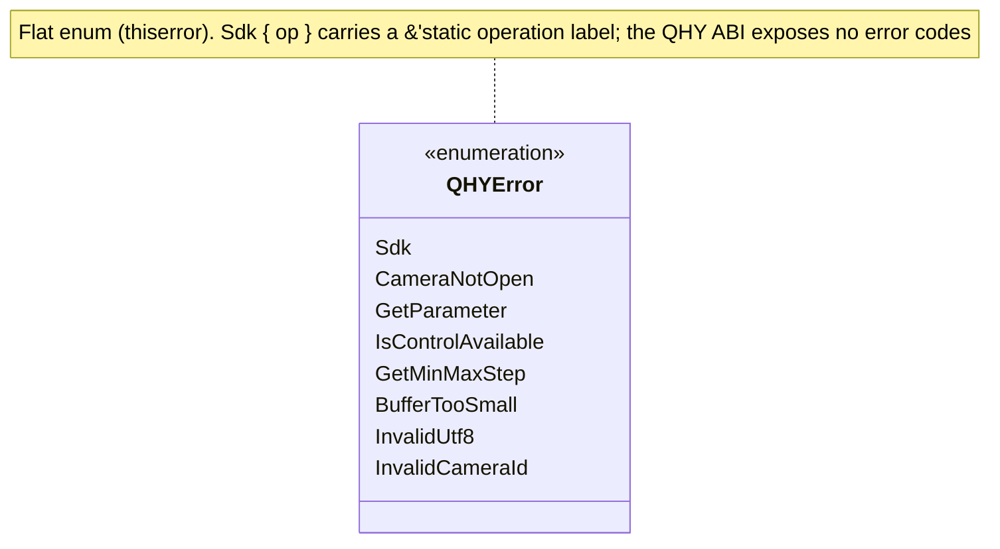
```mermaid
classDiagram
    class QHYError {
        <<enumeration>>
        Sdk
        CameraNotOpen
        GetParameter
        IsControlAvailable
        GetMinMaxStep
        BufferTooSmall
        InvalidUtf8
        InvalidCameraId
    }

    note for QHYError "Flat enum (thiserror). Sdk { op } carries a &'static operation label; the QHY ABI exposes no error codes"
```

**Error Design:**

The `QHYError` enum uses `thiserror` and is deliberately **flat**, matching the sibling `zwo-rs` / `svbony-rs` crates. Because most QHY SDK calls return a bare `u32` (`0` == success, `u32::MAX` == error) with **no discriminating error codes**, a failed plain call is reported as `Sdk { op }`, carrying a `&'static` operation label rather than a per-call-site variant. The remaining variants capture the genuinely-distinct cases: `CameraNotOpen`; the control-scoped `GetParameter` / `IsControlAvailable` / `GetMinMaxStep` (which carry the `ControlType` that failed); `BufferTooSmall { needed, got }` (the caller-owned frame buffer is shorter than the frame — detected before the SDK write); and the `#[from]` foreign errors `InvalidUtf8` / `InvalidCameraId`. The library exports a `Result<T>` alias (`Result<T, QHYError>`) and a `check(status, op)` helper — the analogue of zwo's `asi_check` / svbony's `svb_check` — that funnels the void SDK calls; both are re-exported at the crate root alongside `pub use libqhyccd_sys as sys;`.

Error handling flow:
1. FFI call returns its status word (`u32`; `QHYCCD_SUCCESS` == `0`, `QHYCCD_ERROR` == `u32::MAX`)
2. `check(status, op)` maps a non-zero status to `QHYError::Sdk { op }` (value-returning calls build the variant directly)
3. Error is logged via `tracing::error!`
4. The `QHYError` propagates to the caller via `?`

The library does not panic during normal operation. Internal state is guarded by `parking_lot::RwLock`, which cannot be poisoned, so lock acquisition is infallible and there is no poison error to model or propagate.

### FFI Layer (libqhyccd-sys)

The FFI layer provides raw bindings to the QHYCCD SDK.

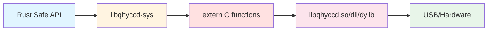
```mermaid
graph LR
    A[Rust Safe API] --> B[libqhyccd-sys]
    B --> C[extern C functions]
    C --> D[libqhyccd.so/dll/dylib]
    D --> E[USB/Hardware]

    style A fill:#e1f5ff
    style B fill:#fff4e1
    style C fill:#ffe1e1
    style D fill:#fce4ec
    style E fill:#e8f5e9
```

**Implementation:**

`libqhyccd-sys/lib.rs` declares:
- Constants: `QHYCCD_SUCCESS`, `QHYCCD_ERROR`, camera type flags
- Type alias: `QhyccdHandle` as opaque pointer type
- `extern "C"` block with function declarations
- Links to system-installed QHYCCD library via `#[link(name = "qhyccd", kind = "static")]`

**Key FFI Functions:**

SDK Lifecycle:
- `InitQHYCCDResource()` - Initialize SDK
- `ReleaseQHYCCDResource()` - Cleanup SDK
- `GetQHYCCDSDKVersion()` - Get SDK version

Device Discovery:
- `ScanQHYCCD()` - Count connected cameras
- `GetQHYCCDId()` - Get camera ID by index
- `GetQHYCCDType()` - Get camera type flags

Device Management:
- `OpenQHYCCD()` - Open camera connection
- `CloseQHYCCD()` - Close camera
- `InitQHYCCD()` - Initialize camera for use

Configuration:
- `SetQHYCCDStreamMode()` - Set single frame or live mode
- `SetQHYCCDReadMode()` - Set readout mode
- `SetQHYCCDBitsMode()` - Set bit depth
- `SetQHYCCDBinMode()` - Set binning
- `SetQHYCCDResolution()` - Set ROI
- `SetQHYCCDDebayerOnOff()` - Enable/disable debayering

Information:
- `GetQHYCCDChipInfo()` - Get sensor specifications
- `GetQHYCCDEffectiveArea()` - Get imaging area
- `GetQHYCCDOverScanArea()` - Get overscan region
- `GetQHYCCDFWVersion()` - Get firmware version
- `GetQHYCCDModel()` - Get model name
- `GetQHYCCDMemLength()` - Get required buffer size

Parameter Control:
- `IsQHYCCDControlAvailable()` - Check control support
- `GetQHYCCDParam()` - Get parameter value
- `SetQHYCCDParam()` - Set parameter value
- `GetQHYCCDParamMinMaxStep()` - Get parameter range

Imaging:
- `ExpQHYCCDSingleFrame()` - Start single frame exposure
- `GetQHYCCDSingleFrame()` - Retrieve single frame
- `BeginQHYCCDLive()` - Start live mode
- `GetQHYCCDLiveFrame()` - Get next live frame
- `StopQHYCCDLive()` - Stop live mode
- `GetQHYCCDExposureRemaining()` - Query exposure status
- `CancelQHYCCDExposing()` - Cancel exposure
- `CancelQHYCCDExposingAndReadout()` - Cancel exposure and readout

Readout Modes:
- `GetQHYCCDNumberOfReadModes()` - Count available modes
- `GetQHYCCDReadModeName()` - Get mode name
- `GetQHYCCDReadModeResolution()` - Get mode resolution
- `GetQHYCCDReadMode()` - Get current mode

Filter Wheel:
- `IsQHYCCDCFWPlugged()` - Check filter wheel presence
- `GetQHYCCDCFWStatus()` - Get filter wheel status
- `SendOrder2QHYCCDCFW()` - Send command to filter wheel

### Simulation System

The simulation feature enables development and testing without physical hardware.

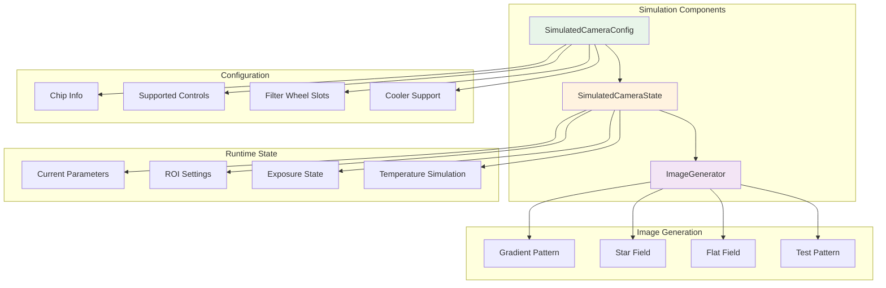
```mermaid
graph TB
    subgraph "Simulation Components"
        CONFIG[SimulatedCameraConfig]
        STATE[SimulatedCameraState]
        IMGEN[ImageGenerator]
    end

    subgraph "Configuration"
        CONFIG --> CHIPINFO[Chip Info]
        CONFIG --> CONTROLS[Supported Controls]
        CONFIG --> FW[Filter Wheel Slots]
        CONFIG --> COOLER[Cooler Support]
    end

    subgraph "Runtime State"
        STATE --> PARAMS[Current Parameters]
        STATE --> ROI[ROI Settings]
        STATE --> EXPOSURE[Exposure State]
        STATE --> TEMP[Temperature Simulation]
    end

    subgraph "Image Generation"
        IMGEN --> GRADIENT[Gradient Pattern]
        IMGEN --> STARS[Star Field]
        IMGEN --> FLAT[Flat Field]
        IMGEN --> TEST[Test Pattern]
    end

    CONFIG --> STATE
    STATE --> IMGEN

    style CONFIG fill:#e8f5e9
    style STATE fill:#fff3e0
    style IMGEN fill:#f3e5f5
```

#### Simulation Architecture

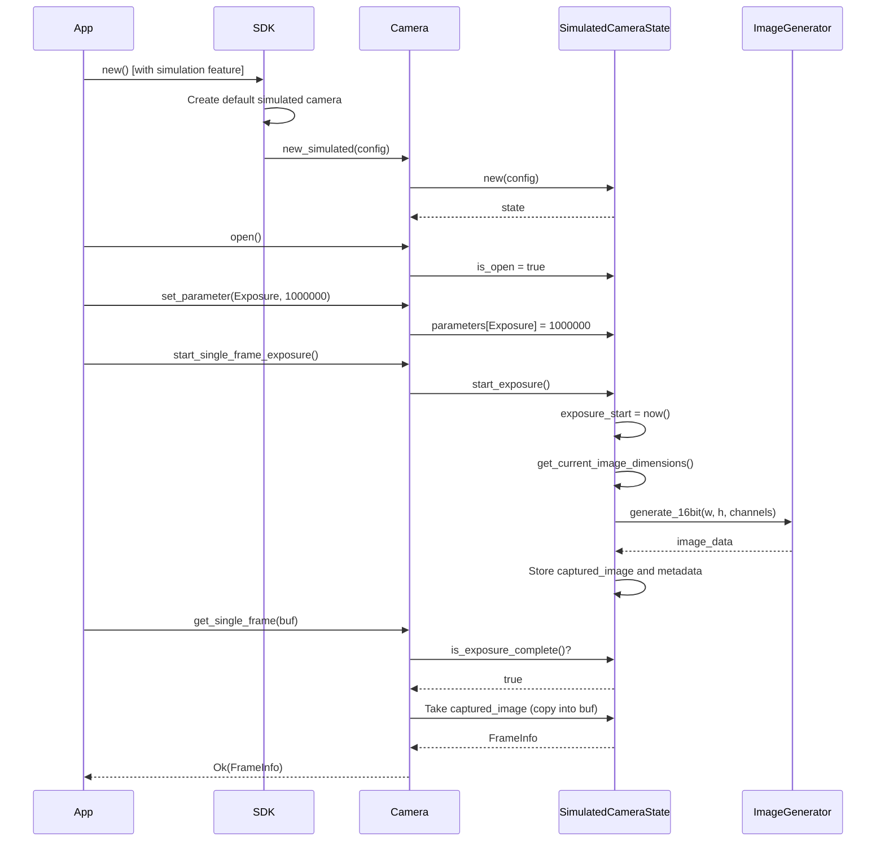
```mermaid
sequenceDiagram
    participant App
    participant SDK
    participant Camera
    participant SimState as SimulatedCameraState
    participant ImgGen as ImageGenerator

    App->>SDK: new() [with simulation feature]
    SDK->>SDK: Create default simulated camera
    SDK->>Camera: new_simulated(config)
    Camera->>SimState: new(config)
    SimState-->>Camera: state

    App->>Camera: open()
    Camera->>SimState: is_open = true

    App->>Camera: set_parameter(Exposure, 1000000)
    Camera->>SimState: parameters[Exposure] = 1000000

    App->>Camera: start_single_frame_exposure()
    Camera->>SimState: start_exposure()
    SimState->>SimState: exposure_start = now()
    SimState->>SimState: get_current_image_dimensions()
    SimState->>ImgGen: generate_16bit(w, h, channels)
    ImgGen-->>SimState: image_data
    SimState->>SimState: Store captured_image and metadata

    App->>Camera: get_single_frame(buf)
    Camera->>SimState: is_exposure_complete()?
    SimState-->>Camera: true
    Camera->>SimState: Take captured_image (copy into buf)
    SimState-->>Camera: FrameInfo
    Camera-->>App: Ok(FrameInfo)
```

#### SimulatedCameraConfig

Located in `src/simulation.rs`. Provides configuration for simulated cameras using the builder pattern.

**Structure:**
- `id`: Camera identifier string
- `model`: Model name string
- `chip_info`: Sensor specifications
- `effective_area`: Imaging area
- `overscan_area`: Overscan region
- `supported_controls`: HashMap of ControlType -> (min, max, step)
- `filter_wheel_slots`: Number of filter positions (0 = no wheel)
- `has_cooler`: Cooler availability
- `bayer_pattern`: Color pattern (None for mono)
- `readout_modes`: List of (name, (width, height))
- `camera_type`: Type code
- `firmware_version`: Version string

**Default Configuration:**
Mimics a QHY178M monochrome camera:
- 3072×2048 resolution
- 2.4µm pixel size
- 16-bit depth
- Standard controls (Gain, Offset, Exposure, Speed, UsbTraffic, TransferBit)
- Binning modes (1×1, 2×2)
- Frame modes (Single, Live)

**Builder Methods:**
- `with_id()`: Set camera ID
- `with_model()`: Set model name
- `with_filter_wheel()`: Add N-position filter wheel
- `with_color()`: Make color camera with Bayer pattern
- `with_cooler()`: Add temperature control
- `with_chip_info()`: Custom sensor specs
- `with_readout_mode()`: Add custom readout mode
- `with_firmware_version()`: Set firmware string
- `with_control()`: Add custom control support

#### SimulatedCameraState

Located in `src/simulation.rs`. Maintains runtime state for simulated cameras.

**State Fields:**
- `config`: Reference to configuration
- `is_open`: Connection state
- `is_initialized`: Initialization state
- `stream_mode`: Current mode (Single/Live)
- `parameters`: Current values for all controls
- `roi`: Current region of interest
- `binning`: Current binning (x, y)
- `bit_depth`: Current bit depth (8 or 16)
- `readout_mode`: Current mode index
- `live_mode_active`: Live streaming state
- `exposure_start`: Exposure start time
- `exposure_duration_us`: Exposure duration
- `captured_image`: Pre-generated image data (available after exposure completes)
- `captured_image_metadata`: Dimensions and metadata for the captured image
- `filter_wheel_position`: Current filter (0-indexed)
- `target_temperature`: Target cooler temp
- `current_temperature`: Simulated actual temp
- `cooler_pwm`: Cooler power (0-255)
- `debayer_enabled`: Debayering state

**Key Methods:**
- `new()`: Initialize from config with default parameter values
- `get_current_image_dimensions()`: Returns ROI dimensions directly (already in binned coordinates when set via ASCOM Alpaca)
- `get_bytes_per_pixel()`: 1 for 8-bit, 2 for 16-bit
- `get_channels()`: 1 for mono, 3 for color with debayer
- `calculate_buffer_size()`: Total buffer size needed
- `get_remaining_exposure_us()`: Time until exposure complete
- `is_exposure_complete()`: Check if exposure finished
- `start_exposure()`: Begin exposure timing and pre-generate image data
- `stop_exposure()`: Stop exposure but preserve image data (for retrieval with `get_single_frame()`)
- `abort_exposure()`: Abort exposure and discard image data
- `update_temperature()`: Simulate cooling behavior

**Temperature Simulation:**
The `update_temperature()` method simulates realistic cooling behavior:
- When cooler active: Temperature approaches target based on PWM
- Cooling rate: up to 0.1°C per update at full PWM
- When cooler off: Temperature warms toward ambient (20°C)
- Temperature stored in `parameters[CurTemp]`

**ROI and Binning Coordinate System:**

The simulation handles ROI (Region of Interest) dimensions in a way that's compatible with ASCOM Alpaca integration:

- ROI dimensions in `SimulatedCameraState` are stored in **binned coordinates**
- When binning changes in an ASCOM Alpaca server, the server automatically scales the ROI dimensions by the binning factor
- `get_current_image_dimensions()` returns the ROI dimensions directly without applying binning division
- This matches the behavior of the QHYCCD SDK where `SetQHYCCDResolution()` is called after `SetQHYCCDBinMode()`

For example:
- Full frame at 1×1 binning: 3072×2048 pixels
- When binning changes to 2×2, the ASCOM Alpaca server updates ROI to 1536×1024 (already binned)
- `get_current_image_dimensions()` returns 1536×1024 directly (not 768×512)

This design prevents double-binning issues and ensures the simulation generates images with the correct dimensions expected by ASCOM Alpaca clients.

#### ImageGenerator

Located in `src/simulation.rs`. Generates test images for simulated captures.

**Pattern Types:**
- `Gradient`: Linear gradient with noise
- `StarField`: Simulated stars on dark background
- `Flat`: Uniform field with noise
- `TestPattern`: Geometric shapes for testing

**Configuration:**
- `pattern`: Which pattern to generate
- `noise_level`: Noise amplitude (0.0-1.0)
- `base_level`: Base signal level in ADU

**Methods:**
- `new()`: Create generator with pattern
- `with_noise_level()`: Set noise amount
- `with_base_level()`: Set base signal
- `generate_8bit()`: Create 8-bit image
- `generate_16bit()`: Create 16-bit image

**Implementation:**
Uses the `rand` crate to generate random noise and `rayon` for parallel processing. Each pattern has separate implementations for 8-bit and 16-bit output. The generators fill the provided buffer with appropriate pixel values, supporting multi-channel output for color images. Images are pre-generated during `start_exposure()` in the simulation backend for immediate retrieval when `get_single_frame()` is called.

## Control System

The library provides extensive control over camera parameters through the `ControlType` enum — a semantic subset of the SDK's `CONTROL_ID`s plus an `Other(i32)` escape hatch.

### Control Categories

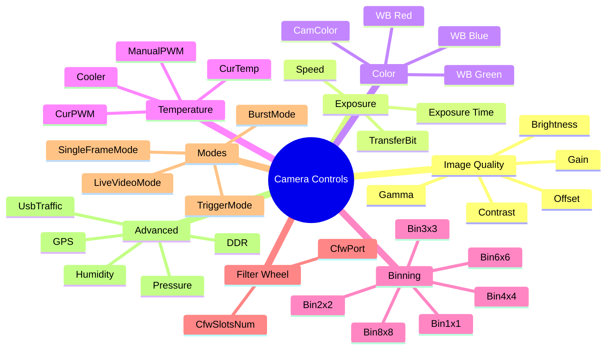
```mermaid
mindmap
  root((Camera Controls))
    Image Quality
      Gain
      Offset
      Brightness
      Contrast
      Gamma
    Exposure
      Exposure Time
      Speed
      TransferBit
    Color
      WB Red
      WB Blue
      WB Green
      CamColor
    Temperature
      Cooler
      CurTemp
      CurPWM
      ManualPWM
    Binning
      Bin1x1
      Bin2x2
      Bin3x3
      Bin4x4
      Bin6x6
      Bin8x8
    Filter Wheel
      CfwPort
      CfwSlotsNum
    Modes
      SingleFrameMode
      LiveVideoMode
      TriggerMode
      BurstMode
    Advanced
      UsbTraffic
      DDR
      GPS
      Humidity
      Pressure
```

### Control Flow

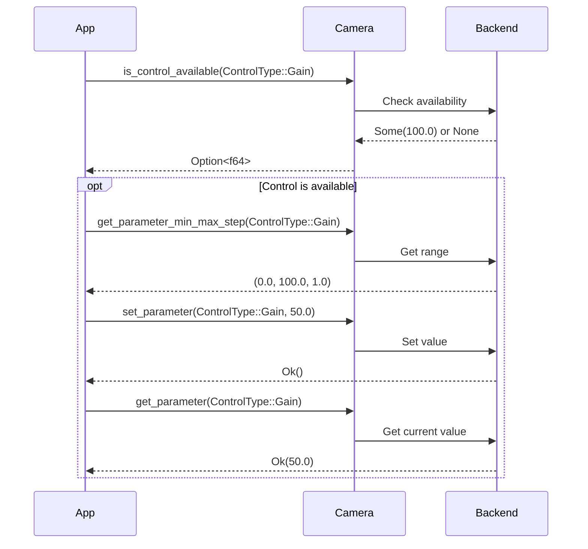
```mermaid
sequenceDiagram
    participant App
    participant Camera
    participant Backend

    App->>Camera: is_control_available(ControlType::Gain)
    Camera->>Backend: Check availability
    Backend-->>Camera: Some(100.0) or None
    Camera-->>App: Option<f64>

    opt Control is available
        App->>Camera: get_parameter_min_max_step(ControlType::Gain)
        Camera->>Backend: Get range
        Backend-->>App: (0.0, 100.0, 1.0)

        App->>Camera: set_parameter(ControlType::Gain, 50.0)
        Camera->>Backend: Set value
        Backend-->>App: Ok()

        App->>Camera: get_parameter(ControlType::Gain)
        Camera->>Backend: Get current value
        Backend-->>App: Ok(50.0)
    end
```

**Control Checking:**

The `is_control_available()` method returns `Option<u32>`:
- `Some(value)`: control is supported (the `u32` is the SDK's support flag, or the Bayer mode for `CamColor`)
- `None`: control is not supported by this camera

For real hardware, this calls `IsQHYCCDControlAvailable()`. For simulation, it checks the `supported_controls` HashMap.

**Parameter Operations:**

All parameter operations use the `ControlType` enum:
1. Check availability with `is_control_available()`
2. Optionally get valid range with `get_parameter_min_max_step()`
3. Set value with `set_parameter(control, value)`
4. Read value with `get_parameter(control)`

Parameter values are always `f64`, even for integer-like controls. The SDK uses floating-point for all parameter values.

## Imaging Modes

### Single Frame Mode

Long exposure mode for deep-sky imaging:

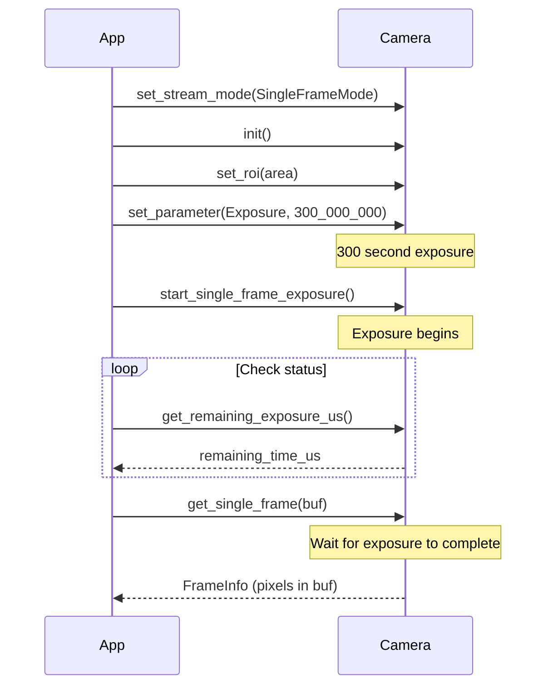
```mermaid
sequenceDiagram
    participant App
    participant Camera

    App->>Camera: set_stream_mode(SingleFrameMode)
    App->>Camera: init()
    App->>Camera: set_roi(area)
    App->>Camera: set_parameter(Exposure, 300_000_000)
    Note over Camera: 300 second exposure

    App->>Camera: start_single_frame_exposure()
    Note over Camera: Exposure begins

    loop Check status
        App->>Camera: get_remaining_exposure_us()
        Camera-->>App: remaining_time_us
    end

    App->>Camera: get_single_frame(buf)
    Note over Camera: Wait for exposure to complete
    Camera-->>App: FrameInfo (pixels in buf)
```

**Single Frame Workflow:**

1. Set stream mode to `SingleFrameMode`
2. Initialize camera with `init()`
3. Configure ROI, binning, bit depth as needed
4. Set exposure time via `set_parameter(ControlType::Exposure, microseconds)`
5. Call `start_single_frame_exposure()` to begin
6. Optionally poll with `get_remaining_exposure_us()`
7. Allocate a `&mut [u8]` of `get_image_size()` bytes and call `get_single_frame(&mut buf)` to retrieve the frame (blocks if not ready; pixels land in `buf`, dimensions in the returned `FrameInfo`)

For simulation, the exposure timing is tracked with `Instant` and `exposure_duration_us`. The simulated camera pre-generates image data when `start_single_frame_exposure()` is called, making it available for later retrieval.

**Exposure Cancellation:**

There are two ways to cancel an ongoing exposure, each with different behavior:

1. **`stop_exposure()`** - Stops the exposure but **preserves the image data** in the camera
   - Corresponds to QHYCCD SDK's `CancelQHYCCDExposing()`
   - The partially exposed image remains available for retrieval via `get_single_frame()`
   - Useful when you want to retrieve a shorter exposure than originally planned

2. **`abort_exposure_and_readout()`** - Stops the exposure and **discards the image data**
   - Corresponds to QHYCCD SDK's `CancelQHYCCDExposingAndReadout()`
   - No image data can be retrieved after calling this
   - Useful when you want to immediately start a new exposure

In simulation mode, these methods correctly preserve or discard the pre-generated image data accordingly.

### Live Mode

Continuous video streaming for focusing and framing:

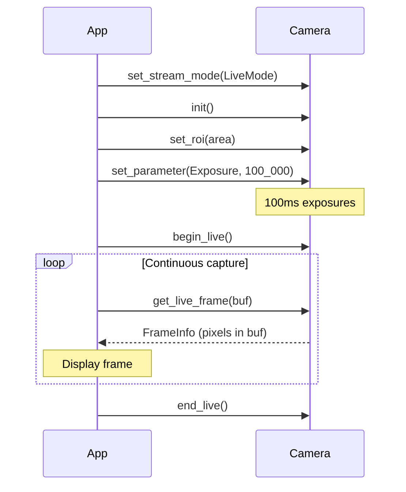
```mermaid
sequenceDiagram
    participant App
    participant Camera

    App->>Camera: set_stream_mode(LiveMode)
    App->>Camera: init()
    App->>Camera: set_roi(area)
    App->>Camera: set_parameter(Exposure, 100_000)
    Note over Camera: 100ms exposures

    App->>Camera: begin_live()

    loop Continuous capture
        App->>Camera: get_live_frame(buf)
        Camera-->>App: FrameInfo (pixels in buf)
        Note over App: Display frame
    end

    App->>Camera: end_live()
```

**Live Mode Workflow:**

1. Set stream mode to `LiveMode`
2. Initialize camera with `init()`
3. Configure for fast readout (smaller ROI, more binning)
4. Set short exposure time
5. Call `begin_live()` to start streaming
6. Repeatedly call `get_live_frame()` to get frames
7. Call `end_live()` when done

Live mode provides continuous frame capture with minimal latency. Each call to `get_live_frame()` returns the next available frame.

## Thread Safety

The library is designed for multi-threaded applications:

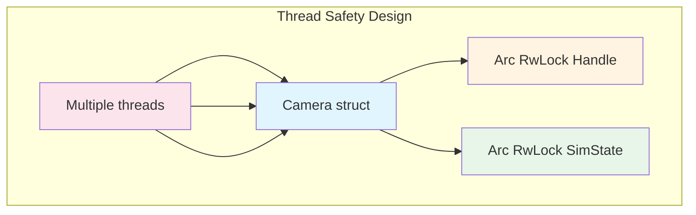
```mermaid
graph TB
    subgraph "Thread Safety Design"
        A[Camera struct] --> B[Arc RwLock Handle]
        A --> C[Arc RwLock SimState]
        D[Multiple threads] --> A
        D --> A
        D --> A
    end

    style A fill:#e1f5ff
    style B fill:#fff4e1
    style C fill:#e8f5e9
    style D fill:#fce4ec
```

**Thread Safety Implementation:**

The camera backend uses `Arc<parking_lot::RwLock<T>>` for shared state — the
compile-time-selected field (see *Backend Pattern* above):
- Real build (`#[cfg(not(feature = "simulation"))]`): `handle: Arc<HandleCell>`, wrapping `RwLock<Option<QHYCCDHandle>>`
- Sim build (`#[cfg(feature = "simulation")]`): `state: Arc<RwLock<SimulatedCameraState>>`

`parking_lot::RwLock` is used (not `std::sync::RwLock`) because it cannot be poisoned: `read()`/`write()` return the guard directly, so lock acquisition is infallible and no panic in another thread can wedge later lock users. This matches the consuming camera services, which already use `parking_lot`.

`Camera::clone()` is cheap - it clones the `Arc` backend field, incrementing the reference count. Multiple clones (and a camera's `FilterWheel`) share the same underlying state.

**Locking Strategy:**

`HandleCell::with_handle` is the crate's only route to the handle, and it holds the cell's read lock across the FFI call:

```rust
pub(crate) fn with_handle<T>(&self, f: impl FnOnce(*const c_void) -> T) -> Result<T> {
    let cell = self.inner.read();
    match *cell {
        Some(handle) => Ok(f(handle.ptr)),   // <- the guard is still held here
        None => Err(QHYError::CameraNotOpen),
    }
}
```

It is a closure rather than an accessor on purpose: the borrow ends with the call, so scoping the handle to the guard is what the signature makes easy and a caller has to go out of its way to widen it. That is a discipline rather than a guarantee — `T` is unconstrained, so a closure that returned the pointer would carry it past the guard, and callers instead use the handle inside `f` and let it go. `open`/`close` take the **write** lock, so `CloseQHYCCD` waits for every call in flight instead of freeing the device beneath one — the guarantee the sibling `zwo-rs`/`svbony-rs` backends get from holding their handle mutex across the call. Freeing a handle under a live transfer is not a recoverable error: libusb reports it as a `usbi_mutex_lock` assertion, and it can corrupt the context every QHY device on the bus shares.

Because the lock is infallible, the only failure is an unopened handle (`None`), reported as `CameraNotOpen` — the accurate cause, matching the simulation backend rather than a misleading operation-specific error. The closure does not run in that case.

Two *non-close* calls on one handle still run concurrently: they are both read guards. That is deliberate and matches practice — INDI's `indi-qhy` polls `GetQHYCCDParam(CONTROL_CURTEMP)` from its event-loop timer while `GetQHYCCDSingleFrame` blocks on its imaging thread, holding no lock at all — and the SDK manual takes no position on per-handle concurrency. Excluding a close is the property no QHY driver gets for free; indi-qhy buys it with a `pthread_join` before its `CloseQHYCCD`.

**Thread Safety Guarantees:**

- `Camera`: `Send + Sync` (via backend components)
- `FilterWheel`: `Send + Sync` (wraps Camera)
- `Sdk`: `Send + Sync` (contains Vec of Send+Sync types)
- `QHYCCDHandle`: manually implements `Send + Sync`. The pointer is opaque and never dereferenced in Rust; what makes sharing it sound is that `with_handle` keeps it alive for the duration of every call made through it.

Multiple threads can safely:
- Clone cameras and operate on separate clones
- Call methods concurrently (both take the read guard; a close is excluded)
- Share ownership via Arc (already built-in to backend)

The discipline is covered by the `handle_cell_tests` module in `src/camera.rs`: a live call excludes the write lock a close needs, two calls do not exclude each other, and an unopened cell refuses without running the closure.

## Usage Patterns

### Basic Camera Operation

```rust
use qhyccd_rs::{Sdk, StreamMode, ControlType};

// Initialize SDK and find cameras
let sdk = Sdk::new()?;
let camera = sdk.cameras().next().ok_or("No camera found")?;

// Open and configure
camera.open()?;
camera.set_stream_mode(StreamMode::SingleFrameMode)?;
camera.init()?;

// Get chip info
let chip_info = camera.get_ccd_info()?;
println!("Sensor: {}x{} pixels", chip_info.image_width, chip_info.image_height);

// Set exposure
camera.set_parameter(ControlType::Exposure, 1_000_000.0)?; // 1 second

// Capture image into a caller-owned buffer
camera.start_single_frame_exposure()?;
let mut buf = vec![0u8; camera.get_image_size()?];
let info = camera.get_single_frame(&mut buf)?;
println!("Captured {}x{} frame ({} bytes)", info.width, info.height, buf.len());

camera.close()?;
```

### Filter Wheel Control

```rust
// Find filter wheel
let fw = sdk.filter_wheels().next().ok_or("No filter wheel")?;

fw.open()?;

// Get number of positions
let num_filters = fw.get_number_of_filters()?;
println!("Filter wheel has {} positions", num_filters);

// Move to position 3
fw.set_fw_position(3)?;

// Verify position
let pos = fw.get_fw_position()?;
assert_eq!(pos, 3);

fw.close()?;
```

### Simulation Mode

```rust
#[cfg(feature = "simulation")]
{
    // Default simulation (automatic)
    let sdk = Sdk::new()?; // Creates simulated QHY178M

    // Custom simulation
    let mut sdk = Sdk::new_simulated();
    let config = SimulatedCameraConfig::default()
        .with_id("CUSTOM-CAM")
        .with_model("Custom Model")
        .with_filter_wheel(5)
        .with_cooler()
        .with_color(BayerPattern::RGGB);
    sdk.add_simulated_camera(config);

    // Use identically to real hardware
    let camera = sdk.cameras().next().unwrap();
    camera.open()?;
    // ... normal operations
}
```

### Temperature Control

```rust
use std::time::Duration;

// Check if cooler is available
if camera.is_control_available(ControlType::Cooler).is_some() {
    // Set target temperature to -10°C
    camera.set_parameter(ControlType::Cooler, -10.0)?;

    // Monitor cooling
    loop {
        let current = camera.get_parameter(ControlType::CurTemp)?;
        let pwm = camera.get_parameter(ControlType::CurPWM)?;
        println!("Temp: {:.1}°C, PWM: {:.0}%", current, pwm / 255.0 * 100.0);

        if (current - (-10.0)).abs() < 0.5 {
            break;
        }
        std::thread::sleep(Duration::from_secs(5));
    }
}
```

### Readout Mode Selection

```rust
// Query available readout modes
let num_modes = camera.get_number_of_readout_modes()?;

for i in 0..num_modes {
    let mode = camera.get_readout_mode_name(i)?;
    let (width, height) = camera.get_readout_mode_resolution(i)?;
    println!("Mode {}: {} ({}x{})", i, mode.name, width, height);
}

// Select a specific mode
camera.set_readout_mode(1)?;

// Verify current mode
let current = camera.get_readout_mode()?;
assert_eq!(current, 1);
```

## Design Patterns

### Builder Pattern

Used extensively in simulation configuration:
- `SimulatedCameraConfig::default().with_*()` - Configure simulated cameras
- `ImageGenerator::new().with_*()` - Configure image generation

Each `with_*()` method consumes `self` and returns `Self`, enabling method chaining.

### Wrapper Pattern

`FilterWheel` wraps `Camera` to provide a specialized interface for filter wheel operations. This reflects the hardware architecture where filter wheels are connected to and controlled through cameras. The wrapper delegates all operations to the underlying camera's parameter API.

### Compile-time backend selection

The real vs. simulated backend is chosen at **compile time** by the `simulation`
feature (the sibling `zwo-rs` / `svbony-rs` convention). Every public `Camera`
method forks with two `#[cfg]` blocks, one calling `libqhyccd-sys` FFI and one
updating `SimulatedCameraState`; only the selected block is compiled. User code
works identically against either build. This replaced an earlier runtime
`CameraBackend` enum + `#[automock]` FFI-mock test layer (removed in Phase 4 of the
convention-alignment plan).

### Resource Acquisition Is Initialization (RAII)

The `Sdk` struct follows RAII principles:
- Constructor (`new()`) calls `InitQHYCCDResource()`
- Destructor (`Drop`) calls `ReleaseQHYCCDResource()`
- Ensures proper cleanup even during panics
- Prevents resource leaks

The shared real handle cell (`HandleCell`, real build only) *also* follows RAII: its `Drop` calls `CloseQHYCCD()` when the last strong reference (the `Camera` and any clones, including its `FilterWheel`) is released, so a dropped-open camera no longer leaks the handle. `Sdk::drop` additionally closes every still-open camera handle *before* `ReleaseQHYCCDResource()`, per the SDK's documented Close-then-Release ordering (Phase 1 of the convention plan).

### Interior Mutability

Uses `Arc<RwLock<T>>` to provide shared mutable state across threads while maintaining Rust's safety guarantees. This allows `Camera` to be `Clone` and `Send + Sync` while still supporting mutation through the lock.

### Scoped Handle Access

`HandleCell::with_handle` centralizes the common pattern of:
1. Acquiring the read lock
2. Checking whether the camera is open
3. Running the SDK call **while still holding the lock**
4. Providing error context

Passing a closure rather than returning the handle is what makes step 3 the
only way to reach the pointer: it cannot be stored, returned, or used after the
guard drops, so no call site can put a handle into the SDK that a concurrent
`close` is free to release. It also keeps the error context in one place across
all 33 call sites.

## Error Handling Strategy

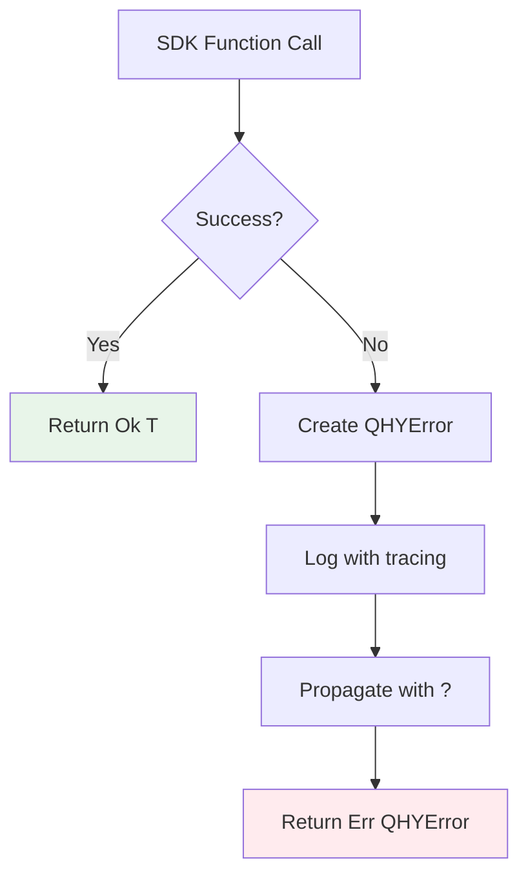
```mermaid
graph TD
    A[SDK Function Call] --> B{Success?}
    B -->|Yes| C[Return Ok T ]
    B -->|No| D[Create QHYError]
    D --> E[Log with tracing]
    E --> F[Propagate with ?]
    F --> G[Return Err QHYError]

    style C fill:#e8f5e9
    style G fill:#ffebee
```

**Error Flow:**

1. FFI call returns its status word (or a value with a `u32::MAX` sentinel)
2. `check(status, op)` (for void calls) or an explicit sentinel check (for value-returning calls) detects failure against `QHYCCD_SUCCESS` / `QHYCCD_ERROR`
3. Build the typed `QHYError` (`Sdk { op }`, or a control-scoped variant)
4. Log error with `tracing::error!(?error)`
5. Propagate with the `?` operator (foreign errors convert via `#[from]`)

**Error Types:**

`QHYError` is a flat 8-variant enum:
- `Sdk { op }` — any plain SDK success/fail call, tagged with a `&'static` operation label (the QHY ABI carries no error code to preserve)
- `CameraNotOpen`
- `GetParameter` / `IsControlAvailable` / `GetMinMaxStep` — carry the `ControlType` that failed
- `BufferTooSmall { needed, got }` — the caller-owned frame buffer is shorter than the frame (Phase 5)
- `InvalidUtf8` / `InvalidCameraId` — foreign errors captured via `#[from]`
- Formatted error messages using `thiserror`

**Logging:**

Every error path includes a `tracing::error!` call with the error details. This provides detailed diagnostics without exposing internal errors to end users.

## Testing Strategy

### Unit Tests

In-source `#[cfg(test)]` modules, run against the **simulated** backend (there is
**no FFI-mock layer** — the real FFI arm is `#[cfg]`'d out under `simulation`, as in
`zwo-rs` / `svbony-rs`):
- `src/error.rs`: `QHYError` construction (incl. `BufferTooSmall`), the `check` helper, `Display`, and the `#[from]` conversions
- `src/camera.rs`: `ControlType` ⇄ raw `CONTROL_ID` round-trip
- `src/types.rs`: `BayerPattern::try_from`
- `src/simulation.rs`: `SimulatedCameraState` and `ImageGenerator` behaviour (state management, timing, parameter handling)

The former `src/tests/` `#[automock]` FFI-mock suite and `src/mocks.rs` were removed
in Phase 4 of the convention-alignment plan. Behaviour that lived only in the real
FFI arm — the `u32::MAX` / `QHYCCD_ERROR_F64` sentinel decodes, C-string (`CStr` /
`CString`) handling, the scan/enumeration pipeline, and `Drop` / teardown ordering —
is exercised on real hardware via ConformU, not unit-tested, matching the siblings.

### Integration Tests

Located in the top-level `tests/` directory (Cargo integration tests):
- `tests/simulation_tests.rs`: Entry point for simulation integration tests
- `tests/simulation/config_tests.rs`: SimulatedCameraConfig builder tests
- `tests/simulation/image_generator_tests.rs`: Image generation tests
- `tests/simulation/camera_tests.rs`: Simulated camera workflow tests
- `tests/common/mod.rs`: Common test utilities

The simulation feature enables comprehensive integration testing:
- Test complete workflows without hardware
- Verify state transitions
- Test error conditions
- Validate parameter validation

Example programs in `examples/` (run with `--features simulation`):
- `SingleFrameMode.rs`: Demonstrates single frame capture
- `LiveFrameMode.rs`: Demonstrates live video mode
- `test.rs`: Development testing

## Performance Considerations

### Zero-Cost Abstractions

- Thin wrappers over FFI calls with minimal overhead
- Small functions eligible for inlining
- Enums compile to efficient match statements
- No runtime cost for unused features (simulation is feature-gated)

### Memory Management

Image buffer handling (caller-owned, since Phase 5):
1. Query frame size with `get_image_size()` (`GetQHYCCDMemLength()`)
2. The **caller** allocates a `&mut [u8]` of at least that size
3. `get_single_frame` / `get_live_frame` bounds-check it, then pass its raw pointer to the FFI
4. FFI fills the caller's buffer directly (the simulated backend copies its generated frame in)
5. Return a `FrameInfo` with the dimensions; the pixels are already in the caller's buffer

No `Vec` is allocated per frame inside the library. Buffer reuse is natural: the caller owns the buffer and can reuse it across frames.

### Locking Strategy

- Read locks for queries (multiple concurrent readers allowed)
- Write locks only for open/close
- The read lock is held **across** the SDK call, so a close cannot free the
  handle under one; it is not held across API boundaries
- `HandleCell::with_handle` is the only route to the handle, so that duration is
  the same at every call site

### Conditional Compilation

Features and conditional compilation minimize compiled code:
- `#[cfg(feature = "simulation")]`: Simulation arms only when enabled
- `#[cfg(not(feature = "simulation"))]`: Real FFI arms + handle machinery only without the simulation feature
- `#[cfg(test)]`: Test code only in test builds

## Platform Support

| Platform | Architecture | Status | Notes |
|----------|-------------|--------|-------|
| Linux | x86_64 | ✅ Full Support | Primary development platform |
| Linux | aarch64 | ✅ Full Support | ARM64/Raspberry Pi |
| Windows | x64 | ✅ Full Support | Requires QHYCCD SDK installed |
| macOS | x86_64 (Intel) | ⚠️ Experimental | Limited testing |
| macOS | aarch64 (Apple Silicon) | ⚠️ Experimental | Limited testing |

**Platform Requirements:**

Linux:
- libusb-1.0-dev development package
- QHYCCD SDK installed to system library paths
- udev rules for camera access

Windows:
- QHYCCD SDK installer (includes drivers)
- Visual C++ redistributable

macOS:
- QHYCCD SDK installer
- USB permissions

## Dependencies

### Runtime Dependencies

From `Cargo.toml`:

**Required:**
- `libqhyccd-sys` (0.1.4, path): Internal FFI crate
- `thiserror` (workspace): Typed error enum (`QHYError`)
- `tracing` (workspace): Structured logging
- `parking_lot` (workspace): Non-poisoning `RwLock` guarding the camera handle / simulated state

**Dev-dependencies:**
- `tracing-subscriber` (workspace): Logging setup for the `examples/` demos

**Optional (simulation feature only):**
- `rand` (workspace): Random number generation for image noise
- `rayon` (workspace): Parallel processing for improved simulation performance

`Camera`'s id-only `PartialEq` is hand-rolled, so the crate no longer depends on
`derive_more`; the `#[automock]` FFI-mock layer is gone, so it no longer depends on
`mockall` (both removed in Phase 4 of the convention-alignment plan).

### System Dependencies

- **libqhyccd**: QHYCCD SDK library (system-installed)
- **libusb-1.0** (Linux): USB communication

The `libqhyccd-sys` crate links against the system-installed QHYCCD library via:
```rust
#[link(name = "qhyccd", kind = "static")]
```

## Module Organization

```
qhyccd-rs/
├── src/
│   ├── lib.rs              # Library root - module declarations and re-exports
│   ├── camera.rs           # Camera device (impl blocks) + ControlType + real-only handle machinery
│   ├── error.rs            # Flat QHYError enum + check() helper
│   ├── types.rs            # Public data types (FrameInfo, CCDChipInfo, …)
│   ├── sdk.rs              # Sdk implementation (real/sim #[cfg] fork)
│   ├── filter_wheel.rs     # FilterWheel implementation (delegates to Camera)
│   └── simulation.rs       # Simulation backend (feature-gated): SimulatedCameraConfig,
│                           #   SimulatedCameraState, ImageGenerator + in-source tests
├── examples/               # Demo programs (run with --features simulation)
│   ├── LiveFrameMode.rs
│   ├── SingleFrameMode.rs
│   └── test.rs
├── tests/                  # Integration tests (simulation feature)
│   ├── simulation_tests.rs
│   ├── common/
│   │   └── mod.rs
│   └── simulation/
│       ├── mod.rs
│       ├── config_tests.rs
│       ├── image_generator_tests.rs
│       └── camera_tests.rs
└── libqhyccd-sys/
    ├── Cargo.toml
    ├── lib.rs              # FFI declarations
    └── build.rs            # Build script (if needed)
```

The library follows the sibling `zwo-rs` / `svbony-rs` **device-file-major**
layout: one file per device with behaviour grouped into `impl` blocks, rather
than a folder of responsibility sub-modules. Phase 5 of the convention-alignment
plan merged the former six-file `camera/` split, `backend.rs`, and `control.rs`
into a single `src/camera.rs`. The public API is composed of:

- `lib.rs`: Module declarations and public re-exports only
- `camera.rs`: the `Camera` device (constructors, lifecycle, configuration,
  device info, imaging, parameters + typed accessors, readout modes — each an
  `impl Camera` block); `ControlType` (the semantic `CONTROL_ID` subset +
  `Other(i32)` + `to_raw`); and the real-hardware handle machinery (`HandleCell`
  / `QHYCCDHandle` / `with_handle`, `pub(crate)`), gated
  `any(not(feature = "simulation"), test)` — compiled out of a simulated
  *library*, but present in the simulated *test* build so `handle_cell_tests`
  can exercise the ownership rule without hardware
- `error.rs`: flat `QHYError` enum (`thiserror`) + the `check()` helper
- `types.rs`: Public data types (StreamMode, CCDChipInfo, FrameInfo, etc.)
- `sdk.rs`: SDK initialization, camera discovery, resource management
- `filter_wheel.rs`: Filter wheel control and operations (delegates to `Camera`)
- `simulation.rs`: Simulation backend (feature-gated) — config builder, runtime state, image generation

All public types are re-exported from `lib.rs`, so `use qhyccd_rs::{…}` paths are
unaffected by the internal file moves. The **public API surface** is not fully
backward compatible across the convention alignment, however: `Camera::new` is
now available only without the `simulation` feature (Phase 4), fallible methods
return `qhyccd_rs::QHYError` rather than `eyre` (Phase 3), and the frame download
takes a caller-owned `&mut [u8]` returning `FrameInfo` instead of a `Vec`-owning
`ImageData` (Phase 5).

## Glossary

- **ADU**: Analog-to-Digital Units, raw pixel values from sensor
- **Bayer Pattern**: Color filter array pattern (RGGB, GRBG, BGGR, GBRG) on color sensors
- **Binning**: Combining adjacent pixels to increase sensitivity and reduce resolution
- **CCD**: Charge-Coupled Device, a type of image sensor
- **CMOS**: Complementary Metal-Oxide-Semiconductor, another type of image sensor
- **CFW**: Color Filter Wheel, mechanical filter changer
- **Debayer**: Converting Bayer pattern raw data to RGB color image
- **FFI**: Foreign Function Interface, calling C code from Rust
- **FITS**: Flexible Image Transport System, standard astronomy image format
- **PWM**: Pulse Width Modulation, used for cooler power control (0-255)
- **ROI**: Region of Interest, sub-frame imaging area
- **SDK**: Software Development Kit, the QHYCCD C library

---

*Document Version: 1.2*
*Last Updated: 2026-02-08*
*qhyccd-rs Version: 0.1.9*
