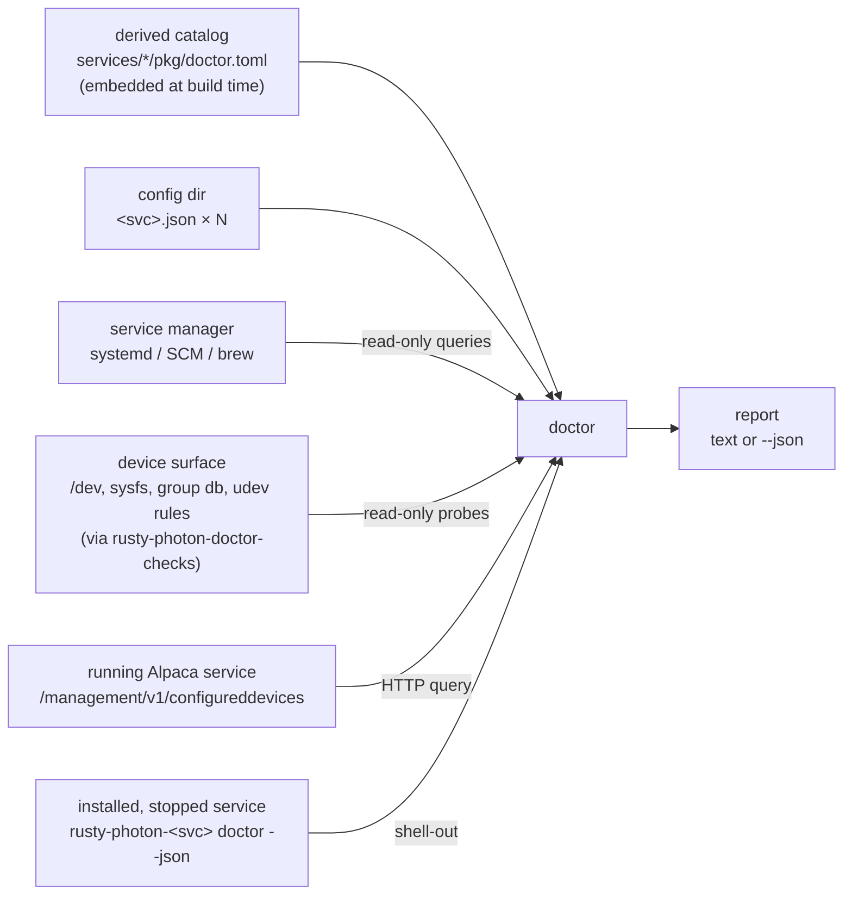

# doctor — Service Design

## Overview

`doctor` is the standalone diagnosis-and-repair tool for a multi-service
rusty-photon install: packages put bytes on disk, services self-create their
default configs, and doctor makes the result coherent. It audits **service
facts** — ports, TLS, auth, service-to-service references, unit wiring — and
never learns device usage (which camera is the guide cam belongs to `rp`).
[ADR-016](../decisions/016-service-config-ownership-and-doctor.md) is the
decision record; [`docs/plans/archive/service-config-doctor.md`](../plans/archive/service-config-doctor.md)
is the completed plan that delivered it.

This document specifies the **D2–D5 scope (diagnosis, repair, the no-SDK
hardware checks, and the per-service doctors) plus the D6a scope (TLS +
credential provisioning)**. A default run examines the config directory,
the platform's service manager, and the host's device surface (device
nodes, USB inventory, udev rules — all read-only), prints a report, and
writes nothing; `--fix` (D3) additionally applies the machine-applicable
fixes, runs the provisioning pass (D6a), and re-diagnoses; the
`tls`/`auth` subcommands (D6a) expose provisioning à la carte. From D5
on, every packaged service binary also answers `doctor` itself — its own
full-config validation, plus SDK-side hardware enumeration on the
services that link a vendor blob — and central doctor aggregates those
answers into the one report (§Per-service doctors). Cert renewal (D6b)
extends this binary later; its contract is recorded in the plan and
folded in here as it lands.

Doctor is a one-shot CLI, not a long-running service: no server, no config
file of its own, no unit. It lives at `services/doctor` (cargo binary
`doctor`) and installs as `rusty-photon-doctor`, riding in sentinel's
package on every platform (D7 — there is no separate doctor package).

## Architecture



Six inputs, one output. A default run is read-only: config files are
parsed but never written, every service-manager interaction is a query
(`list-unit-files`, `show`), never a verb, and every hardware probe is a
stat, a directory listing, or a read-only inventory query — doctor never
opens a device (ADR-016 decision 5: a running service holds its hardware;
doctor must never contend for it). Only `--fix` and the `tls`/`auth`
subcommands write — config files through `rusty_photon_config::save`'s
atomic path, plus the pki tree (D6a) — and nothing ever runs a
service-manager verb.

### The derived catalog

Doctor's catalog — which services exist, their class, and their default port —
is **derived from the packaging tree, not typed into doctor**
(ADR-016 decision 11). Each packaged service carries a metadata file,
`services/<svc>/pkg/doctor.toml`:

```toml
# Catalog metadata for rusty-photon-doctor (docs/services/doctor.md).
# This service's own unit tests assert these values match its config defaults.
class = "alpaca"  # "alpaca" | "core" | "advertising" — which shared server shape
                  # its config uses
port = 11113      # default port when the config file or server block is absent

# Optional: the unit has no sensible default config and never self-creates
# one — docs/packaging.md's "config-gated" services (ConditionPathExists= on
# Linux, start type Manual on Windows). Defaults to false. Feeds
# `units.config-gated`, `inventory.unit-without-config`'s remedy text, and
# scopes `tls.absent`/`auth.absent` away from a config-gated service's
# expected `FileAbsent` state (§TLS and auth).
config_gated = false

# Optional hardware identity (§Hardware checks) — present only on services
# that talk to a device.
serial_pointer = "/serial/port"       # config JSON pointer holding the device path
serial_default_unix = "/dev/ttyACM0"  # effective path when the file or field is absent
serial_default_windows = "COM3"
usb_vendor = "1618"                   # USB idVendor, four lowercase hex digits
usb_product = "c179"                  # optional idProduct — omitted for vendor-only
                                      # families (a QHY camera is any 1618 device)
usb_model = "Q-Focuser"               # optional product-string substring — required
                                      # where the VID:PID is a generic bridge chip
                                      # shared across devices (FTDI FT-X, RP2040)
serial_gate_pointer = "/transport/kind"  # optional: the serial checks apply only
serial_gate_value = "usb"                # when this pointer holds this value
```

Everything else is derived from the directory name: the config file is
`<svc>.json`, the systemd unit is `rusty-photon-<svc>.service`, the Windows
service and brew formula are `rusty-photon-<svc>`.

Three guards keep the catalog honest:

1. **Each service tests its own file.** A unit test in each service crate
   (`include_str!("../pkg/doctor.toml")`) asserts the declared port equals its
   own `Config::default()` server port and the class matches the shape it
   embeds (`AlpacaServerConfig`, `ServerConfig`, or
   `AdvertisingServerConfig`). Every service's `server` block **is** one of
   those three shared types rather than a service-local copy of one, so the
   shape a service accepts cannot drift from the shape doctor validates it
   against — the divergence that made doctor false-`fail` rp's
   `advertised_url` and, worse, silently skip rp's whole TLS/auth diagnosis
   with it. Services declaring serial
   metadata extend the same test: the pointer resolves in their own default
   config shape and the declared defaults equal their `DEFAULT_SERIAL_PORT`
   constants. The five config-gated services (below) assert `config_gated`
   is `true` in the same test. A drifted copy fails that service's tests,
   not doctor's.
2. **Doctor embeds the files at build time** and a doctor unit test asserts
   the embedded set parses, ports are unique, and the table matches the files.
   That test is load-bearing rather than belt-and-braces: at runtime the
   catalog *skips* an entry it cannot parse, so a malformed file would quietly
   drop one service from every report instead of aborting the run.
   Doctor also embeds the three shipped udev rules
   (`services/*/pkg/90-*.rules`) and asserts each rule-shipping service's
   declared `usb_vendor` equals the `ATTRS{idVendor}` its own rule matches —
   one source of truth for the USB checks, drift-guarded against the rule.
   A third doctor unit test pins `config_gated` against the known set
   (`calibrator-flats`, `plate-solver`, `polar-align`, `session-runner`,
   `sky-survey-camera`) — unlike `usb_vendor`, this one is not measured
   from hardware, so a plain assertion is enough.
3. **A CI completeness check** asserts every `services/*/pkg` directory
   contains a `doctor.toml`, so a newly packaged service cannot silently stay
   out of the catalog.

USB identity declarations are measured from real hardware (the values a
device reports on the bus), so the code-parity guard cannot cover them;
the vendor-vs-rule assertion above and the on-rig verification leg do.
`qhy-focuser` and `star-adventurer-gti` carry no `usb_*` keys yet — their
identities get declared the day the hardware is measured on a USB port —
so the USB-presence check simply does not run for them; their device-node
checks work regardless.

The catalog today (21 packaged services):

| Service | Class | Default port |
|---|---|---|
| filemonitor | alpaca | 11111 |
| ppba-driver | alpaca | 11112 |
| qhy-focuser | alpaca | 11113 |
| sentinel | core | 11114 |
| rp | advertising | 11115 |
| sky-survey-camera | alpaca | 11116 |
| star-adventurer-gti | alpaca | 11117 |
| pa-falcon-rotator | alpaca | 11118 |
| dsd-fp2 | alpaca | 11119 |
| ui-htmx | core | 11120 |
| qhy-camera | alpaca | 11121 |
| zwo-camera | alpaca | 11122 |
| pa-scops-oag | alpaca | 11123 |
| zwo-focuser | alpaca | 11124 |
| svbony-camera | alpaca | 11125 |
| planetarium-bridge | alpaca | 11126 |
| phd2-guider | core | 11130 |
| plate-solver | core | 11131 |
| calibrator-flats | core | 11170 |
| session-runner | core | 11171 |
| polar-align | core | 11172 |

Doctor itself never appears in the catalog: it is a one-shot binary with no
unit and no port. It also has no `pkg/` directory — the packaging rides
entirely in sentinel's (plan decision 8): sentinel's deb/rpm assets, MSI
Core feature, and Homebrew formula each carry the `rusty-photon-doctor`
binary and the renewal scheduling for their platform, so the `services/*/pkg`
discovery loops and the catalog completeness check never see a doctor
"service" at all. `scripts/check-pkg-assets.sh` asserts the whole delivery
contract inside its sentinel case.

### Config-root resolution

Doctor diagnoses one config directory per run, resolved in order:

1. `--config-dir <path>` — explicit, always wins. A path that does not
   exist is an error (exit 2) on every entry point except `tls issue`,
   which creates it: issuance is the one command whose job is
   materializing a tree from nothing (the recommended ACME staging
   rehearsal targets a scratch directory, and the ACME path creates the
   pki tree underneath anyway), while a typo'd `--config-dir` on a
   diagnosis, `--fix`, or renewal run must not silently operate on an
   empty directory.
2. `/etc/rusty-photon`, if it exists (Unix). Packaging ships this symlink
   pointing at the service user's tree
   (`/var/lib/rusty-photon/.config/rusty-photon`), so an operator running
   doctor as root diagnoses the **service user's** configs, not their own
   empty home. A packaged tree that exists but is **unreadable by the
   invoking user is a hard error** (exit 2, "run with sudo"), never a
   fall-through: the tree is 0750-owned by `rusty-photon`, and silently
   diagnosing the operator's own empty config directory instead would report
   seventeen missing configs on a healthy rig — and scan polkit rule
   directories it cannot read. A dangling symlink (packages removed) falls
   through to step 3.
3. The platform default the services themselves use —
   `rusty_photon_config`'s resolution (`~/.config/rusty-photon` on Linux,
   `~/Library/Application Support/rusty-photon` on macOS,
   `%ProgramData%\rusty-photon` on Windows).

Step 3 is what makes doctor useful on a dev checkout with no packages
installed.

### Platform inspectors

All service-manager knowledge sits behind one trait with a per-platform
implementation:

- **systemd** (Linux) — `systemctl list-unit-files 'rusty-photon-*'` for the
  inventory and enablement, `systemctl cat <unit>` for the
  `ConditionPathExists=` gate, `SupplementaryGroups=`, and the `ExecStart=`
  binary (the aggregation shell-out target), `systemctl is-active` for
  the run state, and one `systemctl list-units --state=failed
  'rusty-photon-*'` for the failed set (`units.failed`). Polkit facts come from a heuristic scan of
  `/etc/polkit-1/rules.d` and `/usr/share/polkit-1/rules.d` (the vendor dir
  the sentinel packages ship their rule to) for the manage-units action, the
  `rusty-photon-` unit prefix, and the `"rusty-photon"` user literal.
- **SCM** (Windows) — PowerShell over CIM (`Get-CimInstance Win32_Service`,
  not `Get-Service` — only the CIM class carries the image path) for the
  inventory, start mode, run state, and `PathName`.
- **brew services** (macOS) — `brew services list` filtered to
  `rusty-photon-*` formulas for the inventory and run state (its `error`
  status is the failed fact); the shell-out
  binary is the `brew --prefix`-linked `bin/<unit-stem>` when it exists.

The inspector reports a platform-neutral inventory (unit name, enabled,
active, failed, the unit's binary, plus platform-specific facts where they
exist);
checks that depend on a fact one platform lacks (systemd conditions, polkit,
systemd's `SupplementaryGroups=`) simply do not run on the other platforms.

### The hardware gatherer

The device-surface knowledge lives in the shared
`rusty-photon-doctor-checks` crate (ADR-016 decision 6: the similarity
between central doctor and D5's per-service doctors is a library, not a
binary). Doctor derives a probe list from the catalog and the scanned
configs — the effective serial paths, the expected udev rule files, the
firmware artifacts — and the crate gathers `HardwareFacts`, read-only:

- **Paths** — `stat` results (exists, file kind, mode, owner) for every
  probed path. Never an `open`.
- **USB inventory** — vendor:product plus the product string per device:
  sysfs (`/sys/bus/usb/devices/*/idVendor` …) on Linux, the
  `SYSTEM\CurrentControlSet\Enum\USB` registry tree plus the bus-reported
  device description on Windows, `system_profiler -json SPUSBDataType` on
  macOS.
- **Serial ports** (Windows) — `[System.IO.Ports.SerialPort]::GetPortNames()`.
- **Identity** — the `rusty-photon` user's uid/gid, its account-level
  supplementary groups (the `/etc/group` member lists that name it), and
  the gid of every group the checks reference (udev `GROUP=` names, unit
  `SupplementaryGroups=` names), from the host's user/group database.
- **udev rules** (Linux) — the content of the *effective* installed copy of
  each expected rule file (`/etc/udev/rules.d` shadows `/usr/lib` and
  `/lib`, same as udev's own precedence).

For hermetic tests, the `mock` feature (the same convention drivers use)
enables a `--platform-facts <file>` flag: the file deserializes into the
inspector's output type and replaces the host queries, so BDD scenarios can
stage any host state on any OS. The flag does not exist in release builds.
A staged facts file may include a `hardware` object; when it does not, the
hardware checks are skipped entirely — a staged file is the whole truth of
its scenario, and probing the real host underneath a mock would make every
scenario's outcome depend on the machine running it. A real (non-mock) run
always gathers. The same rule covers the `dns` object `dns.unresolvable`
reads (§ACME convergence): staged facts list the resolvable public names,
and a facts file without a `dns` object skips that check rather than
resolving real names under a mock.

### Packaged host vs dev checkout

If the inspector finds **zero** `rusty-photon-*` units, the host is treated as
a dev checkout: doctor runs the config-only checks (parse, shapes, ports,
joins, TLS paths) against whatever config files exist, skips the unit-joined
checks, and says so in the report (`mode: "config-only"`). Inventory
mismatch checks (orphan configs, unit-without-config) only make sense against
a package inventory and run only in `mode: "packaged"`.

## Diagnosis — the D2 checks

Every check yields `ok`, `warn`, or `fail` plus a human-readable detail and,
where doctor can suggest one, a concrete remedy (as text — machine-applicable
fixes arrive with D3). Checks are service-scoped where applicable so the
report groups naturally.

### Inventory (packaged mode only)

| Check | Status | Trigger |
|---|---|---|
| `inventory.unit-without-config` | warn | A `rusty-photon-*` unit is installed but `<svc>.json` does not exist. For a self-defaulting service that has never started (it self-creates config on first run) — or its state directory is wrong; for a `config_gated` service (§The derived catalog) it hard-requires a hand-written file and cannot start without one. The remedy names the actual `ConditionPathExists=` gate on Linux, else falls back to the catalog's `config_gated` flag (the only portable signal — Windows/macOS carry no equivalent fact) so the suggestion never wrongly claims a gated service self-creates. |
| `inventory.config-without-unit` | warn | `<svc>.json` exists for a catalog service whose unit is not installed. Leftover from a removed package, or a hand-copied file. |
| `inventory.unknown-config` | warn | A `*.json` in the config dir matches no catalog service and no known non-service file (`acme.json`; the `pki/` tree is ignored). Catches typo'd filenames that a service will silently never read. |
| `inventory.unit-and-config` | ok | Unit installed and config present — the healthy pairing, reported so an empty report is never mistaken for a clean one. |

### Config parsing

| Check | Status | Trigger |
|---|---|---|
| `config.unreadable` | fail | `<svc>.json` exists but could not be read (permissions, I/O) — a different operator problem than bad JSON, diagnosed under its own name. |
| `config.json-syntax` | fail | `<svc>.json` is not valid JSON. The service will refuse to start (by design — corrupt config never silently resets), and doctor says so before the next night does. |
| `config.server-shape` | fail | The top-level `server` block does not parse under the catalog-declared shape (`ServerConfig` for core, `AlpacaServerConfig` for Alpaca, `AdvertisingServerConfig` for advertising): unknown keys (`deny_unknown_fields`), missing `port` when the block is present, `discovery_port` on a non-Alpaca service, `advertised_url` on a service that advertises nothing, malformed `bind_address`. An absent `server` block is `ok` — the service applies its defaults. |
| `config.checks-skipped` | warn | Companion to a `config.server-shape` failure, naming what that failure cost: with no parsed `server` block, `tls.absent`, `auth.absent`, `tls.paths`, `tls.expiry`, `tls.auth-without-tls`, `auth.mismatch`, every client-target join resolving to this service, and — on an ACME install — `tls.stale-selfsigned-pointer` and `rp.advertised-url` all self-limit. Without this row their silence reads as a clean bill of health, which is how an untested TLS configuration hides behind an unrelated parse complaint. |
| `config.known-blocks` | fail | One of the cross-reference blocks doctor joins across fails to parse: sentinel's `operation_watchdog`, rp's `equipment` array / `session` block. Everything else in every file is opaque `serde_json::Value` doctor steps around (ui-htmx's whole file included — its view reads only the retired `drivers` key). |
| `config.retired-keys` | fail | A config still carries a key its service retired and now refuses to start over (`deny_unknown_fields`): sentinel's `services` map (D3s — supervision is discovered, not configured) or ui-htmx's whole `drivers` override map (#569 — rp's equipment roster is the only device source). The remedy is deletion — no replacement config exists. |

Full-config typo detection (a misspelled key in, say, qhy-camera's
`device_overrides`) is **out of D2's reach by design**: doctor knows only the
shared blocks. It arrives with D5, where each service's own binary — which has
the typed shape — validates its own file and doctor aggregates.

### Ports

| Check | Status | Trigger |
|---|---|---|
| `ports.collision` | fail | Two services resolve to the same **effective** port. Effective = the configured `server.port`, else the catalog default. A service is in the collision set when its unit is installed or its config file exists. |
| `ports.discovery-collision` | fail | Two or more Alpaca configs set the same `discovery_port`. The responder is a per-host opt-in for single-driver deployments precisely because N responders collide; two enabled is always a mistake. |

### Units and privileges (systemd facts; run where the platform has them)

| Check | Status | Trigger |
|---|---|---|
| `units.failed` | fail | The service manager is holding a `rusty-photon-*` unit in a failed state — one row per unit, tagged with the catalog service when the unit runs one. Linux reads it from one `systemctl list-units --state=failed` query (a failed unit is loaded, so the listing sees it, and the alternative is an `is-failed` per unit); macOS reads brew's `error` status, which costs nothing extra. Windows leaves the fact ungathered — a Scheduled Task's last result lives outside `Win32_Service` — and the check then emits no row at all rather than a green one it cannot back up. The case that motivates it is the **renewal one-shot**: a daemon that dies is eventually noticed because nothing answers it, but `rusty-photon-renew` failing means only that certificates quietly stop renewing, and sentinel deliberately does not supervise it (supervising a job would restart-loop a failed 3am run), so its row names that consequence explicitly. Suggestion-only: doctor starts and resets no units. |
| `units.config-gated` | fail | A unit is enabled but its `ConditionPathExists=` file is missing: installed, enabled, and silently inert. Today that is sky-survey-camera, plate-solver, calibrator-flats, session-runner, and polar-align — the catalog's `config_gated` services (§The derived catalog) — all of which hard-require a config file. Linux-only: the check reads the systemd fact directly; Windows/macOS installs of the same five services are covered instead by `inventory.unit-without-config`'s `config_gated`-aware remedy. |
| `sentinel.privilege-path` | fail | Sentinel's unit is installed and no rule under `/etc/polkit-1/rules.d/` or `/usr/share/polkit-1/rules.d/` (where the sentinel packages ship theirs) grants the `rusty-photon` user `org.freedesktop.systemd1.manage-units` for `rusty-photon-*` units — the packaged unit runs unprivileged with `NoNewPrivileges=yes`, so every restart sentinel attempts will be denied at the privilege boundary. Points at the scoped rule from [#523](https://github.com/rusty-photon/rusty-photon/issues/523). Detection is a heuristic (scan for the action id, unit prefix, and user literal in the rules files) and the detail says so. |

### Name joins

Since D3s sentinel discovers its services from the platform service manager,
so the one service-name join that survives resolves against the **installed
`rusty-photon-*` units** (packaged mode only — the join has nothing to
resolve against on a dev checkout): the watchdog's
`operations.<family>.service`, matched by convention and validated by
nothing at runtime until the 2am 404. (ui-htmx's restart names stopped
being configured with #569 — they are derived at request time by matching a
roster device's `alpaca_url` port against sentinel's discovered services,
so there is no ui-htmx-side name join left to check.)

| Check | Status | Trigger |
|---|---|---|
| `joins.watchdog-service` | fail | An `operation_watchdog.operations.<family>.service` names a service with no installed `rusty-photon-<service>` unit — sentinel's discovery will never resolve it, so the watchdog's ladder degrades to notify-only. |

### URL conventions

| Check | Status | Trigger |
|---|---|---|
| `urls.spurious-suffix` | warn | An rp `equipment[].alpaca_url` ends in `/api/v1`. The client appends it itself; doubling it 404s. (Doctor reads `alpaca_url` out of rp's equipment entries and steps around the rest of the block — checking the URL is service wiring, owning the entry is device usage.) Sentinel's URLs are all derived since D3s, and ui-htmx's device URLs come from rp's roster since #569 — no other spurious-suffix case is left to check. |

### TLS and auth

| Check | Status | Trigger |
|---|---|---|
| `tls.paths` | fail / warn | A `server.tls` block is present but the cert or key is not an existing **file** after resolving the path the way the service itself will (`TlsConfig::resolved_*_path`, which expands `~`; empty paths and directories are absent) — fail. A **relative** path (D6b) warns instead: the service resolves it against its own working directory, which doctor cannot know, so presence is not judged either way — the suggestion is absolute paths, which is all doctor ever writes. Readability by the unit's user is not checked in D2 — doctor runs privileged on packaged hosts, so an ownership heuristic needs the passwd machinery D4's hardware checks bring. |
| `tls.auth-without-tls` | warn | `server.auth` is set while `server.tls` is absent: HTTP Basic credentials in cleartext on the wire. Legal, but worth a nag — ADR-003's scheme is Basic **over TLS**. Fixed by the provisioning pass turning TLS on. |
| `tls.absent` (D6a) | warn | An installed service's config file exists but has no `server.tls` block: it serves plain HTTP. Legal (absent still means off — ADR-016 decision 10(d)), and fixable: the provisioning pass issues a cert and writes the block — on an ACME install (`acme.json` present) the block points at the existing wildcard pair instead, and while that pair is missing the check stays suggestion-only pointing at `doctor tls renew` (§What `--fix` adds). **No config file at all** (`FileAbsent`) grades the same way for any non-`config_gated` service (#598): doctor cannot tell whether the service has simply never started or a working config was deleted, but either way the next (re)start serves plain HTTP — unlike the block-absent case above, this is **unfixable**, since there is no file for `--fix` to write into; the suggestion is to create the file yourself (an empty `{}` is enough — `--fix` provisions `server.tls`/`server.auth` into it from there), or start the service once so it self-creates one, then re-run `--fix`. A `config_gated` service's `FileAbsent` state is expected (it cannot start without an operator-written file in the first place) and stays silent here — `inventory.unit-without-config` / `units.config-gated` own that story. |
| `auth.absent` (D6a) | warn | An installed service's config file exists but has no `server.auth` block: it answers unauthenticated. Same legality and fix as `tls.absent`, including the `FileAbsent` extension above. |
| `auth.mismatch` (D6a) | warn | A client auth block's plaintext password does not verify (Argon2id) against the target service's `server.auth` hash — the client will get 401s. Suggestion-only: hand-set credentials are operator intent, so doctor reports the pair and suggests `doctor auth rotate` to re-align everything to the observatory credential. |
| `tls.ownership` | fail / warn | Unix only, install-wide (no service column). An entry in the pki tree — or `acme.json` / `renew.env` beside the configs — does not belong to the **config root's owner**, the identity the services and the renewal timer run as. Material something reads (the pki directory, `*.pem`, `credential`, `acme-account.json`, and those two files) fails: a service cannot read a key it does not own, so its next start serves no TLS. Anything else in the tree warns, because the ownership sweep skips it too (§Ownership under sudo) — the point of the row is that a mixed-ownership tree is visible in a normal `doctor` run instead of only in a 3am journal. Entries doctor cannot `stat` are not reported: unproven, not wrong. Suggestion-only, but a privileged `--fix` repairs it in passing — its provisioning pass runs the same sweep with the privileges to complete it. |
| `tls.expiry` (D6b) | fail / warn | A configured `server.tls` certificate is **expired or unparseable** (fail — rustls loads an expired cert cleanly and only *clients* reject the handshake, so without this check the failure surfaces as every client erroring at night) or **inside its renewal window** (warn — 30 days for self-signed material, `renewal_days_before_expiry` for the ACME cert). Graded only when `tls.paths` is clean — an expiry verdict beside a failing pair would read as contradictory. Suggestion-only: the fix is `doctor tls renew` (or `tls issue --force` for a cert the renew legs don't own); `--fix` does not renew, because renewal belongs on the platform timer. |

### Client-target joins ([#607](https://github.com/rusty-photon/rusty-photon/issues/607))

Every other D2/D6a check above judges a service against its **own**
config. This family is the join the rest missed: a service's config
points a URL at *another* catalog service — ui-htmx's `rp`/`sentinel`
targets, rp's `plate_solver.url`, `equipment.mount.guiding.url`,
every `equipment.<kind>[].alpaca_url` entry including the singular
`equipment.mount.alpaca_url` (issue #663), the callback URL of each
plugin registration rp dials (`plugins[].invoke_url` /
`plugins[].webhook_url`, issue #800), sentinel's
`operation_watchdog.rp_url` and each Alpaca `monitors[]` entry —
and nothing checked whether that URL's scheme and credential still match
the *target's* `server.tls`/`server.auth` after the provisioning pass
upgrades the target's server side. That gap is exactly how #607 happened:
provisioning turned rp and sentinel TLS-on/auth-on, but ui-htmx's targets
kept their pre-provisioning `http://` + no-credential shape, and 88
service-local checks had nothing to say about it.

**Resolution.** A client URL joins a target only when its host names
*this* machine (`127.0.0.1`, `localhost`, `::1` — every shipped default) —
doctor diagnoses one config directory, so a different host names a
service in a config file doctor cannot see, and is silently skipped
rather than guessed at. Among the participating scanned services, the one
whose effective port matches the URL's is the target; a URL with no
explicit port, or one that doesn't parse, resolves to nothing. On an
ACME install one more host shape joins
([#805](https://github.com/rusty-photon/rusty-photon/issues/805), D3 of
[the flip plan](../plans/acme-flip.md)): a URL whose host is exactly
`<svc>.<domain>` — `domain` read from `acme.json`, `<svc>` the
port-matched service's own catalog name — because the flip rewrites
client URLs onto exactly those names, and the join family must keep
judging them (and the `--fix` loop verifying its own rewrites) after the
flip. An absent or unreadable `acme.json` keeps the loopback-only shape,
mirroring the aggregation probes' domain handling. Host comparison is
ASCII-case-insensitive throughout, as DNS is — a URL host arrives
lowercased by the parser anyway, but a monitor's discrete `host` field
reaches the join exactly as the config spells it.

| Check | Status | Trigger |
|---|---|---|
| `joins.client-transport` | fail | Any of: the client's scheme doesn't match the target's `server.tls` state (`http` against a TLS-on target, or `https` against a plain-HTTP one) — the connection fails outright; the target's certificate **is** the ACME wildcard while the client's host is loopback — the wildcard's only SAN is `*.<domain>`, so hostname verification fails no matter the scheme (gap 2 of [#805](https://github.com/rusty-photon/rusty-photon/issues/805)); or the scheme matches, the target's certificate is doctor's self-signed CA (not the publicly-trusted ACME wildcard — judged the way `tls.expiry` distinguishes them, by the resolved cert file's name), and the client has no CA-trust field pointed at it (ui-htmx's per-target `ca_cert_path`; rp's and sentinel's single top-level `ca_cert`) — the TLS handshake fails validation. All grade `fail`, mirroring `tls.paths`: a definite break, not a hardware-style installed/enabled split. |
| `joins.client-auth` | warn | The target has `server.auth` set and the client's credential is absent or does not verify (Argon2id) against it — every request 401s. Mirrors `auth.mismatch`'s severity and its asymmetry: an **absent** credential is fix-eligible (the correct value is derivable), a **present but wrong** one is suggestion-only (hand-set credentials are operator intent, so doctor points at `doctor auth rotate`). sentinel's own `service_auth`/`operation_watchdog.rp_url` pair is `auth.mismatch`'s territory already, not this check's — only targets with their own credential field (ui-htmx's `rp`/`sentinel` blocks, each Alpaca monitor's `auth`, rp's `plate_solver.auth` / `equipment.mount.guiding.auth` since issue #620, every `equipment.<kind>[].auth` / `equipment.mount.auth` since issue #663, and each `plugins[].auth` since issue #800) are judged here. |

**What `--fix` can and cannot rewrite.** ui-htmx's `rp`/`sentinel` blocks
carry `base_url` + `auth` + `ca_cert_path`, so both checks are fully
fix-eligible there: the scheme is rewritten in place (preserving the
URL's path/query byte-for-byte — round-tripping through a URL parser's
`to_string()` would silently append a trailing `/` to an origin-only URL,
which some client call sites concatenate a `/`-prefixed path onto without
trimming), the CA path is written from the resolved pki tree, and the
credential is written from `pki/credential` — the same material
`plan_client_wiring` already distributes, following the same "absent gets
it, present is operator intent, never overwritten" contract as every
other D6a client fix. Sentinel's per-monitor entries carry `scheme` +
`auth` (no per-monitor `ca_cert_path` — every monitor, and the watchdog's
`rp_url` alongside them, trusts sentinel's single top-level `ca_cert`, the
same shape rp uses), so the scheme and per-monitor credential are equally
fix-eligible, and a self-signed target with no `ca_cert` set is reported
against that one field with `/ca_cert` as its fix
([#801](https://github.com/rusty-photon/rusty-photon/issues/801));
`operation_watchdog.rp_url`'s scheme and CA trust are fix-eligible too,
but it carries no separate `joins.client-auth` check — its credential is
the shared `service_auth` pair, `auth.mismatch`'s territory already.
`plan_client_wiring` writes that same `ca_cert` unconditionally, but only
inside `--fix`; reporting it here is what makes a **plain, read-only
`doctor` run** name the gap in the window between a target's TLS being
provisioned and the next `--fix`, instead of leaving it to surface at
night as monitor errors. rp's `plate_solver.url`, `equipment.mount.guiding.url`,
every `equipment.<kind>[].alpaca_url` entry — including the singular
`equipment.mount.alpaca_url` (issue #663) — and each dialed plugin
registration's `plugins[].invoke_url` / `plugins[].webhook_url`
(issue #800) share rp's single top-level
`ca_cert` field (issue #609 / PR #612, the `wire_auth: false` row of
`CLIENT_WIRING` in
`provision/mod.rs`), not a per-target one, so `joins.client-transport`
is fully fix-eligible for all of them: the scheme is rewritten in place and
`/ca_cert` is written from the resolved pki tree, same as every other
CA-trust fix. Every target also carries a per-target `auth` field —
`plate_solver.auth` / `equipment.mount.guiding.auth` since issue #620,
every `equipment.<kind>[].auth` / `equipment.mount.auth` since issue
#663, closing the config-schema gap this section used to describe for
the generic equipment roster, and `plugins[].auth` since issue #800 —
so `joins.client-auth` is fully
fix-eligible for all of them too: an absent credential is written from
`pki/credential` at the target's own `auth` pointer (e.g.
`/plate_solver/auth`, `/equipment/mount/guiding/auth`,
`/equipment/cameras/0/auth`, `/plugins/0/auth`), the same "absent gets
it, present is operator intent" contract as every other client target.
`RpView::equipment_targets`
(`services/doctor/src/scan.rs`) walks the roster generically — any object
under `equipment` carrying an `alpaca_url`, whether nested in an array
(`cameras`, `focusers`, …) or standalone like `mount` — so a future
equipment kind is covered without new doctor code. `RpView::plugin_targets`
is deliberately narrower — the registrations rp actually **dials**
(the orchestrator's `invoke_url`, an event plugin's `webhook_url`), not
any entry carrying a URL-shaped key: a registration is an opaque
plugin-author surface, and rp interprets a callback URL and `auth` on
those two entry types alone, so walking by field would file a transport
verdict on a URL rp never calls and offer to write a credential rp never
reads. A tool provider, for one, is reached over MCP and authenticates
however its author chose. That scope mirrors rp's own
`config::dialed_url_field`; the two must agree, or doctor advises a fix
rp ignores. A CA-trust gap is
always reported once a target's certificate is self-signed and the
client's CA field is absent, regardless of whether doctor's own
`pki/ca.pem` exists locally yet — only the *fix* is gated on that file's
presence, so a from-scratch config dir (TLS provisioned before the CA leg
ever ran) still surfaces the gap instead of silently skipping it.

On an ACME install the hostname-verification leg's fix rewrites the
loopback host onto the target's public name `<svc>.<domain>`
([#805](https://github.com/rusty-photon/rusty-photon/issues/805) gap 2;
D2 of [the flip plan](../plans/acme-flip.md)). For URL-shaped fields the
scheme and host rewrites compose into a **single** written value —
byte-preserving on either side of the rewritten part, per the same
no-round-trip rule as the scheme rewrite — and sentinel's per-monitor
`host` field is set directly. Only a loopback host is ever rewritten (a
hand-set name is operator intent, reported but left alone), and an
`acme.json` with `staging: true` withholds the fix while still reporting
the break, naming the staging state — doctor never converges clients
onto a publicly-untrusted certificate (D4); the staging rehearsal
belongs in a scratch `--config-dir`. A target serving the wildcard pair
while `acme.json` is missing or unreadable is still a real break for a
loopback client, so it is reported the same way with the fix withheld —
there is no domain to derive the public name from. The whole join family is driven
from one client-target registry (every URL/CA/auth pointer site in one
table), so the rewrite rules above apply uniformly to every current and
future client target.

Because `joins.client-transport`/`joins.client-auth` read the *target's*
`server.tls`/`server.auth`, and those are themselves written by
`tls.absent`/`auth.absent`'s fixes earlier in the same `--fix` invocation,
a from-scratch install converges within the existing fix-round loop
(§Repair) without any special-casing: round 0 turns the target's server
side on, round 1 (the loop's next iteration re-diagnoses against the
now-updated files) sees the mismatch and rewrites the client.

### The fake-mount hazard (`joins.fake-mount`)

planetarium-bridge serves a virtual ASCOM Telescope for planetarium
apps — it never touches hardware, and slews against it "just succeed"
without moving anything. Wiring it in as rp's real mount would defeat
every motion safeguard rp believes it has (park, limits, slew
completion), so this is graded a **hard failure**, never a warning
([planetarium-bridge.md](planetarium-bridge.md) § Doctor integration).
Never fix-eligible: doctor cannot know which URL the real mount lives
at.

| Check | Status | Trigger |
|---|---|---|
| `joins.fake-mount` | fail | Either: rp's `equipment.mount.alpaca_url` resolves — by the same loopback-host + port join every client-target check uses — to the installed planetarium-bridge (the static leg, `checks.rs`); or the URL's management API (`GET /management/v1/configureddevices`, probed as rp itself would connect: rp's `equipment.mount.auth` or the observatory credential; for https, doctor's CA on a self-signed install and the platform store on an ACME one) reports a device whose `UniqueID` is the locally-scanned bridge config's `device.unique_id` (the probe leg, `aggregate.rs`) — which is what catches a config addressing the bridge by a host name the static join cannot resolve (on an ACME install the static join also covers exact `<svc>.<domain>` names, so the probe's remaining territory is every other name shape, e.g. a rig's `<svc>.rig.<domain>`). The probe is skipped when the static leg already resolved the URL to the bridge, and stays silent when the mount does not answer — liveness is `service.devices`' story. |

### ACME convergence ([#805](https://github.com/rusty-photon/rusty-photon/issues/805))

Once `acme.json` exists, the install's declared state is ACME (decision
D1 of [the flip plan](../plans/acme-flip.md)): every service serves the
shared wildcard pair, clients trust the platform roots instead of a
pinned CA, sentinel probes and rp advertises public `<svc>.<domain>`
names, and those names resolve on the box. These checks grade what
still diverges from that state and — where the divergent value is
provably doctor's own material (D2) — plan the fix that converges it,
so a self-signed install flips with `doctor tls issue --acme`, one
`doctor --fix` run, and the reported hosts entries. The whole family
runs only while `acme.json` is present and readable, and an `acme.json`
declaring the staging endpoint downgrades every check in it to a
suggestion-only `warn` naming the staging state (D4): doctor never
converges a fleet onto a publicly-untrusted certificate — the staging
rehearsal belongs in a scratch `--config-dir`. The one exception is
`tls flip-to-acme --allow-staging`'s own planning, which deliberately
treats a staging install as convergeable (§The flip orchestrator);
nothing reachable from a plain run or `--fix` ever does.

| Check | Status | Trigger |
|---|---|---|
| `tls.stale-selfsigned-pointer` | fail / warn | A `server.tls` block points at material other than the pki tree's wildcard pair while that pair exists on disk (without the pair the fleet is in renewal-recovery territory — `tls.absent`'s suggestion path — and the still-serving self-signed material is all there is, so the check waits). Converged is a **path** judgment against `pki/acme-cert.pem`/`acme-key.pem`, not the file-name convention the trust-model classifiers use: a same-named copy elsewhere is one renewal never rewrites, so it quietly ages out and is reported like any other hand-placed path. The doctor-issued per-service pair — matched by the exact `pki/<svc>.pem` / `pki/<svc>-key.pem` path strings doctor itself writes — fails with a fix rewriting the block's `cert` and `key` onto the wildcard pair: the one flip case where overwriting a present value is exactly intended (D2), expressed as plain string sets so the create-if-absent contract is untouched. A hand-placed foreign path warns, suggestion-only: doctor cannot know the material is not valid for the public name clients dial, so it reports the divergence and the derivable wildcard paths, and the operator decides. |
| `tls.stale-ca-pin` | fail / warn | A client CA-trust field is set on an ACME install (`warn` only under D4's staging downgrade, like the whole family). The pin replaces the platform trust roots (`tls_certs_only`), so the client rejects the publicly-trusted wildcard outright — a definite break whatever the pin points at. Judged over exactly the fields doctor itself wires: each `CLIENT_WIRING` service's `ca_cert` (sentinel, session-runner, calibrator-flats, polar-align, planetarium-bridge's nested `rp.ca_cert`, rp) plus ui-htmx's per-target `ca_cert_path` — one source of truth with the writer, so the two can never drift. Only the doctor-written `pki/ca.pem` path is fix-eligible (a `remove-key` op); a foreign pin is reported suggestion-only — it may be a deliberate private-CA trust. Like the stale-pointer check, it waits for the wildcard pair: before the pair lands, the pin is what keeps the client connected to the still-self-signed fleet. |
| `sentinel.probe-domain` | warn | sentinel's config has no `probe_domain` while the install is ACME: its supervision probes then dial bind-derived hosts, which the wildcard's only SAN `*.<domain>` can never match, so probes against TLS-serving services fail hostname verification. The fix writes `acme.json`'s `domain` — the identical value the aggregation probes already derive. A present value is operator intent and is left alone. |
| `rp.advertised-url` | warn | rp's `server` block has no `advertised_url` while the install is ACME: the URL rp advertises to orchestrators is derived from its bind address, which the wildcard certificate can never match. The fix writes `https://rp.<domain>:<port>` (rp's own effective port), planned only while a parsed `server` block exists to write into — with no `server` key at all the check still reports, and the `--fix` fixpoint loop converges it one round after `tls.absent`'s fix creates the block. |
| `dns.unresolvable` | fail / warn | A derived `<svc>.<domain>` name for a participating service does not resolve on this host (`warn` only under D4's staging downgrade) — every client and probe dialing it fails before TLS even starts. Report-only (D5: `/etc/hosts` is outside doctor's write surface); the suggestion carries the exact loopback hosts line to paste — loopback, because public DNS alone would make on-box traffic depend on the WAN link and the DHCP lease, against tenets 1 and 2. Like the aggregation probes, this check runs only on the **final** report, never inside the `--fix` fixpoint rounds: it plans no fixes, and a slow or misconfigured resolver must not multiply its timeouts across rounds. A real run resolves through the system resolver (`/etc/hosts` first, DNS behind it — the same path every client dial takes), all names concurrently under one shared deadline with names unanswered in time judged unresolvable — a black-holed resolver costs one deadline in total, not one per service, because a hung diagnosis is the failure mode the aggregation probes' bounds exist to prevent; a staged facts file supplies a `dns` object instead, and one without a `dns` object skips the check entirely, the same whole-truth rule the hardware family follows. All names resolving is reported `ok`, so a clean row is distinguishable from a skipped one. |

### Platform defaults

| Check | Status | Trigger |
|---|---|---|
| `rp.data-directory` | fail | rp's `session.data_directory` does not exist — catches the Linux-path-on-macOS default documented in `docs/packaging-macos.md` — or, on a packaged **Linux** install, exists but is not writable by the `rusty-photon` user rp runs as under systemd, judged from the directory's owner/group/mode. Doctor writes no probe files — the judgment is an ownership heuristic, and the detail says so. Dev checkouts keep the existence-only check (the operator owns their own tree), as do macOS and Windows installs — brew services run as the operator and the MSI's services as LocalSystem, so there is no service user to judge for. (`tls.paths` readability keeps its D2 shape; the TLS lifecycle work owns that check's evolution.) |

### Hardware (D4 — the no-SDK checks)

Everything here needs no vendor blob (ADR-016 decision 5); SDK-side checks
are D5's per-service `doctor` subcommands. One severity rule covers the
whole family: **`fail` when the service's unit is installed and enabled** —
it will start at boot and hit the problem, so this is tomorrow's 2am
failure reported at noon — **`warn` otherwise** (a parked service, or a dev
checkout). A check runs only for services that participate in diagnosis
(config present or unit installed) and declare the relevant catalog
metadata.

| Check | Platforms | Trigger |
|---|---|---|
| `hardware.serial-node` | Linux, macOS, Windows | The effective serial device — the config value at the catalog's `serial_pointer`, else the platform's declared default — does not exist, or exists but is not a character device (Unix). On Windows: the configured name is not among the host's present COM ports. A service with a `serial_gate_pointer` participates only while its config holds the gate value (star-adventurer-gti on `kind: "udp"` has no serial device to check — the same pointer is a UDP port number there). |
| `hardware.serial-access` | Linux (packaged) | The node exists but the `rusty-photon` user cannot open it, judged from the node's owner/group/mode and the identity the kernel actually grants the process: the user's uid/gid, the unit's `SupplementaryGroups=`, **and** the account's own supplementary memberships from the group database — systemd initializes the process group list from the union, so a node openable only via an account-level membership passes, with the granting mechanism named in the detail (the packaged intent is the unit file; account-level grants are host-local state worth seeing). The fail suggestion distinguishes a membership neither source confers (add `SupplementaryGroups=` to the unit) from a mode/ownership problem (udev-rule surgery). |
| `hardware.usb-device` | Linux, macOS, Windows | No device on the bus matches the service's declared USB identity: `usb_vendor`, plus `usb_product` when declared, plus `usb_model` as a product-string substring when declared. The substring is what makes the check honest for devices behind generic bridge chips — the three Pegasus devices all report FTDI's `0403:6015` and the FP2 reports the RP2040's `2e8a:000a`, so VID:PID alone would confuse "the Falcon is plugged in" with "the PPBA is plugged in". |
| `hardware.udev-rule` | Linux (packaged) | For each service shipping a udev rule, against the effective installed copy: the file is missing (`fail`/`warn` per the severity rule); a `GROUP=` it names does not resolve in the host's group database — udev **silently drops the entire rule line** on an unresolvable `GROUP=`, so file presence alone proves nothing (`fail`/`warn`); or the content differs from the packaged copy doctor embeds (`warn` always — an operator override in `/etc/udev/rules.d` is legitimate, but worth surfacing). |
| `hardware.firmware-helper` | Linux (packaged) | qhy-camera's unit is installed but the firmware helper's three artifacts are not all present: `/lib/firmware/qhy/` (directory), `/usr/local/sbin/fxload` (executable), `/etc/udev/rules.d/85-qhyccd.rules` (file). The conjunction is the helper's own idempotency gate — any subset is a partial install that must re-converge — and the suggestion points at `/usr/sbin/rusty-photon-qhy-firmware-install` (ADR-013: proprietary firmware is never packaged, so nothing but this check verifies the operator ran it). |

None of these checks plan a `--fix`: absent hardware cannot be conjured, a
missing group or udev rule is package/host surgery outside config files,
and the firmware helper needs network and root. Every failure carries a
concrete suggestion instead.

## Per-service doctors and aggregation (D5)

The D4 checks stop exactly where a vendor SDK starts (ADR-016 decision 5:
a doctor that links every vendor blob recreates the file conflict ADR-014
fixed). D5 crosses that line from the other side: **every packaged service
binary answers `doctor` itself**, using only what it already links, and
central doctor aggregates the answers.

### The per-service subcommand

```
rusty-photon-<svc> doctor [--config <file>] [--json]
```

Every catalog service binary carries the subcommand. It is additive to the
existing CLI — a plain flag invocation (what the units run) still starts
the service — and the run is strictly read-only: it resolves the config
path the way the service itself does (`--config`, else
`rusty_photon_config::resolve_config_path`), but never materializes the
scaffold or mints identities. Output and exit codes follow central
doctor's contract exactly (text by default, `--json` for the schema, exit
0/1/2), with `mode: "service"` and the service binary's own version in
`doctor_version`.

Two checks, the second only on services that link an SDK:

| Check | Services | Trigger |
|---|---|---|
| `config.full-shape` | all | The service's config file does not survive the service's **own typed load path** — the same parse a start would perform, `deny_unknown_fields` included, so a typo'd key anywhere in the file is named here (the detail carries serde's path and message). This is the full-config validation D2 deferred: central doctor knows only the shared blocks; the binary that owns the shape validates all of it. An absent file is `ok` — most services write their defaults on first start, config-gated ones stay inert, and either way there is nothing to validate (central doctor's inventory and `units.config-gated` checks own that judgment). |
| `hardware.sdk-devices` | qhy-camera, zwo-camera, zwo-focuser | The SDK cannot see the hardware: enumeration (`ScanQHYCCD`, the ASI/EAF list calls) errors (`fail` — with the D4 `hardware.usb-device` check this splits "not on the bus" from "on the bus but the SDK is blind", which is the firmware/driver signature), or enumerates zero devices (`warn` — the binary cannot see unit state, so unplugged-on-purpose and unplugged-by-accident are indistinguishable here; the D4 checks carry the unit-aware severity). `ok` lists the models the SDK reports. **Enumeration only, never an open** — an open against a device the running service holds is the camera-lock class of bug, and the subcommand must stay safe to run by hand at any time. |

Per-service checks plan no fixes in D5 — machine-applicable repair stays a
central-doctor concern, so `--fix` semantics live in exactly one binary.

The shared machinery — schema, check constructors, config-load harness,
text/JSON rendering, exit-code mapping — lives in
`rusty-photon-doctor-checks` (ADR-016 decision 6: the similarity between
central doctor and the per-service doctors is a library, not a binary).
With D5 that crate becomes the **canonical home of the report schema**,
and central doctor re-exports it; a service's subcommand is its clap
variant plus a closure handing its typed load to the shared runner.

### Aggregation — the two probe paths

On a packaged host, central doctor extends its diagnosis through each
installed service, and the two paths are naturally exclusive:

- **Unit active** → the service already enumerated its hardware at
  startup, so doctor asks it over HTTP: `GET
  /management/v1/configureddevices` against the service's effective port
  (Alpaca-class services only — core services expose no management API and
  are fully covered by the config-side checks). The connection follows the
  service's own config: HTTPS when its `server.tls` is set, credentials
  from the D6 machinery when `server.auth` is on. The dialled host and
  the root of trust come as a pair from the install's TLS story: a
  self-signed install is probed at `localhost` (a SAN of every
  doctor-issued cert) verified by doctor's own CA, while an ACME install
  (`acme.json` present) is probed at the service's public name —
  `<service>.<domain>` from `acme.json`'s `domain`, the same shape
  sentinel's `probe_domain` dials — verified by the platform trust store,
  since the wildcard's only SAN is `*.<domain>` and can never match
  `localhost`. An unreadable `acme.json` keeps the self-signed shape
  rather than guess at names. `service.devices` reports the inventory; an
  active unit that does not answer its own port is a `fail` (that is
  tomorrow's 2am failure); an authenticated endpoint doctor holds no
  credential for is a `warn` — the answer proves liveness but not
  inventory.
- **Unit installed but not active** → nothing holds the device, and this
  is precisely the case being debugged: doctor shells out to the unit's
  own binary — the path the service manager records (systemd `ExecStart=`,
  the SCM image path, the brew formula bin), `doctor --json --config
  <dir>/<svc>.json` — and merges the returned checks into the report with
  the `service` field set. The parse is permissive in both directions
  (ADR-016 decision 7): unknown fields, statuses, and ops degrade instead
  of refusing. A binary that predates the subcommand (version skew across
  nightlies) fails the shell-out without producing a report; that is a
  `warn` under `service.doctor-probe` naming the skew, never a `fail` —
  an old binary is not a broken rig.

Both paths are bounded: the HTTP probe by a 15 s whole-request deadline,
the shell-out by a one-minute one (an SDK bus scan takes seconds). A
timeout is reported under the same names — an answer that never comes is
a diagnosis, not a crash — and the `service.devices` fail detail carries
the request's full cause chain (a refused connection, a failed TLS
handshake, or the deadline by name), because reqwest's own message reads
"error sending request" for all three.

The HTTP bound is sized for a *loaded* host, not a healthy one: a live
service answers in milliseconds and a dead port refuses at once, so the
deadline only ever runs out against a service that accepts the connection
and never answers — or against a host too busy to complete a request. On
Windows the second case is real: the OS takes ~2 s to report a loopback
refusal, and every `localhost` probe pays a fixed ~300 ms because the
resolver returns `::1` first, services bind IPv4 `0.0.0.0` only, and the
client falls back to `127.0.0.1` on a timer rather than a refusal.
Measured on a 4-vCPU Windows host under CPU contention (64 fresh probe
processes against a live listener, 32 busy-loop hogs), a single probe
took up to ~4.8 s end to end where the same host idle takes ~0.3 s and
Linux ~0.05 s — so a 5 s deadline misreported live services as dead
under CI load; 15 s keeps 3× headroom over that measurement.

For hermetic tests the mock seam extends accordingly: staged unit facts
carry the binary path (BDD points it at a stub that emits a canned
report), and the HTTP probe targets whatever port the staged config
declares, so a scenario can stand up a stub management endpoint.

## Repair — `--fix` (D3)

`doctor --fix` runs the same diagnosis, applies every **machine-applicable
fix** the checks planned, then re-runs the diagnosis and reports the
post-fix state. The loop an operator runs after installing packages is:
services self-create their defaults, `doctor --fix` makes the install
coherent, done.

A fix is planned only where the correct value is derivable, not a judgment
call:

| Check | Fix `--fix` applies |
|---|---|
| `ports.collision` | Move each colliding service whose configured port differs from its catalog default back to that default — but only when the default itself is free among the effective ports. A collision between judgment-call ports (two services deliberately moved to the same custom port) gets a suggestion, not a fix. |
| `config.retired-keys` | Delete the retired key (sentinel's `services` map; ui-htmx's `drivers` map). |

Everything else stays suggestion-only: a `ConditionPathExists` gate needs a
hand-written config, a `discovery_port` collision is operator intent (which
host keeps the responder?), and rp's `session.data_directory` is a placement
decision. Missing TLS material and absent `tls`/`auth` blocks stopped being
suggestion-only with D6a — the provisioning pass (next section) conjures
them.
`--fix` also never *generates* config — device targets come from rp's
roster, never from doctor-written entries (see [ui-htmx.md](ui-htmx.md)).

Write mechanics:

- Fixes are grouped per file and applied as one read-modify-write through
  `rusty_photon_config::save` — the same atomic
  temp→fsync→rename→fsync-dir path the services' own `config.apply` uses,
  so a crash mid-fix never corrupts a config. Every field doctor does not
  touch is preserved — the mutation is on the raw JSON value, not a typed
  round-trip — though `save` normalizes formatting to the same
  pretty-printed shape `config.apply` writes.
- The write preserves the replaced file's **owner and mode** across the
  rename's inode swap. On a packaged Linux install the config root is
  `0750 rusty-photon:rusty-photon`, so doctor runs under sudo — without
  the preservation every fixed config would come out root-owned and
  unreadable by its service. A failed chown aborts the write rather than
  proceeding: dropping the service user's access is worse than not
  writing at all.
- Doctor reads files directly and holds no override layers, so a fix can
  never bake a transient value into a file (the plan's layer-aware persist
  rule is satisfied by construction).
- **Services may be running while `--fix` writes** — that is the canonical
  install flow, so doctor warns rather than refuses: atomic renames make
  corruption impossible, and the residual race (a driver's own
  `config.apply` landing between doctor's read and write loses one of the
  two writes) is called out on stderr in packaged mode with the advice to
  re-run doctor afterwards. Services read config at startup, so applied
  fixes take effect on each service's next restart.
- `--fix` is **idempotent**: the post-fix diagnosis plans no further fixes,
  and a second `--fix` run applies nothing.

## Provisioning — TLS and the observatory credential (D6a)

Doctor owns the TLS and credential lifecycle (ADR-016 decision 10; the
settled sub-decisions are in the plan's D6 section). The provisioning code —
self-signed issuance, ACME, DNS-01 — lives inside doctor as modules; the
serving half every service links is the `rusty-photon-tls` crate (renamed
from `rp-tls`), which carries none of the provisioning dependency tree
(`instant-acme`; the Cloudflare DNS calls go straight through the
workspace `reqwest` client — ADR-002's 2026-08-30 update). `rp init-tls`
and `rp hash-password` are removed; their functionality lives here.

### The pki tree

All TLS material and the credential live under **`<config-root>/pki`** —
the same resolved config root as the service configs (`--config-dir` >
`/etc/rusty-photon` symlink > platform default), so a scratch `--config-dir`
scopes provisioning the same way it scopes diagnosis, and on a packaged
Linux host the tree is `/var/lib/rusty-photon/.config/rusty-photon/pki`.
One tree, one symlink, one thing to back up. (`~/.rusty-photon/pki` is
retired; pre-1.0, no migration shim — a config still pointing at old
material keeps working, since `tls.paths` checks the configured paths,
wherever they point.)

```
<config-root>/
  pki/
    ca.pem            # self-signed CA, 10-year validity, create-if-absent
    ca-key.pem        # 0600
    <svc>.pem         # per-service cert, 10-year, SANs: hostname + localhost + extras
    <svc>-key.pem     # 0600
    credential        # observatory credential plaintext, 0600 — the canonical copy
  acme.json           # ACME account/config state (0600), alongside the configs
```

Every issued certificate carries a Subject Key Identifier, and every
service cert also carries an Authority Key Identifier pointing at the
CA's SKI — RFC 5280 §4.2.1.1/§4.2.1.2 compliance that strict verifiers
(e.g. Python 3.13's default `VERIFY_X509_STRICT`) require (issue #621).

Key files and `credential` are `0600` and owned by the service user on
packaged hosts (doctor runs privileged there and chowns what it writes).
The CA is **never regenerated** while `ca.pem` exists — replacing it
invalidates every distributed trust anchor, so that is an explicit operator
act: delete `ca.pem` and `ca-key.pem`, then `doctor tls issue --force` so
every service pair is re-issued from the new CA (without `--force` existing
pairs are kept and still chain to the old CA), and redistribute the anchor.

### The observatory credential

One credential for the whole observatory (ADR-016 decision 10(e)):
username **`observatory`**, password minted with ≥128 bits of entropy. The
canonical plaintext copy is `pki/credential`; because doctor mints it, it
can write **both forms everywhere they belong**:

- the **Argon2id hash** into each installed service's `server.auth`;
- the **plaintext** into each client auth block — rp's `equipment[].auth`
  entries, sentinel's service-probe `auth`, ui-htmx's `rp`/`sentinel`
  targets, and the MCP clients' `service_auth` (session-runner,
  calibrator-flats, polar-align — see
  [ADR-017](../decisions/017-standard-mcp-client-construction.md)) —
  alongside the CA path each client trusts.

`rp` itself gets only the CA path, into its own top-level `ca_cert`
(rp.md §Configuration) — it has no shared-observatory-credential client
role (its outbound Alpaca/plate-solver/guider clients use per-device
`auth` blocks or no auth at all), just the CA trust an `https://` target
signed by the observatory CA requires (issue #609).

`doctor auth rotate` overwrites `pki/credential` with a fresh mint and
re-runs the same distribution; services pick the new `server.auth` up at
their next restart (rotation is operator-initiated and rare — no reload
machinery). A forgotten credential is recovered by reading
`pki/credential`, or by rotating.

### What `--fix` adds

After the config fixes, `--fix` runs the provisioning pass over every
installed service. The pass is **ACME-aware**: when
`<config-root>/acme.json` exists the install has flipped to
publicly-trusted certificates (the write side of the `tls issue --acme`
contract — the same gate renewal's ACME leg keys on), and provisioning
must not hand out self-signed material. A client's single reqwest trust
configuration cannot verify self-signed and publicly-trusted targets at
once (`tls_certs_only` disables platform roots), so wiring one new
service self-signed would cut it off from every already-flipped client,
and a freshly written `ca_cert` client block would break that client
against the rest of the fleet (issue
[#616](https://github.com/rusty-photon/rusty-photon/issues/616)):

1. **Certs** — without `acme.json`: create the CA if absent; issue a cert
   for each installed service whose `<svc>.pem`/`<svc>-key.pem` pair is
   missing. Existing material is never touched. With `acme.json`: nothing
   is issued — every service serves the shared wildcard pair, which is
   `tls issue --acme`'s (and renewal's) to mint, never `--fix`'s.
2. **Credential** — reuse `pki/credential` if present, else mint and write
   it. A service installed after the first `--fix` run is wired with the
   *same* credential on the next run. Auth is orthogonal to the trust
   model, so this step is identical on both kinds of install.
3. **Config writes** — where a service's `server.tls` is absent, write the
   block pointing at the issued pair — on an ACME install, at the shared
   `pki/acme-cert.pem`/`acme-key.pem` wildcard pair instead, and only
   while both halves exist: `--fix` never wires paths that are not there,
   and a missing wildcard pair is renewal's recovery territory, so
   `tls.absent` stays suggestion-only pointing at `doctor tls renew`
   until the pair lands. Where `server.auth` is absent, write
   `observatory` + the hash. Client blocks that are absent get the
   plaintext + CA path — except on an ACME install, where they get the
   plaintext and **no** `ca_cert`: the targets are publicly trusted and a
   `ca_cert` would disable the platform roots the client needs. The
   client set is the `CLIENT_WIRING` table (`provision/mod.rs`):
   sentinel / session-runner / calibrator-flats / polar-align carry the
   pair top-level, planetarium-bridge nests it under its `rp` block
   (`/rp/service_auth`, `/rp/ca_cert` — planned only while that parent
   object exists, since fix ops never create intermediate structure),
   and rp is CA-only. **Present blocks are never overwritten** — a
   hand-set credential or hand-placed cert path is operator intent;
   incoherence surfaces as `auth.mismatch`/`tls.paths`,
   suggestion-only.
   **A missing config file has nothing to write into** — `tls.absent` /
   `auth.absent`'s `FileAbsent` case (§TLS and auth, #598) plans no fix,
   so `--fix` silently does nothing for that service; the diagnosis is the
   whole of what doctor can offer until the file exists.

The same "absent means off" contract from decision 10(d) is what makes this
safe: packages start services before any doctor run, and BDD/ConformU
configs that omit `tls`/`auth` keep meaning plain HTTP. After one `--fix`,
every wired service is TLS-on and auth-on, and services pick both up at
their next restart (the existing `--fix` restart advice covers it).

### Subcommands

- **`doctor tls issue`** — the cert step alone (CA-if-absent + missing
  service certs), without touching configs. `--services <name>...`
  restricts to named services; `--extra-san <host-or-ip>...` adds SANs —
  a value that parses as an address becomes an **IP SAN** (D6b), which is
  what a client dialing the service by LAN IP verifies against, and
  renewal preserves both kinds; `--force` re-issues service certs from
  the existing CA (never the CA itself). The service set defaults to the
  installed set, derived from the catalog —
  `rp_tls::cert::DEFAULT_SERVICES` (five hand-typed names of eighteen)
  is retired.
- **`doctor tls issue --acme --domain <d> --dns-provider <p>
  (--dns-token <t> | --dns-token-var <NAME>) --email <e> [--staging]
  [--directory-url <u>] [--acme-root <pem>]
  [--dns-propagation-seconds <n>]`** — the ACME path, unchanged in mechanism
  from `rp init-tls --acme` (DNS-01, wildcard cert, account state persisted
  to `acme.json`). Publicly-trusted certs need no CA distribution to
  clients. The DNS credential takes one of two forms, and the form is
  what persists into `acme.json`: `--dns-token-var NAME` stores the
  indirection `$NAME` — the token itself never reaches disk, and
  issuance and renewal resolve it from the environment (renewal falling
  back to `renew.env`) — while `--dns-token` stores its value verbatim.
  A `--dns-token` value that does not start with `$` is a literal
  secret about to be persisted, usually because the shell expanded an
  unquoted `$VAR` before doctor saw it — and a literal in `acme.json`
  also means `renew.env` is never consulted, so a rotated token
  silently stops taking effect; doctor warns loudly on stderr and
  proceeds (a deliberate literal is legal). The two flags conflict;
  one is required with `--acme`. With the Cloudflare provider, `--domain` must sit at least one
  label **below** its zone apex — `rig.example.com` in the `example.com`
  zone, giving `<service>.rig.example.com` names: the enclosing zone is
  found by walking parent labels, and the apex itself is rejected because
  `*.<zone>` would also cover every sibling hostname in the zone. `--directory-url` overrides the Let's Encrypt endpoint entirely
  (an internal ACME CA such as step-ca — or Pebble in tests); `--acme-root`
  adds a PEM trust anchor for the ACME server's own TLS endpoint, which
  such private directories need; `--dns-propagation-seconds` tunes the wait
  between writing the TXT record and telling the server to validate
  (default 15). All three persist into `acme.json` — renewal must replay
  them unattended. Every signed ACME request retries a server-rejected
  anti-replay nonce (RFC 8555 §6.5) at two levels — per HTTP request
  inside instant-acme, plus a per-operation layer in doctor — because the
  fresh nonce a rejection carries can itself be rejected: Let's Encrypt
  does this when a request lands on a frontend with a diverged nonce pool,
  and Pebble injects it deliberately (5% of valid nonces by default),
  which the BDD suite inherits as a live exercise of the retry path.
- **`doctor tls flip-to-acme`** — the self-signed → ACME transition in
  one command; §The flip orchestrator below.
- **`doctor auth rotate`** — mint + distribute, as above.
- **`doctor auth hash-password [--stdin]`** — hash one password for
  hand-written configs (the third-party-driver escape hatch); prompt with
  confirmation, or read stdin.
- **`doctor tls renew [--force]`** — one-shot renewal for a platform
  scheduler; §Renewal below.

Subcommands report through the same report schema (`--json` works on all
of them); provisioning actions appear in `fixes_applied` as non-pointer
operations (`generate-ca`, `generate-cert`, `mint-credential`,
`renew-acme` from D6b) next to the config-pointer ops, which the
permissive parse lets older consumers skip.

### The flip orchestrator — `doctor tls flip-to-acme` ([#805](https://github.com/rusty-photon/rusty-photon/issues/805) slice 4)

```
doctor tls flip-to-acme [--domain <d> --dns-provider <p>
                         (--dns-token <t> | --dns-token-var <NAME>) --email <e>
                         [--staging] [--directory-url <u>] [--acme-root <pem>]
                         [--dns-propagation-seconds <n>]]
                        [--dry-run] [--allow-staging]
```

The ACME convergence checks already make the flip a two-command recipe
(`tls issue --acme` + `--fix` + the reported hosts entries — D1 of
[the flip plan](../plans/acme-flip.md)); `flip-to-acme` wraps that
sequence in one transaction. It shares `tls issue --acme`'s issuance
flags (`--dns-token-var` included, with the same literal-token warning
and either-flag-required rule) and runs four stages:

1. **Preconditions** — each refusal is a named reason on stderr, exit 2,
   before anything is written:
   - Every unit-installed service must have a config file. A `FileAbsent`
     service has nothing to write the flip into (§What `--fix` adds), so
     the flip would "succeed" while silently leaving that service behind;
     the refusal names the services and the fix (start each once so it
     self-creates its config, or create an empty `{}`).
   - A **staging** install never converges (D4): `--staging`, or an
     existing `acme.json` declaring the staging endpoint, refuses unless
     `--allow-staging` is passed. The override exists for one purpose —
     rehearsing the *full* flip, issuance through convergence, on a
     disposable tree — and with it the run treats the staging install as
     convergeable: the convergence checks plan their fixes instead of
     downgrading to suggestion-only. Nothing else ever sets that mode; a
     plain `doctor --fix` on a staging install keeps withholding.
   - An explicit `--config-dir` must exist. The flip transitions an
     existing install; `tls issue` stays the one entry point that
     materializes a tree from nothing.
2. **Issuance, or accept the existing pair** — with no `acme.json`, the
   issuance flags are required and the ACME order runs exactly as
   `tls issue --acme` (same `acme.json`-before-order contract, same
   nonce retries). With `acme.json` and the wildcard pair both present,
   the pair is accepted and no order runs — which is what makes a re-run
   after a partial flip converge without spending a rate-limited ACME
   order; a `--domain` that contradicts `acme.json`'s refuses rather
   than guessing which domain the operator means. With `acme.json` but
   no wildcard pair the flip refuses, pointing at `doctor tls renew` —
   the documented recovery path, which replays the persisted settings.
3. **The op plan, staged in memory (D6)** — the plan is the convergence
   checks' own fixes (`tls.stale-selfsigned-pointer`, `tls.stale-ca-pin`,
   `sentinel.probe-domain`, `rp.advertised-url`, and the
   `joins.client-transport`/`joins.client-auth` rewrites), iterated the
   same way the `--fix` fixpoint iterates — the host rewrite is only
   plannable once the target's `server.tls` points at the wildcard — but
   against **staged in-memory copies** of the configs instead of written
   rounds: every affected config is read once, each round's ops are
   applied to the staged values, and re-planning reads those values. A
   planning failure therefore costs zero **config** writes (ACME
   material an issuance leg already wrote — `acme.json`, the wildcard
   pair — is on disk and stays valid, renewal's territory as ever).
   Only then are the
   changed files written, one `rusty_photon_config::save` each (owner
   and mode preserved, as every fix write). POSIX offers no multi-file
   atomicity, so an unwritable file mid-sequence still leaves the
   earlier files rewritten: the error names exactly which files were and
   were not written, and re-running the command — or plain
   `doctor --fix`, D1's backstop — converges the remainder.
4. **Verification and the hosts block** — the flip families are
   re-diagnosed from disk and `dns.unresolvable` runs (report-only, D5:
   the suggestion carries the exact loopback hosts line to paste, and on
   a staged facts file its `dns` object drives the judgment as usual).
   The report renders through the standard schema, `fixes_applied`
   carrying what was written; exit codes follow the CLI contract, so a
   flip that converged but whose public names do not resolve yet exits 1
   with the hosts line as the remaining step, and a converged, resolving
   install exits 0.

`--dry-run` runs stages 1 and 3–4 and writes nothing: the full
cross-round op plan is printed (and carried in the report's `plan`
field under `--json`), the verification reports the *current* state,
and the exit code grades that state like any other run — a converged
install plans zero ops and exits 0, which is the on-rig validation. An
install that still needs issuance reports that the ACME order would run
first and plans nothing (the plan is derived from the issued state, and
a dry run never orders — nor writes `acme.json`); under `--json` that
pending issuance is carried as a single `tls.flip-issuance-pending`
`warn` check, so stdout stays a report for machine consumers on every
path.

The flip deliberately plans **only** the transition. General repair —
absent `tls`/`auth` blocks, port collisions, retired keys — stays
`doctor --fix`'s job; on an ACME install its provisioning pass already
wires new services onto the wildcard pair (#616). Rollback stays
config-pointer-only and manual (D8): the flip deletes no self-signed
material.

### Renewal — `doctor tls renew` (D6b)

Renewal is a **one-shot command on a platform scheduler** (systemd timer /
Windows scheduled task / launchd interval — certbot's shape; plan
decision 2), not a background task in any service: renewing zwo-camera's
cert must not require rp — or anything else — to be running. The command
is a no-op unless material is inside its renewal window, so one daily
timer serves self-signed installs (10-year certs: effectively never) and
ACME installs (90→45-day certs: roughly every other month) alike. Two
legs, both scoped to the resolved config root:

1. **Self-signed** — every `<svc>.pem`/`<svc>-key.pem` pair in the pki
   tree whose `not_after` is within 30 days is re-issued from the existing
   CA, **preserving the old cert's SANs** (unioned with the current
   hostname defaults, so `--extra-san` names given at issue time survive a
   renewal that no longer knows the flag). A pair whose key half cannot be
   loaded — unreadable, unparseable, or no longer matching the
   certificate's public key — is due regardless of the window: it cannot
   serve TLS now, however far off expiry is. The CA itself is never
   regenerated — a CA inside its window gets a loud warning naming the
   explicit operator act (delete `ca.pem` and `ca-key.pem`, then
   `doctor tls issue --force` so every service pair is re-issued from
   the new CA, and redistribute the anchor).
2. **ACME** — runs only when `<config-root>/acme.json` exists (the read
   side of the `tls issue --acme` contract: the file is written before the
   first order is attempted, so renewal — not a hand-replayed `issue`
   with every flag re-passed — is also the **recovery path** when that
   first order failed). A missing `acme-cert.pem` therefore counts as
   "due", as does one within `renewal_days_before_expiry` — and, as on
   the self-signed leg, a wildcard pair whose key half is missing or
   cannot be loaded. The order
   replays the persisted settings (directory URL, DNS provider and
   credentials — `$VAR` indirection resolves here, at 3am, which is why
   the env-var form matters; propagation wait; ACME trust root), retries
   a failed order up to 3 times (a new order each attempt — a failed
   DNS-01 authorization is dead), and rewrites the wildcard pair via
   write-then-rename so a service reloading mid-renewal never reads a
   torn file.

**`renew.env`: sourcing `$VAR` credentials on an unattended run.** A
platform scheduler starts `doctor tls renew` with no inherited shell
environment, so `$CLOUDFLARE_API_TOKEN` (or any other `$VAR`-indirected
`dns_credentials` value) has nowhere to resolve from at 3am unless
something puts it there first. Rather than three platform-specific
mechanisms (systemd `EnvironmentFile=`, a launchd `EnvironmentVariables`
plist key, a Windows machine-level env var), the renewal leg itself
parses `<config-root>/renew.env` — `KEY=VALUE` per line, blank lines and
whole-line `#` comments ignored (no inline comments: a trailing `#
note` becomes part of the value) — and consults it as a fallback when
resolving credentials, only for a `$VAR` name the process environment
doesn't already have (the process environment always wins). `renew.env`
is parsed into a map rather than injected with `std::env::set_var`,
since the renewal leg runs on a multi-thread Tokio runtime where
mutating the process environment races any concurrent read. The file
is optional
(a self-signed-only install, or one with literal, non-`$` credentials,
never needs it) and sits beside `acme.json`, so it gets the same
ownership alignment (`align_pki_ownership`) after a root-run renewal.
Create it 0600 and owned by the service user (`rusty-photon` on Linux,
the brew-services user on macOS):

```
CLOUDFLARE_API_TOKEN=xxxxxxxxxxxxxxxxxxxxxxxxxxxxxxxxx
```

This is the same mechanism on all three platforms — no unit, plist, or
Scheduled Task edits needed to make `$VAR` indirection work.

After a successful ACME renewal, `post_renewal_hooks` from `acme.json`
run in order (`sh -c` / `cmd /C`) — the multi-machine distribution hook
from ADR-002. Every hook runs even if an earlier one fails; any failure
exits 2, because a silently-failed hook means a remote machine keeps its
old cert until it expires — exactly the unattended night-time failure
this command exists to prevent. Exit 0 means "nothing was due" or
"everything due was renewed"; the timer unit needs no logic. `--force`
ignores the windows and renews everything both legs own (self-signed
pairs re-issue; the ACME order runs) — the manual escape hatch and the
test affordance.

**The swap is in-process** (plan decisions 3–4): `rusty-photon-tls`'s
acceptor serves through a `ReloadableCertResolver` — on a TLS handshake,
at most once every 60 s, it re-stats the configured cert/key files and
reloads the pair when an mtime changed. A pair that fails to load or
whose key does not match its cert (the torn-write window, closed
belt-and-suspenders by rustls' `keys_match`) is skipped with a `debug!`
log and the old cert keeps serving until the next check. No signals, no
watcher lifecycle, no new dependencies, portable to all three platforms
— and no restart, so renewal can never interrupt an exposure. Services
need no code or config change: the resolver is inside
`build_tls_acceptor`. Auth rotation stays restart-based (decision 5).
Because the trigger is the files' **mtime**, a `post_renewal_hooks`
command that distributes certs to another machine must not preserve
timestamps — `scp -p` or `rsync -a`/`-t` land a renewed pair the remote
services never notice until restart; plain `scp`/`cp` update the mtime
and hot-reload works.

**Timer units** (shipped in sentinel's package — it carries the doctor
binary and these units; plan decision 8, D7):

- systemd: `services/sentinel/pkg/rusty-photon-renew.service`
  (`Type=oneshot`, `ExecStart=/usr/bin/rusty-photon-doctor tls renew`,
  `User=rusty-photon`, no `[Install]` — static, timer-armed)
  + `rusty-photon-renew.timer` (`OnCalendar=daily`,
  `RandomizedDelaySec=1h`, `Persistent=true` — a powered-off-by-day
  observatory machine still renews on next boot). The deb enables and
  starts the timer on install; the rpm enables it (Fedora convention —
  it arms on the next boot, or `systemctl start rusty-photon-renew.timer`
  once by hand). Both packagers enable on the timer's **first
  appearance** — a fresh install or the upgrade that first ships it —
  and preserve an operator's explicit disable on later upgrades. Sentinel's service discovery deliberately skips the
  `renew` unit: it is a job, not a daemon — supervising it would
  restart-loop a failed 3am run. Nothing watches it, in other words, which
  is why a failed run is `units.failed`'s to report: the unit stays
  `failed` after a bad night, and certificates simply stop renewing until
  someone looks.
- Windows: the MSI registers a Scheduled Task `rusty-photon-renew`
  (daily, 03:00) running `rusty-photon-doctor.exe tls renew` as
  LocalSystem — the account the services already run as; uninstall
  removes it.
- macOS: sentinel's formula installs `rusty-photon-renew.plist`
  (`StartCalendarInterval` daily, 03:00) into its keg; a formula manages
  one brew service (the sentinel daemon), so the operator loads the
  plist once — `launchctl bootstrap gui/$UID <keg>/rusty-photon-renew.plist`
  (the formula's caveats print the exact command). It runs as the
  operator user brew services use.

**Ownership under sudo.** Provisioning and renewal end by aligning the
pki tree (and `acme.json`) with the config root's owner: a
`sudo rusty-photon-doctor --fix` on a packaged host creates fresh key
material root-owned — files with no original whose owner
`rusty_photon_config::save` could preserve — and without the alignment
the services could not read their keys and the renewal timer (which runs
as the service user) could not renew them. Unprivileged runs are a
no-op (every owner already matches).

An entry the sweep cannot hand over aborts loudly **only when it is
material something reads**: the pki directory itself (renewal writes new
pairs into it), any `*.pem`, `credential`, `acme-account.json`, plus
`acme.json` and `renew.env` beside the configs. A silently root-owned key
breaks TLS at the next service start, and that is worth exit 2. Every
other entry in the tree — `ca.srl`, the serial counter
`openssl x509 -req -CAcreateserial` leaves beside the CA whenever an
operator hand-mints a certificate for a third-party driver, a leftover
CSR, an editor's backup — is aligned best-effort and only warns. Doctor
neither writes nor reads those, and one of them landing root-owned must
not disable unattended renewal: the renewal unit runs as the service
user, which cannot chown a root-owned file, so a fatal sweep would fail
the timer every day, for good, with nothing but a `failed` unit nobody
watches to show for it (`units.failed` exists because that is invisible
otherwise). Because the sweep runs *after* both renewal legs, a failure
there is not a failed renewal — the message says so, and names the
material and the `chown` that repairs it, so a renewal that wrote a pair
is never mistaken for a failed ACME order.

## Report

One schema, shared by the text renderer and `--json`, and — from D5 on — by
the per-service `doctor` subcommands central doctor aggregates. Its
canonical home is `rusty-photon-doctor-checks` (central doctor re-exports
it), because from D5 every service binary serializes it. It versions and
parses **permissively** (`#[serde(default)]`, unknown fields tolerated,
unknown `status`/`mode`/`op` values degrade to explicit `Unknown`
variants) — the inverse of the config convention, so a doctor and a
service from different nightlies degrade to a partial report instead of
refusing to run (ADR-016 decision 7). `mode` is `"service"` in a
per-service report; `doctor_version` always carries the **emitting**
binary's version, which is what makes version skew visible in an
aggregated report.

```json
{
  "schema_version": 1,
  "doctor_version": "0.1.0",
  "mode": "packaged",
  "config_dir": "/var/lib/rusty-photon/.config/rusty-photon",
  "checks": [
    {
      "name": "ports.collision",
      "service": "qhy-focuser",
      "status": "fail",
      "detail": "qhy-focuser and dsd-fp2 both resolve to port 11113 (qhy-focuser: configured; dsd-fp2: configured)",
      "suggestion": "set a distinct server.port in dsd-fp2.json (default 11119)",
      "fixes": [
        { "op": "set-number", "service": "dsd-fp2", "pointer": "/server/port", "value": 11119 }
      ]
    }
  ]
}
```

- `fixes` (per check, empty and omitted when none) carries the
  machine-applicable fix plan as primitive JSON-pointer operations —
  `set-number`, `set-string`, `set-object` (D6a, for whole
  `server.tls`/`server.auth`/client blocks), `remove-key` — against one
  service's config file. Primitive ops keep the schema forward-parseable:
  an aggregating doctor that does not recognize a newer op simply cannot
  apply it, and says so, instead of misparsing the check.
- `fixes_applied` (top level, populated by `--fix` runs) records what was
  actually written, one entry per applied fix: the originating check name
  and the operation (which carries the service). Like `fixes`, it is
  omitted when empty — a consumer must treat the missing field as an empty
  list, which the permissive parse does by construction. On a `--fix` run
  the `checks` array is the **post-fix** diagnosis — the exit code and the
  report describe the state the operator is left with.
- `plan` (top level, populated only by `tls flip-to-acme --dry-run`)
  carries the staged cross-round op plan in `fixes_applied`'s shape —
  what a real run would write, distinct from `fixes_applied` because
  nothing was. Omitted when empty, tolerated as an unknown field by
  older consumers — the same permissive contract as everything else.

`ok` checks are included (an empty report is indistinguishable from a doctor
that skipped everything); the text renderer summarizes them, prints
`warn`/`fail` in full, and lists applied fixes.

## CLI contract

```
doctor [--config-dir <path>] [--json] [--fix]
doctor tls issue [--acme --domain <d> --dns-provider <p>
                  (--dns-token <t> | --dns-token-var <NAME>) --email <e>
                  [--staging] [--directory-url <u>] [--acme-root <pem>] [--dns-propagation-seconds <n>]]
                 [--services <name>...] [--extra-san <host-or-ip>...] [--force]
doctor tls flip-to-acme [<the tls issue --acme flag set>] [--dry-run] [--allow-staging]
doctor tls renew [--force]
doctor auth rotate
doctor auth hash-password [--stdin]
```

- Default run (no subcommand) diagnoses and prints the human-readable
  report to stdout; it writes nothing. On a packaged host the diagnosis
  includes the per-service probes (§Aggregation); a dev checkout has no
  units to probe.
- `--fix` applies the machine-applicable fixes (see §Repair) and the
  provisioning pass (see §Provisioning), re-diagnoses, and reports the
  post-fix state.
- `--json` prints the report JSON instead, on every subcommand.
- `--config-dir` scopes subcommands too — the pki tree anchors at the
  resolved config root.
- `--platform-facts <file>` exists only under the `mock` feature (tests).
- Logging goes to stderr via `tracing` (`debug!` throughout; the report is
  the product, not the log).

The per-service subcommand (`rusty-photon-<svc> doctor [--config <file>]
[--json]`, §Per-service doctors) mirrors this contract: same output modes,
same exit codes, no flags beyond these.

Exit codes:

| Code | Meaning |
|---|---|
| 0 | Diagnosis ran; no `fail`-status checks (warnings allowed). After `--fix`: the post-fix state is clean. |
| 1 | Diagnosis ran; at least one check failed (after fixes, on a `--fix` run). |
| 2 | Doctor itself could not run (unresolvable config dir, inspector error, or a fix write failed). |

Scripts and CI can gate on "the rig is coherent" without parsing JSON.

## Configuration

Doctor has **no config file**. Its inputs are the flags above. This is
deliberate: a config-repair tool with its own config file would need a
doctor. (`acme.json` is provisioning *state* doctor writes and reads back —
account URL, domain, DNS provider — not configuration of doctor's own
behavior; every knob in it was a CLI flag first.)

## Verification

- **Unit** — catalog parsing/uniqueness and the per-service `doctor.toml`
  parity tests (now including serial pointer/defaults against each service's
  own config shape, and `usb_vendor` against each shipped udev rule);
  per-check tests against tempdir fixtures; the `doctor-checks` crate's pure
  predicates against staged facts, and its gatherer against fake root trees;
  report schema round-trip including a forward-compatibility case (unknown
  fields, unknown status/mode/op values from a newer binary); the shared
  service-doctor runner against a fake typed-load closure (typo'd key named,
  absent file ok, exit-code mapping). For client-target joins
  ([#607](https://github.com/rusty-photon/rusty-photon/issues/607)): scheme
  mismatch in both directions, the ACME-vs-self-signed CA-trust split
  (including rp's shared top-level `ca_cert`, wired the same way once
  #609/PR #612 gave rp that field), absent-vs-wrong credential handling,
  rp's plate-solver/guider `joins.client-auth` fix-eligible path (writing
  the observatory credential to `plate_solver.auth` /
  `equipment.mount.guiding.auth` once issue #620 gave rp those fields), a
  non-loopback host resolving to nothing, and that the scheme- and
  host-rewrite helpers never introduce the trailing slash a URL-parser
  round trip would. For the ACME name join and host rewrite
  ([#805](https://github.com/rusty-photon/rusty-photon/issues/805)): the
  resolver joins exactly `<svc>.<domain>` for the port-matched service
  (a foreign name, nested subdomain, foreign domain, or absent/unreadable
  `acme.json` all keep the loopback-only shape), a loopback URL against
  an ACME target composes the scheme and host rewrites into one written
  value, a staging `acme.json` reports the break without a fix, and a
  monitor's discrete `host` field is rewritten in place. For the ACME
  convergence family (#805 slice 3): the stale-pointer check
  distinguishes doctor's per-service pair (fix), a hand-placed path
  (suggestion-only), the already-converged wildcard pointer (silent),
  and a missing wildcard pair (silent); the stale-pin check judges each
  `CLIENT_WIRING` pointer plus ui-htmx's per-target `ca_cert_path` and
  plans `remove-key` only for the doctor-written `pki/ca.pem` path;
  `probe_domain` and `advertised_url` fixes carry the derived values and
  respect present ones; the staging downgrade holds for every check in
  the family; and the DNS judgment is case-insensitive and driven by
  staged or gathered facts, with the resolver helper tested against
  deterministic names only.
- **BDD** (`services/doctor/tests`, built with the `mock` feature) — seed a
  scratch config dir and a platform-facts file with known-broken states (port
  collision, dangling watchdog service, retired D3s keys, unparseable JSON,
  missing `ConditionPathExists` target, absent polkit rule, a client target
  stale against a TLS/auth-provisioned peer), run the real binary, assert
  the diagnosis, the exit code, and the `--json` schema. For `--fix`:
  assert the rewritten file contents (untouched fields preserved),
  post-fix convergence, idempotence of a second run, that a default run
  writes nothing, and that unfixable checks stay reported without a write.
  For hardware: stage `hardware` facts (nodes, USB inventory, groups, rule
  contents) and assert each check's fail/warn split against enabled and
  disabled units, plus that a facts file without a `hardware` object skips
  the family. For the ACME convergence checks (staged `acme.json` +
  wildcard pair): each fires on divergence, `--fix` converges a
  previously provisioned install onto the flip end state within the
  fixpoint loop (repointed `server.tls`, removed pins, written
  `probe_domain`/`advertised_url`, rewritten client URLs), a second
  `--fix` applies nothing, a staging `acme.json` downgrades to
  suggestion-only, hand-set material stays untouched, and staged `dns`
  facts drive the hosts-line report. For the flip orchestrator (#805
  slice 4): `--dry-run` prints the cross-round op plan (host rewrites
  included) and writes nothing; each precondition refuses with its named
  reason (missing config file, staging without the override, `--domain`
  contradicting `acme.json`, missing pair pointing at `doctor tls
  renew`, absent `acme.json` without the issuance flags); a full flip
  against a staged self-signed tree converges to the same file end
  state slice 3's `--fix` reaches; a re-run applies nothing;
  `--allow-staging` converges a staging tree; and staged `dns` facts
  drive the final hosts-line verification and the exit code. For aggregation: staged unit facts point the shell-out at
  stub binaries (canned report, canned garbage, canned clap error for the
  skew case) and the HTTP probe at a stub management endpoint; assert the
  merge, the `service` attribution, and that a degraded probe warns
  instead of failing.
- **Per-service BDD** — the subcommand itself follows the smoke-suite
  convention (the tls-auth precedent): one scenario per service asserting
  `doctor --json` exits 0 on a valid config and exits 1 naming the key on
  a typo'd one, with the deep behavior (rendering, absent-file, SDK
  enumeration against the sim/mock backends) covered once in
  representatives and the shared runner's unit tests.
- **On-host** (D2 gate, per the plan's all-platforms requirement) — the real
  inspectors validated against a packaged Linux host, the Windows VM (SCM),
  and macOS (brew services). The D4 gatherer gets the same three legs, plus
  the rig's unplug-proof: disconnect a device, run doctor, confirm the
  report is honest.
- **D6a** — unit: cert/ACME module tests move with the code; credential
  mint → Argon2id hash → verify round-trip; pki paths anchor at the
  resolved config root. BDD: against a scratch `--config-dir`, `--fix`
  creates the CA/certs/credential and writes `tls`/`auth` + client blocks
  (hash server-side, plaintext client-side); a second run applies nothing
  and reuses the credential for a newly-appearing service; hand-set blocks
  survive untouched; `auth.mismatch` fires on an incoherent pair;
  `doctor tls issue --force` re-issues service certs but never the CA;
  `doctor auth rotate` re-aligns a mismatched pair. ACME-aware
  provisioning ([#616](https://github.com/rusty-photon/rusty-photon/issues/616)):
  with a staged `acme.json` and wildcard pair, `--fix` wires a new
  service's `server.tls` to the pair (no CA, no per-service pair is
  created) and writes client blocks carrying the credential but no
  `ca_cert`; with `acme.json` but no wildcard pair, `tls.absent` stays
  suggestion-only pointing at `doctor tls renew` and no self-signed
  material appears. rp's
  `tls_setup.feature`/`acme_setup.feature` and `bdd-infra`'s one-shot
  command tests move here with the commands. On-host: a packaged install
  goes TLS-on/auth-on with one `--fix` and every service answers
  authenticated HTTPS after restart.
- **D6b** — unit: `not_after` parsing and window arithmetic against
  world-generated short-lived certs; SAN preservation across a re-issue;
  order retry against a `MockAcmeClient` that fails then succeeds; the
  resolver's reload/throttle/torn-pair mechanics against real files, plus
  one full handshake proving a swapped pair is served without rebinding.
  BDD (self-signed leg, no network): a pki tree staged with
  near-expiry/expired pairs → `renew` re-issues exactly those, preserves
  SANs, never touches the CA, and a fresh tree is a no-op with exit 0;
  `tls.expiry` fails on an expired configured cert and warns inside the
  window. BDD (ACME leg, `@pebble`): end-to-end against
  [Pebble](https://github.com/letsencrypt/pebble) — Let's Encrypt's ACME
  test server — plus its `pebble-challtestsrv` DNS sidecar: `tls issue
  --acme --directory-url` obtains a real wildcard cert through the real
  `instant-acme` order flow (closing the mock-only gap
  [#541](https://github.com/rusty-photon/rusty-photon/issues/541) called
  out); `renew` no-ops outside the window, renews a short-validity cert
  inside it, runs `post_renewal_hooks`, and exits 2 on a failing hook.
  The `@pebble` scenarios need `PEBBLE_PATH` + `PEBBLE_CHALLTESTSRV_PATH`
  (CI provisions both via `.github/actions/install-pebble`; locally the
  suite announces loudly when it skips them — see
  `docs/skills/testing.md`).

## MVP scope

**In D2–D5:** derived catalog, config-root resolution, platform
inspectors, the check list including the no-SDK hardware family, the
`rusty-photon-doctor-checks` crate (now also the schema's canonical home
and the shared service-doctor runner), the per-service `doctor`
subcommands on all catalog services, aggregation over both probe paths,
text + `--json` rendering, exit codes, and `--fix`. Hardware probes never
open a device; SDK checks enumerate only; the aggregation probe against
local services stays on the host.

**In D6a (this document's §Provisioning):** the TLS + credential lifecycle —
self-signed issuance and ACME moved from `rp` (which loses `init-tls` and
`hash-password`), the pki tree under the config root, the minted observatory
credential and its distribution, `tls`/`auth`-on written by `--fix`, and the
`tls`/`auth` subcommands. Writes cover config files and the pki tree; ACME
is the one place doctor's network I/O leaves the host, and only when asked.

**In D6b (§Renewal):** `doctor tls renew` (both legs, hooks, retry), the
`tls.expiry` check, the ACME endpoint/trust/propagation knobs on
`tls issue --acme`, and the in-process cert hot-reload in
`rusty-photon-tls` — closing
[#541](https://github.com/rusty-photon/rusty-photon/issues/541).

**In D7 (§Renewal, §The derived catalog):** the packaging — doctor and
the renewal scheduling ship in sentinel's deb/rpm/MSI Core/brew formula,
the install-flow docs in the per-platform packaging guides, and the
pki-ownership alignment under sudo (the #572 remainder).

**Client-target joins ([#607](https://github.com/rusty-photon/rusty-photon/issues/607),
[#620](https://github.com/rusty-photon/rusty-photon/issues/620),
[#800](https://github.com/rusty-photon/rusty-photon/issues/800),
[#801](https://github.com/rusty-photon/rusty-photon/issues/801),
[#805](https://github.com/rusty-photon/rusty-photon/issues/805) gap 2):**
`joins.client-transport` and `joins.client-auth` (§Diagnosis), driven
from the one client-target registry, with the ACME name join and the
loopback→`<svc>.<domain>` host rewrite on an ACME install.
`joins.client-transport` is fully fix-eligible for ui-htmx's
`rp`/`sentinel` targets, sentinel's per-monitor `scheme`, sentinel's
`operation_watchdog.rp_url` scheme, the shared top-level `ca_cert` both
sentinel client families trust (#801), and rp's plate-solver/guider/plugin
clients (rp's shared top-level `ca_cert`, closed by #609/PR #612).
`joins.client-auth`
is fully fix-eligible for ui-htmx's targets, sentinel's per-monitor
`auth`, and (since #620 added `plate_solver.auth` /
`equipment.mount.guiding.auth`, and #800 `plugins[].auth`, to rp's
config schema) rp's plate-solver/guider/plugin clients; it does not run at all for
`operation_watchdog.rp_url` (its credential is the shared `service_auth`
pair — `auth.mismatch` already owns it).

**ACME convergence ([#805](https://github.com/rusty-photon/rusty-photon/issues/805)
gaps 1, 3, 4, 5, 6):** the five convergence checks (§Diagnosis §ACME
convergence) — `tls.stale-selfsigned-pointer`, `tls.stale-ca-pin`,
`sentinel.probe-domain`, `rp.advertised-url`, `dns.unresolvable` — grade
an already-provisioned install against the ACME target state `acme.json`
declares and make `--fix` converge everything provably doctor-owned, so
the flip recipe is `tls issue --acme` + `doctor --fix` + the reported
hosts entries + service restarts. The `flip-to-acme` orchestrator
(§The flip orchestrator, slice 4 of the plan) wraps that recipe in one
transaction: preconditions, issuance-or-accept, the in-memory staged op
plan, and the hosts-line verification, with `--dry-run` throughout.

**Deferred, tracked in the plan:**
- `usb_*` identity declarations for qhy-focuser and star-adventurer-gti —
  measured whenever that hardware is next on a USB port; two lines of
  `doctor.toml` each.
