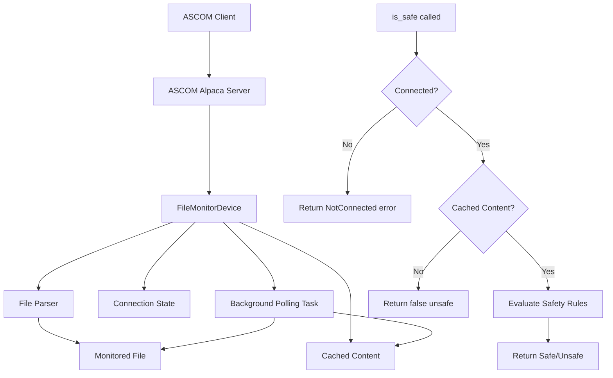

# Filemonitor Service Design

## Overview

The filemonitor service implements an ASCOM Alpaca compatible SafetyMonitor device. It monitors a clear text file and determines safety status based on configurable parsing rules.

**Cross-Platform Support:** The service runs natively on Linux, macOS, and Windows with no platform-specific dependencies.

## Implementation Framework

The service uses the `ascom-alpaca` crate [https://crates.io/crates/ascom-alpaca](https://crates.io/crates/ascom-alpaca) which provides:

- `SafetyMonitor` trait with required `async fn is_safe(&self) -> ASCOMResult<bool>` method
- `Device` trait for common ASCOM functionality (device name, unique ID, etc.)
- `Server` struct for ASCOM Alpaca protocol handling
- Auto-discovery mechanism for network clients
- Built on async/await with tokio runtime
- Cross-platform compatibility (Linux, macOS, Windows)

## Configuration

The service uses a JSON configuration file with the following format:

```json
{
  "device": {
    "name": "File Safety Monitor",
    "unique_id": "filemonitor-001",
    "description": "ASCOM Alpaca SafetyMonitor that monitors file content"
  },
  "file": {
    "path": "/path/to/RoofStatusFile.txt",
    "polling_interval": "60s"
  },
  "parsing": {
    "rules": [
      {
        "type": "contains",
        "pattern": "OPEN",
        "safe": true
      },
      {
        "type": "contains", 
        "pattern": "CLOSED",
        "safe": false
      },
      {
        "type": "regex",
        "pattern": "Status:\\s*(SAFE|OK)",
        "safe": true
      }
    ],
    "case_sensitive": false
  },
  "server": {
    "port": 11111,
    "bind_address": "0.0.0.0",
    "tls": null,
    "auth": {
      "username": "observatory",
      "password_hash": "$argon2id$v=19$m=19456,t=2,p=1$..."
    }
  }
}
```

Configuration sections:

- **device**: ASCOM device metadata (name, unique ID, description)
- **file**: Path to monitor and polling interval (humantime string, e.g. `"60s"`)
- **parsing**: Multiple rule types (contains, regex) with safe/unsafe outcomes
- **server**: ASCOM Alpaca server configuration (port, bind address, optional TLS/auth)
- **server.auth**: Optional HTTP Basic Auth credentials (username, Argon2id password_hash). See [ADR-003](../decisions/003-authentication-for-device-access.md).

The `server` block is the shared `AlpacaServerConfig` from
`crates/rusty-photon-server-config` (see ADR-016): `port`, `bind_address`
(default `0.0.0.0`), optional `discovery_port`, and optional `tls`/`auth`.
Absent `tls`/`auth` means plain, unauthenticated HTTP.

The parsing rules are evaluated in order, with the first match determining safety status. If no rules match, the device defaults to unsafe (`false`) for safety reasons.

Every block (`Config` and each nested config struct — `DeviceConfig`, `FileConfig`, `ParsingConfig`, `ParsingRule`, and the shared `AlpacaServerConfig`) rejects unknown keys at deserialize (`deny_unknown_fields`), so a typo or a key removed by a schema change fails loudly at load instead of being silently ignored.

## Config actions

filemonitor exposes its configuration over HTTP as the vendor ASCOM actions
`config.get` / `config.apply` / `config.schema` on the SafetyMonitor device —
the cross-driver protocol in [`config-actions.md`](config-actions.md),
implemented generically in `rusty_photon_config::actions`. `config_actions.rs`
supplies the driver-specific half (`ConfigurableDriver for FileMonitorDriver`,
`Overrides = ()` — the binary has no CLI overrides beyond `--config` /
`--log-level`) plus the `dispatch` the device delegates to.

- **Secret redacted / carried forward:** `/server/auth/password_hash`.
- **Locked (identity) field:** `device.unique_id`.
- **Hard read-only field:** `server.port`.
- **Validation:** `device.unique_id` and `file.path` must be non-empty,
  `file.polling_interval` must be greater than zero, and every `regex`-type
  parsing rule's `pattern` must compile — a bad pattern otherwise fails
  silently as a non-match at evaluation time (see [Operation](#operation)),
  so `config.apply` rejects it at the config boundary instead.

A `config.apply` that changes a field persists atomically, returns
`status:"applying"`, and fires the in-process reload: `main.rs` runs under
`ServiceRunner::with_reload().run_with_reload(...)`, whose loop
(`run_server_loop`) rebuilds the server from the freshly-persisted file. Both
the shutdown signal and a `config.apply`-fired reload drive the *same*
graceful-shutdown future passed to the running server, so a reload drains
in-flight requests and closes keep-alive connections before rebinding — a
client's persistent connection reconnects and observes the new configuration
rather than continuing to talk to the torn-down server's stale in-memory
state.

## Operation

The service parses the monitored file according to the configured rules, yielding either:

- `true` - Safe condition
- `false` - Unsafe condition or any errors/unresolvable conflicts

The `is_safe()` method contains the core file monitoring and parsing logic, called by ASCOM clients. When the device is not connected, it returns a `NotConnected` error, aligning with the ASCOM spec so clients can distinguish "genuinely unsafe" from "device not connected."

### Connection Management

The `set_connected()` method controls the monitoring behavior:

- **When set to `true`**:
  - Immediately reloads the monitored file to get current content
  - Initiates background polling according to the configured `polling_interval` (humantime string, e.g. `"60s"`)
  - Caches file content for use by `is_safe()` calls
  - Returns error if file cannot be read

- **When set to `false`**:
  - Stops the background polling task
  - `is_safe()` returns a `NotConnected` error when called

The polling runs in a background task that periodically reads the file and updates the cached content. This ensures `is_safe()` calls are fast and don't block on file I/O.

## Architecture



## Implementation Components

1. **FileMonitorDevice**: Struct implementing `Device` and `SafetyMonitor` traits
2. **Configuration**: JSON-based config for file path, parsing rules, and device metadata
3. **File Parser**: Logic to read and parse monitored file according to rules
4. **ASCOM Server**: Uses `ascom-alpaca::Server` to expose device over network

## Example

An example monitored file `RoofStatusFile.txt` might contain:

```
???2025-12-15 01:20:13AM Roof Status: CLOSED
```

This would cause the safety monitor to evaluate to `false` (unsafe), as the roof is closed and the telescope might be in danger of colliding with the roof.

## Cross-Platform Support

The filemonitor service is designed to run natively on multiple platforms:

### Supported Platforms
- **Linux** (x86_64, ARM64) - Primary development platform
- **macOS** (Intel, Apple Silicon) - Full compatibility
- **Windows** (x86_64, ARM64) - Full compatibility

### Platform-Specific Considerations

#### File Paths
The service uses Rust's `PathBuf` for cross-platform path handling:
- **Linux/macOS**: `/home/user/observatory/RoofStatusFile.txt`
- **Windows**: `C:\Observatory\RoofStatusFile.txt` or `\\server\share\RoofStatusFile.txt`

#### Network Binding
- All platforms bind to `0.0.0.0` (all interfaces) by default; configurable via `server.bind_address`
- IPv6 dual-stack support available on all platforms
- Windows Firewall may require configuration for network access

#### File Monitoring
- Uses standard file I/O operations (`std::fs::read_to_string`)
- Polling-based approach works consistently across all platforms
- No platform-specific file watching dependencies

### Installation

#### Linux (Debian/Ubuntu) — `.deb` package
```bash
sudo dpkg -i rusty-photon-filemonitor_0.1.0-1_amd64.deb
```

This installs the binary to `/usr/bin/rusty-photon-filemonitor`, enables and
starts the `rusty-photon-filemonitor` systemd unit, and creates the shared
`rusty-photon` system user (see
[ADR-012](../decisions/012-service-packaging-architecture.md)). The package
ships **no config file**: the service self-creates its config with defaults
on first start at `/var/lib/rusty-photon/.config/rusty-photon/filemonitor.json`
(also reachable via the `/etc/rusty-photon` symlink). Edit it to point at
your monitored file, then `systemctl reload rusty-photon-filemonitor`.
Upgrades never touch the config; package purge removes it.

#### Linux (Fedora/RHEL) — `.rpm` package
```bash
sudo rpm -i rusty-photon-filemonitor-0.1.0-1.x86_64.rpm
```

Same layout and config behavior as the `.deb` package.

#### macOS — Homebrew
```bash
brew tap rusty-photon/rusty-photon
brew install filemonitor
```

#### Windows — suite `.msi` installer
filemonitor ships as a feature of the family-wide
`rusty-photon-<version>-x64.msi` (ADR-015) — select it under **Drivers** in
the installer UI, or silently with
`msiexec /qn /i rusty-photon-<version>-x64.msi ADDLOCAL=Core,Filemonitor`.
It installs as the auto-start Windows service `rusty-photon-filemonitor`
with crash-restart failure actions and a firewall exception on its port.
See [docs/packaging-windows.md](../packaging-windows.md).

#### From source (all platforms)
```bash
cargo build --release -p filemonitor
./target/release/filemonitor -c config.json   # Linux/macOS
.\target\release\filemonitor.exe -c config.json  # Windows
```

### Service Integration

#### Linux (systemd)
A hardened systemd unit is provided at `pkg/rusty-photon-filemonitor.service`
(network-only service class per ADR-012). When installed via the `.deb` or
`.rpm` package, the unit is automatically enabled and started. Manual setup:

```bash
sudo cp pkg/rusty-photon-filemonitor.service /etc/systemd/system/
sudo systemctl daemon-reload
sudo systemctl enable --now rusty-photon-filemonitor
```

The service runs as the shared `rusty-photon` system user, created
automatically during package installation.

#### macOS / Windows
**Runtime support:** The filemonitor binary accepts a hidden `--service`
flag and, when invoked with it under the Windows Service Control Manager,
dispatches via the shared `rusty-photon-service-lifecycle` crate (see
[`docs/crates/rusty-photon-service-lifecycle.md`](../crates/rusty-photon-service-lifecycle.md)).
SCM `Stop` is translated to graceful shutdown; `ParamChange` is translated
to a reload signal that re-reads the config file without restarting the
process. SIGHUP on Unix triggers the same reload path. In SCM mode logs go
to a rolling file `%PROGRAMDATA%\rusty-photon\logs\filemonitor.<date>.log`
(daily rotation, 14 files retained) instead of the dead stderr handle;
console mode logs to stderr unchanged.

**Installer-side registration:** On Windows the suite MSI registers the
`rusty-photon-filemonitor` service (LocalSystem, auto-start, restart-on-
failure actions) — see [docs/packaging-windows.md](../packaging-windows.md).
macOS (launchd) registration is not implemented; running the binary
directly is the supported mode there.

### Monorepo Structure

The filemonitor service is located in `services/filemonitor/` within the rusty-photon monorepo.

#### Building
```bash
# From repository root
cargo build --release -p filemonitor
```

#### Running
```bash
# From repository root
./target/release/filemonitor -c config.json
```

`filemonitor doctor [--config <file>] [--json]` diagnoses this service's own
config read-only without starting it — see
[doctor.md §Per-service doctors](doctor.md). Top-level flags cannot be
combined with the subcommand (the mixed form would silently ignore them).
