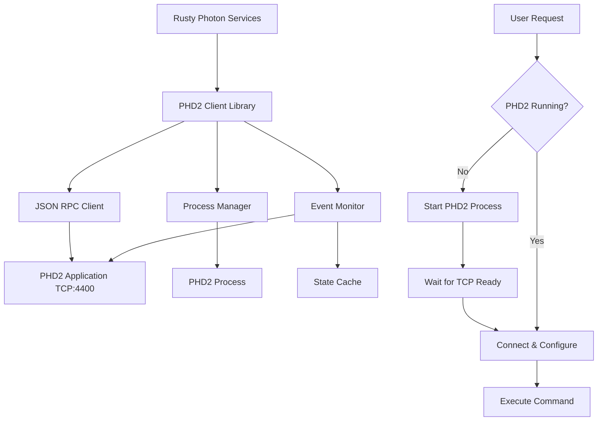

# PHD2 Guider Service Design

## Overview

The PHD2 guider service provides a Rust client library and service for interacting with Open PHD Guiding 2 (PHD2). It enables programmatic control of PHD2 including starting/stopping the application, managing equipment profiles, and controlling guiding operations.

The binary has two roles:

- **CLI** — one-shot subcommands (`status`, `guide`, `dither`, …) for
  operators and scripts.
- **rp-managed HTTP service** — `phd2-guider serve` runs the guider
  service that `rp` proxies its guider MCP tools
  (`start_guiding`, `stop_guiding`, `dither`, …) to. See
  [HTTP Service Mode](#http-service-mode-serve) below and
  `docs/services/rp.md` § "Guider Service".

`phd2-guider doctor [--config <file>] [--json]` diagnoses this service's
own config read-only without starting it — see
[doctor.md §Per-service doctors](doctor.md).

**Cross-Platform Support:** The service runs natively on Linux, macOS, and Windows, matching PHD2's platform support.

## Architecture Overview



## Module Structure

The library is organized into focused modules for maintainability:

```
services/phd2-guider/src/
├── lib.rs          # Crate root with re-exports
├── client.rs       # Phd2Client with all RPC methods
├── config.rs       # Config, Phd2Config, SettleParams, load_config
├── connection.rs   # Internal connection management and auto-reconnect
├── error.rs        # Phd2Error enum and Result type alias
├── events.rs       # AppState, GuideStepStats, Phd2Event
├── fits.rs         # FITS file utilities for saving images
├── io.rs           # I/O traits and implementations for testability
├── process.rs      # Phd2ProcessManager, get_default_phd2_path
├── rpc.rs          # RpcRequest, RpcResponse, RpcErrorObject
├── types.rs        # Rect, Profile, Equipment (shared types)
└── service/        # HTTP service mode (`phd2-guider serve`)
    ├── mod.rs      # ServerBuilder, BoundServer
    ├── api.rs      # axum router, wire types, request handlers
    ├── error.rs    # ServiceError enum + structured error envelope
    └── guider.rs   # GuiderOps: settle wait, stop poll, rolling RMS stats
```

| Module | Description | Key Types |
|--------|-------------|-----------|
| `client` | PHD2 client with RPC methods | `Phd2Client` |
| `config` | Configuration | `Config`, `Phd2Config`, `SettleParams`, `ReconnectConfig` |
| `connection` | Connection management (internal) | `SharedConnectionState`, `ConnectionConfig` |
| `error` | Error handling | `Phd2Error`, `Result<T>` |
| `events` | PHD2 events and state | `Phd2Event`, `AppState`, `GuideStepStats` |
| `fits` | FITS file utilities | `decode_base64_u16`, `write_grayscale_u16_fits` |
| `io` | I/O traits for testability | `LineReader`, `MessageWriter`, `ConnectionFactory`, `ProcessSpawner`, `ProcessHandle` |
| `process` | Process management | `Phd2ProcessManager`, `get_default_phd2_path` |
| `rpc` | JSON RPC 2.0 protocol | `RpcRequest`, `RpcResponse`, `RpcErrorObject` |
| `types` | Common types | `Rect`, `Profile`, `Equipment`, `EquipmentDevice`, `CalibrationData`, `CalibrationTarget`, `GuideAxis`, `CoolerStatus`, `StarImage` |
| `service` | HTTP service mode | `ServerBuilder`, `BoundServer`, `GuiderOps`, `ServiceError` |

All commonly used types are re-exported at the crate root for convenience. The `connection` module is internal (`pub(crate)`) and handles TCP connection establishment, message reading, and auto-reconnection logic.

## I/O Trait Abstractions

The library uses trait abstractions for I/O operations, enabling comprehensive testing without requiring actual network or process operations. This allows tests to run under miri for memory safety verification.

### Traits

| Trait | Purpose | Default Implementation |
|-------|---------|----------------------|
| `LineReader` | Reading lines from a connection | `TcpLineReader` |
| `MessageWriter` | Writing messages to a connection | `TcpMessageWriter` |
| `ConnectionFactory` | Creating connections | `TcpConnectionFactory` |
| `ProcessSpawner` | Spawning processes | `TokioProcessSpawner` |
| `ProcessHandle` | Managing spawned processes | `TokioProcessHandle` |

### Test-Friendly Constructors

Both `Phd2Client` and `Phd2ProcessManager` provide constructors that accept custom implementations of these traits:

```rust
// Production use (default TCP/process implementations)
let client = Phd2Client::new(config);
let manager = Phd2ProcessManager::new(config);

// Testing with mock implementations
let client = Phd2Client::with_connection_factory(config, mock_factory);
let manager = Phd2ProcessManager::with_spawner(config, mock_spawner, mock_factory);
```

This design enables:
- Unit tests that run quickly without network I/O
- Tests that can run under miri for memory safety verification
- Deterministic test behavior without timing dependencies
- Testing error handling and edge cases that are hard to reproduce with real network connections

## PHD2 API Overview

PHD2 provides two network interfaces:

### 1. Socket Server Interface (Port 4300)
- Legacy single-byte command protocol
- Commands: pause, resume, dither, start guiding, stop, etc.
- **Not recommended for new implementations**

### 2. Event Monitoring / JSON RPC Interface (Port 4400) ⭐ **Recommended**
- Modern JSON RPC 2.0 protocol
- Full bidirectional communication
- Event notifications and method invocation
- Multiple simultaneous client connections supported

## Complete PHD2 JSON RPC API Reference

### Guiding Control

| Method | Parameters | Description | Status |
|--------|------------|-------------|--------|
| `guide` | `settle: {pixels, time, timeout}`, `recalibrate: bool`, `roi: [x,y,w,h]` | Start guiding with settling parameters; optional recalibration and region of interest | ✅ |
| `dither` | `amount: float`, `raOnly: bool`, `settle: object` | Shift lock position by specified pixels for dithering between exposures | ✅ |
| `loop` | none | Start capturing exposures, or if guiding, stop guiding but continue capturing | ✅ |
| `stop_capture` | none | Stop all capture and guiding operations | ✅ |

### Pause Control

| Method | Parameters | Description | Status |
|--------|------------|-------------|--------|
| `get_paused` | none | Check if guiding is currently paused | ✅ |
| `set_paused` | `paused: bool`, `full: string` | Pause or resume guiding; "full" pauses looping entirely | ✅ |

### Equipment Connection

| Method | Parameters | Description | Status |
|--------|------------|-------------|--------|
| `set_connected` | `connected: bool` | Connect or disconnect all equipment in current profile | ✅ |
| `get_connected` | none | Check if equipment is connected | ✅ |
| `get_current_equipment` | none | Retrieve list of selected devices in active profile | ✅ |

### Profile Management

| Method | Parameters | Description | Status |
|--------|------------|-------------|--------|
| `get_profile` | none | Return current profile ID and name | ✅ |
| `get_profiles` | none | List all available equipment profiles | ✅ |
| `set_profile` | `id: int` | Switch active profile; equipment must be disconnected first | ✅ |

### Calibration

| Method | Parameters | Description | Status |
|--------|------------|-------------|--------|
| `get_calibrated` | none | Check if mount is calibrated | ✅ |
| `get_calibration_data` | `which: string` | Obtain calibration parameters and angles ("Mount" or "AO") | ✅ |
| `clear_calibration` | `which: string` | Reset calibration data for "mount", "ao", or "both" | ✅ |
| `flip_calibration` | none | Invert existing calibration for meridian flip without recalibrating | ✅ |

### Camera Operations

| Method | Parameters | Description | Status |
|--------|------------|-------------|--------|
| `capture_single_frame` | `exposure: int`, `subframe: [x,y,w,h]` | Acquire one frame with optional exposure (ms) and subframe | ✅ |
| `set_exposure` | `exposure: int` | Set exposure duration in milliseconds | ✅ |
| `get_exposure` | none | Get current exposure time in milliseconds | ✅ |
| `get_exposure_durations` | none | List all valid exposure duration options | ✅ |
| `get_camera_frame_size` | none | Return camera image dimensions (width, height) | ✅ |
| `get_use_subframes` | none | Check if subframing is enabled | ✅ |

### Camera Cooling

| Method | Parameters | Description | Status |
|--------|------------|-------------|--------|
| `get_ccd_temperature` | none | Read current sensor temperature | ✅ |
| `get_cooler_status` | none | Get cooler temperature and power percentage | ✅ |
| `set_cooler_state` | `enabled: bool`, `temperature: float` | Enable/disable cooling and set target temperature | ✅ |

### Guide Star & Lock Position

| Method | Parameters | Description | Status |
|--------|------------|-------------|--------|
| `find_star` | `roi: [x,y,w,h]` | Auto-select a guide star, optionally within specified region | ✅ |
| `get_lock_position` | none | Get current lock position coordinates (x, y) | ✅ |
| `set_lock_position` | `x: float`, `y: float`, `exact: bool` | Set lock position; exact=false allows PHD2 to find nearby star | ✅ |
| `get_lock_shift_enabled` | none | Check if lock position shift is enabled | ❌ |
| `set_lock_shift_enabled` | `enabled: bool` | Enable or disable lock position shifting | ❌ |
| `get_lock_shift_params` | none | Get shift rate and axis configuration | ❌ |
| `set_lock_shift_params` | `rate: [ra,dec]`, `units: string`, `axes: string` | Configure shift parameters | ❌ |

### Guide Algorithm Parameters

| Method | Parameters | Description | Status |
|--------|------------|-------------|--------|
| `get_algo_param_names` | `axis: string` | List algorithm parameter names for "ra" or "dec" axis | ✅ |
| `get_algo_param` | `axis: string`, `name: string` | Read individual algorithm parameter value | ✅ |
| `set_algo_param` | `axis: string`, `name: string`, `value: float` | Modify individual algorithm parameter value | ✅ |

### Guide Output Control

| Method | Parameters | Description | Status |
|--------|------------|-------------|--------|
| `get_guide_output_enabled` | none | Check if guide corrections are being sent to mount | ❌ |
| `set_guide_output_enabled` | `enabled: bool` | Enable or disable sending guide corrections | ❌ |
| `guide_pulse` | `amount: int`, `direction: string`, `which: string` | Send manual pulse; direction: N/S/E/W, which: "mount" or "ao" | ❌ |
| `get_dec_guide_mode` | none | Get declination guide mode (Off/Auto/North/South) | ❌ |
| `set_dec_guide_mode` | `mode: string` | Set declination guide mode | ❌ |

### State & Status

| Method | Parameters | Description | Status |
|--------|------------|-------------|--------|
| `get_app_state` | none | Get current app state: Stopped, Selected, Calibrating, Guiding, LostLock, Paused, Looping | ✅ |
| `get_pixel_scale` | none | Get image scale in arc-seconds per pixel | ❌ |
| `get_search_region` | none | Get star search radius in pixels | ❌ |

### Image Operations

| Method | Parameters | Description | Status |
|--------|------------|-------------|--------|
| `get_star_image` | `size: int` | Get current guide star image data as base64-encoded FITS | ✅ |
| `save_image` | none | Save current frame to FITS file in PHD2's default location | ✅ |

### Timing Configuration

| Method | Parameters | Description | Status |
|--------|------------|-------------|--------|
| `get_variable_delay_settings` | none | Get delay configuration between exposures | ❌ |
| `set_variable_delay_settings` | `enabled: bool`, `shortDelay: int`, `longDelay: int` | Configure exposure delays | ❌ |

### Application Control

| Method | Parameters | Description | Status |
|--------|------------|-------------|--------|
| `shutdown` | none | Close PHD2 application | ✅ |

## PHD2 Event Notifications

PHD2 sends asynchronous event notifications over the same TCP connection:

| Event | Description |
|-------|-------------|
| `Version` | Sent on connect; contains PHD2 version and protocol version |
| `AppState` | Application state changed (Stopped, Guiding, etc.) |
| `GuideStep` | Sent after each guide correction with detailed statistics |
| `GuidingDithered` | Dither operation completed |
| `SettleDone` | Settling after guide/dither completed |
| `StarSelected` | Guide star was selected |
| `StarLost` | Guide star was lost |
| `LockPositionSet` | Lock position was established |
| `LockPositionShiftLimitReached` | Lock shift hit its limit |
| `Calibrating` | Calibration in progress |
| `CalibrationComplete` | Calibration finished |
| `CalibrationFailed` | Calibration failed |
| `CalibrationDataFlipped` | Calibration was flipped |
| `LoopingExposures` | Looping exposures started |
| `LoopingExposuresStopped` | Looping stopped |
| `Paused` | Guiding was paused |
| `Resumed` | Guiding was resumed |
| `GuideParamChange` | Guide algorithm parameter changed |
| `ConfigurationChange` | Configuration was modified |
| `Alert` | Alert message for user |

## Service API Design

The service exposes a high-level Rust API:

### Connection Management

```rust
/// Connect to a running PHD2 instance (uses host/port from config)
async fn connect(&self) -> Result<()>;

/// Disconnect from PHD2
async fn disconnect(&self) -> Result<()>;

/// Check if connected to PHD2
async fn is_connected(&self) -> bool;

/// Get the PHD2 version (available after connection)
async fn get_phd2_version(&self) -> Option<String>;
```

### Process Management

```rust
/// Start PHD2 application (uses executable_path from config or default)
async fn start_phd2(&self) -> Result<()>;

/// Stop PHD2 application gracefully
/// If client is provided, attempts graceful RPC shutdown first
async fn stop_phd2(&self, client: Option<&Phd2Client>) -> Result<()>;

/// Check if PHD2 process is running (by attempting TCP connect)
async fn is_phd2_running(&self) -> bool;

/// Check if we are managing a PHD2 process
async fn has_managed_process(&self) -> bool;
```

### Profile Management

```rust
/// Get list of available equipment profiles
async fn get_profiles(&self) -> Result<Vec<Profile>>;

/// Get current active profile
async fn get_current_profile(&self) -> Result<Profile>;

/// Set active profile (equipment must be disconnected)
async fn set_profile(&self, profile_id: i32) -> Result<()>;
```

### Equipment Control

```rust
/// Connect all equipment in current profile
async fn connect_equipment(&self) -> Result<()>;

/// Disconnect all equipment
async fn disconnect_equipment(&self) -> Result<()>;

/// Check if equipment is connected
async fn is_equipment_connected(&self) -> Result<bool>;

/// Get current equipment configuration
async fn get_current_equipment(&self) -> Result<Equipment>;
```

### Guiding Control

```rust
/// Start guiding with settling parameters
/// roi: Optional region of interest for star selection
async fn start_guiding(&self, settle: &SettleParams, recalibrate: bool, roi: Option<Rect>) -> Result<()>;

/// Stop guiding (continues looping)
async fn stop_guiding(&self) -> Result<()>;

/// Stop all capture and guiding
async fn stop_capture(&self) -> Result<()>;

/// Start looping exposures without guiding
async fn start_loop(&self) -> Result<()>;

/// Pause guiding
/// full: If true, pause looping entirely. If false, continue looping but don't send corrections.
async fn pause(&self, full: bool) -> Result<()>;

/// Resume guiding
async fn resume(&self) -> Result<()>;

/// Check if guiding is paused
async fn is_paused(&self) -> Result<bool>;

/// Get current application state
async fn get_app_state(&self) -> Result<AppState>;

/// Get cached application state (from events, no RPC call)
async fn get_cached_app_state(&self) -> Option<AppState>;

/// Dither the guide position
async fn dither(&self, amount: f64, ra_only: bool, settle: &SettleParams) -> Result<()>;
```

### Star Selection

```rust
/// Auto-select a guide star
async fn find_star(&self, roi: Option<Rect>) -> Result<()>;

/// Get current lock position
async fn get_lock_position(&self) -> Result<(f64, f64)>;

/// Set lock position
/// exact: If true, use exact position. If false, PHD2 will search for a nearby star.
async fn set_lock_position(&self, x: f64, y: f64, exact: bool) -> Result<()>;
```

### Calibration

```rust
/// Check if calibrated
async fn is_calibrated(&self) -> Result<bool>;

/// Get calibration data
/// which: Mount or AO (Both is not valid for get, defaults to Mount)
async fn get_calibration_data(&self, which: CalibrationTarget) -> Result<CalibrationData>;

/// Clear calibration
/// which: Mount, AO, or Both
async fn clear_calibration(&self, which: CalibrationTarget) -> Result<()>;

/// Flip calibration for meridian flip
async fn flip_calibration(&self) -> Result<()>;
```

### Camera Exposure

```rust
/// Get the current exposure duration in milliseconds
async fn get_exposure(&self) -> Result<u32>;

/// Set the exposure duration in milliseconds
async fn set_exposure(&self, exposure_ms: u32) -> Result<()>;

/// Get the list of valid exposure durations in milliseconds
async fn get_exposure_durations(&self) -> Result<Vec<u32>>;

/// Get the camera frame size (width, height) in pixels
async fn get_camera_frame_size(&self) -> Result<(u32, u32)>;

/// Check if subframe mode is enabled
async fn get_use_subframes(&self) -> Result<bool>;

/// Capture a single frame
async fn capture_single_frame(&self, exposure_ms: Option<u32>, subframe: Option<Rect>) -> Result<()>;
```

### Camera Cooling

```rust
/// Get the current CCD sensor temperature in degrees Celsius
async fn get_ccd_temperature(&self) -> Result<f64>;

/// Get the cooler status including temperature and power
async fn get_cooler_status(&self) -> Result<CoolerStatus>;

/// Set the cooler state
/// temperature: Required when enabling the cooler
async fn set_cooler_state(&self, enabled: bool, temperature: Option<f64>) -> Result<()>;
```

### Guide Algorithm Parameters

```rust
/// Get the list of algorithm parameter names for the specified axis
async fn get_algo_param_names(&self, axis: GuideAxis) -> Result<Vec<String>>;

/// Get the value of a guide algorithm parameter
async fn get_algo_param(&self, axis: GuideAxis, name: &str) -> Result<f64>;

/// Set the value of a guide algorithm parameter
async fn set_algo_param(&self, axis: GuideAxis, name: &str, value: f64) -> Result<()>;
```

### Image Operations

```rust
/// Get the current guide star image
/// size: Size of the image in pixels (width and height will be 2*size+1)
async fn get_star_image(&self, size: u32) -> Result<StarImage>;

/// Save the current camera frame to a file
/// Returns the path to the saved file
async fn save_image(&self) -> Result<String>;
```

### FITS Utilities

```rust
/// Decode base64-encoded image data to u16 pixel values
fn decode_base64_u16(base64_data: &str) -> Result<Vec<u16>>;

/// Write a 16-bit grayscale image to a FITS file. Native u16 via
/// BITPIX=16 + BZERO=32768 (per ADR-001 Amendment A; previously the
/// `fitrs`-based path widened to BITPIX=32 because it could not write
/// unsigned values). Atomic and durable: stages, fsyncs, renames,
/// fsyncs the parent dir.
/// `width`/`height` are `usize` because they describe `pixels`; the
/// writer narrows them to `NAXIS1`/`NAXIS2` header cards itself.
async fn write_grayscale_u16_fits(
    path: impl AsRef<Path>,
    pixels: &[u16],
    width: usize,
    height: usize,
    headers: Option<&[(&str, &str)]>,
) -> Result<()>;
```

**Example usage:**
```rust
use phd2_guider::{Phd2Client, decode_base64_u16, write_grayscale_u16_fits};

let image = client.get_star_image(15).await?;
let pixels = decode_base64_u16(&image.pixels)?;
write_grayscale_u16_fits(
    "guide_star.fits",
    &pixels,
    image.width,
    image.height,
    Some(&[("FRAME", &image.frame.to_string()), ("ORIGIN", "PHD2")]),
).await?;
```

### Application Control

```rust
/// Shutdown PHD2 application
async fn shutdown_phd2(&self) -> Result<()>;
```

### Event Subscription

```rust
/// Subscribe to PHD2 events
fn subscribe(&self) -> broadcast::Receiver<Phd2Event>;
```

### Auto-Reconnect Control

```rust
/// Check if auto-reconnect is enabled
fn is_auto_reconnect_enabled(&self) -> bool;

/// Enable or disable auto-reconnect
fn set_auto_reconnect_enabled(&self, enabled: bool);

/// Check if currently reconnecting
async fn is_reconnecting(&self) -> bool;

/// Stop ongoing reconnection attempts
async fn stop_reconnection(&self);
```

## Configuration

```json
{
  "server": {
    "port": 11130,
    "bind_address": "0.0.0.0",
    "tls": null,
    "auth": null
  },
  "stop_timeout": "10s",
  "phd2": {
    "host": "localhost",
    "port": 4400,
    "executable_path": null,
    "connection_timeout": "10s",
    "command_timeout": "30s",
    "auto_start": false,
    "auto_connect_equipment": false,
    "reconnect": {
      "enabled": true,
      "interval": "5s",
      "max_retries": null
    }
  },
  "settling": {
    "pixels": 0.5,
    "time": "10s",
    "timeout": "60s"
  }
}
```

All duration fields use the humantime string format (`"5s"`, `"500ms"`,
`"1m30s"`). See `docs/workspace.md` § "Duration Units" for the
convention.

Configuration sections:

- **server** (only read by `phd2-guider serve`, ignored by the CLI
  subcommands): the shared `ServerConfig` from
  `crates/rusty-photon-server-config` (see ADR-016):
  - `port`: HTTP port (default: `11130`; `0` auto-assigns — used by
    tests)
  - `bind_address`: listen interface (default: `0.0.0.0`, all
    interfaces)
  - `tls` / `auth`: optional HTTPS and HTTP Basic Auth blocks. Absent
    (`null`) means plain, unauthenticated HTTP.
- **stop_timeout** (top level; `serve` mode only): how long
  `POST /api/v1/guiding/stop` waits for PHD2 to reach `Stopped`
  (default: `"10s"`)
- **phd2**: PHD2 connection and process settings
  - `host`: PHD2 host address (default: localhost)
  - `port`: JSON RPC port (default: 4400)
  - `executable_path`: Path to PHD2 executable (null for system default)
  - `connection_timeout`: TCP connection timeout (default: `"10s"`)
  - `command_timeout`: RPC command timeout (default: `"30s"`)
  - `auto_start`: Automatically start PHD2 if not running (declared
    for future use — no code path honors it yet, `serve` included;
    see § HTTP Service Mode)
  - `auto_connect_equipment`: Automatically connect equipment after PHD2 starts
  - `reconnect`: Auto-reconnect settings
    - `enabled`: Enable automatic reconnection (default: true)
    - `interval`: Delay between reconnection attempts (default: `"5s"`)
    - `max_retries`: Maximum reconnection attempts, null for unlimited (default: null)
- **settling**: Default settling parameters for guiding operations.
  Note: PHD2's own JSON-RPC `guide`/`dither` payloads require integer
  seconds for `time` and `timeout`, so this struct is the operator
  config representation. When `client.rs` constructs the wire payload,
  it rounds these durations up to whole seconds (ceil rounding) before
  sending them to PHD2. For example, `"500ms"` is sent as `1` second,
  and `"1.2s"` is sent as `2` seconds.

### Config-path resolution and first-start creation

Config comes from `--config <path>` if given (a missing explicit file is a
hard error). Without it, `serve` resolves the platform default
(`~/.config/rusty-photon/phd2-guider.json` on Linux,
`%PROGRAMDATA%\rusty-photon\phd2-guider.json` on Windows) and — when neither
`--host` nor `--port` is passed, i.e. the packaged path where systemd invokes
the bare binary — bootstraps it via `rusty_photon_config::resolve_and_init`,
**materializing the default config there on first start**. `serve` with
explicit `--host`/`--port` flags and no existing default file runs on
in-memory defaults with the flags applied, writing nothing; the CLI
subcommands (`status`, `monitor`, …) never touch the default path at all —
they always use in-memory defaults plus the flags.

## PHD2 Process Management

### Starting PHD2

**Platform-specific executable locations:**
- **Linux**: `phd2` (in PATH) or `/usr/bin/phd2`
- **macOS**: `/Applications/PHD2.app/Contents/MacOS/PHD2`
- **Windows**: `C:\Program Files (x86)\PHDGuiding2\phd2.exe`

**Startup sequence:**
1. Check if PHD2 is already running (attempt TCP connect)
2. If not running, spawn PHD2 process
3. Wait for TCP port 4400 to become available (with timeout)
4. Connect and receive initial Version event
5. Optionally set profile and connect equipment

### Stopping PHD2

**Clean shutdown sequence:**
1. Stop any active guiding (`stop_capture`)
2. Disconnect equipment (`set_connected(false)`)
3. Send `shutdown` RPC command
4. Wait for process to exit (with timeout)
5. Force kill if graceful shutdown fails

## Auto-Reconnect

The client automatically attempts to reconnect when the connection to PHD2 is lost (e.g., PHD2 crashes or is restarted). This behavior is enabled by default but can be configured or controlled at runtime.

### Connection Events

The following events are broadcast when connection state changes:

| Event | Description |
|-------|-------------|
| `ConnectionLost` | Connection was lost (includes reason) |
| `Reconnecting` | Attempting to reconnect (includes attempt number) |
| `Reconnected` | Successfully reconnected |
| `ReconnectFailed` | Reconnection failed (max retries or cancelled) |

### Reconnection Behavior

1. When the TCP connection is lost, `ConnectionLost` event is broadcast, and
   the cached PHD2 version and app state are cleared — `get_phd2_version()`
   and `get_cached_app_state()` return `None` until the new session's
   `Version`/`AppState` events arrive, so callers can't mistake stale data
   from the ended session for the reconnected one
2. If auto-reconnect is enabled, reconnection attempts begin immediately
3. Each attempt broadcasts a `Reconnecting` event
4. Between attempts, waits for the configured interval
5. On success, `Reconnected` event is broadcast and normal operation resumes
6. On failure (max retries or disabled), `ReconnectFailed` event is broadcast

### Runtime Control

Auto-reconnect can be controlled at runtime:
- `set_auto_reconnect_enabled(false)` - Disables auto-reconnect; stops any ongoing reconnection
- `stop_reconnection()` - Stops current reconnection attempt without disabling future reconnects
- `disconnect()` - Cleanly disconnects and stops any reconnection attempts

## HTTP Service Mode (`serve`)

`phd2-guider serve` — also the default when the binary runs with no
subcommand, which is how the packaged systemd unit invokes it — runs
the **rp-managed guider service** described in `docs/services/rp.md`
§ "Guider Service": a narrow HTTP API in front of the PHD2 JSON-RPC
client, so `rp` speaks only HTTP and never PHD2's wire protocol. The shape deliberately mirrors
[`docs/services/plate-solver.md`](plate-solver.md) — the other
rp-managed service — including the structured error envelope, the
`/health` probe, the `bound_addr=` stdout line for test harnesses, and
the OS-process-supervisor recovery posture.

Default port: **11130** (matches the `guider.url` placeholder in
`rp.md` § "Configuration").

### What serve mode does and does not do

- It **connects to an already-running PHD2** (`phd2.host`/`phd2.port`)
  using the client's auto-reconnect. A failed connect at startup is
  **not fatal**: the service binds and serves anyway, reports `503` on
  `/health`, fails guiding requests with `phd2_unreachable`, and keeps
  retrying in the background. PHD2 starting later (or restarting
  mid-night) needs no service restart.
- It does **not** spawn or supervise the PHD2 process in v1.
  `Phd2Config.auto_start` and the `Phd2ProcessManager` remain
  library/CLI functionality; under `serve` the operator (or their OS
  supervisor) owns the PHD2 process. Process adoption is future work.
  For installing PHD2 itself on a packaged Linux host — and running it
  headless — see
  [docs/packaging.md §phd2-guider: PHD2](../packaging.md#phd2-guider-phd2).
- It is **stateless across restarts** in the way that matters:
  guiding runs *in PHD2*, so a service restart never interrupts an
  active guide loop. The only state lost is the rolling RMS window,
  which refills within a few guide exposures. Restart is always cheap
  — the same property that makes the plate-solver's supervision
  posture safe.
- Graceful shutdown does **not** stop guiding. Stopping the guide loop
  is an explicit `POST /api/v1/guiding/stop` (issued by `rp` — e.g.
  its safety path), never a side effect of service lifecycle.

### Units

All pixel quantities carry the `_px` suffix on the wire
(`rms_ra_px`, `amount_px`). Settle thresholds and dither offsets are
**guide-camera pixels** — PHD2's native unit — not arcseconds:
converting arcseconds would require the guide camera's pixel scale,
which PHD2 only knows after calibration, and a settle threshold must
be expressible before the first calibration of the night.

### HTTP API

All request/response bodies are JSON. Durations are humantime strings
(`"10s"`); the service converts to PHD2's integer seconds with ceil
rounding (see § Configuration).

#### `POST /api/v1/guiding/start`

Start the guide loop and **block until PHD2 reports the star settled**.

Request (all fields optional):

```json
{
  "recalibrate": false,
  "settle": { "pixels": 1.5, "time": "10s", "timeout": "60s" }
}
```

`settle` defaults to the config `settling` block. `recalibrate`
defaults to `false` (PHD2 reuses its stored calibration and
calibrates on its own if it has none).

Behavior:

1. Subscribe to the event pump's settle verdicts **before** issuing
   the `guide` RPC, so a fast `SettleDone` cannot be missed.
2. Reset the rolling RMS window, then send `guide` with the settle
   parameters.
3. Wait for `SettleDone`, bounded by a wall-clock backstop of
   `settle.timeout + 10 s` (PHD2 enforces `settle.timeout` itself and
   reports expiry via `SettleDone{status≠0}`; the backstop only
   catches a wedged or disconnected PHD2).
4. `SettleDone{status: 0}` → `200` with the RMS snapshot, which
   accounts for every guide step PHD2 sent before it settled (see
   [RMS statistics](#rms-statistics)).
   `SettleDone{status ≠ 0}` → `guide_failed` carrying PHD2's error
   text. Backstop expiry → `settle_timeout`.

Calling it while already guiding is valid: PHD2 re-runs the settle
check and the service returns the fresh RMS snapshot.

Success response (also the shape `dither` returns):

```json
{
  "state": "guiding",
  "rms_ra_px": 0.3,
  "rms_dec_px": 0.4,
  "total_rms_px": 0.5,
  "sample_count": 12
}
```

RMS fields are `null` while `sample_count` is 0.

#### `POST /api/v1/guiding/stop`

Stop capture and **block until PHD2 confirms it stopped**. Sends
`stop_capture`, then polls `get_app_state` every 250 ms until it
reports `Stopped`, bounded by the config `stop_timeout` (default
`"10s"`; expiry → `stop_timeout` error). Idempotent — an
already-stopped PHD2 returns success immediately.

Response: `{ "state": "stopped" }`.

#### `POST /api/v1/guiding/pause` / `POST /api/v1/guiding/resume`

Forward to PHD2's `set_paused`. `pause` accepts
`{ "full": false }` (default `false`: keep looping exposures, just
stop sending corrections — the right mode around a camera readout).
Both return `{ "state": "paused" | "resumed" }`. Neither blocks on
settling; resuming does not re-settle.

#### `POST /api/v1/dither`

Shift the lock position and **block until settled** (same wait, same
backstop, and same success shape as `guiding/start`).

```json
{
  "amount_px": 5.0,
  "ra_only": false,
  "settle": { "pixels": 1.5, "time": "10s", "timeout": "60s" }
}
```

`amount_px` is required and must be `> 0`. The service first checks
PHD2's application state and rejects the request with `not_guiding`
when the state is not `Guiding` — deterministic, instead of parsing
whatever error text PHD2 would produce.

#### `GET /api/v1/guiding/stats`

Read-only snapshot; never blocks on settling and bypasses the
mutating-request queue.

```json
{
  "app_state": "Guiding",
  "guiding": true,
  "rms_ra_px": 0.3,
  "rms_dec_px": 0.4,
  "total_rms_px": 0.5,
  "snr": 25.1,
  "star_mass": 5340.0,
  "sample_count": 12
}
```

`app_state` is a fresh `get_app_state` RPC (`guiding` is derived from
it). `snr`/`star_mass` mirror the most recent `GuideStep` event
exactly — `null` when the latest step omitted the measurement, so the
snapshot never reports stale telemetry. RMS comes from the rolling
window; all nullable fields are `null` when no samples exist.

#### `GET /api/v1/guiding/metrics`

The per-frame star-metric window backing rp's guide-focus features
(rp.md § Guide Focus Watch and the guide-train `auto_focus` sweep):
the last **50** `GuideStep` / `StarLost` events, oldest first,
cleared together with the RMS window when `guiding/start` is issued.
Read-only; never blocks and bypasses the mutating-request queue.

```json
{
  "guiding": true,
  "frames": [
    { "frame": 41, "hfd": 2.31, "snr": 24.8, "star_mass": 5120.0, "star_lost": false },
    { "frame": 42, "hfd": null, "snr": 3.1, "star_mass": null, "star_lost": true }
  ]
}
```

- A `GuideStep` event appends an entry with `star_lost: false` and
  the metric fields exactly as PHD2 reported them (`null` where the
  event omitted a measurement — older PHD2 versions have no `HFD`).
- A `StarLost` event appends `star_lost: true` with whatever metrics
  the event carried.
- `frame` is PHD2's own frame counter — consumers poll for freshness
  by watermark (`frame` greater than the last one they acted on),
  never by array position.
- `guiding` is derived from a fresh `get_app_state`, as in `stats`.

#### `GET /api/v1/equipment`

Read-only passthrough of PHD2's `get_current_equipment`: each
equipment slot's `{ "name", "connected" }`, `null` for slots the
current profile does not configure. Bypasses the mutating queue.

```json
{
  "camera":  { "name": "QHY5III715C", "connected": true },
  "mount":   { "name": "On Camera", "connected": true },
  "aux_mount": null,
  "ao":      null,
  "rotator": null
}
```

The `rotator` slot is what rp's rotate-while-guiding ladder branches
on (rp.md § Rotator Tool Details): PHD2 with a connected rotator
records the rotation angle with each calibration and adjusts on its
own; without one, rp decides between clearing the calibration and
accepting the cross-axis leak.

#### `POST /api/v1/calibration/clear`

Clear PHD2's stored calibration; PHD2 recalibrates on the next guide
start. Body optional: `{ "which": "mount" | "ao" | "both" }`,
default `"mount"`. Mutating (queues behind the single-flight mutex).

Response: `{ "state": "cleared" }`.

#### `POST /api/v1/star/reselect`

Auto-select a guide star on the current frame (PHD2 `find_star`,
full frame). Used by rp after a rotation of the guide field moved
the star. Requires frames to be flowing (looping or guiding); when
PHD2 cannot find a star, the RPC error surfaces as `guide_failed`
with PHD2's text. Mutating.

Response: `{ "state": "selected" }`.

#### `GET /health`

`200 {"status": "ok"}` while the TCP connection to PHD2 is
established;
`503 {"status": "unavailable", "message": "..."}` otherwise, where
`message` is a human-readable explanation of the missing dependency
(no connection to PHD2 at the configured host/port). Cheap (no RPC
round-trip — it reads the client's connection state), so external
tooling may probe at high frequency. Auto-reconnect keeps working
regardless of probes.

The `503` deliberately means **alive but degraded** — PHD2 being off
is the normal daytime state, not a fault. Sentinel's
[health supervision](sentinel.md#service-health-supervision) counts it
as proof of life (no restart, no notification) and shows the service
amber on the dashboard with `message` displayed verbatim, so the
operator sees *why* without sentinel interpreting it (issue #595).

### RMS statistics

The service accumulates PHD2 `GuideStep` events into a rolling window
(last **50** steps), cleared each time `guiding/start` is issued.

- `rms_ra_px` = √(mean(`RADistanceRaw`²)), `rms_dec_px` =
  √(mean(`DECDistanceRaw`²)), `total_rms_px` =
  √(`rms_ra_px`² + `rms_dec_px`²).
- Steps missing a distance field are skipped for that axis.
- The window survives a guiding stop (last-known stats remain
  readable) and is lost on service restart.

The same event pump feeds the **metrics ring** behind
`GET /api/v1/guiding/metrics`: per-frame `{frame, hfd, snr,
star_mass, star_lost}` entries (also 50, also cleared on
`guiding/start`), recording `StarLost` events alongside guide steps
so consumers can tell a degraded star from a vanished one.

The pump is the **only** consumer of PHD2's event stream, and it
republishes a settle verdict only after folding the events that
preceded it. That ordering is what makes the snapshot in a `guide` or
`dither` response complete: a settle wait on the raw event stream
would be a second, independent subscriber racing the pump, and a
response could then report fewer samples than PHD2 had already sent.
The RMS figures would not give it away — a window short one step still
looks plausible — so `sample_count` is the field that shows it.

### Concurrency

Mutating requests (`guiding/start`, `guiding/stop`, `pause`,
`resume`, `dither`, `calibration/clear`, `star/reselect`) serialize
behind a single-flight mutex — overlapping requests **queue, not
error** (plate-solver precedent). PHD2 is a single guiding head;
concurrent settle waits are meaningless. `stats`, `metrics`,
`equipment`, and `health` do not take the mutex.

### Error envelope

Errors return the plate-solver's structured shape (`details` is
omitted from the wire when there is nothing to attach):

```json
{ "error": "guide_failed", "message": "settle failed: Star lost" }
```

| Code | HTTP status | Trigger |
|------|-------------|---------|
| `invalid_request` | 400 | Schema-invalid body, non-positive or non-finite `amount_px` / `settle.pixels`, unparseable durations. Rejected before any RPC. |
| `not_guiding` | 409 | `dither` while PHD2's application state is not `Guiding`. |
| `guide_failed` | 422 | PHD2 reported `SettleDone{status ≠ 0}` (star lost, calibration failed, settle threshold not reached in time). PHD2's error text is in `message`. |
| `settle_timeout` | 504 | Wall-clock backstop (`settle.timeout + 10 s`) expired without any `SettleDone`. |
| `stop_timeout` | 504 | PHD2 did not reach `Stopped` within `stop_timeout`. |
| `phd2_unreachable` | 502 | No PHD2 connection, or the RPC failed to send. |
| `internal` | 500 | Unexpected service failure. |

### Supervision and recovery

Same three-domain posture as the plate-solver: the operator's OS
process supervisor restarts `phd2-guider serve` (and PHD2, and `rp`)
on exit; `/health` is exposed for operational tooling; `rp`'s HTTP
client applies its own outer timeout as the backstop. Because guiding
state lives in PHD2, a service restart costs at most one in-flight
request.

### Startup and port discovery

`serve` binds `server.bind_address:server.port` and prints
`bound_addr=<host>:<port>` to stdout (the `bdd-infra::ServiceHandle`
discovery convention; `port: 0` auto-assigns). Config validation
failures exit non-zero before binding.

## Implementation Phases

### Phase 1: Core Connection and JSON RPC Client (MVP) ✅
- [x] Implement TCP connection to PHD2 port 4400
- [x] Implement JSON RPC 2.0 request/response handling
- [x] Parse PHD2 event stream (Version, AppState)
- [x] Implement connection management (`connect`, `disconnect`)
- [x] Implement `get_app_state` method
- [x] Basic error handling for connection failures
- [x] Unit tests for JSON RPC message parsing

### Phase 2: Guiding Control ✅
- [x] Implement `guide` (start guiding)
- [x] Implement `stop_capture`
- [x] Implement `loop`
- [x] Implement `set_paused` / `get_paused`
- [x] Implement settling parameter handling
- [x] Handle GuideStep and SettleDone events
- [x] Unit tests for guiding state machine
- [x] Implement `dither`

### Phase 3: Equipment and Profile Management ✅
- [x] Implement `get_profiles` / `set_profile`
- [x] Implement `set_connected` / `get_connected`
- [x] Implement `get_current_equipment`
- [x] Unit tests for profile switching

### Phase 4: Process Management ✅
- [x] Implement PHD2 process spawning (cross-platform)
- [x] Implement process health monitoring
- [x] Implement graceful shutdown with `shutdown` RPC
- [x] Implement auto-reconnect on PHD2 restart
- [x] Integration tests with PHD2 process

### Phase 5: Star Selection and Calibration ✅
- [x] Implement `find_star`
- [x] Implement lock position get/set
- [x] Implement calibration status and data retrieval
- [x] Implement `clear_calibration` / `flip_calibration`

### Phase 6: Advanced Features ✅
- [x] Implement dithering support
- [x] Event subscription and broadcasting
- [x] Implement guide algorithm parameter get/set
- [x] Implement camera exposure control
- [x] Implement camera cooling control
- [x] Handle calibration events

### Phase 7: Testing and Validation (Partial)
- [x] Comprehensive unit tests
- [ ] Integration tests with PHD2 simulator
- [x] Integration tests with real PHD2 instance
- [ ] Cross-platform testing (Linux, Windows, macOS)
- [ ] Documentation and examples

### Phase 8: HTTP Service Mode ✅
- [x] `serve` subcommand with two-phase `ServerBuilder` (bind, then run)
- [x] Guiding endpoints with settle blocking + rolling RMS stats
- [x] Structured error envelope + `/health`
- [x] `mock_phd2` event emission (settle modes, RPC log, app-state tracking)
- [x] BDD suite for the HTTP contract (`http_api.feature`)
- [ ] PHD2 process adoption under serve (spawn/supervise; `auto_start`) — deferred

## Dependencies

```toml
[dependencies]
tokio = { version = "1", features = ["full", "process"] }
serde = { version = "1", features = ["derive"] }
serde_json = "1"
tracing = "0.1"
thiserror = "2"
base64 = "0.22"
rp-fits = { workspace = true }
axum = { workspace = true }        # HTTP service mode
```

## Testing Strategy

### Test Files

```
services/phd2-guider/tests/
├── test_integration.rs        # End-to-end tests: library + CLI subprocess
├── test_mock_server.rs        # Mock server protocol tests (TCP binding + client internals)
├── bdd.rs                     # BDD entry point (harness = false)
├── bdd/                       # World + step definitions for the HTTP service contract
└── features/
    └── http_api.feature       # serve-mode contract (the API rp proxies to)
# Unit and mock-based tests are in src/ as #[cfg(test)] modules
```

### Unit Tests (Mockall-based)
- JSON RPC 2.0 message serialization/deserialization
- Event parsing for all event types
- All client RPC methods with mock I/O
- Connection state management
- Process spawning and management
- Run under miri for memory safety verification

### CLI Integration Tests
- All CLI subcommands (status, guide, dither, etc.)
- Command-line argument parsing
- Config file loading
- Error handling (connection failures, invalid arguments)
- `mock_phd2` binds `:0` and announces the result on stdout
  (`MOCK_PHD2_PORT:<port>`), so these run in parallel without contending for a
  port. The CLI is given `--host 127.0.0.1` explicitly: the config default is
  `localhost`, which resolves `::1` first on a dual-stack host, and the mock
  binds `127.0.0.1` only.
- The tests driving `Phd2ProcessManager` cannot use an announced port, because
  the port is an *input* to that API — `start_phd2` probes it before spawning,
  the child receives it through `spawn_env`, and `wait_for_ready` polls it — and
  neither can the tests that want a port with nothing listening. Both take one
  from `reserved_test_port()`, a band below the platform ephemeral floor that no
  `bind(0)` can be assigned (see docs/skills/testing.md §5.1).

### Library Integration Tests
- Connect to PHD2 and verify version event
- Start/stop guiding cycle
- Profile switching
- Equipment connect/disconnect
- Process start/stop

### BDD (HTTP service contract)

`tests/features/http_api.feature` is the canonical contract for the
serve mode — `rp`'s guider client (`crates/rp-guider`) is written
against it. Each scenario spawns `mock_phd2` (with per-scenario env)
and then `phd2-guider serve` pointed at it via
`bdd_infra::ServiceHandle`, mirroring how `plate-solver`'s BDD drives
`mock_astap`.

`mock_phd2` supports scenario control via environment variables:

| Variable | Effect |
|----------|--------|
| `MOCK_PHD2_MODE` | Process/connection behavior: `normal` (default), `exit_immediately`, `no_listen`, `slow_start`, `shutdown_fails` |
| `MOCK_PHD2_SETTLE_MODE` | What follows a `guide`/`dither` RPC: `settle_ok` (default — emit `Settling`, two fixed `GuideStep` events, then `SettleDone{status: 0}`), `settle_fail` (`SettleDone{status: 1, Error: "Mock star lost"}`), `never_settle` (no `SettleDone` — drives the `settle_timeout` backstop) |
| `MOCK_PHD2_STOP_MODE` | `stops` (default — `stop_capture` moves the app state to `Stopped`) or `never_stops` (state stays `Guiding` — drives `stop_timeout`) |
| `MOCK_PHD2_RPC_LOG` | Path to a JSON-lines file the mock appends each received `{method, params}` to — used for request-forwarding assertions (the `MOCK_ASTAP_ARGV_OUT` equivalent) |

The mock tracks a per-connection application state
(`Stopped` → `Guiding` on `guide`, → `Stopped` on `stop_capture`) so
the service's stop poll and the `dither`-while-stopped rejection are
observable. The fixed `GuideStep` distances (`RADistanceRaw` ±0.3,
`DECDistanceRaw` ∓0.4) make the RMS deterministic:
`rms_ra_px = 0.3`, `rms_dec_px = 0.4`, `total_rms_px = 0.5`.

### Manual Testing
- Test with real guiding session
- Verify dithering works with imaging software
- Test auto-reconnect after PHD2 crash
- Exercise serve mode against a real PHD2 (`phd2-guider serve` +
  `curl` the endpoints above)

## Error Handling

The service uses typed errors:

```rust
#[derive(Debug, thiserror::Error)]
pub enum Phd2Error {
    #[error("Not connected to PHD2")]
    NotConnected,

    #[error("Connection failed: {0}")]
    ConnectionFailed(String),

    #[error("PHD2 not running")]
    Phd2NotRunning,

    #[error("Equipment not connected")]
    EquipmentNotConnected,

    #[error("Not calibrated")]
    NotCalibrated,

    #[error("Invalid state for operation: {0}")]
    InvalidState(String),

    #[error("RPC error: {code} - {message}")]
    RpcError { code: i32, message: String },

    #[error("Timeout: {0}")]
    Timeout(String),

    #[error("IO error: {0}")]
    Io(#[from] std::io::Error),

    #[error("JSON error: {0}")]
    Json(#[from] serde_json::Error),

    #[error("Failed to send message: {0}")]
    SendError(String),

    #[error("Failed to receive response")]
    ReceiveError,

    #[error("Failed to start PHD2 process: {0}")]
    ProcessStartFailed(String),

    #[error("PHD2 executable not found: {0}")]
    ExecutableNotFound(String),

    #[error("Process already running")]
    ProcessAlreadyRunning,

    #[error("Reconnection failed: {0}")]
    ReconnectFailed(String),
}
```

## References

- [Open PHD Guiding](https://openphdguiding.org/)
- [PHD2 Event Monitoring Documentation](https://github.com/OpenPHDGuiding/phd2/wiki/EventMonitoring)
- [PHD2 Socket Server Interface](https://github.com/OpenPHDGuiding/phd2/wiki/SocketServerInterface)
- [PHD2 Source Code](https://github.com/OpenPHDGuiding/phd2)
