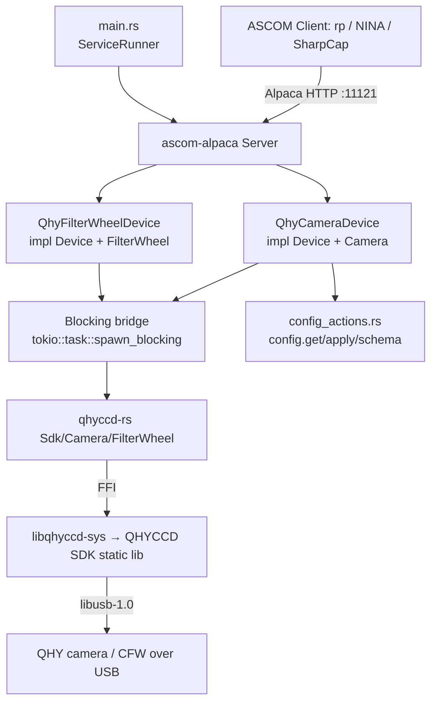

# Qhy-Camera Service Design

> **Status:** Implemented (v0). The driver lives in
> [`services/qhy-camera`](../../services/qhy-camera). All 8 BDD feature suites
> (56 scenarios) and the unit tests are green against the `qhyccd-rs`
> `simulation` backend; ConformU runs in CI. This document remains the
> behavioural specification — the handful of implementation deviations from the
> original design are called out inline (search "*Implementation note*"). The
> *Delivery phasing* § Phase 0–6 tracked the SDK-de-risk → full-driver rollout.

## Overview

The `qhy-camera` service is an ASCOM Alpaca **Camera** (and optional
**FilterWheel**) driver for real QHYCCD hardware. It exposes a connected QHY
camera — exposures, ROI/binning, gain/offset, cooling, readout modes — over
ASCOM Alpaca on a fixed port so the `rp` orchestrator (and any Alpaca client:
NINA, SGPro, SharpCap) can drive it like any other device.

It is the **first hardware imaging camera** in rusty-photon, complementing the
existing [`sky-survey-camera`](sky-survey-camera.md) *simulator* (which it reuses
for scaffolding) and the same-vendor [`qhy-focuser`](qhy-focuser.md) driver.

**Provenance.** The behaviour is derived from the author's standalone
[`ivonnyssen/qhyccd-alpaca`](https://github.com/ivonnyssen/qhyccd-alpaca) driver
(MIT OR Apache-2.0, same author). Rather than vendoring that ~1,350-LOC monolith,
this service is **written natively against rusty-photon conventions on top of the
published [`qhyccd-rs`](https://crates.io/crates/qhyccd-rs) crate** (the durable,
reusable FFI layer), using `qhyccd-alpaca`'s device-trait code only as the
behavioural reference. See *Delivery phasing* and
[ADR — to be written] for why.

**Requires a proprietary native SDK.** Unlike `filemonitor` /
`sky-survey-camera`, this service links a **proprietary native SDK** that must be
provisioned before it will link, so a developer without the SDK cannot build
`-p qhy-camera`. The SDK *is* cross-platform on x86 (Linux/macOS/Windows via the
install action; linux-arm64 via the Pi), so CI builds it on all GitHub-hosted
OSes — but the SDK requirement is still the dominant design constraint. See
*Native dependency & build gating*.

---

## Native dependency & build gating (the crux)

This is the single most consequential fact about this service and the reason it
is delivered in two tracks.

- The imaging path is `qhy-camera → qhyccd-rs (0.1.9) → libqhyccd-sys (0.1.4) →`
  the **proprietary QHYCCD SDK** (a closed-source static lib) **+ libusb-1.0**.
  Both `qhyccd-rs` and `libqhyccd-sys` are **vendored first-party** at
  `crates/qhyccd-rs/` (the `libqhyccd-sys` sub-crate nested inside) per
  [ADR-009](../decisions/009-vendor-qhyccd-rs.md) — we develop them in-tree and
  dual-home them to crates.io.
- `libqhyccd-sys` declares `links = "qhyccd"` and its `build.rs` emits
  `cargo:rustc-link-lib=static=qhyccd` + `dylib=usb-1.0` **unconditionally** —
  there is **no feature/cfg gate** on the link.
- **macOS link fix (now in-tree, no patch):** the *published* crates.io
  `libqhyccd-sys 0.1.4` was cut before the macOS link fix landed — on macOS its
  `build.rs` emitted only `static=qhyccd` + `dylib=c++` and **never linked
  `libusb-1.0`**, failing with `Undefined symbols … _libusb_*`. This used to be
  worked around with a `[patch.crates-io]` git override pinning `libqhyccd-sys`
  to a GitHub commit. Since [ADR-009](../decisions/009-vendor-qhyccd-rs.md)
  vendored the crate, that **patch is gone** — the fixed `build.rs` (the
  `/opt/homebrew/lib` search path + the `dylib=usb-1.0` directive) lives in the
  in-tree source at `crates/qhyccd-rs/libqhyccd-sys/build.rs`. Linux/Windows
  link directives are unchanged.
- **Consequence:** *every machine that compiles this package* — dev laptops, CI
  runners, Bazel actions — needs the QHYCCD SDK installed and discoverable, plus
  `libusb-1.0` dev headers. Not just machines with a camera attached.
- The `qhyccd-rs` **`simulation` feature** (which this service forwards as its own
  `simulation` feature) makes the build **camera-free** (it fabricates fake frames
  at runtime via `rand`/`rayon`), and — with **`QHYCCD_SKIP_NATIVE_LINK=1`** —
  **SDK-free** too: the real FFI is `cfg`'d out and `libqhyccd-sys`'s `build.rs`
  omits the link (and drops the `#[link]` attribute via the `qhyccd_skip_link`
  cfg), so a simulation build needs no QHYCCD SDK installed. This mirrors zwo-rs's
  `ZWO_SKIP_NATIVE_LINK`. *Without* that env the static `qhyccd` lib is still linked
  even under `simulation` (so a plain `--features simulation` build with the SDK
  present works unchanged). SDK-less dev builds, the `safety.yml`
  sanitizer, and the per-PR `test.yml` / `conformu.yml` jobs set the env (so they
  need no SDK); the real (non-simulation) build — `native.yml`, `scheduled.yml`,
  Bazel's real variant, the Pi nightly — leaves it unset and links `static=qhyccd`.

### Why this matters for rusty-photon specifically

The workspace is **currently 100% pure-Rust at the link layer — zero
native/system-lib dependencies**. The old `cfitsio`/`fitsio-sys` requirement was
**purged** in [ADR-001 Amendment A](../decisions/001-fits-file-support.md) (FITS
is now pure-Rust `fitsrs` via `rp-fits`). So `qhyccd-rs` **reintroduces the first
native build dependency** since that purge. It does not match an existing
precedent — it creates a new one. The doc below specifies how it is gated so it
does not break the SDK-less default build.

### Gating plan

| Concern | Mechanism |
|---|---|
| local dev (SDK required) | `qhy-camera` is a normal workspace member but **fails to link without the SDK**. The SDK is a required local-dev prerequisite — install it (CI installs it before building); `bazel build //...` then builds the package like any other. Documented in this design doc and the service README. |
| CI | **The Cargo jobs build qhy-camera SDK-free.** `test.yml` (a nightly safety net) and `conformu.yml` both build on the `--all-features` / `--features conformu` (`simulation`) path — which `cfg`s out the real FFI — and set **`QHYCCD_SKIP_NATIVE_LINK=1`** (workflow-level env), so `libqhyccd-sys`'s `build.rs` omits the link directives and **no QHYCCD SDK or libusb is provisioned** (same pattern as `safety.yml`, and as `ZWO_SKIP_NATIVE_LINK` for the zwo crates). This drops the `ivonnyssen/qhyccd-sdk-install@v3` + libusb + macOS dylib-loader steps from every Cargo leg (ubuntu / macOS / windows / coverage in `test.yml`; Linux/macOS/Windows in `conformu.yml`). The **real native link + FFI** is still exercised by: `native.yml` (provisions the SDK via the published [`ivonnyssen/qhyccd-sdk-install@v3`](https://github.com/ivonnyssen/qhyccd-sdk-install) action on Linux/macOS/Windows, nightly + on camera-crate changes), `scheduled.yml` (nightly/beta), the **Bazel** real variant (`bazel.yml`/`bazel-coverage.yml`), and the **Pi nightly** (linux-arm64, provisioned per-run via the action's sudo-free `install: env` mode → `QHYCCD_SDK_DIR`). The SDK is publicly downloadable from qhyccd.com (no secret/auth). |
| Raspberry Pi nightly runner | `pi-nightly.yml` provisions the SDK (26.06.04) **per run** with `ivonnyssen/qhyccd-sdk-install@v4` in its sudo-free **`install: env`** mode: the action extracts the SDK under the workspace and exports `QHYCCD_SDK_DIR`, which `libqhyccd-sys`'s `build.rs` reads on Linux (preferring it over `/usr/local/lib`) to link `libqhyccd.a` **statically** — no `ldconfig`, no `LD_LIBRARY_PATH`, nothing written to `/usr/local`. This keeps the runner intentionally **sudo-less** (public-repo safety) *and* self-healing — a new native-SDK service or SDK version bump no longer needs a manual `setup-pi-runner.sh` re-run. `setup-pi-runner.sh` therefore no longer installs the QHYCCD SDK (its `§1b` is now a pointer to this per-run flow; ZWO is still pre-provisioned there). **aarch64 confirmed available and linking** — `qhy-camera` builds on the Pi5 arm64 nightly; `libusb`/`stdc++` come from system packages already on the runner. |
| Bazel | **SDK provisioned into the Bazel actions** (no `crate.annotation` needed). `bazel.yml` (3 OSes) + `bazel-coverage.yml` (Linux) install `ivonnyssen/qhyccd-sdk-install@v3` + per-OS libusb. On **Linux** `build.rs` finds the SDK at its hard-coded `/usr/local/lib` (read-only-mounted into the sandbox); on **macOS/Windows** the SDK extracts into `$GITHUB_WORKSPACE`, which `.bazelrc` forwards to build actions via `build:macos`/`build:windows --action_env=GITHUB_WORKSPACE` (`--incompatible_strict_action_env` strips it otherwise). The library, binary, unit test, **`bdd`, and `conformu_integration` are ALL first-class `//...` targets that build _and run_ under Bazel** (the `bdd` suite runs in ~16 s and the full ConformU suite in ~33 s, matching Cargo — both verified locally with 0 errors / 0 issues). **Real/sim split (ADR-009 — first-party two-variant):** since `qhyccd-rs` is now a workspace member with its own [`BUILD.bazel`](../../crates/qhyccd-rs/BUILD.bazel), the SDK variant is chosen by *which library target a rule depends on* — prod targets (library, binary) dep on `//crates/qhyccd-rs:qhyccd-rs` (real static SDK); the sim library/binary (both `testonly`) + the **unit test** + `bdd`/`conformu_integration` dep on `//crates/qhyccd-rs:qhyccd-rs_sim` (the `testonly`, `simulation`-feature variant, so `Sdk::new()` fabricates a pure-Rust QHY178M and no USB is enumerated). **Doctests run per variant** — `qhyccd-rs_doc_test` (real) and `qhyccd-rs_sim_doc_test` (sim) — because the crate's public API forks on the feature (`Camera::new` vs `Camera::new_simulated`) while most examples hang off ungated items, so an example is only proven where it is actually compiled; the sim target must repeat `crate_features = ["simulation"]`, since `rust_doc_test` builds its own `CrateInfo` and would otherwise have rustdoc *collect* the non-simulation example set and compile it against the simulated rlib. Both run on all three OSes, but **Windows needed a `MAX_PATH` fix first** (issue #739, measured on CI): the crate's one *runnable* example (`lib.rs`, the simulated-SDK walkthrough) is the first doctest under Bazel to invoke `link.exe`, and `rust_doc_test` spells sysroot inputs relative to the runfiles tree, whose prefix alone eats 123 characters — so `libpanic_unwind-….rlib` landed at 261, one over the limit, and failed `LNK1181` while `libstd-….rlib` at 252 in the same directory resolved. The file was present and readable; only its path length was wrong, and the job's `LongPathsEnabled` step cannot help because that is opt-in per binary via a `longPathAware` manifest which `link.exe` lacks. [The vendored rustdoc Windows patch](../../third_party/patches/rustdoc_test_windows_external_repo_path.patch) now resolves `--sysroot=` through the runfiles manifest to its execroot target, which drops that path to 193 and leaves ~55 characters of headroom on the longest std member. The **sim** target additionally needs the same patch's runner restructuring: its `crate_features` reaches rustdoc as `--cfg` + `feature="simulation"`, and those embedded quotes cannot ride a batch line (`cmd.exe` tracks quote state without honouring any escape), so the patch writes the Windows runner's command into a companion `.ps1` invoked via `powershell -File` — where single-quoted arguments carry `"` literally — and re-encodes the quotes as `\"` for PowerShell 5.1's native-command marshalling, which would otherwise paste them into the child's command line unescaped. And because both variants share `libqhyccd-sys`'s `build_script.linksearchpaths` runfile — spelled bare workspace-relative, unlike the `external/`-spelled crates.io ones — the pair raced on a dangling tree entry for it when running concurrently on the same Windows runner (issue #781, exactly one victim per attempt); the patch's resolver now routes bare workspace-relative argv paths through the runfiles manifest too. Both doctest targets run on all three OSes. The unit test wraps `:qhy-camera_lib_sim` (matching zwo-camera / svbony-camera): the SDK seam is mock-doubled so the suite gains nothing from the real link, and linking it would make `bazel coverage` instrument qhyccd-rs's compiled-out real-FFI arms as never-executed lines, falsely dragging `crates/qhyccd-rs/src/camera.rs` to ~57%. `testonly` **build-enforces** the boundary: Bazel rejects any production binary that links the simulated SDK. The qhy-camera sim targets still carry `crate_features = […, "simulation"]` so qhy-camera's own `#[cfg(feature = "simulation")]` paths compile (e.g. `--simulation-empty`). **One retained nuance:** crate_universe resolves _one_ feature set per crate and ignores a target's `crate_features`, so the `simulation` feature's optional deps (`rand`/`rayon`) only enter `@cr` if the Cargo resolution reaches `qhyccd-rs/simulation`. qhy-camera therefore keeps a test-only `qhyccd-rs = { features = ["simulation"] }` dev-dep **solely to keep rand/rayon in `@cr`** (verified by spike: dropping it → `qhyccd-rs_sim` fails with `unresolved import rand`). `resolver = "2"` keeps that dev-dep out of `cargo build`, so the production binary links the real SDK. (Aside: crate_universe still materializes an orphan `@cr` `libqhyccd-sys` because the path dep carries a `version` for publish — nothing depends on it; `qhyccd-rs` resolves the workspace-member edge.) Run `CARGO_BAZEL_REPIN=1 bazel mod tidy && bazel mod tidy` after any `Cargo.lock`/feature change (Rule 10). |

### Resolved facts (decided)

- **SDK version: 26.06.04** — keep the install action (x86/Bazel jobs on `@v3`
  system mode; the Pi nightly on `@v4` `install: env` mode), `build.rs` macOS
  dir names, and the Pi script in lockstep. **Packaging changed at 26.x:** the
  repository dir is now the version with dots stripped (`260604`), archives are
  `.tar.gz` (not `.tgz`), there is no `install.sh` (a staged `usr/lib/etc/sbin`
  tree copied into `/`), and the per-OS archives were renamed
  (`macMix`→`mac_x64`, `WinMix`→`win64`, `Arm64`→`linux_arm64`).
  `qhyccd-sdk-install@v3` picks the scheme by a `YYMMDD ≥ 260604` threshold.
  Validated on real hardware (QHY178M + 7-slot CFW, ConformU 0 errors).
- **arm64: supported and linking** on the Pi5 runner — `qhy-camera` is in the
  arm64 nightly matrix.
- **SDK distribution: public, via the published action.** *(Decision revised to
  match the reference CI.)* The QHYCCD SDK is **publicly downloadable from
  qhyccd.com** (`.../publish/SDK/260604/sdk_linux64_26.06.04.tar.gz`); the author's
  `ivonnyssen/qhyccd-sdk-install@v3` action wraps the download and caches it on
  **Linux, macOS, and Windows**. On Linux the 26.x packaging ships no `install.sh`,
  so the action copies the staged `usr/lib/etc/sbin` tree into `/`
  (→ `/usr/local/lib` + `ldconfig`); on macOS/Windows it extracts into
  `$GITHUB_WORKSPACE` where `libqhyccd-sys`'s `build.rs` looks (and adds
  `sdk_win64_<ver>\x64` to `PATH` on Windows). So **no
  authenticated tier, secret, or SHA pin is needed** — the earlier
  "authenticated/internal cache tier pending the redistribution-terms question"
  plan was superseded once the reference's CI confirmed the SDK is fetched
  publicly. (A self-hosted cache could still front it for hermeticity, but is not
  required.)

### Open questions still to resolve before Track A lands

1. **`qhyccd-rs` churn.** Single-maintainer, pre-1.0 (0.1.7/0.1.8/0.1.9 all
   shipped within days). Pin exactly (`=0.1.9`) and track upstream closely.
2. **Shutter actuation API** *(resolved).* `qhyccd-rs` 0.1.9 exposes only shutter
   *presence* (`CamMechanicalShutter`), no open/close actuation. Per the E4
   degradation clause, v0 rejects all dark frames with `NOT_IMPLEMENTED`;
   shutter-actuated darks are Future Work.

---

## Architecture



**Key components**

- **`main.rs`** — plain `fn main`, parses clap args, inits `tracing`, runs under
  `ServiceRunner::new("qhy-camera").with_reload().run_with_reload(...)` per
  [`service-lifecycle.md`](../skills/service-lifecycle.md). No hand-rolled signal
  handling; config bootstrap via `rusty_photon_config::resolve_and_init` with an
  **empty identity-pointer list** (identities are hardware-derived), which still
  materializes the default config file on first start.
- **`lib.rs`** — `ServerBuilder` that, on `build()`, opens the SDK and
  **enumerates every connected camera** (and any CFW discovered on it),
  registering each as an ASCOM device (index 0, 1, 2, …) with its serial-derived
  UniqueID. The eager per-device connect handshake (normalize the readout
  geometry, then cache CCD info, effective area, valid binning modes,
  exposure/gain/offset min-max-step) happens on `set_connected(true)`.
  Returns a `BoundServer`.

  **The handshake sets bin 1x1 and a full-frame resolution before reading the
  effective area.** `GetQHYCCDEffectiveArea` answers from the SDK's current bin
  *and* resolution, and both outlive a close, so reopening a camera the previous
  session left at bin 2 reports `BinX == 1` beside a frame half the width of
  `CameraXSize` — and once the SDK's bin and resolution disagree it reports an
  empty area instead, which is unrecoverable in-process (only restarting the
  service clears it). Verified on a QHY178M: without the normalization, set bin
  2 → disconnect → reconnect yields a 0x0 effective area and every later connect
  fails. An empty area is refused rather than cached, since caching one makes
  `NumX`/`NumY` report 0 — outside the range ASCOM allows — for the life of the
  process.
- **`camera.rs`** — `QhyCameraDevice` (one instance per discovered camera)
  implementing `Device` + `Camera` against `qhyccd-rs`. **Every blocking SDK call
  runs inside `tokio::task::spawn_blocking`** (the same blocking-bridge discipline
  the legacy serial drivers use) so the async runtime is never stalled.
- **`filterwheel.rs`** — `QhyFilterWheelDevice` (one per discovered CFW)
  implementing `Device` + `FilterWheel` (registered automatically on detection —
  no opt-in toggle, the same rule as cameras).
- **`config.rs`** — typed `Config` with parse-don't-validate newtypes.
- **`config_actions.rs`** — `ConfigurableDriver` impl + the `dispatch` the devices
  delegate to (`config.get`/`config.apply`/`config.schema`).
- **`mock.rs`** (feature `simulation`/`mock`) — the hardware-free test backend
  (the `qhyccd-rs` `simulation` camera + a tiny in-crate trait seam over the SDK
  for unit tests).
- **`preflight.rs` / `doctor.rs`** — Windows `qhyccd.dll` resolution (startup
  preflight for the delay-loaded SDK DLL) and the per-service `doctor`
  subcommand ([doctor.md §Per-service doctors](doctor.md)), which carries
  the Windows installation checks; see *Windows: qhyccd.dll resolution*
  below.

**Concurrency.** The QHY SDK is blocking C FFI. Every SDK call runs on
`spawn_blocking`, never on a Tokio worker — a property read is a USB round-trip,
and made inline it stalls every other Alpaca request sharing that worker. Device
state is held field by field rather than behind one lock: the cached geometry,
limits, target temperature and last frame each sit in their own
`parking_lot::Mutex`, and the exposure state machine's flags and counters are
atomics. Nothing takes a reader/writer lock, so there is no shared-read fast
path to reason about — every one of these is short and uncontended, and the
ordering that actually matters is `result_lock`, described under *SDK call
serialization* in **Implementation notes** below.

Two rules with different scopes sit above that, and it is worth keeping them
apart. *Captures* have a single logical owner per device — the in-flight claim
(see *SDK call serialization* in **Implementation notes** below), which is about
the SDK's own ordering rules, not memory safety. Separately, `qhyccd-rs` holds
its handle's read lock across every FFI call, so a `CloseQHYCCD` cannot free the
device beneath a call in flight. Non-close calls still run concurrently on one handle: the SDK manual
takes no position on that, and INDI's `indi-qhy` polls temperature from its
event-loop timer while a readout blocks on its imaging thread, holding no lock at
all. What no driver gets for free is the close exclusion — indi-qhy buys it with
a `pthread_join` before its `CloseQHYCCD`.

Measured on hardware (QHY178M + 7-slot CFW, SDK 26.6.4.16), read latency during
a capture is **bimodal**: across one exposure 1933 of 1935 `CCDTemperature` reads
returned in ~0.4 ms and exactly two stalled — 1222 ms while the capture armed and
760 ms during readout. Readers share the handle's read lock and cannot block one
another, so that stall is *below* this driver's locking, inside the SDK or
libusb. It argues for the read lock rather than against it: a `Mutex` on the
handle would put all 1935 reads behind the arm and the readout instead of two.
The operational consequence is that a property read can occasionally block for
the length of a readout, so it is not a sound liveness probe on a capturing
camera.

---

## MVP scope

The MVP boundary drives BDD scenario selection (Phase 2). Grounded in what
`qhyccd-rs` / `qhyccd-alpaca` actually support today.

**In scope (v0)**

- ASCOM Camera ICameraV3 for **every enumerated QHY camera** (each registered as
  a device on the one port), 16-bit monochrome **and** one-shot-colour (Bayer)
  sensors.
- Startup enumeration registers all discovered cameras (+ CFWs when enabled);
  per-device connect/disconnect lifecycle: open → single-frame mode → init →
  16-bit transfer → cache geometry/limits.
- Sensor geometry (`CameraXSize`/`YSize`, `PixelSizeX`/`Y`) from cached CCD info.
- **Binning** — symmetric only (`CanAsymmetricBin = false`); `MaxBinX/Y` from the
  SDK's valid binning modes; ROI rescaled on bin change.
- **ROI** — `StartX/Y`/`NumX/Y` setters accept any `u32`; geometry validated at
  `StartExposure` (ConformU "Reject Bad…" semantics).
- **Exposure** — `ExposureMin/Max/Resolution` from the SDK; single-frame
  `StartExposure`; `ImageReady`/`ImageArray`/`ImageArrayVariant`; `CameraState`
  (`Idle`/`Exposing`/`Error`); `PercentCompleted` from remaining-exposure µs.
- **Abort** — `CanAbortExposure = true` via the SDK abort path.
- **Gain / Offset** — current value + `Min`/`Max` from the SDK; `NOT_IMPLEMENTED`
  when the control is unavailable on the model.
- **Readout modes** — `ReadoutMode(s)` named from the SDK; switching updates
  cached resolution.
- **Cooling** — `CoolerOn`, `CCDTemperature`, `SetCCDTemperature`, `CoolerPower`,
  `CanSetCCDTemperature`, `CanGetCoolerPower` — all gated on the `Cooler` control.
- **Sensor type** — `Monochrome` vs `RGGB`/colour + `BayerOffsetX/Y`.
- **`MaxADU`** = `(2^transfer_bits) - 1` (65535 for the 16-bit container set at
  connect), from `GetQHYCCDChipInfo`'s reported bit depth — **not**
  `OutputDataActualBits` (see the MaxADU note under "Deliberate divergences");
  `SensorName` from the device id.
- **FilterWheel** as a second ASCOM device on the same port (when present):
  `Names`, `Position` (with moving state), `set_position`, `FocusOffsets`.
- **Dark frames** — `Light = false` returns `NOT_IMPLEMENTED` on all models in
  v0 (qhyccd-rs 0.1.9 has no shutter actuation; see E4). `HasShutter` still
  reports `CamMechanicalShutter` presence.
- `config.get`/`config.apply`/`config.schema` actions; hardware-derived
  `UniqueID` (camera/CFW SDK serial); in-process reload.
- ConformU integration test driven against the `qhyccd-rs` `simulation` backend
  (SDK installed in CI, no physical camera).

**Deferred (see *Future Work*)**

- **Dark/bias frames.** v0 rejects all `Light = false` exposures with
  `NOT_IMPLEMENTED` (qhyccd-rs 0.1.9 has no shutter open/close actuation; see
  E4). Shutter-actuated darks on mechanical-shutter models (e.g. QHY600M) and a
  cap-on operator workflow for shutterless darks are deferred to Future Work.
- `StopExposure` (graceful stop) — upstream returns `NOT_IMPLEMENTED`; only
  `AbortExposure` works.
- `FastReadout` — upstream untested; ship as `CanFastReadout` reflecting the
  `Speed` control but mark untested.
- `PulseGuide` (`CanPulseGuide = false`), LiveMode, multi-frame/video.
- Per-serial connect-time tuning (gain/offset/target-temperature defaults).
- `ElectronsPerADU` / `FullWellCapacity` (upstream `NOT_IMPLEMENTED`; supply
  placeholders only if ConformU requires them).

---

## Configuration

The service **enumerates every connected QHY camera** (and CFW, when enabled) at
startup and registers each as an ASCOM device (camera / filter-wheel index
0, 1, 2, …) on the one port. The hardware is the source of truth — there is no
per-camera *binding* in config. Each device's UniqueID comes from its SDK serial;
config carries only optional per-serial display overrides plus a global CFW
toggle and the port.

```jsonc
{
  // Optional per-device overrides, keyed by SDK serial. A device with no
  // entry uses SDK-derived defaults (name from model+serial; CFW filter names
  // "Filter0".."FilterN"). Named `devices` (not `overrides`) to avoid colliding
  // with the config.get response's own `overrides[]` (CLI-pinned paths) field.
  "devices": {
    "QHY600M-0123456789": {
      "name": "Main Imaging",
      "description": "QHY600M @ 1000mm"
    },
    "CFW3L-SR-9876543210": {
      "filter_names": ["L", "R", "G", "B", "Ha", "OIII", "SII"]
    }
  },
  "server": {
    "port": 11121,
    "bind_address": "0.0.0.0",
    "tls": null,
    "auth": null
  }
}
```

The `server` block is the shared `AlpacaServerConfig` from
`crates/rusty-photon-server-config` (see ADR-016): `port`, `bind_address`
(default `0.0.0.0`), optional `discovery_port`, and optional `tls`/`auth`.
Absent `tls`/`auth` means plain, unauthenticated HTTP.

Sections:

- **devices** — Optional per-device override map keyed by **SDK serial**. Lets an
  operator give a friendly `name`/`description` to a specific camera and human
  `filter_names` to a specific CFW. Any device without an entry uses SDK-derived
  defaults. v0 does
  **not** carry per-camera connect-time tuning (gain/offset/target temperature) —
  with heterogeneous cameras those are per-serial concerns and clients set them
  over ASCOM; per-serial defaults are deferred (see *Future Work*).
- **(no CFW toggle)** — discovered CFWs are registered as FilterWheel devices
  automatically, the same way cameras are enumerated; detection (`sdk.filter_wheels()`)
  is the source of truth. Verified on hardware: unplugging the wheel drops
  `filter_wheels` from 1 → 0 with no phantom device, so no opt-in flag is needed.
- **server.port** — Listening port (**11121**, next free in the 1112x family;
  11111–11120 and 11131 are taken). One port hosts all enumerated devices. Hard
  read-only (self-lockout: a port change would make the BFF lose the devices).

### Config actions

Standard cross-driver protocol ([`config-actions.md`](config-actions.md)),
implemented generically in `rusty_photon_config::actions` + the ASCOM adapter in
[`rusty-photon-driver`](../../crates/rusty-photon-driver). `config_actions.rs`
supplies `ConfigurableDriver for QhyCameraDriver`:

- **Secrets redacted/carried forward:** `server.auth.password_hash` (the one
  secret; `server.tls` stores file *paths*, not key material).
- **Locked (identity) fields:** none — UniqueIDs are hardware-derived and not
  stored in config, so there is no identity field to lock (a deliberate
  divergence from the minted-identity convention; see *Device identity*).
- **Hard read-only fields:** `/server/port` (a port change would make the BFF
  lose the devices → restart-required, not a live apply).
- **Editable fields:** the `devices` map (per-serial `name` / `description` /
  `filter_names`).
- **Validation** at load (parse-don't-validate): `filter_names` entries are
  non-empty strings; `devices` keys are free-form serial strings. Unknown keys
  are **rejected at deserialize** (`deny_unknown_fields`, as in zwo-camera and
  the other newer services), so typos and removed keys fail loudly at load
  instead of being silently ignored.

`config.apply` persists atomically, returns `status:"applying"` when a field
changed, and fires the in-process reload (`main.rs` runs under
`with_reload().run_with_reload(...)`).

### Device identity (UniqueID)

ASCOM requires a globally-unique, never-changing `UniqueID`. **This service
derives the UniqueID from the camera's hardware serial** (the QHYCCD SDK id,
available from `Sdk::cameras()` at enumeration, *before* the device is opened),
and the FilterWheel's UniqueID from the CFW's SDK id — the same scheme upstream
`qhyccd-alpaca` uses.

This is a **deliberate divergence** from the rusty-photon
minted-UUID identity convention used by the other six drivers,
chosen because a camera exposes a genuinely stable, globally-unique hardware
serial. The serial is a *better* ASCOM identity than a per-install minted UUID:
it is tied to the physical camera, so it survives an OS reinstall and moving the
camera between machines, and swapping the camera correctly yields a new id.

Consequences: there is **no `unique_id` field in config**, an **empty
identity-pointer list** passed to `resolve_and_init` in `main.rs` (no minting;
the bootstrap still materializes the default config file on first start), and
**no locked identity field** in the config-actions tiers. Because the service enumerates *all* cameras, there is
no selector — every discovered camera and CFW is exposed, each carrying its own
serial-derived UniqueID, so two identical-model cameras are naturally
distinguished by their serials.

---

## Behavioral contracts

Named, testable behaviours mapping 1:1 to BDD scenarios in `tests/features/`.
ASCOM error names per [`docs/references/ascom-alpaca.md`](../references/ascom-alpaca.md).
Values are grounded in the `qhyccd-rs`-backed implementation.

### Enumeration & connection lifecycle

- **C0.** At startup `build()` enumerates all connected QHY cameras (and any CFWs
  discovered on them) and registers each as an ASCOM device with its
  serial-derived UniqueID. Zero discovered cameras is **not** a hard failure — the
  service starts with no Camera devices, logged at `warn!`; a later reload
  re-enumerates.
- **C1.** `set_connected(true)` on a device opens *that* camera, sets single-frame
  mode, readout mode 0, `init()`, 16-bit transfer, and caches CCD info, effective
  area, valid binning modes, and exposure/gain/offset/speed min-max-step. On
  success `Connected = true`.
- **C2.** `set_connected(true)` with the device's camera unreachable / SDK open
  failure returns the mapped driver error and `Connected` stays `false`.
- **C3.** `set_connected(false)` closes that device and returns `NOT_CONNECTED`
  for subsequent operations; an in-flight exposure on it is aborted first.
  Disconnect **owns the device from the moment it is quiescent until the handle
  is closed**, so a `StartExposure` arriving in that window is refused with
  `INVALID_OPERATION` instead of racing the close. One that gets in earlier,
  while the drain is still running, is aborted as well — a disconnect wins over
  an exposure that starts during it — within the same deadline. If the device
  cannot be got out of the SDK before that deadline, the handle is left open and
  the call errors rather than close under a live USB transfer.

  A request already in flight when the close lands also answers `NOT_CONNECTED`,
  not whatever that call site would otherwise spell a dead handle as. The
  connected check runs before the SDK call is dispatched off the executor, so it
  cannot exclude a disconnect arriving in between; rather than let the error a
  client sees depend on where in that race the request fell, an SDK failure on a
  handle that is no longer open is reported as the disconnect it is. A call that
  *succeeded* answers for itself, and the capability properties that deliberately
  answer while disconnected are unaffected.
- **C4.** Connect is per-device and independent: connecting/disconnecting one
  camera does not affect the others enumerated on the same service.
- **C5.** No code path in this service pushes cooler state, wheel position, or
  any other actuation on startup, connect, or `config.apply` (workspace tenet
  [*no actuation on connect*](../workspace.md#project-tenets)); cooler and CFW
  commands are issued only by explicit ASCOM setters. **Known vendor-SDK side
  effect outside our control:** `OpenQHYCCD`/`InitQHYCCD` run on connect (C1),
  and QHY filter wheels auto-home at the firmware level on init — a physical
  wheel rotation the SDK performs on its own. Operators with a CFW should
  expect the wheel to home when a client first connects the camera.

### Geometry, binning, ROI

- **G1.** `CameraXSize`/`CameraYSize`/`PixelSizeX`/`PixelSizeY` reflect the cached
  CCD info.
- **B1.** `set_bin_x`/`set_bin_y` validate against the SDK's valid binning modes
  and set symmetric binning; an unsupported bin returns `INVALID_VALUE`.
- **B2.** `CanAsymmetricBin = false`; `MaxBinX`/`MaxBinY` come from the valid
  modes (typically 1–4, up to 8).
- **B3.** A bin change rescales the cached ROI by the bin ratio. `set_num_x`/
  `set_num_y` store without validating (the members are set independently, so
  only the combination is checked, at `StartExposure`), so whatever the client
  last set is what gets rescaled — and the rescale must not change which value
  `StartExposure` then complains about. A **sub-pixel** extent is clamped to a
  minimum of 1, because truncating it to 0 would make R2 reject a value the
  driver invented. A **client-set 0** is preserved for the same reason read the
  other way: QHY has no alignment rule (contrast `zwo-camera`/`svbony-camera`
  R3), so a 1 substituted here would clear every remaining check and expose a
  one-pixel frame in place of the R2 error the client had earned. **One implementation**, in
  [`rusty-photon-camera-core`](../../crates/rusty-photon-camera-core/) — this
  rule was three copies until one drifted, and the drift went unseen because
  each driver curated its own test cases, so the missing behaviour and its
  missing test hid each other.
- **R1.** `StartX/Y`/`NumX/Y` setters accept any `u32`; geometry is validated at
  `StartExposure` (R2), not at the setter.
- **R2.** `StartExposure` with `StartX + NumX > CameraXSize / BinX` (or the Y
  analogue), or `NumX/NumY = 0`, returns `INVALID_VALUE`; otherwise the ROI is
  applied to the SDK before exposing.
- **R-order.** When a ROI breaks more than one rule at once, the client is told
  about the first of: zero extent, zero bin, bounds. The order is part of
  the contract and is pinned by tests in
  [`rusty-photon-camera-core`](../../crates/rusty-photon-camera-core/),
  because it decides which value a client is sent to fix — a zero bin is not a
  geometry that fails a rule but one with *no rule to apply*, so it is reported
  ahead of a complaint a client could otherwise chase while the real problem sat
  in `BinX`.

### Exposure

- **E1.** `StartExposure` while disconnected returns `NOT_CONNECTED`.
- **E2.** `StartExposure` while exposing returns `INVALID_OPERATION`.
- **E3.** `StartExposure` `Duration` outside `[ExposureMin, ExposureMax]` returns
  `INVALID_VALUE`.
- **E4.** `StartExposure` with `Light = false` (dark/bias) returns
  `NOT_IMPLEMENTED`. *Implementation note:* `qhyccd-rs` 0.1.9 exposes shutter
  *presence* (`CamMechanicalShutter`) but no shutter open/close *actuation* call,
  so v0 cannot capture a true dark on any model — the design's "close shutter +
  capture on shutter-equipped models" degrades (as foreseen below) to reject on
  all models. `has_shutter()` still reports presence; shutter-actuated darks move
  to Future Work. The simulated QHY178M-Simulated is shutterless.
- **E5.** A successful light `StartExposure` sets exposure µs, runs the SDK
  single-frame capture on the blocking bridge, and on completion produces an
  `ImageArray` of the binned sub-frame, `ImageReady = true`,
  `LastExposureStartTime`/`LastExposureDuration` set, `CameraState = Idle`.
- **E6.** `CameraState` is `Exposing` during capture; `PercentCompleted` is
  derived from remaining-exposure µs (clamped to ≤ 100), `100` once ready.
- **E7.** `AbortExposure` during capture cancels via the SDK abort path and leaves
  `ImageReady = false`; `CanAbortExposure = true`. It returns only once the
  capture is out of the SDK and the camera has been told to stop, so a client may
  start a fresh exposure immediately; it errors rather than return early if the
  SDK never comes back. An abort issued at **any** instant the device reports
  `Exposing` reaches the capture that is exposing: it cancels the capture it was
  issued against and no other, and it waits for *that* capture rather than for
  the device to fall idle. An abort on an idle device is a no-op that returns
  `OK`.
- **E8.** `StopExposure` returns `NOT_IMPLEMENTED`; `CanStopExposure = false`.
- **E9.** A mid-exposure SDK error transitions `CameraState = Error`, sets
  `last_error`, leaves `ImageReady = false`, logged at `warn!`.

### Gain / offset / readout

- **GO1.** `Gain`/`Offset` return the current SDK value, or `NOT_IMPLEMENTED` if
  the control is unavailable on the model. The SDK reports it as an `f64`
  (its uniform control carrier); it is rounded to nearest for ASCOM's `i32`,
  and a value outside `i32` returns `INVALID_OPERATION` rather than a
  saturated number.
- **GO2.** `set_gain`/`set_offset` validate against cached `[min, max]` and apply
  via the SDK; out-of-range returns `INVALID_VALUE`.
- **GO3.** `GainMin/Max`, `OffsetMin/Max` reflect the cached SDK min-max,
  converted **once at connect** to ASCOM's `i32` by rounding to nearest — the
  SDK carries an integer bound in a float, so truncation would advertise a
  maximum one below the one the camera accepts. A bound with no `i32` spelling
  leaves the control **unadvertised** (`NOT_IMPLEMENTED` from all four members)
  with a `warn!`, rather than advertising a clamped bound the camera would then
  reject.
- **GO4.** The cache is the sole gate on all six members, so each connect
  **overwrites** it — including with "unavailable". A control missing on this
  connect, or whose bounds this connect cannot name, clears the cached range
  instead of leaving the previous session's bounds standing to be advertised
  (the reconnect hygiene of C3, applied to the control caches).
- **RM1.** `ReadoutModes` is the SDK's named mode list; `set_readout_mode`
  validates the index and updates cached resolution; an invalid index returns
  `INVALID_VALUE`.
- **RM2.** The `ImageArray` unpack is total in both directions, and reports the
  **format before the length**: a bit depth the driver cannot unpack is rejected
  as such even when the buffer is also short, because the length it would be
  measured against is derived from that same unusable depth. A buffer shorter
  than the frame is rejected as "buffer too small". The 8-bit path takes the
  download buffer **by value** and hands it to `Array2` without copying — on a
  60 MP sensor that copy is the frame itself; 16-bit pays one, since its bytes
  must be re-read as `u16`. **One implementation**, in
  [`rusty-photon-camera-core`](../../crates/rusty-photon-camera-core/) — this
  driver's share is only which of its own formats maps onto which pixel depth,
  and the format name the message carries.

### Cooling

- **K1.** `CanSetCCDTemperature` / `CanGetCoolerPower` are `true` iff the `Cooler`
  control is available; otherwise the related getters return `NOT_IMPLEMENTED`.
- **K2.** `CCDTemperature` returns the current sensor temperature when cooling is
  supported.
- **K3.** `set_set_ccd_temperature` validates `[-273.15, 80]` and sets the target;
  `SetCCDTemperature` reads it back.
- **K4.** `set_cooler_on(true)` (re-)engages the SDK's auto-regulation via
  `handle.set_target_temperature_celsius(…)` (the `ControlType::Cooler` typed
  accessor) at the stored `SetCCDTemperature` target (falling back to the
  current `CCDTemperature` if no target has been set yet); `set_cooler_on(false)`
  calls `handle.set_manual_cooler_pwm(0.0)` (the `ControlType::ManualPWM`
  accessor). `CoolerOn` reports the last-commanded on/off state (tracked
  independently of the PWM readback, since neither real hardware nor the
  simulation backend updates `CurPWM` synchronously when the cooler target is
  asserted). `CoolerPower` remains the normalized `CurPWM` percent (read via
  `handle.cooler_power_raw()`).

### Sensor type

- **ST1.** `SensorType` is `RGGB` (colour) when the colour control is present,
  else `Monochrome`; `BayerOffsetX/Y` follow the SDK's reported Bayer pattern.
  The driver maps the SDK's spelling onto
  [`rusty-photon-camera-core`](../../crates/rusty-photon-camera-core/)'s
  `BayerPattern`, which locates the first red photosite; the offsets
  themselves are **one implementation** across the three camera drivers.

### FilterWheel (when a CFW is detected)

- **FW1.** `Names` lists `filter_names` (or generated `Filter0..N`); `Position`
  returns the current slot, or the "moving" sentinel (`-1`/`None` → ASCOM moving)
  while target ≠ actual. A **settled** wheel answers from the slot cached at
  connect or at the end of the last move — the SDK is read only while a move is
  outstanding. `GetQHYCCDCFWStatus` is a serial round-trip through the camera and
  measures **~260 ms** on a QHY178M + CFW3, which alone would put `Position` (and
  `DeviceState`, which aggregates it) outside ASCOM's 100 ms target for a state
  getter; nothing moves the wheel except `set_position`, so there is nothing to
  re-read until one is in flight. INDI's `indi-qhy` is built the same way — its
  `QueryFilter()` returns a cached member and `GetQHYCCDCFWStatus` runs only
  while the move is `IPS_BUSY`.
- **FW2.** `set_position` validates `index < filter_count` and commands the SDK;
  out-of-range returns `INVALID_VALUE`. The check runs on the slot as ASCOM
  sends it (a `usize`), *before* it is narrowed to the SDK's `u32`, so a value
  past 2^32 is rejected rather than wrapped onto a real slot.
- **FW2a.** A reported slot outside the wheel's own slot count is treated as a
  status that does not name a slot, not as a slot. `cfw_ascii_to_slot` degrades
  any nonstandard `CONTROL_CFWPORT` status byte to `byte - 0x30` rather than
  failing, so anything past `'F'` decodes above slot 15 — `'N'` (0x4E) becomes
  30 on a 7-slot wheel, which is what a wheel that is still moving looks like
  from here. Per the ASCOM spec that is the moving sentinel (`Position` = -1 →
  `None`), so the connect succeeds, caches no slot, and `Position` reports
  moving until the wheel names a real one; the first that reads cleanly is
  adopted as the settled slot and the cache resumes serving it. Reporting the
  decoded number instead would have given `Names` an index it has no entry for.
- **FW3.** `FocusOffsets` returns zeros per filter in v0.

---

## ASCOM Camera surface — v0 behaviour

| Property / Method | v0 behaviour (backed by `qhyccd-rs`) |
|---|---|
| `CameraXSize` / `CameraYSize` | Cached `get_ccd_info()` width/height |
| `PixelSizeX` / `PixelSizeY` | Cached `get_ccd_info()` pixel width/height |
| `BinX` / `BinY` / `MaxBinX` / `MaxBinY` | Symmetric; max from valid binning modes |
| `CanAsymmetricBin` | `false` |
| `NumX` / `NumY` / `StartX` / `StartY` | Setters relaxed; validated at `StartExposure` |
| `MaxADU` | `(2^transfer_bits) - 1` (65535) from `GetQHYCCDChipInfo` bpp, not `OutputDataActualBits` |
| `ElectronsPerADU` / `FullWellCapacity` | `NOT_IMPLEMENTED` (placeholder only if ConformU demands) |
| `ExposureMin` / `Max` / `Resolution` | From SDK `get_parameter_min_max_step(Exposure)` |
| `Gain` / `GainMin` / `GainMax` | SDK `Gain` control; `NOT_IMPLEMENTED` if absent |
| `Offset` / `OffsetMin` / `OffsetMax` | SDK `Offset` control; `NOT_IMPLEMENTED` if absent |
| `ReadoutMode` / `ReadoutModes` | SDK named modes |
| `SensorType` / `BayerOffsetX/Y` | Mono vs RGGB from colour control |
| `CoolerOn` / `CCDTemperature` / `SetCCDTemperature` / `CoolerPower` | Gated on `Cooler` control |
| `CanSetCCDTemperature` / `CanGetCoolerPower` | `true` iff `Cooler` control present |
| `CanFastReadout` / `FastReadout` | Reflects `Speed` control (untested — see *Future Work*) |
| `HasShutter` | `true` iff `CamMechanicalShutter` control present |
| `CameraState` | `Idle` / `Exposing` / `Error` |
| `PercentCompleted` | From remaining-exposure µs, clamped ≤ 100 |
| `CanAbortExposure` / `CanStopExposure` | `true` / `false` |
| `CanPulseGuide` | `false` |
| `StartExposure` (`Light=false`) | `NOT_IMPLEMENTED` (no shutter actuation in qhyccd-rs 0.1.9; see E4) |
| `StartExposure` / `AbortExposure` / `ImageReady` / `ImageArray` / `ImageArrayVariant` | Per *Exposure* contracts; `ImageArray` axes `[X, Y]` |
| `StopExposure` | `NOT_IMPLEMENTED` |

---

## Service lifecycle (`main.rs`)

Standard shape per [`service-lifecycle.md`](../skills/service-lifecycle.md):

```rust
use rusty_photon_service_lifecycle::{ServiceResult, ServiceRunner};

fn main() -> ServiceResult {
    let args = Args::parse();
    rusty_photon_service_lifecycle::init_tracing(args.log_level);

    // The default config materializes at the default path on first start. The
    // empty identity-pointer list is deliberate: ASCOM UniqueIDs are derived
    // from the camera/CFW SDK serials at enumeration (see "Device identity"),
    // not minted into config.
    let config_path = rusty_photon_config::resolve_and_init(
        "qhy-camera",
        args.config,
        &serde_json::to_value(Config::default())?,
        &[],
    )?;

    ServiceRunner::new("qhy-camera")
        .with_reload()
        .run_with_reload(|shutdown, reload| async move {
            loop {
                let bound = ServerBuilder::new()
                    .with_config_source(&config_path, CliOverrides { port: args.port })
                    .with_reload_signal(reload.clone())
                    .build()
                    .await?;           // eager SDK open + enumerate/register devices
                tokio::select! {
                    r = bound.start(shutdown.cancelled()) => return r,
                    () = reload.recv() => continue,
                }
            }
        })
}
```

`info!("Service started successfully …")` only after the bind succeeds; everything
else is `debug!` ([AGENTS.md](../AGENTS.md) Rule 9).

In addition to the plain service invocation, `main.rs` exposes one subcommand:
`rusty-photon-qhy-camera doctor [--config <file>] [--json]` — the per-service
doctor ([doctor.md §Per-service doctors](doctor.md): own-config validation
plus SDK enumeration), which on Windows real-SDK builds also carries the
installation diagnostics specified in *Windows: qhyccd.dll resolution*
below. Running with no subcommand starts the driver exactly as before.

---

## Windows: qhyccd.dll resolution (delay-load · preflight · doctor)

On Windows the QHYCCD SDK's `qhyccd.lib` is an **import library** for the
proprietary `qhyccd.dll` — the exe needs the DLL at runtime, and
[ADR-013](../decisions/013-native-sdk-payload-policy.md) forbids
redistributing it. Per
[ADR-015](../decisions/015-windows-packaging-architecture.md) (decision 6)
the operator installs QHY's **All-in-One pack** (required for the signed
device driver anyway), which also provides the DLL. Without intervention a
missing DLL kills the process **in the Windows loader before `main`** — no
log line, just an error dialog. Three layers make that failure mode
diagnosable instead:

### Delay-load (build layer)

- **WD1.** Windows **MSVC real-SDK** builds (not `simulation`, not
  `QHYCCD_SKIP_NATIVE_LINK`) link the qhy-camera binary — and the package's
  test binaries — with `/DELAYLOAD:qhyccd.dll` + `delayimp.lib`. The DLL is
  no longer needed at process start; the first SDK call binds it.
- **WD2.** The link args are emitted by **`services/qhy-camera/build.rs`**,
  *not* by `libqhyccd-sys/build.rs`: `cargo:rustc-link-arg` applies only to
  the emitting package's own link targets and does **not** propagate from a
  dependency's build script to the final binary (verified empirically; under
  Bazel/rules_rust likewise only `-l`/`-L` propagate from dep build scripts).
  The hand-written `BUILD.bazel` mirrors the flags on the real-SDK binary and
  unit-test targets via a `rustc_flags` `select()` for CI parity; the
  *shipped* exe comes from the Cargo path (`scripts/build-msi.ps1`, plan W4).
- **WD3.** `simulation` builds take **no** delay-load args: the real FFI is
  `cfg`'d out, so no `qhyccd.dll` imports exist to delay (and `/DELAYLOAD`
  with zero imports draws linker warning LNK4199).

### Startup preflight (service + console modes)

Runs on Windows real-SDK builds only, **before any SDK call**, as the first
act of the `ServiceRunner` run closure in `main.rs`. Inside the closure, not
before the runner, deliberately: in SCM service mode the wrapper registers
with the SCM and reports `Running` before invoking the closure, so a
missing-DLL failure is a clean `ServiceSpecific(1)` stop that the failure
actions restart every 5 s — whereas a process exit before SCM registration
is a start *failure*, which aborts an entire MSI install with error 1920
during `StartServices` (found by `verify-msi.ps1`, plan W4):

- **PF1.** Probe an **ordered candidate list** of directories for
  `qhyccd.dll`: (1) the exe's own directory, then (2) a **best-effort seed**
  of known All-in-One install locations under `%ProgramFiles%` /
  `%ProgramFiles(x86)%` (`QHYCCD\AllInOne\sdk\x64`, `QHYCCD\AllInOne\sdk`).
  The exact All-in-One layout is a flagged unknown of the Windows packaging
  plan — the list is confirmed/extended on a real Windows box and is trivially
  extendable in `preflight::candidate_dirs`.
- **PF2.** **Every existing candidate is attempted in order; the first
  successful load wins.** Each attempt uses `LOAD_WITH_ALTERED_SEARCH_PATH`
  (so the DLL's own same-directory dependencies resolve), and the winning
  handle is deliberately **leaked** — the module stays resident for the life
  of the process, and the delay-load helper's later
  `LoadLibrary("qhyccd.dll")` binds to the already-loaded module by base name
  instead of re-searching. A candidate that **exists but fails to load** (a
  stale or broken copy, e.g. next to the exe) is logged at `debug!`,
  recorded, and **skipped** — it must never mask a later, usable All-in-One
  install (note the by-name fallback of PF3 alone would not recover from
  this: the exe dir is first in the default search order too).
- **PF3.** All candidates exhausted → fall back to a plain load **by name**
  using the default Windows DLL search order (exe dir, System32, `PATH`),
  catching installs that put the DLL on `PATH`. The resolution outcome is
  logged at `debug!`.
- **PF4.** Everything misses → **one distinctive, actionable `error!`**
  naming the QHY All-in-One download URL (<https://www.qhyccd.com/download/>),
  the probed directories, and **every failed load attempt with the loader's
  reason** (the 2 a.m. log says both *what* was tried and *why* it failed),
  then a clean non-zero exit. SCM/systemd failure actions restart the service
  every 5 s — the same contract as a missing serial device: the unit comes up
  by itself once the pack is installed. (`scripts/verify-msi.ps1`, plan W4,
  asserts this line on a DLL-less runner.)
- **PF5.** `simulation` builds skip the preflight entirely: the real FFI is
  `cfg`'d out, so no SDK call is ever made and `qhyccd.dll` is not required
  at runtime. (The SDK *link* itself is only omitted under
  `QHYCCD_SKIP_NATIVE_LINK` — see *Native dependency & build gating*; the
  preflight keys off runtime behavior, not linkage.) Non-Windows builds have
  no preflight.

### `doctor` subcommand (installation checks inside the D5 shape)

`rusty-photon-qhy-camera doctor [--config <file>] [--json]` — the standard
per-service doctor ([doctor.md §Per-service doctors](doctor.md):
`config.full-shape` + `hardware.sdk-devices`, shared report schema, exit
0/1/2), compiled on every platform and still especially useful on Windows
(planned Start-Menu shortcut, plan W4), where its text mode can do what a
session-0 service cannot: talk to the operator and open a browser.

- **DR1.** On Windows real-SDK builds the report additionally carries:
  **(a)** `hardware.sdk-dll` — `qhyccd.dll` resolution: `ok` found at which
  probed path / found via the default search order, `fail` when missing,
  with the probed list **and every failed load attempt with its loader
  error** in the detail and the All-in-One remedy plus best-effort
  driver-pack presence (existence of the known `QHYCCD` install roots) in
  the suggestion; **(b)** `hardware.sdk-version` — the **loaded** SDK
  version via `GetQHYCCDSDKVersion` vs. the **pinned build-time** SDK
  version (26.06.04): `warn` when they differ — ABI skew against whatever
  the All-in-One ships is an accepted risk (ADR-015), surfaced here —
  `fail` when the DLL resolved but the version is unreadable; **(c)** the
  standard `hardware.sdk-devices` check lists what the loaded SDK
  enumerates. The SDK is only called when the DLL actually resolved
  (calling into a delay-loaded DLL that is missing would trip the
  delay-load helper); with the DLL missing, `hardware.sdk-devices` is
  omitted — `hardware.sdk-dll` carries the whole story. Known limitation:
  if the installed DLL is old enough to *lack* a symbol the pinned import
  library carries, the delay-load helper faults on that call — the doctor
  surfaces version skew, not symbol-level skew.
- **DR2.** In **text mode only**, when `hardware.sdk-dll` failed or
  `hardware.sdk-version` is non-`ok`, the doctor offers to open the QHY
  download page in the default browser (`[y/N]` prompt on stdin; opened via
  `cmd /C start` — no extra dependency). Non-interactive stdin (EOF) counts
  as "No", and `--json` (central doctor's shell-out) never prompts.
- **DR3.** The shared exit-code contract preserves the health semantics:
  **0** = DLL resolved *and* SDK version readable — version skew alone
  still exits 0, it is a `warn`, not a failure; **1** = `hardware.sdk-dll`
  or `hardware.sdk-version` failed (DLL missing, or DLL present but SDK
  init / version query failed).
- **DR4.** On non-Windows platforms only the standard pair runs (Unix
  builds link the SDK statically — there is no DLL to resolve, so the
  installation checks do not exist there).
- **DR5.** On `simulation` builds the installation checks do not exist
  either (the simulation backend makes no SDK calls and needs no
  `qhyccd.dll`); `hardware.sdk-devices` enumerates the simulated cameras.

The pinned build-time SDK version constant lives in `preflight.rs`, kept in
lockstep with the SDK pin in `crates/qhyccd-rs/libqhyccd-sys/build.rs` and the
CI workflows; the Windows packaging plan's `check-pkg-assets.sh` assertions
(W4) will assert that parity.

zwo-camera / zwo-focuser need none of this: their MIT DLLs ship in the MSI
next to the exes (ADR-013/014), and the loader finds same-directory DLLs
first.

---

## Testing

Layered per [`testing.md`](../skills/testing.md).

- **Unit** — config parse/newtype validation, ROI/binning geometry math, the
  `Camera` state machine (Idle/Exposing/Error, `ImageReady`, percent-completed),
  gain/offset range checks, cooling gating, Bayer-offset mapping — against an
  in-crate trait seam over the SDK (mockall doubles), so unit tests need **neither
  hardware nor the SDK linked** where possible.
- **Windows DLL resolution** — the preflight's candidate ordering/selection are
  pure functions with **injected** environment and fs-existence checkers, and
  the doctor's check assembly / prompt parsing are pure over plain data —
  all unit-tested **cross-platform**. The real `LoadLibrary` path is
  exercised by `#[cfg(windows)]` unit tests on the Windows CI legs (and by
  plan-W4's on-Windows verification pass). The BDD doctor smoke
  (`doctor.feature`, shared fixture) drives the `simulation` binary, which
  deliberately skips this whole layer (PF5/DR5) — it proves the config and
  enumeration contract, not the DLL layer.
- **BDD** (`bdd-infra::ServiceHandle`) — connection lifecycle (C1–C4), ROI/bin
  validation (R1–R2, B1–B3), exposure happy-path + error paths (E1–E9),
  gain/offset/readout (GO1–RM1), cooling (K1–K4), and FilterWheel (FW1–FW3 when
  enabled), driven against the `qhyccd-rs` `simulation` backend.
- **ConformU** (`tests/conformu_integration.rs`, gated by the `conformu` feature)
  — launches the production binary (built `--features conformu`, which pulls in
  `simulation`) via `bdd_infra::ServiceHandle::try_start` and drives the official
  validator with `bdd_infra::run_conformu("camera", …)` and
  `run_conformu("filterwheel", …)` over HTTP. *Implementation note:* this matches
  the `sky-survey-camera` / `dsd-fp2` ConformU shape (launch the real binary),
  not a `run_conformu_tests::<dyn Camera>()` generic. `CONFORMU_PATH` unset ⇒ the
  run is skipped (so the test passes without ConformU installed); CI sets it.

> **CI caveat (critical):** the `simulation` feature removes the *camera*
> requirement; on its own it does **not** remove the SDK link (`static=qhyccd` is
> still linked). To build/test/ConformU **SDK-free**, a job must *also* set
> **`QHYCCD_SKIP_NATIVE_LINK=1`** — which is only safe when the `simulation`
> feature is active (it `cfg`s out the real FFI so no SDK symbols are referenced).
> The per-PR `test.yml` / `conformu.yml` / `safety.yml` jobs do exactly this (sim
> feature + skip env) and provision **no SDK**. Jobs that build the **real**
> (non-simulation) path — `native.yml`, `scheduled.yml`, Bazel's real variant, the
> Pi nightly — leave the env unset and must install the SDK first (see *Gating
> plan*).

---

## Delivery phasing (E→C)

This service is built in two tracks to isolate the genuinely novel risk (the
proprietary system dependency) from the mechanical-but-large risk (the device
driver itself).

- **Phase 0 — decision gate** *(done)*. First-class managed device confirmed;
  enumerate-all device model; SDK pinned to **25.09.29**; arm64 confirmed.
- **Phase 1 — `ascom-alpaca` branch reconcile.** Land
  `fix/macos-trait-recursion-overflow` onto `integration` and repin upstream
  `qhyccd-alpaca` to `integration`, giving the fork one shared branch (fork
  hygiene — chosen even though it is not a compile-time prerequisite for this
  service under Option C, since `qhyccd-rs` carries no `ascom-alpaca` dep). A
  separate-repo operation on the `ascom-alpaca-rs` fork.
- **Phase 2 — Track A: isolate the system-dep risk.** Add `qhyccd-rs = "=0.1.9"`
  to `[workspace.dependencies]`. Stand up SDK (25.09.29) + `libusb` provisioning
  (CI step, `setup-pi-runner.sh` incl. arm64, Bazel `requires-cargo` tag, repin
  twice). Create a **bare `qhy-camera` exposing an ASCOM Camera in `simulation`
  mode on :11121** — proving build/link, CI, Pi5 arm64, and repin end-to-end
  **before** any device-trait work. *If the Bazel sys-crate path proves
  intractable, fall back to the `requires-cargo` carve-out (Cargo remains
  canonical); the camera still builds and runs under Cargo.*
- **Phase 3 — this design doc** *(done)* + the `docs/workspace.md` row.
- **Phase 4 — Track B: full driver (Option C, confirmed)** *(done)*. Implemented
  `Device + Camera` **and `+ FilterWheel`** natively against `qhyccd-rs`, using
  `qhyccd-alpaca`'s `main.rs` as the behavioural spec only (no vendored fork); a
  thin in-crate SDK seam (`backend.rs`) wraps the blocking `qhyccd-rs` handles so
  the device logic is unit-testable without hardware. Lifecycle, hardware-derived
  identity, and config-actions wired.
- **Phase 5 — test + gate** *(done)*. 8 BDD feature suites (56 scenarios) + unit
  tests green against the `simulation` backend; ConformU wired (skips without
  `CONFORMU_PATH`); `bazel build //...` + `bazel test //...` + `cargo fmt` + clippy
  green.
- **Phase 6 — consumer + Bazel finish** *(Bazel done; consumer pending)*. CI/Pi
  SDK provisioning landed. The `bdd` + `conformu_integration` Bazel targets are
  now **first-class** (no `requires-cargo`): they depend on the `testonly`
  simulated library `//crates/qhyccd-rs:qhyccd-rs_sim`, so they no longer call
  the real `InitQHYCCDResource` (see the Gating plan's Bazel row + ADR-009's
  first-party two-variant). Still pending: the `rp`
  `CameraConfig { alpaca_url: http://localhost:11121, device_number }` consumer.

---

## Implementation notes (v0 deviations from the original design)

Behaviour the implementation pins down or diverges from the design above. The
behavioural contracts and the BDD feature files remain the authority; these are
the "how" decisions made while building.

- **SDK seam (`backend.rs`).** The device structs hold an `Arc<dyn CameraHandle>`
  / `Arc<dyn FilterWheelHandle>` over a thin trait that wraps the blocking
  `qhyccd-rs` handles and collapses its `eyre::Report` into one typed error. A
  production wrapper drives the real SDK; a test mock lets the unit tests — incl.
  the E9 `Error`-state path and colour/shutter models the mono sim can't show —
  run with no hardware and no *real* SDK calls. (The static `qhyccd` lib is still
  linked into the test binary — that link is unconditional, see above; only the
  runtime seam is mocked.) The device logic reaches the well-known controls
  through **typed accessors** — `handle.gain()` / `set_gain(…)`,
  `handle.current_temperature_celsius()`, `set_target_temperature_celsius(…)`,
  `set_manual_cooler_pwm(…)`, `cooler_power_raw()`, `exposure_range_us()`, … —
  which the trait provides as defaults over the generic
  `get_parameter`/`set_parameter(ControlType, )` methods (mirroring
  `qhyccd_rs::Camera`'s own accessors; Phase 2 of the
  [convention-alignment plan](../plans/archive/qhyccd-convention-alignment.md)). The
  generic pair stays for capability *probes* (`is_control_available`) and any
  control without a dedicated accessor. `qhyccd-rs`'s control enum is the
  `ControlType` subset (semantic variants + `Other(i32)`), not the SDK's full
  `CONTROL_ID` list.
- **MaxADU.** `2^bits − 1` where `bits` is the **transfer-container depth** from
  the cached `ccd_info.bits_per_pixel` (16 ⇒ 65535), defaulting to 16 if unset.
  It is **not** `OutputDataActualBits`: the driver sets a 16-bit container at
  connect (`set_transfer_bit_16`) and the SDK left-shifts each raw sensor reading
  to fill it (zero-padding the low bits — SDK manual §14), so a client receives
  values up to the container max regardless of the sensor's native ADC depth.
  Confirmed on hardware: the 12-bit IMX290 returns values quantised in steps of 16
  up to 0xFFF0, and `OutputDataActualBits` reads 14 (IMX178) / 12 (IMX290) / **0**
  (QHY5III715C) — the last of which made the old `2^OutputDataActualBits − 1`
  formula yield `MaxADU = 0` (ConformU: "below minimum"). The container-depth
  formula is uniform across all models and never 0.
- **Dark frames** → `NOT_IMPLEMENTED` on all models (E4) — no shutter actuation
  in `qhyccd-rs` 0.1.9.
- **FilterWheel `UniqueID`** is `CFW-<sdk-id>` (prefixed), because a `qhyccd-rs`
  `FilterWheel` delegates `id()` to its underlying camera and would otherwise
  collide with the camera's `UniqueID` on single-handle models.
- **Empty simulation backend** (the C0 zero-camera scenario) is selected by a
  hidden, `simulation`-feature-gated `--simulation-empty` CLI flag that makes
  `build()` use `Sdk::new_simulated()` (empty) instead of `Sdk::new()`.
- **Transport.** v0 serves with plain `axum::serve` on `server.port`. Alpaca
  UDP discovery is opt-in via `server.discovery_port` (absent by default —
  many rusty-photon servers on one host would collide on the shared
  discovery port), like every Alpaca service.
  The listener is created via the shared `rusty_photon_tls::server::bind_dual_stack_tokio`
  helper (IPv6 + IPv4, `SO_REUSEADDR`) like every other Alpaca service, so the
  in-process `with_reload` rebind survives a prior listener's lingering
  `TIME_WAIT`. TLS termination / Basic Auth (the rest of `rusty-photon-tls` / `rp-auth`)
  are still Future Work.
- **A cancel may never race a readout.** `qhyccd.h` documents
  `CancelQHYCCDExposingAndReadout` as *"the camera does not send back the image
  data. Host software must not readout the data"*, so the SDK cancel and
  `GetQHYCCDSingleFrame` must never overlap. The capture task is therefore split
  into three phases — start, a **cancellable wait** for the exposure to elapse,
  and an **uninterruptible readout** — and an abort is honoured only between
  them. `cancel_exposure` signals the in-flight capture's own cancel channel
  (which both raises its flag and wakes it), waits for that capture to leave the
  SDK, and *only then* issues the SDK cancel. An abort taken during the exposure
  skips the readout entirely; one
  taken during the readout waits for it to finish, after which the cancel is the
  same harmless pre-close reset the SDK's own `SingleFrameSample` performs.
  indi-qhy keeps exactly this discipline (its `AbortExposure` blocks on the
  imaging thread leaving `StateExposure` before calling the SDK cancel), and the
  SDK's samples never cancel concurrently with a readout either. Getting this
  wrong is not merely untidy: it leaves `GetQHYCCDSingleFrame` waiting on image
  data the camera has been told never to send.
- **Waiting for the exposure without holding the SDK.** The wait is host-side
  first (a 30-minute exposure costs no USB traffic), then
  `GetQHYCCDExposureRemaining` must agree the exposure is over before the readout
  is entered — if the host clock ran ahead, `get_single_frame` would block inside
  the readout for the remainder, re-opening the window the split exists to close.
  Polling is capped at `EXPOSURE_POLL_INTERVAL` and the confirmation phase at
  `EXPOSURE_CONFIRM_TIMEOUT`, after which the readout is entered anyway so a
  camera that never reports 0 cannot strand the frame. A cancel never waits for
  a poll: the capture's cancel channel wakes the sleep immediately.
- **SDK call serialization — the claim *is* the cancel channel.** The single
  in-flight capture is the one logical owner of the device's blocking SDK calls.
  `start_exposure` claims the device by installing that capture's own cancel
  channel in `in_flight_capture`: `Some` **is** the claim, so a device that
  reports itself exposing always has something an abort can signal. Holding the
  two apart — an `AtomicBool` claim taken first, a handle-wide cancel flag
  cleared a statement later — leaves a window in which an abort is *erased* by
  the exposure that admitted it, and the client then waits out the drain deadline
  for an `AbortExposure` that cancelled nothing. Because the channel is per
  capture rather than per device, no exposure can clear another's cancel, and an
  abort signals the capture it was issued against and no other.

  `cancel_exposure` (abort/disconnect) bumps a generation and signals that claim
  but does **not** release it — the capture task takes it back only after its SDK
  calls have fully drained, so a new exposure cannot start and race them, and
  only the installer of a claim ever takes it back. A reconnect's
  `reset_exposure_state` is the one place that could be tempted to take another
  owner's claim and deliberately does not: here the claim means *something is
  inside the SDK*, so handing the device on while that is still true is exactly
  what would let an SDK cancel land on a live readout. It signals instead, and a
  `StartExposure` in that window is rejected rather than started alongside.

  A short `result_lock` covers every transition of this state machine: the
  generation bump, the claim install and take, and the capture task's "check
  generation + commit result". So an abort reads the claim and bumps the
  generation knowing no start, drain or reconnect can slip between the two, a
  just-completing capture can never resurrect an aborted frame, and a successor
  exposure cannot lose its frame to a bump meant for its predecessor.

  The drain is **event-driven on a deadline, not a
  polling sleep**, and it waits for the *specific* claim the abort signalled
  rather than for the device to fall idle — an abort whose target has already
  been superseded must not sit out the successor's exposure and then report a
  failure belonging to neither. The capture task fires a `tokio::sync::Notify`
  (`exposure_drained`) the instant the claim leaves, and the waiter awaits it
  under a single `tokio::time::timeout` (canonical `Notified` `enable()`-before-
  check pattern, so a release landing between the check and the await is never
  lost). Earlier this was a `loop { sleep(5 ms) }` busy-wait, replaced because
  repeated short sleeps can stall under scheduler pressure.
- **A stuck SDK call blocks the close rather than being closed through.**
  `disconnect` closes the handle only once the capture task is out of the SDK.
  Closing it under a live USB transfer frees the handle beneath libusb — a
  use-after-free that trips its `usbi_mutex_lock` assertion and can corrupt the
  SDK's shared libusb context. If the drain deadline (`CAPTURE_DRAIN_TIMEOUT`,
  30 s — sized for a readout, since the exposure wait is cancellable) expires,
  `disconnect` issues **no** SDK cancel, leaves the handle **open**, and returns
  an error. A failed disconnect is the lesser evil, and it reports the stuck
  device honestly instead of hiding it behind a close that may corrupt state.
  indi-qhy takes the same position more bluntly, with an unconditional
  `pthread_join` before its `CloseQHYCCD`.

  **Draining is not enough on its own — `disconnect` has to keep the device.**
  Every drain ends with the device *unclaimed*, which is exactly the state a
  `StartExposure` is waiting for: it can claim, push its ROI and exposure, and
  be inside `GetQHYCCDSingleFrame` before the close lands. So the drain and the
  close are one critical section from the ownership point of view, and
  `disconnect` holds a claim of its own across both, releasing it only after
  `close()` has returned (also when `close()` *fails*, so a refused close cannot
  wedge the device claimed forever). While that claim is installed a racing
  `StartExposure` is refused by the ordinary E2 path, which is what makes the
  close safe rather than merely likely to be safe.

  **A section that owns the device runs where cancellation cannot reach it.**
  Every SDK call runs off the executor, so each path that owns the device —
  `StartExposure`'s arming, `disconnect`'s seize-and-close, and `AbortExposure`'s
  drain-and-cancel — holds its claim across an `.await`. An Alpaca client
  disconnecting mid-request is enough for the server to drop that future, and
  neither answer available to a plain `.await` is safe:

  - *Never release.* No code of ours runs after the drop and nothing else can
    release a claim on its behalf, so it stays installed for the life of the
    process — every later exposure refused as already-exposing, every later
    disconnect a drain that never completes.
  - *Release immediately.* The `spawn_blocking` call the future was awaiting is
    **not** cancelled with it and is still inside the SDK. Handing the device
    back then lets a successor claim it and issue calls that overlap the orphan,
    and nothing below stops them: `qhyccd-rs` guards the handle with a *read*
    lock that admits concurrent non-close calls by design. An SDK cancel
    overlapping a readout is precisely what `qhyccd.h` forbids.

  So these sections are not run in the request future at all. Each is spawned as
  its own task and the request awaits its `JoinHandle`; dropping a `JoinHandle`
  detaches the task rather than stopping it, so the section always runs to
  completion and gives the device back only once its SDK call has returned.
  Within a section, a `Drop` guard covers the ordinary and error exits so there
  is no second release to keep in step — except `StartExposure`'s success, which
  hands the claim to the capture task instead.

  The claim is what makes the *shutdown* orderly — a `StartExposure` racing the
  close is refused rather than started and then torn down, and an operator gets
  a reported failure instead of a device that closed under a live transfer.
  Beneath it, `qhyccd-rs` holds its handle's read lock across every FFI call
  (`HandleCell::with_handle`), so a close waits for anything in flight rather
  than freeing the handle under it — the same guarantee `zwo-camera` and
  `svbony-camera` get from backends that hold their handle mutex across the call
  and close by clearing that same slot.

  The two are not redundant, and the difference is worth keeping straight when
  changing either. The lock cannot express the SDK's *ordering* rules — a cancel
  and a readout are both read guards, and `qhyccd.h` forbids overlapping them —
  and on its own it would turn a wedged readout into an unbounded block on the
  close rather than the reported refusal above. It also covers far more than the
  capture path: every property read reaches the SDK outside any claim, because a
  temperature poll is not a capture and must not be refused during one. So the
  claim decides *when* a close may be attempted, and the lock guarantees that
  once attempted it cannot land underneath a call — anyone's call, not just a
  capture's.

  **A disconnect wins over an exposure that starts during it.** When the drain
  ends and the device has already been re-claimed by a new capture, `disconnect`
  drains that one too and keeps going until it holds the device or the deadline
  expires — the operator asked for the device to go away, and a shutdown that
  cannot complete at an unattended rig costs more than the frame does. The
  deadline is a total budget across all rounds, not per round, so a client
  starting exposures in a loop cannot stall a disconnect indefinitely; it exits
  through the same refuse-to-close path a stuck readout takes, but is reported
  apart from it — the two ask different things of an operator, since an SDK that
  never came back usually means power-cycling the camera while a lost race just
  means retrying the disconnect. (`AbortExposure`
  keeps the opposite rule — E7: it cancels the capture it was issued against and
  no other, so finding the device re-claimed means its target is already gone
  and it returns `OK`.) The alternative considered and rejected was clearing the
  device's logical `connected` flag *first*, so racing `StartExposure`s bounce
  on `NOT_CONNECTED` and there is no contest at all: cleaner in the device
  layer, but `SharedCameraConnection::connect` reads that flag and takes its
  refcount in one critical section, so clearing it without dropping the ref lets
  a concurrent connect take a second ref and leak the physical handle open. That
  is a change to the one invariant in this service with a dedicated concurrency
  test, for a race the claim already closes.
- **Camera + CFW share one physical handle — refcounted shared connection.**
  `qhyccd-rs` derives the CFW from the *same* camera id as the enumerated camera
  (a QHY CFW is driven over the camera's USB, not a separate device). The SDK
  keys the open device by id, so opening that id as two independent handles and
  closing either one tears down the shared physical device and breaks the other.
  This was **confirmed on real hardware (QHY178M + 7-slot CFW, 2026-06-18):**
  disconnecting the CFW made the next camera `StartExposure` fail with
  `SetRoiError` (QHYCCD_ERROR), and disconnecting the camera made CFW `Position`
  fail with `INVALID_OPERATION` — and in both cases the still-"connected" device's
  `is_open()` kept (mis)reporting `true`. The Camera and FilterWheel devices
  therefore share ONE
  [`SharedCameraConnection`](../../services/qhy-camera/src/backend.rs): one
  `qhyccd-rs::Camera` (the CFW operates a clone that shares the same internal
  handle `Arc`) behind a refcount of logical connections — the physical
  `OpenQHYCCD` runs on the first device's connect and `CloseQHYCCD` only on the
  last device's disconnect, while each device keeps its own logical `connected`
  flag so its ASCOM `Connected` reflects that device, not the shared handle.
  Validated end-to-end on hardware (disconnect-CFW-then-expose and
  disconnect-camera-then-move-CFW both succeed) plus unit tests over the
  simulation backend (`backend::conn_tests`). *This supersedes the v0 plan, which
  used independent handles "as the reference `qhyccd-alpaca` does" and deferred
  the refcount as Future Work pending hardware.* Since the `qhyccd-rs` **Phase-1
  handle-model alignment** ([qhyccd-convention-alignment.md](../plans/archive/qhyccd-convention-alignment.md)),
  the crate itself shares one handle cell between a camera and its filter wheel
  and closes it on last-drop (RAII), and `Sdk::drop` closes every open camera
  handle **before** `ReleaseQHYCCDResource` (the SDK-documented Close-then-Release
  order). So a device still Connected at process shutdown or reload is now torn
  down cleanly instead of leaked; the service's own `SharedCameraConnection`
  refcount and per-device `Connected` semantics are unchanged.
- **Cooling model.** v0 had `set_cooler_on(true)` engage a nominal 1% *manual*
  PWM (matching the reference), distinct from the automatic target-temperature
  regulation `SetCCDTemperature` drives — a real ASCOM client sequence of
  `SetCCDTemperature` then `CoolerOn(true)` left the cooler pinned near 1%
  power (confirmed on real hardware). `set_cooler_on(true)` now
  re-asserts the cooler target (`ControlType::Cooler`, via
  `set_target_temperature_celsius`) with the stored target instead; see
  [Cooling contract K4](#cooling).

## Future Work

- **Dark/bias frames** — v0 rejects all darks (`NOT_IMPLEMENTED`) because
  `qhyccd-rs` 0.1.9 exposes no shutter actuation. Add shutter open/close support
  (plus a cap-on / explicit-override workflow for shutterless models, e.g. the
  5III series) so `calibrator-flats` darks/bias work.
- **`StopExposure`** (graceful stop with readout) — currently `NOT_IMPLEMENTED`.
- **FastReadout** validation on real hardware.
- **PulseGuide** / `CanPulseGuide`.
- **Focuser consolidation.** `qhyccd-rs` also covers QHY focusers; a future
  evaluation could let this SDK supersede the serial [`qhy-focuser`](qhy-focuser.md).
- **TLS / Basic Auth** via `rusty-photon-tls` / `rp-auth`.
- **`ElectronsPerADU` / `FullWellCapacity`** real values if a signal model is
  added.

## Packaging

Packaged as `rusty-photon-qhy-camera` (`.deb`/`.rpm`) per
[ADR-012](../decisions/012-service-packaging-architecture.md) /
[ADR-013](../decisions/013-native-sdk-payload-policy.md) and
[`docs/plans/service-packaging.md`](../plans/service-packaging.md):
binary at `/usr/bin/rusty-photon-qhy-camera`, hardened
`rusty-photon-qhy-camera.service` (camera class: `AF_NETLINK`, no
`PrivateDevices`/`MemoryDenyWriteExecute`, no supplementary groups), and
a udev rule `90-rusty-photon-qhy.rules` assigning enumerated QHY cameras
(VID `1618`) to the `rusty-photon` service group.

QHYCCD's proprietary firmware is **never** bundled. After installing the
package, run `/usr/sbin/rusty-photon-qhy-firmware-install` once as root:
it downloads the sha256-pinned SDK archive from qhyccd.com and installs
the camera firmware (`/lib/firmware/qhy`), the SDK's firmware-upload udev
rules, and QHYCCD's FX2/FX3-capable `fxload` (`/usr/local/sbin`) — on
Linux a cold-plugged camera receives firmware via udev + fxload as root,
not in-process, so all three pieces are required for a factory-fresh
camera to enumerate.

## References

- [`qhyccd-sdk-manual.md`](../references/qhyccd-sdk-manual.md) — full English translation of the
  official QHYCCD SDK manual (V2.1): function reference, feature-configuration guide, C examples, and
  data structures that `qhyccd-rs` / `libqhyccd-sys` wrap
- Upstream driver (behavioural spec): https://github.com/ivonnyssen/qhyccd-alpaca
- FFI crate: https://crates.io/crates/qhyccd-rs · https://github.com/ivonnyssen/qhyccd-rs
- [`sky-survey-camera.md`](sky-survey-camera.md) — Camera scaffolding template
- [`qhy-focuser.md`](qhy-focuser.md) — same-vendor hardware-driver template
- [`config-actions.md`](config-actions.md) · [`service-lifecycle.md`](../skills/service-lifecycle.md) · [`development-workflow.md`](../skills/development-workflow.md)
- [ADR-001 Amendment A](../decisions/001-fits-file-support.md) — the pure-Rust /
  no-system-dep posture this service is the first exception to
