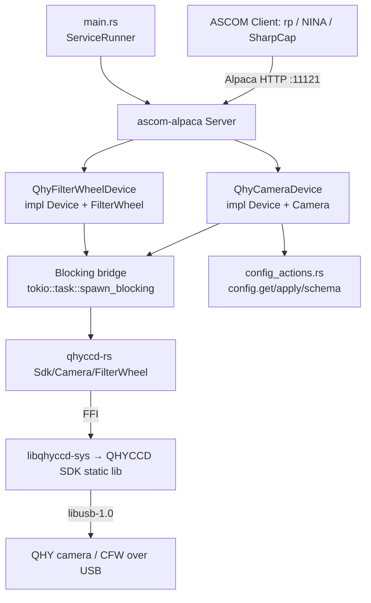

# Qhy-Camera Service Design

> **Status:** Implemented (v0). The driver lives in
> [`services/qhy-camera`](../../services/qhy-camera). All 10 BDD feature suites
> (73 scenarios) and the unit tests are green against the `qhyccd-rs`
> `simulation` backend; ConformU runs in CI. This document remains the
> behavioural specification — the handful of implementation deviations from the
> original design are called out inline (search "*Implementation note*"). The
> *Delivery phasing* § Phase 0–6 tracked the SDK-de-risk → full-driver rollout.

## Overview

The `qhy-camera` service is an ASCOM Alpaca **Camera** (and optional
**FilterWheel**) driver for real QHYCCD hardware. It exposes a connected QHY
camera — exposures, ROI/binning, gain/offset, cooling, readout modes — over
ASCOM Alpaca on a fixed port so the `rp` orchestrator (and any Alpaca client:
NINA, SGPro, SharpCap) can drive it like any other device.

It is the **first hardware imaging camera** in rusty-photon, complementing the
existing [`sky-survey-camera`](sky-survey-camera.md) *simulator* (which it reuses
for scaffolding) and the same-vendor [`qhy-focuser`](qhy-focuser.md) driver.

**Provenance.** The behaviour is derived from the author's standalone
[`ivonnyssen/qhyccd-alpaca`](https://github.com/ivonnyssen/qhyccd-alpaca) driver
(MIT OR Apache-2.0, same author). Rather than vendoring that ~1,350-LOC monolith,
this service is **written natively against rusty-photon conventions on top of the
published [`qhyccd-rs`](https://crates.io/crates/qhyccd-rs) crate** (the durable,
reusable FFI layer), using `qhyccd-alpaca`'s device-trait code only as the
behavioural reference. See *Delivery phasing* and
[ADR — to be written] for why.

**Requires a proprietary native SDK.** Unlike `filemonitor` /
`sky-survey-camera`, this service links a **proprietary native SDK** that must be
provisioned before it will link, so a developer without the SDK cannot build
`-p qhy-camera`. The SDK *is* cross-platform on x86 (Linux/macOS/Windows via the
install action; linux-arm64 via the Pi), so CI builds it on all GitHub-hosted
OSes — but the SDK requirement is still the dominant design constraint. See
*Native dependency & build gating*.

---

## Native dependency & build gating (the crux)

This is the single most consequential fact about this service and the reason it
is delivered in two tracks.

- The imaging path is `qhy-camera → qhyccd-rs (0.1.9) → libqhyccd-sys (0.1.4) →`
  the **proprietary QHYCCD SDK** (a closed-source static lib) **+ libusb-1.0**.
  Both `qhyccd-rs` and `libqhyccd-sys` are **vendored first-party** at
  `crates/qhyccd-rs/` (the `libqhyccd-sys` sub-crate nested inside) per
  [ADR-009](../decisions/009-vendor-qhyccd-rs.md) — we develop them in-tree and
  dual-home them to crates.io.
- `libqhyccd-sys` declares `links = "qhyccd"` and its `build.rs` emits
  `cargo:rustc-link-lib=static=qhyccd` + `dylib=usb-1.0` **unconditionally** —
  there is **no feature/cfg gate** on the link.
- **macOS link fix (now in-tree, no patch):** the *published* crates.io
  `libqhyccd-sys 0.1.4` was cut before the macOS link fix landed — on macOS its
  `build.rs` emitted only `static=qhyccd` + `dylib=c++` and **never linked
  `libusb-1.0`**, failing with `Undefined symbols … _libusb_*`. This used to be
  worked around with a `[patch.crates-io]` git override pinning `libqhyccd-sys`
  to a GitHub commit. Since [ADR-009](../decisions/009-vendor-qhyccd-rs.md)
  vendored the crate, that **patch is gone** — the fixed `build.rs` (the
  `/opt/homebrew/lib` search path + the `dylib=usb-1.0` directive) lives in the
  in-tree source at `crates/qhyccd-rs/libqhyccd-sys/build.rs`. Linux/Windows
  link directives are unchanged.
- **Consequence:** *every machine that compiles this package* — dev laptops, CI
  runners, Bazel actions — needs the QHYCCD SDK installed and discoverable, plus
  `libusb-1.0` dev headers. Not just machines with a camera attached.
- The `qhyccd-rs` **`simulation` feature** (which this service forwards as its own
  `simulation` feature) makes the build **camera-free** (it fabricates fake frames
  at runtime via `rand`/`rayon`), and — with **`QHYCCD_SKIP_NATIVE_LINK=1`** —
  **SDK-free** too: the real FFI is `cfg`'d out and `libqhyccd-sys`'s `build.rs`
  omits the link (and drops the `#[link]` attribute via the `qhyccd_skip_link`
  cfg), so a simulation build needs no QHYCCD SDK installed. This mirrors zwo-rs's
  `ZWO_SKIP_NATIVE_LINK`. *Without* that env the static `qhyccd` lib is still linked
  even under `simulation` (so a plain `--features simulation` build with the SDK
  present works unchanged). SDK-less dev builds, the `safety.yml`
  sanitizer, and the per-PR `test.yml` / `conformu.yml` jobs set the env (so they
  need no SDK); the real (non-simulation) build — `native.yml`, `scheduled.yml`,
  Bazel's real variant, the Pi nightly — leaves it unset and links `static=qhyccd`.

### Why this matters for rusty-photon specifically

The workspace is **currently 100% pure-Rust at the link layer — zero
native/system-lib dependencies**. The old `cfitsio`/`fitsio-sys` requirement was
**purged** in [ADR-001 Amendment A](../decisions/001-fits-file-support.md) (FITS
is now pure-Rust `fitsrs` via `rp-fits`). So `qhyccd-rs` **reintroduces the first
native build dependency** since that purge. It does not match an existing
precedent — it creates a new one. The doc below specifies how it is gated so it
does not break the SDK-less default build.

### Gating plan

| Concern | Mechanism |
|---|---|
| local dev (SDK required) | `qhy-camera` is a normal workspace member but **fails to link without the SDK**. The SDK is a required local-dev prerequisite — install it (CI installs it before building); `bazel build //...` then builds the package like any other. Documented in this design doc and the service README. |
| CI | **The Cargo jobs build qhy-camera SDK-free.** `test.yml` (a nightly safety net) and `conformu.yml` both build on the `--all-features` / `--features conformu` (`simulation`) path — which `cfg`s out the real FFI — and set **`QHYCCD_SKIP_NATIVE_LINK=1`** (workflow-level env), so `libqhyccd-sys`'s `build.rs` omits the link directives and **no QHYCCD SDK or libusb is provisioned** (same pattern as `safety.yml`, and as `ZWO_SKIP_NATIVE_LINK` for the zwo crates). This drops the `ivonnyssen/qhyccd-sdk-install@v3` + libusb + macOS dylib-loader steps from every Cargo leg (ubuntu / macOS / windows / coverage in `test.yml`; Linux/macOS/Windows in `conformu.yml`). The **real native link + FFI** is still exercised by: `native.yml` (provisions the SDK via the published [`ivonnyssen/qhyccd-sdk-install@v3`](https://github.com/ivonnyssen/qhyccd-sdk-install) action on Linux/macOS/Windows, nightly + on camera-crate changes), `scheduled.yml` (nightly/beta), the **Bazel** real variant (`bazel.yml`/`bazel-coverage.yml`), and the **Pi nightly** (linux-arm64, provisioned per-run via the action's sudo-free `install: env` mode → `QHYCCD_SDK_DIR`). The SDK is publicly downloadable from qhyccd.com (no secret/auth). |
| Raspberry Pi nightly runner | `pi-nightly.yml` provisions the SDK (26.06.04) **per run** with `ivonnyssen/qhyccd-sdk-install@v4` in its sudo-free **`install: env`** mode: the action extracts the SDK under the workspace and exports `QHYCCD_SDK_DIR`, which `libqhyccd-sys`'s `build.rs` reads on Linux (preferring it over `/usr/local/lib`) to link `libqhyccd.a` **statically** — no `ldconfig`, no `LD_LIBRARY_PATH`, nothing written to `/usr/local`. This keeps the runner intentionally **sudo-less** (public-repo safety) *and* self-healing — a new native-SDK service or SDK version bump no longer needs a manual `setup-pi-runner.sh` re-run. `setup-pi-runner.sh` therefore no longer installs the QHYCCD SDK (its `§1b` is now a pointer to this per-run flow; ZWO is still pre-provisioned there). **aarch64 confirmed available and linking** — `qhy-camera` builds on the Pi5 arm64 nightly; `libusb`/`stdc++` come from system packages already on the runner. |
| Bazel | **SDK provisioned into the Bazel actions** (no `crate.annotation` needed). `bazel.yml` (3 OSes) + `bazel-coverage.yml` (Linux) install `ivonnyssen/qhyccd-sdk-install@v3` + per-OS libusb. On **Linux** `build.rs` finds the SDK at its hard-coded `/usr/local/lib` (read-only-mounted into the sandbox); on **macOS/Windows** the SDK extracts into `$GITHUB_WORKSPACE`, which `.bazelrc` forwards to build actions via `build:macos`/`build:windows --action_env=GITHUB_WORKSPACE` (`--incompatible_strict_action_env` strips it otherwise). The library, binary, unit test, **`bdd`, and `conformu_integration` are ALL first-class `//...` targets that build _and run_ under Bazel** (the `bdd` suite runs in ~16 s and the full ConformU suite in ~33 s, matching Cargo — both verified locally with 0 errors / 0 issues). **Real/sim split (ADR-009 — first-party two-variant):** since `qhyccd-rs` is now a workspace member with its own [`BUILD.bazel`](../../crates/qhyccd-rs/BUILD.bazel), the SDK variant is chosen by *which library target a rule depends on* — prod targets (library, binary) dep on `//crates/qhyccd-rs:qhyccd-rs` (real static SDK); the sim library/binary (both `testonly`) + the **unit test** + `bdd`/`conformu_integration` dep on `//crates/qhyccd-rs:qhyccd-rs_sim` (the `testonly`, `simulation`-feature variant, so `Sdk::new()` fabricates a pure-Rust QHY178M and no USB is enumerated). **Doctests run per variant** — `qhyccd-rs_doc_test` (real) and `qhyccd-rs_sim_doc_test` (sim) — because the crate's public API forks on the feature (`Camera::new` vs `Camera::new_simulated`) while most examples hang off ungated items, so an example is only proven where it is actually compiled; the sim target must repeat `crate_features = ["simulation"]`, since `rust_doc_test` builds its own `CrateInfo` and would otherwise have rustdoc *collect* the non-simulation example set and compile it against the simulated rlib. Both run on all three OSes, but **Windows needed a `MAX_PATH` fix first** (issue #739, measured on CI): the crate's one *runnable* example (`lib.rs`, the simulated-SDK walkthrough) is the first doctest under Bazel to invoke `link.exe`, and `rust_doc_test` spells sysroot inputs relative to the runfiles tree, whose prefix alone eats 123 characters — so `libpanic_unwind-….rlib` landed at 261, one over the limit, and failed `LNK1181` while `libstd-….rlib` at 252 in the same directory resolved. The file was present and readable; only its path length was wrong, and the job's `LongPathsEnabled` step cannot help because that is opt-in per binary via a `longPathAware` manifest which `link.exe` lacks. [The vendored rustdoc Windows patch](../../third_party/patches/rustdoc_test_windows_external_repo_path.patch) now resolves `--sysroot=` through the runfiles manifest to its execroot target, which drops that path to 193 and leaves ~55 characters of headroom on the longest std member. The **sim** target additionally needs the same patch's runner restructuring: its `crate_features` reaches rustdoc as `--cfg` + `feature="simulation"`, and those embedded quotes cannot ride a batch line (`cmd.exe` tracks quote state without honouring any escape), so the patch writes the Windows runner's command into a companion `.ps1` invoked via `powershell -File` — where single-quoted arguments carry `"` literally — and re-encodes the quotes as `\"` for PowerShell 5.1's native-command marshalling, which would otherwise paste them into the child's command line unescaped. And because both variants share `libqhyccd-sys`'s `build_script.linksearchpaths` runfile — spelled bare workspace-relative, unlike the `external/`-spelled crates.io ones — the pair raced on a dangling tree entry for it when running concurrently on the same Windows runner (issue #781, exactly one victim per attempt); the patch's resolver now routes bare workspace-relative argv paths through the runfiles manifest too. Both doctest targets run on all three OSes. The unit test wraps `:qhy-camera_lib_sim` (matching zwo-camera / svbony-camera): the SDK seam is mock-doubled so the suite gains nothing from the real link, and linking it would make `bazel coverage` instrument qhyccd-rs's compiled-out real-FFI arms as never-executed lines, falsely dragging `crates/qhyccd-rs/src/camera.rs` to ~57%. `testonly` **build-enforces** the boundary: Bazel rejects any production binary that links the simulated SDK. The qhy-camera sim targets still carry `crate_features = […, "simulation"]` so qhy-camera's own `#[cfg(feature = "simulation")]` paths compile (e.g. `--simulation-empty`). **One retained nuance:** crate_universe resolves _one_ feature set per crate and ignores a target's `crate_features`, so the `simulation` feature's optional deps (`rand`/`rayon`) only enter `@cr` if the Cargo resolution reaches `qhyccd-rs/simulation`. qhy-camera therefore keeps a test-only `qhyccd-rs = { features = ["simulation"] }` dev-dep **solely to keep rand/rayon in `@cr`** (verified by spike: dropping it → `qhyccd-rs_sim` fails with `unresolved import rand`). `resolver = "2"` keeps that dev-dep out of `cargo build`, so the production binary links the real SDK. (Aside: crate_universe still materializes an orphan `@cr` `libqhyccd-sys` because the path dep carries a `version` for publish — nothing depends on it; `qhyccd-rs` resolves the workspace-member edge.) Run `scripts/repin-bazel-lock.sh` after any change to `Cargo.lock` or any workspace `Cargo.toml` (Rule 10). |

### Resolved facts (decided)

- **SDK version: 26.06.04** — keep the install action (x86/Bazel jobs on `@v3`
  system mode; the Pi nightly on `@v4` `install: env` mode), `build.rs` macOS
  dir names, and the Pi script in lockstep. **Packaging changed at 26.x:** the
  repository dir is now the version with dots stripped (`260604`), archives are
  `.tar.gz` (not `.tgz`), there is no `install.sh` (a staged `usr/lib/etc/sbin`
  tree copied into `/`), and the per-OS archives were renamed
  (`macMix`→`mac_x64`, `WinMix`→`win64`, `Arm64`→`linux_arm64`).
  `qhyccd-sdk-install@v3` picks the scheme by a `YYMMDD ≥ 260604` threshold.
  Validated on real hardware (QHY178M + 7-slot CFW, ConformU 0 errors).
- **arm64: supported and linking** on the Pi5 runner — `qhy-camera` is in the
  arm64 nightly matrix.
- **SDK distribution: public, via the published action.** *(Decision revised to
  match the reference CI.)* The QHYCCD SDK is **publicly downloadable from
  qhyccd.com** (`.../publish/SDK/260604/sdk_linux64_26.06.04.tar.gz`); the author's
  `ivonnyssen/qhyccd-sdk-install@v3` action wraps the download and caches it on
  **Linux, macOS, and Windows**. On Linux the 26.x packaging ships no `install.sh`,
  so the action copies the staged `usr/lib/etc/sbin` tree into `/`
  (→ `/usr/local/lib` + `ldconfig`); on macOS/Windows it extracts into
  `$GITHUB_WORKSPACE` where `libqhyccd-sys`'s `build.rs` looks (and adds
  `sdk_win64_<ver>\x64` to `PATH` on Windows). So **no
  authenticated tier, secret, or SHA pin is needed** — the earlier
  "authenticated/internal cache tier pending the redistribution-terms question"
  plan was superseded once the reference's CI confirmed the SDK is fetched
  publicly. (A self-hosted cache could still front it for hermeticity, but is not
  required.)

### Open questions still to resolve before Track A lands

1. **`qhyccd-rs` churn.** Single-maintainer, pre-1.0 (0.1.7/0.1.8/0.1.9 all
   shipped within days). Pin exactly (`=0.1.9`) and track upstream closely.
2. **Shutter actuation API** *(resolved).* `qhyccd-rs` 0.1.9 exposes only shutter
   *presence* (`CamMechanicalShutter`), no open/close actuation. Per the E4
   degradation clause, v0 rejects all dark frames with `NOT_IMPLEMENTED`;
   shutter-actuated darks are Future Work.

---

## Architecture


```mermaid
graph TD;
    A[ASCOM Client: rp / NINA / SharpCap] -->|Alpaca HTTP :11121| B[ascom-alpaca Server];
    B --> C[QhyCameraDevice<br/>impl Device + Camera];
    B --> FW[QhyFilterWheelDevice<br/>impl Device + FilterWheel];
    C --> BB[Blocking bridge<br/>tokio::task::spawn_blocking];
    FW --> BB;
    BB --> RS[qhyccd-rs Sdk/Camera/FilterWheel];
    RS -->|FFI| SDK[libqhyccd-sys → QHYCCD SDK static lib];
    SDK -->|libusb-1.0| HW[QHY camera / CFW over USB];
    C --> CA[config_actions.rs<br/>config.get/apply/schema];
    M[main.rs<br/>ServiceRunner] --> B;
```

**Key components**

- **`main.rs`** — plain `fn main`, parses clap args, inits `tracing`, runs under
  `ServiceRunner::new("qhy-camera").with_reload().run_with_reload(...)` per
  [`service-lifecycle.md`](../skills/service-lifecycle.md). No hand-rolled signal
  handling; config bootstrap via `rusty_photon_config::resolve_and_init` with an
  **empty identity-pointer list** (identities are hardware-derived), which still
  materializes the default config file on first start.
- **`lib.rs`** — `ServerBuilder` that, on `build()`, opens the SDK and
  **enumerates every connected camera** (and any CFW discovered on it),
  registering each as an ASCOM device (index 0, 1, 2, …) with its serial-derived
  UniqueID. The eager per-device connect handshake (normalize the readout
  geometry, then cache CCD info, effective area, valid binning modes,
  exposure/gain/offset min-max-step, the gain and offset the camera holds —
  read, never written (GO1) — and the readout-mode list) happens on
  `set_connected(true)`.
  Returns a `BoundServer`.

  **The handshake sets bin 1x1 and a full-frame resolution before reading the
  effective area.** `GetQHYCCDEffectiveArea` answers from the SDK's current bin
  *and* resolution, and both outlive a close, so reopening a camera the previous
  session left at bin 2 reports `BinX == 1` beside a frame half the width of
  `CameraXSize` — and once the SDK's bin and resolution disagree it reports an
  empty area instead, which is unrecoverable in-process (only restarting the
  service clears it). Verified on a QHY178M: without the normalization, a
  session that left the SDK's bin and resolution disagreeing — bin 2 sent on
  its own, with the full-frame resolution still in place — → disconnect →
  reconnect yields a 0x0 effective area and every later connect fails. The
  normalization answers whichever of the two states a session leaves. An empty area is refused rather than cached, since caching one makes
  `NumX`/`NumY` report 0 — outside the range ASCOM allows — for the life of the
  process. The area read here is the sensor the driver advertises (G1), and it
  is re-read the same way after a readout-mode change (RM1), which re-runs the
  handshake's mode sequence — `InitQHYCCD` included — and its reads for the new
  mode, and re-asserts an engaged cooler the init may have stopped (RM4). A
  gain or offset the init may have reset is put back by the next
  `StartExposure`, which sends both on every exposure (GO2).
- **`camera.rs`** — `QhyCameraDevice` (one instance per discovered camera)
  implementing `Device` + `Camera` against `qhyccd-rs`. **Every blocking SDK call
  runs inside `tokio::task::spawn_blocking`** (the same blocking-bridge discipline
  the legacy serial drivers use) so the async runtime is never stalled.
- **`filterwheel.rs`** — `QhyFilterWheelDevice` (one per discovered CFW)
  implementing `Device` + `FilterWheel` (registered automatically on detection —
  no opt-in toggle, the same rule as cameras).
- **`config.rs`** — typed `Config` with parse-don't-validate newtypes.
- **`config_actions.rs`** — `ConfigurableDriver` impl + the `dispatch` the devices
  delegate to (`config.get`/`config.apply`/`config.schema`).
- **`mock.rs`** (feature `simulation`/`mock`) — the hardware-free test backend
  (the `qhyccd-rs` `simulation` camera + a tiny in-crate trait seam over the SDK
  for unit tests).
- **`preflight.rs` / `doctor.rs`** — Windows `qhyccd.dll` resolution (startup
  preflight for the delay-loaded SDK DLL) and the per-service `doctor`
  subcommand ([doctor.md §Per-service doctors](doctor.md)), which carries
  the Windows installation checks; see *Windows: qhyccd.dll resolution*
  below.

**Concurrency.** The QHY SDK is blocking C FFI. Every SDK call runs on
`spawn_blocking`, never on a Tokio worker — a property read is a USB round-trip,
and made inline it stalls every other Alpaca request sharing that worker. Device
state is held field by field rather than behind one lock: the cached geometry,
limits, target temperature and last frame each sit in their own
`parking_lot::Mutex`, and the exposure state machine's flags and counters are
atomics. Nothing takes a reader/writer lock, so there is no shared-read fast
path to reason about — every one of these is short and uncontended, and the
ordering that actually matters is `result_lock`, described under *SDK call
serialization* in **Implementation notes** below. The one exception is
`control_lock` (RM4), which is held across SDK calls and is the cooler's alone.
The `CoolerOn` and `SetCCDTemperature` writes each hold it for their own SDK
round trip, so they run one at a time; a readout-mode change holds it for its
whole switch, because it re-asserts an engaged cooler after its init, so while
one runs each of those calls waits for as long as an `InitQHYCCD` takes. A mode
change takes it after the connection's lifecycle lock and the device claim, and
takes `cache_commit_lock` inside it, never the other way round. `Gain` and
`Offset` take no part in it: their getters and setters read and write a cache,
never the SDK (GO1, GO2), and a set is ordered against a mode change by
`cache_commit_lock`, the lock the change publishes the new mode's bounds
under — as a bin set is (B1).

Two rules with different scopes sit above that, and it is worth keeping them
apart. *Captures* have a single logical owner per device — the in-flight claim
(see *SDK call serialization* in **Implementation notes** below), which is about
the SDK's own ordering rules, not memory safety. Separately, `qhyccd-rs` holds
its handle's read lock across every FFI call, so a `CloseQHYCCD` cannot free the
device beneath a call in flight. Non-close calls still run concurrently on one handle: the SDK manual
takes no position on that, and INDI's `indi-qhy` polls temperature from its
event-loop timer while a readout blocks on its imaging thread, holding no lock at
all. What no driver gets for free is the close exclusion — indi-qhy buys it with
a `pthread_join` before its `CloseQHYCCD`.

Measured on hardware (QHY178M + 7-slot CFW, SDK 26.6.4.16), read latency during
a capture is **bimodal**: across one exposure 1933 of 1935 `CCDTemperature` reads
returned in ~0.4 ms and exactly two stalled — 1222 ms while the capture armed and
760 ms during readout. Readers share the handle's read lock and cannot block one
another, so that stall is *below* this driver's locking, inside the SDK or
libusb. It argues for the read lock rather than against it: a `Mutex` on the
handle would put all 1935 reads behind the arm and the readout instead of two.
The operational consequence is that a property read can occasionally block for
the length of a readout, so it is not a sound liveness probe on a capturing
camera.

---

## MVP scope

The MVP boundary drives BDD scenario selection (Phase 2). Grounded in what
`qhyccd-rs` / `qhyccd-alpaca` actually support today.

**In scope (v0)**

- ASCOM Camera ICameraV3 for **every enumerated QHY camera** (each registered as
  a device on the one port), 16-bit monochrome **and** one-shot-colour (Bayer)
  sensors.
- Startup enumeration registers all discovered cameras (+ CFWs when enabled);
  per-device connect/disconnect lifecycle: open → single-frame mode → readout
  mode 0 → init → 16-bit transfer → cache the mode list and geometry/limits.
- Sensor geometry — `CameraXSize`/`YSize` from the SDK's effective area (the
  region it reads out, not the chip), `PixelSizeX`/`Y` from cached CCD info.
- **Binning** — symmetric only (`CanAsymmetricBin = false`); `MaxBinX/Y` from the
  SDK's valid binning modes; cached at the setter and armed by `StartExposure`
  (B1); the ROI is held in unbinned pixels, so a bin change only changes the
  divisor its binned members are read through (B3).
- **ROI** — `StartX/Y`/`NumX/Y` setters accept any `u32`; geometry validated at
  `StartExposure` (ConformU "Reject Bad…" semantics).
- **Exposure** — `ExposureMin/Max/Resolution` from the SDK; single-frame
  `StartExposure`; `ImageReady`/`ImageArray`/`ImageArrayVariant`; `CameraState`
  (`Idle`/`Exposing`/`Error`); `PercentCompleted` from remaining-exposure µs.
- **Abort** — `CanAbortExposure = true` via the SDK abort path (while connected;
  E11).
- **Gain / Offset** — `Min`/`Max` from the SDK; the value is cached — seeded
  from the camera at connect, then set by the client — and applied by
  `StartExposure` (GO1, GO2); `NOT_IMPLEMENTED` when the control is unavailable
  on the model.
- **Readout modes** — `ReadoutMode(s)` named from the SDK and cached at
  connect; switching re-initializes the camera in the new mode and re-reads
  every mode-dependent cache (RM1).
- **Cooling** — `CoolerOn`, `CCDTemperature`, `SetCCDTemperature`, `CoolerPower`,
  `CanSetCCDTemperature`, `CanGetCoolerPower` — all gated on the `Cooler` control.
- **Sensor type** — `Monochrome` vs `RGGB`/colour + `BayerOffsetX/Y`.
- **`MaxADU`** = `(2^transfer_bits) - 1` (65535 for the 16-bit container set at
  connect), from `GetQHYCCDChipInfo`'s reported bit depth — **not**
  `OutputDataActualBits` (see the MaxADU note under "Deliberate divergences");
  `VALUE_NOT_SET` until a connect has read that depth (C6), and again after a
  readout-mode change that failed part-way (RM3). `SensorName` comes
  from the device id.
- **FilterWheel** as a second ASCOM device on the same port (when present):
  `Names`, `Position` (with moving state), `set_position`, `FocusOffsets`.
- **Dark frames** — `Light = false` returns `NOT_IMPLEMENTED` on all models in
  v0 (qhyccd-rs 0.1.9 has no shutter actuation; see E4). `HasShutter` still
  reports `CamMechanicalShutter` presence, for a device the driver is holding
  open (E11).
- `config.get`/`config.apply`/`config.schema` actions; hardware-derived
  `UniqueID` (camera/CFW SDK serial); in-process reload.
- ConformU integration test driven against the `qhyccd-rs` `simulation` backend
  (SDK installed in CI, no physical camera).

**Deferred (see *Future Work*)**

- **Dark/bias frames.** v0 rejects all `Light = false` exposures with
  `NOT_IMPLEMENTED` (qhyccd-rs 0.1.9 has no shutter open/close actuation; see
  E4). Shutter-actuated darks on mechanical-shutter models (e.g. QHY600M) and a
  cap-on operator workflow for shutterless darks are deferred to Future Work.
- `StopExposure` (graceful stop) — upstream returns `NOT_IMPLEMENTED`; only
  `AbortExposure` works.
- `FastReadout` — upstream untested; ship as `CanFastReadout` reflecting the
  `Speed` control but mark untested.
- `PulseGuide` (`CanPulseGuide = false`), LiveMode, multi-frame/video.
- Per-serial connect-time tuning (gain/offset/target-temperature defaults).
- `ElectronsPerADU` / `FullWellCapacity` (upstream `NOT_IMPLEMENTED`; supply
  placeholders only if ConformU requires them).

---

## Configuration

The service **enumerates every connected QHY camera** (and CFW, when enabled) at
startup and registers each as an ASCOM device (camera / filter-wheel index
0, 1, 2, …) on the one port. The hardware is the source of truth — there is no
per-camera *binding* in config. Each device's UniqueID comes from its SDK serial;
config carries only optional per-serial display overrides plus a global CFW
toggle and the port.

```jsonc
{
  // Optional per-device overrides, keyed by SDK serial. A device with no
  // entry uses SDK-derived defaults (name from model+serial; CFW filter names
  // "Filter0".."FilterN"). Named `devices` (not `overrides`) to avoid colliding
  // with the config.get response's own `overrides[]` (CLI-pinned paths) field.
  "devices": {
    "QHY600M-0123456789": {
      "name": "Main Imaging",
      "description": "QHY600M @ 1000mm"
    },
    "CFW3L-SR-9876543210": {
      "filter_names": ["L", "R", "G", "B", "Ha", "OIII", "SII"]
    }
  },
  "server": {
    "port": 11121,
    "bind_address": "0.0.0.0"
  }
}
```

The `server` block is the shared `AlpacaServerConfig` from
`crates/rusty-photon-server-config` (see ADR-016): `port`, `bind_address`
(default `0.0.0.0`), optional `discovery_port`, and optional `tls`/`auth`.
Absent `tls`/`auth` means plain, unauthenticated HTTP.

Sections:

- **devices** — Optional per-device override map keyed by **SDK serial**. Lets an
  operator give a friendly `name`/`description` to a specific camera and human
  `filter_names` to a specific CFW. Any device without an entry uses SDK-derived
  defaults. v0 does
  **not** carry per-camera connect-time tuning (gain/offset/target temperature) —
  with heterogeneous cameras those are per-serial concerns and clients set them
  over ASCOM; per-serial defaults are deferred (see *Future Work*).
- **(no CFW toggle)** — discovered CFWs are registered as FilterWheel devices
  automatically, the same way cameras are enumerated; detection (`sdk.filter_wheels()`)
  is the source of truth. Verified on hardware: unplugging the wheel drops
  `filter_wheels` from 1 → 0 with no phantom device, so no opt-in flag is needed.
- **server.port** — Listening port (**11121**, next free in the 1112x family;
  11111–11120 and 11131 are taken). One port hosts all enumerated devices. Hard
  read-only (self-lockout: a port change would make the BFF lose the devices).

### Config actions

Standard cross-driver protocol ([`config-actions.md`](config-actions.md)),
implemented generically in `rusty_photon_config::actions` + the ASCOM adapter in
[`rusty-photon-driver`](../../crates/rusty-photon-driver). `config_actions.rs`
supplies `ConfigurableDriver for QhyCameraDriver`:

- **Secrets redacted/carried forward:** `server.auth.password_hash` (the one
  secret; `server.tls` stores file *paths*, not key material).
- **Locked (identity) fields:** none — UniqueIDs are hardware-derived and not
  stored in config, so there is no identity field to lock (a deliberate
  divergence from the minted-identity convention; see *Device identity*).
- **Hard read-only fields:** `/server/port` (a port change would make the BFF
  lose the devices → restart-required, not a live apply).
- **Editable fields:** the `devices` map (per-serial `name` / `description` /
  `filter_names`).
- **Validation** at load (parse-don't-validate): `filter_names` entries are
  non-empty strings; `devices` keys are free-form serial strings. Unknown keys
  are **rejected at deserialize** (`deny_unknown_fields`, as in zwo-camera and
  the other newer services), so typos and removed keys fail loudly at load
  instead of being silently ignored.

`config.apply` persists atomically, returns `status:"applying"` when a field
changed, and fires the in-process reload (`main.rs` runs under
`with_reload().run_with_reload(...)`).

### Device identity (UniqueID)

ASCOM requires a globally-unique, never-changing `UniqueID`. **This service
derives the UniqueID from the camera's hardware serial** (the QHYCCD SDK id,
available from `Sdk::cameras()` at enumeration, *before* the device is opened),
and the FilterWheel's UniqueID from the CFW's SDK id — the same scheme upstream
`qhyccd-alpaca` uses.

This is a **deliberate divergence** from the rusty-photon
minted-UUID identity convention used by the other six drivers,
chosen because a camera exposes a genuinely stable, globally-unique hardware
serial. The serial is a *better* ASCOM identity than a per-install minted UUID:
it is tied to the physical camera, so it survives an OS reinstall and moving the
camera between machines, and swapping the camera correctly yields a new id.

Consequences: there is **no `unique_id` field in config**, an **empty
identity-pointer list** passed to `resolve_and_init` in `main.rs` (no minting;
the bootstrap still materializes the default config file on first start), and
**no locked identity field** in the config-actions tiers. Because the service enumerates *all* cameras, there is
no selector — every discovered camera and CFW is exposed, each carrying its own
serial-derived UniqueID, so two identical-model cameras are naturally
distinguished by their serials.

---

## Behavioral contracts

Named, testable behaviours mapping 1:1 to BDD scenarios in `tests/features/`.
ASCOM error names per [`docs/references/ascom-alpaca.md`](../references/ascom-alpaca.md).
Values are grounded in the `qhyccd-rs`-backed implementation.

### Enumeration & connection lifecycle

- **C0.** At startup `build()` enumerates all connected QHY cameras (and any CFWs
  discovered on them) and registers each as an ASCOM device with its
  serial-derived UniqueID. Zero discovered cameras is **not** a hard failure — the
  service starts with no Camera devices, logged at `warn!`; a later reload
  re-enumerates.

  **A CFW is only found if it has power when this runs.** The wheel is fed from
  the camera's 12V, while the camera's own logic runs off USB — so a camera whose
  12V is off still enumerates, answers every Camera member and passes its
  ConformU suites, while the service logs `filter_wheels=0` and every FilterWheel
  endpoint answers *"Device FilterWheel\[0\] not found"*. Restoring 12V is not
  enough on its own, because the device list is fixed at build: something has to
  make this run again. A **reload** is sufficient — `main.rs` rebuilds the
  `ServerBuilder` on each one, which is the re-enumeration promised above — so an
  operator does not need to restart the process, though a restart works too.

  An operator seeing `filter_wheels=0` on a camera that otherwise works should
  check the 12V rail and reload before suspecting the driver or the SDK. The
  symptom looks nothing like a power problem, and is easily misread as the
  wedged-handle state that does need a physical power cycle.
- **C1.** `set_connected(true)` on a device opens *that* camera, sets single-frame
  mode, readout mode 0, `init()`, 16-bit transfer, and caches CCD info, effective
  area, valid binning modes, exposure/gain/offset/speed min-max-step, the gain
  and offset the camera holds (GO1), and the named readout-mode list. On
  success `Connected = true`, in readout mode 0: a
  mode a client chose is not carried across a reconnect.
- **C2.** `set_connected(true)` with the device's camera unreachable / SDK open
  failure returns the mapped driver error and `Connected` stays `false`.
- **C3.** `set_connected(false)` closes that device and returns `NOT_CONNECTED`
  for subsequent operations; an in-flight exposure on it is aborted first.
  Disconnect **owns the device from the moment it is quiescent until the handle
  is closed**, so a `StartExposure` arriving in that window is refused instead of
  racing the close — with `NOT_CONNECTED` once the handle's connected flag is
  clear, which `SharedCameraConnection` does before `CloseQHYCCD` and so covers
  all but the brief head of that window, and with the claim's
  `INVALID_OPERATION` in the head itself, between the seize and the clear. One
  that gets in earlier, while the drain is still running, is aborted as well — a
  disconnect wins over an exposure that starts during it — within the same
  deadline. If the device cannot be got out of the SDK before that deadline, the
  handle is left open and the call errors rather than close under a live USB
  transfer.

  A request already in flight when the close lands also answers `NOT_CONNECTED`,
  not whatever that call site would otherwise spell a dead handle as. The
  connected check runs before the SDK call is dispatched off the executor, so it
  cannot exclude a disconnect arriving in between; rather than let the error a
  client sees depend on where in that race the request fell, an SDK failure on a
  handle that is no longer open is reported as the disconnect it is. A call that
  *succeeded* answers for itself — with one exception, because
  `is_control_available` spells "this model lacks the control" and "this handle
  is closed" the same way, as `None`, and so never reaches that rewrite. The
  members built on it (`HasShutter`, `CanSetCCDTemperature`, `SensorType`) take
  the connected check on **both** sides of the SDK hop, so a probe that came
  back after the close reports the disconnect rather than a fabricated
  "no cooler" (E11). Serializing the probe against the close instead would mean
  holding the handle across a blocking USB call, which is what dispatching off
  the executor exists to avoid. The members that never touch a device
  (`CanStopExposure`, `CanPulseGuide`, `CanAsymmetricBin`) answer throughout.
- **C4.** Connect is per-device and independent: connecting/disconnecting one
  camera does not affect the others enumerated on the same service.
- **C5.** No code path in this service pushes cooler state, wheel position, or
  any other actuation on startup, connect, or `config.apply` (workspace tenet
  [*no actuation on connect*](../workspace.md#project-tenets)); cooler and CFW
  commands are issued only by explicit ASCOM setters — the one cooler command
  not sent by a cooler setter being a `ReadoutMode` write re-asserting the
  target a client engaged in the same session, once that write's switch
  sequence (`SetQHYCCDReadMode`, `InitQHYCCD`) has run, whether it succeeded or
  failed at any step (RM4). A connect reads the camera's gain and offset and
  writes neither; they reach the camera only inside a `StartExposure` (GO1,
  GO2). **Known vendor-SDK side
  effect outside our control:** `OpenQHYCCD`/`InitQHYCCD` run on connect (C1),
  and QHY filter wheels auto-home at the firmware level on init — a physical
  wheel rotation the SDK performs on its own. Operators with a CFW should
  expect the wheel to home when a client first connects the camera. No
  validation record has observed that homing yet, and the SDK library's init
  code for the QHY600 and QHY5III classes sends no filter-wheel command, so the
  statement stands as the vendor's rather than a measured one. A readout-mode
  change runs `InitQHYCCD` too (RM1), so whatever init does on connect it also
  does there — on a path a client started, not on connect.
- **C6.** A connect **clears every cache its handshake republishes** — the CCD
  info and effective area, the size reported from it, the valid binning modes,
  the cached ROI and bin, the exposure/gain/offset limits and the gain and
  offset values beside them (GO1), and the readout-mode
  list and the mode in force (RM1) — before it opens
  the handle, so a reconnect starts from nothing rather than from the previous
  session. `open()` is what makes `Connected` true (C1), and the handshake
  behind it is a dozen SDK calls of which `InitQHYCCD` alone can take seconds,
  so every request arriving in that window is answered from the caches. Left
  standing, the previous session's bin list is the one B1 validates against: a
  `set_bin_x(2)` in the window is accepted and then overwritten by the
  handshake's own `bin = 1`, so the client that asked for bin 2 is told it
  succeeded and its next frame is taken at bin 1. Cleared, the window
  answers as a first connect does: `INVALID_VALUE` from `set_bin_x` for a bin
  no list supports, `VALUE_NOT_SET` for the geometry, for `BinX`/`BinY`, for
  the gain and offset bounds and values — a `Gain` or `Offset` write among
  them — and for `ReadoutMode`, `ReadoutModes` and a
  `ReadoutMode` write, and a refused `StartExposure` — *not ready yet*
  rather than the previous session's numbers. `BinX` is `VALUE_NOT_SET` rather
  than the 1 the handshake settles on because that 1 belongs to the geometry
  the handshake has not read yet, and is published with it and with the list
  a bin is checked against (B1): answered in the window, it would be a bin for
  a mode nothing has asked the camera about. A **gain or
  offset range this connect has not read yet is `VALUE_NOT_SET`, never
  `NOT_IMPLEMENTED`** — the cache distinguishes *not asked yet* from *asked, and
  the answer was no* (GO4), because the second tells a client the camera cannot
  do something it can, and a client that believes it may never ask again. The
  **exposure state resets at the same boundary**, so a previous session's
  `Error`, `ImageReady` and frame do not outlive the open either — the reconnect hygiene
  of C3, starting where the window starts rather than where the handshake ends.
  The clear is at the **start of a connect only**, not on disconnect: a
  disconnect that cannot take the device leaves it logically connected (C3),
  and blanking a live session's geometry is the failure this rule exists to
  prevent. What keeps the ended session's exposure state from being read back in
  the meantime is not a second clear but the connected check every member of
  that surface takes (E10).

  The same rule runs the other way: **a request made in one session does not
  commit into the next.** `set_readout_mode` reads its session and tests the
  connection at the top of the request, and a disconnect and a reconnect can
  both land between that and the device claim — so the connected test taken
  there cannot speak for the writes and the commit that follow it. It
  therefore checks that the session it was made in is still the running one
  and answers `NOT_CONNECTED` if it is not, leaving the camera and the caches
  as the new connect left them rather than naming a geometry the camera has
  since left. A commit asks two things, and needs both: *is the
  session I read still the running one*, and *is this device still here*. The
  session alone cannot answer the second — a close takes no part in that lock,
  and a disconnect clears the handle's flag before `CloseQHYCCD` runs while the
  session ends only once it returns, so for the length of that close the session
  a request holds is still the current one on a device already gone. The
  connected check alone cannot answer the first, because a reconnect leaves the
  handle open while the caches beneath it change. A connect's own publish is held
  to the same pair, or a handshake could publish during a close and answer `Ok`
  to a client whose next read is `Connected == false`. The session is read **before the connected check and before
  the caches** the request answers from, so a request that passed those in one
  session cannot adopt whichever session has begun by the time it commits.
  `set_bin_x` is held to it as a cache write: the bin it stores arms the next
  exposure (B1), and stored into the session after the one it was set in, it
  would arm that session's frames at a bin nobody set there. `set_gain` and
  `set_offset` are held to it for the same reason: the value each stores arms
  the next exposure too (GO2), and stored into the next session it would arm
  that session's frames at a gain or an offset nobody set there. `StartExposure`
  takes its claim in the session it measured its geometry against, under the
  same lock the clear takes, so a request whose snapshot predates a reconnect
  cannot arm that geometry on the handle the reconnect has just opened. The ROI
  setters are held to it too: the four members are set independently (R1), so
  each is a read of the cached sub-frame and a write of one field back, and a
  reconnect between the two would leave the ended session's extent arming the
  new session's frames. Every write to a cache the handshake publishes goes the
  same way — under one lock, in the session that read the values being written —
  and a setter left outside that rule is a way for a session that has ended to
  reach into the one that replaced it.

  The check keeps the **caches** honest about which session they belong to, and
  it is the second of two things holding `set_readout_mode` together. The first
  is ownership: it holds the device claim (B4) from before its SDK writes until
  after its commit, and the connection's lifecycle lock around both, so a
  *disconnect* cannot land in that window at all — it does not even reach the
  claim, but waits on the lifecycle lock the mode change took first (RM1, C8).
  What the claim does not cover is the stretch before it is taken, between
  reading the session at the top of the request and claiming the device: a
  disconnect and a reconnect fit there, and unchecked the write would then land
  on the new session's handle. The session check taken under the claim, before
  the first SDK write, is what refuses it.

  `set_readout_mode` asks the session question **twice**: once under the
  claim, before the first SDK write, and again at the commit. Refusing only the
  commit would not be enough: the reconnect that ended the request's session
  has already run its handshake, so a mode written to the reconnected handle
  would leave the camera re-initialized in a configuration its freshly
  published caches do not describe, and nothing would put it back before the
  next connect. Once the claim is held, no new session can begin until it is
  released — a reconnect needs the disconnect in front of it, and that
  disconnect waits on the lifecycle lock the mode change holds — so the check
  taken there covers every write that follows it. The check at the commit is
  the rule every cache writer follows, kept though the claim already rules out
  a new session by then. `set_bin_x`, `set_gain` and `set_offset` send the
  camera nothing, so each asks once, in the section that stores its value (B1,
  GO2), and none of them waits. The setpoint and cooler setters, which take no
  claim, ask it once, when they hold the lock a mode change holds and before
  their SDK write (RM4): they can wait there for as long as a mode change runs.

  A connect's own handshake answers to the same rule: it publishes **in the
  session it established, or not at all.** A disconnect or a later connect
  arriving while its reads were running has taken the device somewhere else, and
  the snapshot in its hands describes where the camera used to be. Such a
  handshake also leaves the handle alone on its way out — the device is no
  longer its to close, and closing it would take down the session that replaced
  it. **Reaching the close ends the session** too — whether or not
  `CloseQHYCCD` succeeds, because the handle's connected flag is cleared before
  that call and stays clear when it errors, so a close that failed has still
  disconnected the device and `Connected` reads false. That is what stops a
  cache-only write, having no SDK call to fail on, from reporting success for a
  device that has gone. The disconnect that leaves a session running is the one
  that could not get the device out of the SDK and so never reached the close at
  all (C3).

  And **a connect publishes nothing until it has asked the device everything.**
  The handshake reads the geometry, the exposure range, and the gain and offset
  values and bounds into hand — each value just ahead of its bounds, so the
  offset bounds remain the last thing it asks the device — and makes the caches
  live in one section at its end.
  Published as they were read, the geometry and the exposure range together are
  enough for a `StartExposure` to arm the SDK while the connect is still
  questioning the device — two owners on one handle, which is the state the
  capture claim exists to prevent. Readers take no lock, so those few stores are
  not atomic against them; what the section removes is the handshake-long
  stretch in which some caches answered and others did not.
- **C7.** `Connect` and `Disconnect` are asynchronous and `Connecting` is what a
  client waits on, so `Connecting` is the only thing standing between a client
  and the C6 window: a client told the operation has finished is entitled to
  find the caches published. The server layer owns those three endpoints — this
  service supplies only the `set_connected` they drive, and never sees the
  requests — so it must keep `Connecting` true until **every** operation in
  flight against the device has finished, not merely the first. Tracked per
  device rather than per operation, several outstanding at once collapse into
  one fact and the first to complete answers for the rest; a client polling
  exactly as it should is then released into the middle of the handshake, where
  the device reports `Connected == true` and every cache-backed member answers
  `VALUE_NOT_SET` until the surviving handshake commits. ConformU's
  `alpacaprotocol` suite reaches that state on ordinary hardware: it fires its
  four casing variants at `disconnect` and then, ~18 ms later, at `connect`, and
  the ~1 s `CloseQHYCCD` completing first is what clears the flag while four
  connects are still running. The workspace therefore pins an `ascom-alpaca`
  fork that counts the operations in flight instead (see the pin's comment in
  the workspace `Cargo.toml`); nothing in this service can substitute for it.
- **C8.** `set_connected` is **serialized per physical connection** — not per
  ASCOM device — and the check of what the device already is happens inside that
  order rather than ahead of it. Alpaca gives a client no reason to keep its
  connects and disconnects apart, and ConformU issues four of each as a matter of
  course (C7); left to overlap they collide twice over. They race the **check**:
  each reads a closed handle, each concludes a connect is needed, and each runs
  one. And they race each other's **handshakes**: a dozen SDK calls apiece,
  `InitQHYCCD` among them, issued concurrently down one `OpenQHYCCD`. The session
  generation does not cover that second collision and was never meant to — it
  governs what a handshake may *publish*, not what it may *send*, so the losers
  are refused their caches while their SDK calls have already gone. Held to one
  at a time, the first request does the work and the rest find the device already
  where they wanted it and return `Ok` without reaching the SDK at all.

  **Per connection is the load-bearing part.** The Camera and the CFW are two
  ASCOM devices on one handle (C0), so a lock owned by either device orders that
  device's own requests and leaves the *pair* free to handshake at once — the
  camera asking `SetQHYCCDStreamMode` / `InitQHYCCD` while the wheel asks
  `CfwSlotsNum`, two threads in the SDK on one connection. The lock therefore
  lives on `SharedCameraConnection`, which is what the two share, and both
  devices take it through their handle. The refcount there is no substitute: it
  serializes the open and the close themselves, not the handshakes either side of
  them.

  The lock spans the decision and the act, because splitting them is the race,
  and it is taken by `set_connected` and by a readout-mode change (RM1, which
  re-runs `InitQHYCCD`) alone, so a `Connected` read — the one every health poll
  makes — never queues behind a close waiting out its drain.

### Geometry, binning, ROI

- **G1.** `CameraXSize`/`CameraYSize` are the width and height of the SDK's
  **effective area** (`GetQHYCCDEffectiveArea`, read at bin 1 after the connect
  normalization) reduced by R4, not the chip size `GetQHYCCDChipInfo` reports;
  `PixelSizeX`/`PixelSizeY` reflect the cached CCD info. The two differ on a
  sensor with an overscan margin — a QHY600M reports a 9600x6422 chip beside a
  9576x6388 effective area starting at column 24, and the chip's other 24
  columns are never read out — and ASCOM's `CameraXSize` is what clients treat
  as the largest `NumX` they may ask for, so advertising the chip lets a client
  request columns the camera never reads out. **The reported size is the
  effective area as R4 leaves it**, which on that camera is 9576x6384: the
  effective area is what the SDK reads out, the reported size is what this
  driver will ask it for, and the four rows between them are not part of any
  frame a client can take. The effective area's corner is the client's
  origin: `StartX`/`StartY` count from its top-left pixel, and a fresh
  connection reports `StartX`/`StartY` 0 and `NumX`/`NumY` equal to
  `CameraXSize`/`CameraYSize` (ASCOM's stated defaults). The chip dimensions
  stay in the connect-time `sensor geometry` debug line for reference. The
  simulated camera carries a 24-column margin and two unread rows (3072x2048
  chip, effective area `(24, 0, 3048x2046)`, reported size 3048x2044) so the
  BDD and ConformU suites exercise both distinctions on every run.

  **The QHY600M's starting row depends on when the SDK is asked.**
  `GetQHYCCDEffectiveArea` answers `(24, 34)` straight after `InitQHYCCD`.
  It answers `(24, 0)` before the init, and again once the chip info has been
  read, the 16-bit transfer set and a bin mode set; the probe did not separate
  those three steps. `SetQHYCCDResolution` does not change that second answer.
  The connect handshake reads the area after all three, so this driver uses
  `(24, 0)`. Measured on rig2, 2026-10-03, SDK 24.1.9.12.

  **A lit frame settles it: the imaging area is `(24, 0, 9576x6388)`.** With
  the FP2 panel lighting the sensor (rig2, 2026-10-03, 0.12 s, frame
  median about 23,000 ADU), a full-chip 9600x6422 frame from the SDK shows:
  - **lit:** exactly chip rows 0–6387 and chip columns 24–9599;
  - **dark** (row and column medians 492–535 ADU): rows 6388–6421 and
    columns 0–23.

  That is the area this driver uses. `(24, 34)` would drop 34 lit rows at the
  top and take in 34 dark rows at the bottom. The driver's own full frame,
  armed at `(24, 0)`, matches the chip frame's `(24, 0)` region (median ratio
  1.000).
- **B1 (a bin is cached, and `StartExposure` arms it).** `set_bin_x`/`set_bin_y`
  validate against the SDK's valid binning modes and cache symmetric binning;
  an unsupported bin returns `INVALID_VALUE`, whoever owns the device — the
  list is cached, so the answer needs no camera. Nothing is sent to the camera
  at the setter: `StartExposure` pushes the bin, then the region (R2), under
  the claim the exposure already holds — the way the ROI setters' values reach
  it (R1). `BinX`/`BinY` therefore report the bin the next exposure arms, which
  is the bargain `NumX` already makes, and between exposures the camera can
  still be at the last frame's bin; nothing reads the camera's bin in that
  time. Every exposure pushes its bin, not only a changed one, so the camera
  is at the bin its frame was validated at, and there is no second record of
  the camera's own bin to fall out of step with the first.

  **A bin set needs no device, so it is never refused as busy.** It is taken
  while an exposure is in flight, and describes the next frame — the one in
  flight is delivered at the bin it was armed with — which is what
  `zwo-camera` and `svbony-camera` do with theirs. And `BinX` and `BinY` sent
  *together* are both taken. A client pairs them routinely: `ascom-alpaca`'s
  `set_bin`, which `rp` calls before every capture, sends the two as
  concurrent requests. A setter that took the device to write the bin would
  refuse whichever of the pair arrived while the other held it: measured
  against a QHY178M with one that did, 109 of 200 concurrent pairs had one
  half answered `INVALID_OPERATION` ("an exposure is in flight", with none) —
  96 of the 99 pairs that changed the bin, whose first half held the device
  across `SetQHYCCDBinMode`, and 13 of the 101 that repeated it, whose no-op
  held it only briefly. Either is a failed `rp` capture, and `rp` repeats the
  bin before every frame. Cached, the same 200 pairs are all taken.

  The list is checked in the section that stores the bin, under the lock a
  readout-mode change publishes its list *and* its bin under (RM1). A change
  therefore lands wholly before the check, which then validates against the
  new mode's list, or wholly after the store, and resets the bin to 1 with the
  rest of the mode's geometry — the bin cached is always one the mode in force
  offers. A bin set while a change is running is taken, lands before the
  change, and is reset by it, as a sub-frame set at that moment is.

  **Measured on a QHY178M** (2026-09-28, Linux, 3 s frames with no light on
  the sensor): twelve hot pixels, each at the bin-1 ceiling of 65528, all read
  65535 at `(x/2, y/2)` of a bin-2 frame armed this way — more than any
  bin-1 pixel reaches, so only a summed bin gives it — and the four of them
  that fall inside a top-left crop of the same shape are not at `(x, y)`
  there (164 to 460, against a median of 28). Back at bin 1, all twelve are
  at `(x, y)` again. Twelve concurrent `BinX`/`BinY` pairs, each followed by a
  frame, came back at `NumX` by `NumY` every time, and `StartExposure`
  answered in 16 ms at either bin. **On rig2's QHY600M** (2026-10-03, Windows,
  5 s full frames with no light on the sensor —
  [record](../validation/2026-10-03-qhy-camera-qhy600m-cfw-windows/README.md)):
  the bin-2 frame's median is four times bin 1's (1988 against 497), and
  sixteen isolated bin-1 pixels at 65534 each have a saturated 65535 within
  one pixel of `(x/2, y/2)` in it — four exactly there, twelve one pixel
  away — while the three inside a top-left crop of its shape read 1995 to
  2019 there, against the median of 1988; back at bin 1, all sixteen are
  bright within a pixel of `(x, y)`. The frame is binned, not cropped.

  The one-pixel scatter, which the QHY178M does not show, comes from the
  camera or its SDK, not from this driver. **In readout mode 0, the QHY600M
  bins the way a colour sensor bins its Bayer mosaic**, summing pixels two
  apart, not neighbours. Per axis, at bin *n* the frame
  column *x* lands in binned column `2·⌊x / 2n⌋ + (x mod 2)`, not in
  `⌊x / n⌋`, and rows behave the same way. A pixel is therefore exactly at
  `(x/2, y/2)` only when `x mod 4` and `y mod 4` are each 0 or 3, which is a
  quarter of pixels and matches the four in sixteen above.

  It was measured the same day with the frames kept: 5 s dark full frames in
  mode 0 at bins 1–4, plus bins 1 and 2 taken through `qhyccd.dll` directly,
  without this driver. The other readout modes were not measured.
  - **Where warm pixels land:** of 1087 unsaturated warm pixels, the two-apart
    rule places 1082, 1079 and 1074 exactly at bins 2, 3 and 4. Neighbour
    binning places 26%, 44% and 25% of them, which is just the two-apart
    rule's chance rate.
  - **Whole frames:** the bin-1 frames, summed two apart in software, match
    the camera's frames at r = 0.986, 0.985 and 0.984. Summed from
    neighbours, they match at 0.29, 0.42 and 0.24.
  - **Sums, not averages:** the binned medians are 4.00, 9.00 and 16.01 times
    bin 1's.
  - **Not this driver:** the SDK's own bin-2 frame shows the same layout.

  This driver does not cause it: it passes the bin to the SDK, which returns
  this layout. For a client, a 600M binned pixel in mode 0 is still a true sum
  of *n*² pixels, but with two differences from neighbour binning:
  - it spans 2*n* − 1 unbinned pixels per axis instead of *n*;
  - its centre alternates (*n* − 1)/2 unbinned pixels either side of where
    neighbour binning would put it.

  The record's follow-up section has the detail.
- **B2.** `CanAsymmetricBin = false`; `MaxBinX`/`MaxBinY` come from the valid
  modes (typically 1–4, up to 8).
- **B3.** The cached ROI is held in **unbinned** sensor pixels: the region the
  client asked for, independent of the bin it was asked at. `StartX`/`NumX` and
  their Y counterparts are ASCOM *binned* members, so a setter multiplies by the
  bin in force when it is called and a getter divides by the bin in force when it
  is read. **A bin change therefore rewrites nothing** — it only changes the
  divisor — and walking the bins and coming back returns the client's own frame
  whatever route it took. 100x100 at (200,200) is 100x100 at (200,200) again
  after 1 → 3 → 4 → 1, where scaling each step from the *previous binned value*
  truncated twice and came back 96x96 at (196,196), four pixels short in both
  extent and origin and no way to get them back short of a reconnect.
  `set_num_x`/`set_num_y` store without validating (the members are set
  independently, so only the combination is checked, at `StartExposure`), so
  whatever the client last set is what the binned view is derived from — and the
  derivation must not change which value `StartExposure` then complains about.
  The unbinned store is wider than the `u32` a client can set, so a value read
  back at the bin it was set at is that value exactly, with no ceiling where a
  large `NumX` would fold into a smaller one the client never asked for. A
  **sub-pixel** extent is clamped to a minimum of 1, because truncating it to 0
  would make R2 reject a value the driver invented. A **client-set 0** is preserved, so it still earns R2 rather
  than being clamped into an R4 alignment complaint about a 1 nobody set. The
  default frame is derived from the reported sensor at the current bin like any
  other region, so it round-trips for the same reason a sub-frame does. R4's
  requirement that the reported sensor be a multiple of every supported bin is
  no longer what makes that work — it is what keeps the *binned full frame
  reachable*, i.e. an even extent the SDK will read out at all. **One
  implementation**, in
  [`rusty-photon-camera-core`](../../crates/rusty-photon-camera-core/) — this
  rule was three copies until one drifted, and the drift went unseen because
  each driver curated its own test cases, so the missing behaviour and its
  missing test hid each other.
- **B4 (a readout-mode change takes the device claim).** `set_readout_mode`
  writes to the *camera* — a whole re-initialization in the new mode (RM1):
  `SetQHYCCDStreamMode`, `SetQHYCCDReadMode`, `InitQHYCCD`, the transfer depth,
  and `normalize_geometry`'s `SetQHYCCDBinMode(1, 1)` and
  `SetQHYCCDResolution(whole chip)`. It is this driver's one **geometry
  write**: it takes the same in-flight claim a capture does, holds it across
  the SDK writes *and* the cache commit that describes them, and returns
  `INVALID_OPERATION` while a capture or an abort's cancel owns the device.
  Without it the switch can reach a camera that is integrating or is inside
  the uninterruptible `GetQHYCCDSingleFrame` readout the abort path exists to
  keep clear, and can replace the geometry cache under an exposure that has
  already measured its ROI against it — a frame armed for the readout mode the
  camera has just left, which the SDK reports no differently from a correct
  one (the same silence as R4's short frames). A *check* placed immediately
  before the writes would only race them; the claim is what makes the
  exclusion hold in both directions, since a `StartExposure` arriving meanwhile
  is refused by the ordinary E2 path. The bin is not a geometry write: nothing
  reaches the camera at its setter, so it takes no claim and is never refused
  as busy (B1). Nor are a gain and an offset, for the same reason (GO2).

  **The refusal is this driver's choice, not the spec's requirement.** ASCOM and
  Alpaca say what `ReadoutMode` means and when a value is invalid, but they do
  not say what a *setter* must do while an exposure is in flight: there is no
  documented error for it, and nothing obliges a driver to refuse rather than
  accept-and-defer, or to accept rather than refuse. So `INVALID_OPERATION`
  here is a decision about this SDK, taken because the mode is applied at the
  setter (RM1) and the alternative is a frame armed against geometry it no
  longer has. A different driver answering differently is not thereby
  non-conforming, and ConformU does not test the case. `zwo-camera` and
  `svbony-camera` refuse a mid-exposure `ReadoutMode` too (their RM1), but for
  their own reason — keeping the frame and the `MaxADU` describing it in
  agreement — so those are parallel choices rather than this one applied
  thrice.

  **An invalid value is refused before the claim, whoever owns the device.**
  The readout-mode list is cached (RM1), so an out-of-range index is
  answerable without the camera: the setter checks it *before* it claims
  anything, and the answer is `INVALID_VALUE` whether or not a capture owns the
  device. That is the useful answer — a client told `INVALID_OPERATION`
  retries, and the retry fails identically — and it keeps a request that can
  never succeed from taking the device at all. A valid mode is
  `INVALID_OPERATION` while a capture or an abort's cancel owns the device. A
  mode asked for behind another mode change or a disconnect waits for it on
  the lifecycle lock instead, and is then decided under its own claim (RM1,
  C8). And a disconnect arriving while a mode change is inside the SDK never
  closes through it: it waits on the connection's lifecycle lock (C8) for the
  switch to finish — with no deadline, as it would behind a connect's
  handshake, so an `InitQHYCCD` that never returns holds the disconnect, and
  every other transition on that connection, the filter wheel's included, for
  as long as it does.

  The no-op path (`ReadoutMode` set to the mode already in force) writes
  nothing, but the *decision* that a request is a no-op is made under the
  claim, not before it. Read outside, the value it compares against is one an
  in-flight switch may already be replacing: a request naming the
  currently-cached mode would be answered `Ok` while the camera was being moved
  off it, and the client would be told it has a mode it does not have — worse
  than any refusal, because nothing later contradicts it. So a redundant
  `ReadoutMode` is `INVALID_OPERATION` while a capture or an abort's cancel
  owns the device (behind a mode change or a disconnect it waits, as above),
  and `Ok` — with no SDK call and the C6 session check on the answer — when
  nothing does.

  While a mode change holds the claim the device reports itself busy —
  `CameraState` `Exposing`, `PercentCompleted` 0, `ImageReady` false — on
  exactly the terms an abort's SDK cancel and a disconnect's close already do,
  because the claim means *something is inside the SDK* rather than *a frame is
  being taken*. A sequential client never sees it: the setter has returned
  before its next request is read. A second, concurrent client can, and *busy*
  is the honest answer to give it, for the length of an `InitQHYCCD` (RM1),
  during which a frame already taken cannot be downloaded either.

  **Busy is not the same as ended, so the claim records which kind of owner it
  is.** Every owner shares one slot, but only a geometry write has no exposure
  behind it, and the lifecycle paths ask before they act on one. An
  `AbortExposure` that meets a mode change has nothing to abort: it succeeds
  having changed nothing, rather than clearing `ImageReady` on a frame the
  client has already been told about — busy for as long as the change holds
  the device is a report, but a cleared latch is a frame destroyed — and
  rather than issuing the SDK cancel, which would tell a camera that is not
  exposing to stop. A disconnect does not meet one, since it waits on the
  lifecycle lock the change holds; were one there, it would be drained like
  any other owner and not counted as a capture stopped, so no cancel would be
  issued either. A cancel's *own* re-claim is not a geometry write: it stands
  in for the capture it is ending and keeps that capture's reporting, so a
  second abort still waits for the first one's SDK cancel.
- **R1.** `StartX/Y`/`NumX/Y` setters accept any `u32`; geometry is validated at
  `StartExposure` (R2), not at the setter.
- **R2.** `StartExposure` with `StartX + NumX > CameraXSize / BinX` (or the Y
  analogue), or `NumX/NumY = 0`, returns `INVALID_VALUE` — the bound is the
  reported sensor (G1/R4), so it is the region the SDK can actually deliver.
  The geometry is read **after** the device is claimed, not before it: the cache
  it reads is the one B4's mode change rewrites, and that cannot run while this
  exposure owns the camera, so the region validated here is the region armed
  below. The bin comes out of the same read, under the lock a bin set stores
  under (B1), so the bin armed is the one the region was checked at; so do the
  gain and the offset, under the lock their setters store under (GO2), so the
  values armed are the ones in force when this exposure's geometry was read. A
  refusal hands the device straight back, so a rejected geometry never leaves a
  camera claimed with nothing in flight to explain it.
  Otherwise the exposure is armed in the order of the vendor's single-frame
  sample (SDK manual, *Example 1. Single-frame Mode*, which sets the bin and
  the resolution first, the gain and then the offset after them, and the
  exposure time last before `ExpQHYCCDSingleFrame`): the bin, the ROI, the
  gain, the offset, then the exposure time. The bin goes first because a region
  is addressed in the bin's units, and a bin the camera refuses fails the
  exposure as `INVALID_OPERATION`, with no region armed. A gain or an offset is
  sent only for a control the camera has and a value it can arm (GO1); one the
  camera refuses fails the exposure as `INVALID_OPERATION` — `failed to set
  gain: …` or `failed to set offset: …`, with the SDK's own text — and hands
  the device back. The bin and the region may be armed by then, which is
  harmless: every exposure arms them again. The ROI is **translated into
  the SDK's coordinates**: the SDK addresses every ROI from the chip's top-left
  corner, overscan included, and at bin *n* scales the whole layout — the
  effective area's origin along with every size — by *n* (SDK manual, *Mixed
  Use of BIN, ROI, and Overscan Correction*, method one). The driver therefore
  adds `effective.start / BinX` to the client's `StartX`/`StartY` and passes
  `NumX`/`NumY` through unchanged, so a QHY600M's default full frame is armed
  as `(24, 0, 9576x6384)` at bin 1 and `(12, 0, 4788x3192)` at bin 2. The
  offset is exact whenever the margin divides by the bin, which holds for the
  600M's 24 columns at every bin it offers; on a sensor whose margin does not
  divide, the SDK's own rounding decides the last pixel, and R3's read-back is
  what shows that in the log.
- **R4 (even extents, and a sensor size that keeps them reachable).** A
  `StartExposure` whose `NumX` or `NumY` is odd returns `INVALID_VALUE`, and
  `CameraXSize`/`CameraYSize` are the effective area reduced to the largest
  multiple of `lcm(2 · bin)` over the supported bins that still fits — for a
  QHY600M (9576x6388, bins 1–4) that is **9576x6384**, four rows short of
  what the SDK reads out.

  The reduction is what makes the rule usable: `ConformU` and clients take the
  full frame at each bin as `NumX = CameraXSize / bin`, and 6388 / 3 is 2129,
  an odd height. Both come from `aligned_sensor` in
  [`rusty-photon-camera-core`](../../crates/rusty-photon-camera-core/), from
  the same alignment rule the ROI is checked against, so the size reported and
  the multiple validated can never come from different rules — the same
  arrangement `zwo-camera` and `svbony-camera` use for their `%8`/`%2` rules.

  **Measured on a QHY600M** (2026-09-10, cover closed, one 2 s frame per
  geometry, reading the last row and column of the delivered `ImageBytes`): a
  region with an odd extent comes back one row or column short, the missing
  edge left zero, with no error and with the shape that was asked for. At bin 2
  either axis does it — 200x101 lost its last row, 101x200 its last column,
  200x102 and 102x200 were whole. At bins 3 and 4 the full frames the old
  rescale produced did it: 3192x2129 and 2394x1597 each lost their last row,
  while 3192x2128 and 102x202 were whole. At bin 1 a tall odd request does it
  (200x1001, 200x3193, 9576x6387 and 200x6387 all lost their last row) while a
  short one survives (200x101, 9576x101), and an odd *width* survives at any
  height tried (9575x100, 9575x1000). `StartX`/`StartY` never mattered, odd or
  even. The rule is therefore stated as even extents everywhere rather than as
  the narrower one the measurements strictly allow: one column at bin 1 is a
  cheaper thing to lose than a rule a client cannot predict.
- **R-order.** When a ROI breaks more than one rule at once, the client is told
  about the first of: zero extent, zero bin, alignment, bounds. The order is
  part of the contract and is pinned by tests in
  [`rusty-photon-camera-core`](../../crates/rusty-photon-camera-core/),
  because it decides which value a client is sent to fix — a zero bin is not a
  geometry that fails a rule but one with *no rule to apply*, so it is reported
  ahead of a complaint a client could otherwise chase while the real problem sat
  in `BinX`.
- **R3 (the armed region is read back and logged).** After the ROI is
  applied at `StartExposure` the driver reads it back
  (`GetQHYCCDCurrentROI`) and logs it at `debug` beside the request, both in
  the SDK's chip coordinates (R2) — one line when they agree, both regions
  when the SDK adjusted the request to the sensor's readout. The read-back
  exists for that line alone, so it is skipped when `debug` logging is off. The sensor geometry (image size in
  pixels, bit depth, effective area in pixels) is logged at connect and
  every frame's geometry (`width`, `height`, bit depth, channels, buffer
  bytes) at readout. The frame is unpacked with
  the shape the SDK reports beside the download, unchanged: a QHY600M was
  checked and reports exactly the region that was requested (its default frame
  `(24, 0, 9576x6384)` at bin 1, read-back equal to the request). The read-back is
  there so a sensor that does adjust a request shows up in the log the
  first night it is used, not as a puzzle in its pictures.

  It is **not** a guard against a short frame, and R4 is the reason: a QHY600M
  asked for an odd extent answers with the region it was asked for, reports
  that shape again beside the download, and fills one row or column of it with
  nothing. Neither the read-back nor the frame header says so. That is why the
  driver refuses the geometry rather than trying to detect the shortfall.

### Exposure

- **E1.** `StartExposure` while disconnected returns `NOT_CONNECTED`.
- **E2.** `StartExposure` while exposing returns `INVALID_OPERATION`.
- **E3.** `StartExposure` `Duration` outside `[ExposureMin, ExposureMax]` returns
  `INVALID_VALUE`. The range is read in the section that claims the device,
  under the lock a readout-mode change publishes under, so it is the range of
  the mode the exposure arms — not one a mode change finished replacing
  between the check and the claim (RM1).
- **E4.** `StartExposure` with `Light = false` (dark/bias) returns
  `NOT_IMPLEMENTED`. *Implementation note:* `qhyccd-rs` 0.1.9 exposes shutter
  *presence* (`CamMechanicalShutter`) but no shutter open/close *actuation* call,
  so v0 cannot capture a true dark on any model — the design's "close shutter +
  capture on shutter-equipped models" degrades (as foreseen below) to reject on
  all models. `has_shutter()` still reports presence; shutter-actuated darks move
  to Future Work. The simulated QHY178M-Simulated is shutterless.
- **E5.** A successful light `StartExposure` arms the cached bin, ROI, gain and
  offset and then the exposure µs (R2), runs the SDK
  single-frame capture on the blocking bridge, and on completion produces an
  `ImageArray` of the binned sub-frame, `ImageReady = true`,
  `LastExposureStartTime`/`LastExposureDuration` set, `CameraState = Idle`.
- **E6.** `CameraState` is `Exposing` during capture; `PercentCompleted` is
  derived from remaining-exposure µs (clamped to ≤ 100), `100` once ready.
- **E7.** `AbortExposure` during capture cancels via the SDK abort path and leaves
  `ImageReady = false`; `CanAbortExposure = true`. It returns only once the
  capture is out of the SDK and the camera has been told to stop, so a client may
  start a fresh exposure immediately; it errors rather than return early if the
  SDK never comes back. An abort issued at **any** instant the device reports
  `Exposing` reaches the capture that is exposing: it cancels the capture it was
  issued against and no other, and it waits for *that* capture rather than for
  the device to fall idle. An abort on an idle device is a no-op that returns
  `OK`.
- **E8.** `StopExposure` returns `NOT_IMPLEMENTED`; `CanStopExposure = false`.
- **E9.** A mid-exposure SDK error transitions `CameraState = Error`, sets
  `last_error`, leaves `ImageReady = false`, logged at `warn!`.
- **E10.** The exposure state is a **session's** state, so the members that
  report it — `CameraState`, `ImageReady`, `PercentCompleted`,
  `LastExposureStartTime`, `LastExposureDuration` — answer `NOT_CONNECTED` while
  the device is disconnected, as `StartExposure` (E1), `AbortExposure`,
  `ImageArray` and `ImageArrayVariant` do. That state is cleared at the *start of
  a connect* (C6) and nowhere else, so without the check each of them answers
  from the session that has ended: a camera that took a frame and was then
  disconnected reports `ImageReady = true` and `PercentCompleted = 100` beside an
  `ImageArray` that refuses, one that hit E9 reports `CameraState = Error` until
  someone reconnects it, and `LastExposureStartTime`/`Duration` name a frame from
  a camera the client is no longer talking to. Nothing stale can be *served* —
  `ImageArray` checks — so what is at stake is a wrong answer to a readiness
  question, and the two members a client is told to poll together (`ImageReady`,
  then `ImageArray`) contradicting each other.

  Two decisions behind that shape:

  - `CameraState` **throws** rather than answering safely the way `Connected`
    does. `Connected` deliberately never throws because it is how a client asks
    whether the device is there at all; `CameraState` reports device state, which
    ASCOM answers with `NOT_CONNECTED` when there is no device, and which
    ConformU exercises directly. A supervisor polling "is this camera exposing"
    across a reconnect reads `Connected` first, as it already must for every
    other member of this surface.
  - The exposure state is still reset **only at the start of a connect** (C6),
    not on disconnect. A disconnect that cannot take the device leaves it
    logically connected (C3), and blanking a live session's state is the failure
    that rule exists to prevent; and once these members refuse, there is nothing
    left to observe between a disconnect that did close and the connect that
    clears it. The capability probes beside them take the same check for a
    related reason (E11).
- **E11.** A capability member answers while disconnected **only if the driver
  never implements it**. `CanAsymmetricBin` (`false`), `CanStopExposure`
  (`false`, E8), `CanPulseGuide` (`false`) and `StopExposure`
  (`NOT_IMPLEMENTED`) are the driver's own knowledge — no device can change
  them, so they answer at any time. The rest of the capability surface —
  `HasShutter`, `CanSetCCDTemperature`, `CanGetCoolerPower` (which delegates to
  it) and `CanAbortExposure` — answers `NOT_CONNECTED` while the device is
  disconnected. A driver holding no handle cannot describe the camera on the
  other end of one. The first three probe SDK controls, and `on_handle` rewrites
  to `NOT_CONNECTED` only when the SDK call *errors*, while
  `is_control_available` reports absence as an `Option` rather than an error —
  so a closed handle yields a clean `Ok(false)`, "this camera has no cooler",
  about a camera nobody is talking to. `CanAbortExposure = true` is the opposite
  failure: a promise to abort, made with no handle to abort with, beside an
  `AbortExposure` that refuses — E10's `ImageReady`/`ImageArray` contradiction
  in a second pair. This supersedes the earlier position that these four
  "describe the driver rather than a session"; shared with `zwo-camera`'s E12
  and `svbony-camera`'s state-machine step 10 (#1281).

### Gain / offset / readout

- **GO1 (Gain and Offset report the value the next exposure arms).**
  `Gain`/`Offset` answer from a cache, not from the camera: the value the next
  `StartExposure` sends the camera (GO2) — the bargain `BinX` (B1) and `NumX`
  (R1) already make. A connect seeds it by **reading** the camera's current value —
  a read only; nothing is written at connect (C5) — and so does a readout-mode
  change, for a value it does not carry over (RM4). The SDK reports the value
  as an `f64` (its uniform control carrier); it is rounded to nearest for
  ASCOM's `i32`, so the first exposure sends the rounded integer back. A
  reading that fails, has no `i32` spelling, or lies outside the advertised
  `[min, max]` (GO3) is **not armed**: `Gain` then answers `INVALID_OPERATION`
  — *the camera reported no gain in [{min}, {max}]; set Gain to choose one*,
  and `Offset` the same in its own words — until a client sets one, and no
  exposure sends that control meanwhile. Armed, a value the SDK refuses would
  fail every `StartExposure` of a client that never touched it, and a
  saturated or narrowed one would be a plausible number the camera is not set
  to. A reading that fails fails neither the connect nor a readout-mode change
  (RM3) — it only leaves nothing armed. A control the model lacks
  answers `NOT_IMPLEMENTED` from all of its members (GO3, GO4). Between
  exposures the camera's own register can hold something else — what a mode
  change's init left there (RM4), say — and nothing reads it in that time.
- **GO2 (a gain or an offset is cached, and `StartExposure` arms it).**
  `set_gain`/`set_offset` validate against the cached `[min, max]` — out of
  range is `INVALID_VALUE` (*gain 101 outside [0, 100]*), a control the model
  lacks `NOT_IMPLEMENTED` — and store the value. Nothing reaches the camera at
  the setter: `StartExposure` sends the cached gain, then the cached offset,
  under the claim the exposure already holds (R2), on **every** exposure,
  changed or not. There is then no second record of the camera's own value to
  fall out of step with the first, and a value something reset behind the
  driver — an init, on some models (RM4) — is back before the next frame. The
  vendor's manual is why the setter does not write: it describes gain and
  offset as processing applied to the image data once the exposure is over,
  set "without stopping the capture" (§25, §26) — read literally, a value
  written while a frame is being taken would land on that frame.

  **A gain or offset set needs no device, so it is never refused as busy.** One
  made while an exposure is in flight is taken for the next frame, and the
  frame in flight keeps the values it was armed with, as a bin set then is
  (B1). Neither the setters nor the getters reach the SDK at all, so neither
  stalls behind a capture.

  The range is checked in the section that stores the value, and the two live
  in one cell, which a connect and a readout-mode change publish under the
  same lock (C6, RM1). A value is therefore always checked against the bounds
  it is stored beside: a mode change lands wholly before the check, which then
  validates against the new mode's range, or wholly after the store, and
  carries the value over or replaces it (RM4). The set is bound to the session
  it was made in, like every cache write (C6).

  **Measured on hardware** (QHY178M, Linux —
  [record](../validation/2026-10-01-qhy-camera-qhy178m-gain-offset-linux/README.md)).
  With the setter writing the SDK, as before this rule, an offset or a gain
  set 1.2 s into a 3 s exposure landed in that exposure's frame whole: its
  bias median went from 164 to 1128 against 1116 for the next frame at the new
  offset, and its mean from 5.4 to 25.7 against 24.3 for the gain. The
  manual's reading is what the camera does. With the value cached, the frame
  in flight keeps what it was armed with — its offset median, 220, sits inside
  the 132–220 that identical frames spread over, and its gain statistics match
  the frame before it exactly — and the next frame takes the new values. The
  two `SetQHYCCDParam` writes add about 11 ms to `StartExposure` (12.5 to
  23.9 ms, median), against a 2.5 s single-frame readout. Rig2's QHY600M
  (Windows —
  [record](../validation/2026-10-03-qhy-camera-qhy600m-cfw-windows/README.md))
  behaves the same way before and after this rule: set 1.2 s into a 3 s
  exposure, an offset of 25 → 85 took that frame's median from 414 to 1374
  and a gain of 0 → 100 from 494 to 3063 on the build before it, while on
  this one the frame in flight read 414 and 494 and the next frame took the
  new values. Its two writes cost more than the QHY178M's: 32 ms per
  exposure at the median (31.8 to 33.1 ms over 31 exposures, from the
  driver's log), on Windows with `qhyccd.dll` 24.1.9.12.
- **GO3.** `GainMin/Max`, `OffsetMin/Max` reflect the cached SDK min-max,
  converted **once per mode** — at connect, and again at every readout-mode
  change (RM1) — to ASCOM's `i32` by rounding to nearest — the
  SDK carries an integer bound in a float, so truncation would advertise a
  maximum one below the one the camera accepts. A bound with no `i32` spelling
  leaves the control **unadvertised** (`NOT_IMPLEMENTED` from all four members)
  with a `warn!`, rather than advertising a clamped bound the camera would then
  reject.
- **GO4.** The cache is the sole gate on all six members, so each connect —
  and each readout-mode change — **overwrites** it, including with
  "unavailable", which is a different cached answer from the empty cell a
  connect starts from (C6). A control missing on this
  connect, or whose bounds this connect cannot name, clears the cached range
  instead of leaving the previous session's bounds standing to be advertised
  (the reconnect hygiene of C3, applied to the control caches). The value goes
  with its range: it is withdrawn and republished with it, and a mode change
  carries the armed value over only when the new range admits it (RM4).
- **RM1 (a mode change is a re-initialization, applied at the setter).**
  `ReadoutModes` is the SDK's named mode list, read once per connect and
  answered from that cache — **every mode the SDK names, whether or not the
  camera can deliver a frame in it.** The driver reports what the SDK and the
  hardware report and does not second-guess them: which modes work is the
  camera's to decide, and rig2's QHY600M lists modes it never delivers a frame
  in (*Measured on hardware*, below). `ReadoutMode` is the mode the camera
  was last switched into, answered from the same place — 0 after every connect, because
  the handshake selects it (C1). The SDK answers the list from static tables,
  without switching modes, so reading it costs the handshake a few calls and
  nothing on the camera. `set_readout_mode` checks the index against the cached
  list before it asks for the device: an index past the end is `INVALID_VALUE`
  whoever owns the device (B4), and in a connect's window, before the list is
  published (C6), the setter and both getters answer `VALUE_NOT_SET`.

  A valid index is applied **at the setter**, under the device claim (B4), by
  the vendor's own switch procedure (SDK manual §15): the stream mode (single
  frame) and `SetQHYCCDReadMode`, then `InitQHYCCD`, then the 16-bit transfer
  the init resets — the sequence connect runs (C1), in connect's order, with
  the new mode in place of 0 (the SDK reads neither of the first two until the
  init, so their order does not matter to it) — followed by every read the
  connect handshake makes: chip info (image size,
  pixel size, bit depth), the geometry normalization and effective area (G1),
  the valid binning modes, the exposure, gain and offset ranges, and the gain
  and offset the camera holds after the init. All of it
  is committed in one section, as a connect publishes (C6). After a mode change
  `CameraXSize`/`CameraYSize`, `PixelSizeX`/`PixelSizeY`, `MaxADU`,
  `MaxBinX`/`MaxBinY` and B1's bin list, `ExposureMin`/`ExposureMax` and the
  gain and offset bounds all describe the new mode, and the camera reports
  `BinX`/`BinY` 1 and the new mode's full frame as its sub-frame. A client sets
  its bin and ROI after choosing the mode, which is the order ASCOM clients use
  anyway. Its gain and offset are kept where the new mode's range admits them,
  and otherwise replaced by the camera's own post-init reading (RM4); the next
  exposure arms whichever it is (GO2).

  **Why at the setter, when a bin and a ROI are applied at `StartExposure`.**
  `SetQHYCCDReadMode` sends nothing to the camera. In the SDK it records the
  mode number and returns; the camera is told the mode — and the SDK builds its
  own geometry for it — only inside `InitQHYCCD` (see *Implementation notes*,
  *What a readout-mode change is to the SDK*). A mode's effective area is
  therefore unknowable until the camera has been switched into it and
  re-initialized. Deferred to the next exposure, the switch would leave
  `CameraXSize` describing the old mode until then, and a client reading it
  after choosing a mode — the ordinary sequence — would size its frame for a
  sensor it is no longer using: the disagreement between the reported size and
  the next frame that R4 exists to rule out. A per-mode table built at connect
  would cost an `InitQHYCCD` per mode (ten or eleven on a QHY600M, depending
  on the SDK, at 2.0 s each) inside the window C6 and C7 make safe to sit in.
  So the readout mode is the one image setting
  applied where it is set: it reconfigures the sensor rather than describing
  the next frame.

  **A redundant set changes nothing.** Setting the mode already in force is
  `Ok` with no SDK call, and leaves the bin and the sub-frame as the client set
  them; only a change of mode resets them. Whether a request *is* redundant is
  decided under the claim (B4).

  **A mode change is ordered against the physical connection's other
  transitions.** It takes the same lifecycle lock a connect and a disconnect
  take (C8), before it claims the device: `InitQHYCCD` is exactly the call C8
  keeps from overlapping the CFW's handshake on the same `OpenQHYCCD`, and a
  mode change is one more place that makes it. The lock comes first and the
  claim second, the order a disconnect takes them in (the lock, then its
  seize), so the two cannot wait on each other: a mode change arriving behind a
  disconnect waits for the disconnect and then finds its session ended (C6),
  and a disconnect arriving behind a mode change waits for the switch to
  finish. Two mode changes are ordered the same way: the second waits for the
  first rather than being refused, and then either finds its mode already in
  force or switches from the one the first left. What *refuses* a mode change
  is the claim — a capture or an abort's cancel owning the device
  (B4); none of those takes the lifecycle lock.

  The setter takes as long as `InitQHYCCD` does, which is the model's cost: a
  whole QHY178M connect, init included, measures 0.32 s, while the QHY600M's
  init alone measures 2.0 s, so a `ReadoutMode` write on it answers in about
  2.2 s — past ConformU's 1 s target for a property write, which ConformU does
  not test, since it never writes `ReadoutMode`. The SDK also starts a
  sensor-status thread of its own inside every `InitQHYCCD`, which lives until
  the handle closes: measured, one more thread per switch (seven switches,
  seven threads), all of them gone once the camera disconnects. A client that
  switches modes between frames — a separate mode for snapshots and for
  sequences, say — accumulates them for the length of a connection, not of the
  process.

  **Measured on hardware** (rig2's QHY600M, an early unit with fiber hardware
  fitted but not connected, firmware 2023-06-14; Windows, `qhyccd.dll`
  24.1.9.12 and 26.7.28.15; 2026-09-28). The SDK lists 10 modes on 24.1.9.12
  and 11 on 26.7.28.15, which adds a fourth `(Fiber Only)` mode;
  `Bin3*3Mode (hardware)` is index 5 in both. Switching from mode 0 to mode 1
  and back gives full frames in each, mode 0's geometry reads back identical
  after the round trip, gain and offset carried across a switch — measured
  with the driver of that date, which read them from the camera before the
  switch and wrote them back after its init, before they were cached and armed
  by `StartExposure` (GO2) — and B4's
  refusals answer as specified. A switch into mode 5 publishes that mode's
  geometry — a 3200x2144 chip, effective area (8, 0, 3192, 2124), reported
  3192x2112, and a pixel size the SDK still gives as 3.76 µm — but no exposure
  in it completes: `GetQHYCCDSingleFrame` returns success after 60 s with a
  frame of zeros, every time, whether the mode is entered by this driver's
  switch or selected ahead of the first init of a fresh `OpenQHYCCD` in the
  vendor's order, and whatever the ROI. SharpCap fails the same way in mode 5
  and in the `(Fiber Only)` modes. The init did not start the cooler
  (`disable_auto_cooler=false` on that rig), and the filter wheel read
  position 0 before and after a switch, which says nothing about homing (C5),
  since it was at 0 already.

  The carry-over was measured again on 2026-10-03, with the gain and offset
  cached and armed by `StartExposure` (`qhyccd.dll` 24.1.9.12 —
  [record](../validation/2026-10-03-qhy-camera-qhy600m-cfw-windows/README.md)).
  A gain and offset set in mode 0 with no exposure after them, so that the
  camera still held the previous frame's, read back after a switch to mode 1,
  and the first frame there came back at them: a median of 1456, against 1454
  for the same values set in mode 1 and 408 for the ones the camera held. A
  gain and offset that reached the driver 0.79 s and 0.92 s into a 2.125 s
  switch were answered at once, landed while the camera was being
  re-initialized, and were the ones carried (RM4): read back after the
  switch, and in the first frame's level. Each switch took 2.12 s at the
  driver, and the `ReadoutMode` write answered in about 2.25 s at the client.
- **RM2.** The `ImageArray` unpack is total in both directions, and reports the
  **format before the length**: a bit depth the driver cannot unpack is rejected
  as such even when the buffer is also short, because the length it would be
  measured against is derived from that same unusable depth. A buffer shorter
  than the frame is rejected as "buffer too small". The 8-bit path takes the
  download buffer **by value** and hands it to `Array2` without copying — on a
  60 MP sensor that copy is the frame itself; 16-bit pays one, since its bytes
  must be re-read as `u16`. **One implementation**, in
  [`rusty-photon-camera-core`](../../crates/rusty-photon-camera-core/) — this
  driver's share is only which of its own formats maps onto which pixel depth,
  and the format name the message carries.
- **RM3 (a mode change that fails part-way leaves the geometry unpublished).**
  Once the switch has begun — from its first write, the stream mode — the
  camera's configuration is no longer known to be the one the caches describe,
  whatever happens next; a refused `SetQHYCCDReadMode` is no proof that
  nothing moved. After the init the driver checks that the SDK recorded the
  requested mode and that the effective area is non-empty (the latter as
  connect does, G1). Those catch an SDK that did not take the mode and a camera
  that reports nothing readable; they do **not** catch an `InitQHYCCD` that
  failed inside, which the SDK reports as success and which leaves nothing the
  driver can read to tell — the mode read back is the one recorded before the
  init, and the geometry reads return whatever the init left. That shows only
  in a frame: in a mode the camera cannot read out in, an exposure is a 60 s
  wait and a frame of zeros the SDK reports as a success (RM1, *Measured on
  hardware*), which the driver serves as it gets it (*Future Work*). The gain
  and offset the camera reports after the init are the one read that is not a
  step of the switch: one it will not report leaves the value to the
  carry-over, or unarmed (GO1, RM4), and the change goes on; their ranges are
  steps like the rest. If any step of the switch fails, the change
  returns `INVALID_OPERATION` naming the step, and the mode-dependent caches —
  the geometry and reported size, the bin, the sub-frame, the bin list, the
  exposure/gain/offset ranges, the gain and offset values with their ranges,
  and the mode in force — are **cleared** rather
  than left describing a mode the camera may have left. The members that read
  them answer exactly as they do in a connect's window (C6) — among them
  `VALUE_NOT_SET` for `CameraXSize`/`CameraYSize`, `PixelSizeX`/`PixelSizeY`,
  `MaxADU`, `BinX`/`BinY`, the sub-frame, `Gain`, `Offset` and their bounds,
  and `ReadoutMode` — and `StartExposure` is refused rather than arming the
  previous mode's geometry on a camera in an unknown state. A later mode change
  that succeeds, or a reconnect, republishes them, with the gain and offset the
  camera reports after that init (GO1): a client's gain and offset are lost
  with their bounds, as its bin and sub-frame are. The mode list is kept, since
  it does not depend on the mode, so recovering needs no reconnect: selecting
  any mode runs the whole switch again, because with no mode in force no
  request is redundant.

  A failure *before* the switch begins — the claim refused, the session ended —
  changes nothing on the camera, and leaves every cache as it was.
- **RM4 (what the re-initialization disturbs, and what puts it back).**
  `InitQHYCCD` rebuilds the SDK's geometry for the mode and, on the QHY600,
  resets the exposure time to 5 s and the transfer depth to 16 bits (read from
  the SDK library; see *Implementation notes*). The exposure time is pushed by
  every `StartExposure`, and the transfer depth is set as part of the switch.
  **Gain and offset** are not written by the change at all. The vendor's
  procedure says to re-set them after an init (§15); the QHY600 and QHY5III SDK
  classes re-send their own stored values inside the init anyway, and on at
  least one other model (a QHYminiCam8M, reported by N.I.N.A. and AlpacaBridge)
  the init resets them. Either way the next `StartExposure` sends the cached
  gain and offset ahead of its exposure time (GO2), so the re-set the vendor
  asks for happens before any frame is taken, and nothing reads the camera's
  register in between (GO1). What the change decides is the cached value: at
  its commit, a gain or offset the new mode's range admits is carried over,
  and one it does not admit is replaced by the camera's post-init reading —
  the value a connect would seed (GO1) — and logged; it is never clamped,
  which would be a gain nobody asked for. The cache is read at the commit, not
  before the init, so a gain set while the change runs is the one carried
  over. **The cooler**, if a client engaged it in this
  session (`CoolerOn = true`), has its target re-asserted as soon as the
  sequence that runs the init returns — before anything later in the switch can
  fail, and whether that sequence succeeded, failed at the init, or failed
  before reaching it (re-sending a target the TEC never lost changes nothing):
  with `disable_auto_cooler=true` in `qhyccd.ini` the SDK switches the TEC off
  inside every `InitQHYCCD`, and without it a change that failed would leave the
  sensor warming while `CoolerOn` read true. That
  restores what a client commanded, on a path a client started; it is not an
  actuation on connect (C5). A cooler nobody engaged is not touched, and nor is
  one engaged before a reconnect: `CoolerOn` outlives a reconnect as the last
  command given (K4), but the command was given to a session that has ended,
  and a mode change in the next one does not act on it. The filter wheel is not
  commanded: the SDK's init sends it nothing on the QHY600 and QHY5III classes
  (C5 has what is claimed beyond that).

  **The cooler holds still for the length of a change.** `CoolerOn` and
  `SetCCDTemperature` writes wait behind a mode change in progress rather than
  landing inside it — where a cooler switched off mid-switch would be switched
  back on by the re-assertion of the one it replaced, an engagement could be
  stopped by the init with nothing left to put it back, and a new target would
  be overwritten by the re-assertion of the old one. A client therefore sees
  one of these calls take up to the length of an `InitQHYCCD` while a mode
  change runs. And a request that waited is checked against the
  session it was made in before it writes: queued behind the change, it can
  outlive that session — a disconnect and a reconnect fit in the wait — and it
  answers `NOT_CONNECTED` rather than reach the camera the reconnect opened
  (C6). A `CoolerOn` that passes the check records that session as the one its
  cooler was engaged in, which is the session a later mode change re-asserts it
  for.

  **Gain and offset do not wait.** Their setters store into the cache under the
  lock the change publishes under (GO2), so a set made while a change runs
  lands wholly before its publish or wholly after it, as a bin set does (B1).
  Before, it is checked against the range of the mode the camera is leaving,
  and then carried over or replaced at the commit, as above; after, against
  the new mode's range. `Gain` and `Offset` reads are answered from the cache
  throughout.

### Cooling

- **K1.** `CanSetCCDTemperature` / `CanGetCoolerPower` are `true` iff the `Cooler`
  control is available; otherwise the related getters return `NOT_IMPLEMENTED`.
- **K2.** `CCDTemperature` returns the current sensor temperature when cooling is
  supported.
- **K3.** `set_set_ccd_temperature` validates `[-273.15, 80]` and sets the target;
  `SetCCDTemperature` reads it back.
- **K4.** `set_cooler_on(true)` (re-)engages the SDK's auto-regulation via
  `handle.set_target_temperature_celsius(…)` (the `ControlType::Cooler` typed
  accessor) at the stored `SetCCDTemperature` target (falling back to the
  current `CCDTemperature` if no target has been set yet); `set_cooler_on(false)`
  calls `handle.set_manual_cooler_pwm(0.0)` (the `ControlType::ManualPWM`
  accessor). `CoolerOn` reports the last-commanded on/off state (tracked
  independently of the PWM readback, since neither real hardware nor the
  simulation backend updates `CurPWM` synchronously when the cooler target is
  asserted). `CoolerPower` remains the normalized `CurPWM` percent (read via
  `handle.cooler_power_raw()`). A readout-mode change re-asserts a cooler
  engaged in the same session after its `InitQHYCCD`, so `CoolerOn` stays true
  of the camera across one (RM4). A reconnect is not like that: `CoolerOn` and
  the target survive it as the last command given, and nothing re-asserts them,
  so on a rig whose `qhyccd.ini` sets `disable_auto_cooler` the connect's own
  init leaves the TEC off beside a `CoolerOn` that still reads true, until a
  client sends `CoolerOn` again. Service start is one more such init, with no
  client involved: to find each camera's filter wheel, `build()` opens every
  camera and runs `InitQHYCCD` before `IsQHYCCDCFWPlugged`, the order indi-qhy
  uses in its connect. So on such a rig, a TEC still running when the service
  starts, or when a config reload re-enumerates, is switched off by that init.

### Sensor type

- **ST1.** `SensorType` is `RGGB` (colour) when the colour control is present,
  else `Monochrome`; `BayerOffsetX/Y` follow the SDK's reported Bayer pattern.
  The driver maps the SDK's spelling onto
  [`rusty-photon-camera-core`](../../crates/rusty-photon-camera-core/)'s
  `BayerPattern`, which locates the first red photosite; the offsets
  themselves are **one implementation** across the three camera drivers.

### FilterWheel (when a CFW is detected)

- **FW1.** `Names` lists `filter_names` (or generated `Filter0..N`); `Position`
  returns the current slot, or the "moving" sentinel (`-1`/`None` → ASCOM moving)
  while target ≠ actual. A **settled** wheel answers from the slot cached at
  connect or at the end of the last move — the SDK is read only while a move is
  outstanding. `GetQHYCCDCFWStatus` is a serial round-trip through the camera and
  measures **~260 ms** on a QHY178M + CFW3, which alone would put `Position` (and
  `DeviceState`, which aggregates it) outside ASCOM's 100 ms target for a state
  getter; nothing moves the wheel except `set_position`, so there is nothing to
  re-read until one is in flight. INDI's `indi-qhy` is built the same way — its
  `QueryFilter()` returns a cached member and `GetQHYCCDCFWStatus` runs only
  while the move is `IPS_BUSY`.
- **FW2.** `set_position` validates `index < filter_count` and commands the SDK;
  out-of-range returns `INVALID_VALUE`. The check runs on the slot as ASCOM
  sends it (a `usize`), *before* it is narrowed to the SDK's `u32`, so a value
  past 2^32 is rejected rather than wrapped onto a real slot.
- **FW2a.** A reported slot outside the wheel's own slot count is treated as a
  status that does not name a slot, not as a slot. `cfw_ascii_to_slot` degrades
  any nonstandard `CONTROL_CFWPORT` status byte to `byte - 0x30` rather than
  failing, so anything past `'F'` decodes above slot 15 — `'N'` (0x4E) becomes
  30 on a 7-slot wheel, which is what a wheel that is still moving looks like
  from here. Per the ASCOM spec that is the moving sentinel (`Position` = -1 →
  `None`), so the connect succeeds, caches no slot, and `Position` reports
  moving until the wheel names a real one; the first that reads cleanly is
  adopted as the settled slot and the cache resumes serving it. Reporting the
  decoded number instead would have given `Names` an index it has no entry for.
- **FW3.** `FocusOffsets` returns zeros per filter in v0.

---

## ASCOM Camera surface — v0 behaviour

**Every member below that describes the camera or its session answers
`NOT_CONNECTED` while the device is disconnected** unless its row says
otherwise: a driver holding no handle cannot describe one (E10, E11). Outside
that rule: the members this driver never implements, which are its own
knowledge and are named in their rows, and the ASCOM identity and health
members (`Name`, `Description`, `DriverInfo`, `DriverVersion`, `Connected`,
`UniqueID`), which describe the driver and are how a client asks whether a
device is there at all.

| Property / Method | v0 behaviour (backed by `qhyccd-rs`) |
|---|---|
| `CameraXSize` / `CameraYSize` | The SDK's effective area at bin 1 (G1) — the region it reads out, not the chip — reduced so the full frame at every bin has even extents (R4) |
| `PixelSizeX` / `PixelSizeY` | Cached `get_ccd_info()` pixel width/height |
| `BinX` / `BinY` / `MaxBinX` / `MaxBinY` | Symmetric; cached, armed by `StartExposure` (B1); max from valid binning modes |
| `CanAsymmetricBin` | `false`; never implemented, so answered at any time (E11) |
| `NumX` / `NumY` / `StartX` / `StartY` | Origin at the effective area's corner; default `CameraXSize`/`CameraYSize` and `0`; setters relaxed, validated (bounds R2, even extents R4) and translated at `StartExposure` |
| `MaxADU` | `(2^transfer_bits) - 1` (65535) from `GetQHYCCDChipInfo` bpp, not `OutputDataActualBits` |
| `ElectronsPerADU` / `FullWellCapacity` | `NOT_IMPLEMENTED` (placeholder only if ConformU demands) |
| `ExposureMin` / `Max` / `Resolution` | From SDK `get_parameter_min_max_step(Exposure)` |
| `Gain` / `GainMin` / `GainMax` | SDK `Gain` control; the value is cached — seeded from the camera at connect — and armed by `StartExposure` (GO1, GO2); `NOT_IMPLEMENTED` if absent |
| `Offset` / `OffsetMin` / `OffsetMax` | SDK `Offset` control; the value is cached — seeded from the camera at connect — and armed by `StartExposure` (GO1, GO2); `NOT_IMPLEMENTED` if absent |
| `ReadoutMode` / `ReadoutModes` | SDK named modes, cached at connect; a change re-initializes the camera in the new mode at the setter and re-reads every mode-dependent cache (RM1, RM3, RM4) |
| `SensorType` / `BayerOffsetX/Y` | Mono vs RGGB from colour control; `SensorType` is one of the `is_control_available` probes, so its "no colour control" branch takes the check on both sides of the SDK hop rather than reporting `Monochrome` off a closed handle (E11) |
| `CoolerOn` / `CCDTemperature` / `SetCCDTemperature` / `CoolerPower` | Gated on `Cooler` control |
| `CanSetCCDTemperature` / `CanGetCoolerPower` | `true` iff `Cooler` control present; `NOT_CONNECTED` while disconnected (E11) |
| `CanFastReadout` / `FastReadout` | Reflects `Speed` control (untested — see *Future Work*) |
| `HasShutter` | `true` iff `CamMechanicalShutter` control present; `NOT_CONNECTED` while disconnected (E11) |
| `CameraState` | `Idle` / `Exposing` / `Error`; `NOT_CONNECTED` while disconnected (E10) |
| `PercentCompleted` | From remaining-exposure µs, clamped ≤ 100; `NOT_CONNECTED` while disconnected (E10) |
| `CanAbortExposure` / `CanStopExposure` | `true` (`NOT_CONNECTED` while disconnected, E11) / `false` (never implemented, so answered at any time) |
| `CanPulseGuide` | `false`; never implemented, so answered at any time (E11) |
| `StartExposure` (`Light=false`) | `NOT_IMPLEMENTED` (no shutter actuation in qhyccd-rs 0.1.9; see E4) |
| `StartExposure` / `AbortExposure` / `ImageReady` / `ImageArray` / `ImageArrayVariant` | Per *Exposure* contracts; `ImageArray` axes `[X, Y]`; all `NOT_CONNECTED` while disconnected (E1, E10) |
| `LastExposureStartTime` / `LastExposureDuration` | The last frame of the **running** session; `VALUE_NOT_SET` before its first exposure, `NOT_CONNECTED` while disconnected (E10) |
| `StopExposure` | `NOT_IMPLEMENTED`; never implemented, so answered at any time — the truth about a member no reconnect makes work (E11) |

---

## Service lifecycle (`main.rs`)

Standard shape per [`service-lifecycle.md`](../skills/service-lifecycle.md):

```rust
use rusty_photon_service_lifecycle::{ServiceResult, ServiceRunner};

fn main() -> ServiceResult {
    let args = Args::parse();
    rusty_photon_service_lifecycle::init_tracing(args.log_level);

    // The default config materializes at the default path on first start. The
    // empty identity-pointer list is deliberate: ASCOM UniqueIDs are derived
    // from the camera/CFW SDK serials at enumeration (see "Device identity"),
    // not minted into config.
    let config_path = rusty_photon_config::resolve_and_init(
        "qhy-camera",
        args.config,
        &serde_json::to_value(Config::default())?,
        &[],
    )?;

    ServiceRunner::new("qhy-camera")
        .with_reload()
        .run_with_reload(|shutdown, reload| async move {
            loop {
                let bound = ServerBuilder::new()
                    .with_config_source(&config_path, CliOverrides { port: args.port })
                    .with_reload_signal(reload.clone())
                    .build()
                    .await?;           // eager SDK open + enumerate/register devices
                tokio::select! {
                    r = bound.start(shutdown.cancelled()) => return r,
                    () = reload.recv() => continue,
                }
            }
        })
}
```

`info!("Service started successfully …")` only after the bind succeeds; everything
else is `debug!` ([AGENTS.md](../AGENTS.md) Rule 9).

In addition to the plain service invocation, `main.rs` exposes one subcommand:
`rusty-photon-qhy-camera doctor [--config <file>] [--json]` — the per-service
doctor ([doctor.md §Per-service doctors](doctor.md): own-config validation
plus SDK enumeration), which on Windows real-SDK builds also carries the
installation diagnostics specified in *Windows: qhyccd.dll resolution*
below. Running with no subcommand starts the driver exactly as before.

---

## Windows: qhyccd.dll resolution (delay-load · preflight · doctor)

On Windows the QHYCCD SDK's `qhyccd.lib` is an **import library** for the
proprietary `qhyccd.dll` — the exe needs the DLL at runtime, and
[ADR-013](../decisions/013-native-sdk-payload-policy.md) forbids
redistributing it. Per
[ADR-015](../decisions/015-windows-packaging-architecture.md) (decision 6)
the operator installs QHY's **All-in-One pack** (required for the signed
device driver anyway), which also provides the DLL. Without intervention a
missing DLL kills the process **in the Windows loader before `main`** — no
log line, just an error dialog. Three layers make that failure mode
diagnosable instead:

### Delay-load (build layer)

- **WD1.** Windows **MSVC real-SDK** builds (not `simulation`, not
  `QHYCCD_SKIP_NATIVE_LINK`) link the qhy-camera binary — and the package's
  test binaries — with `/DELAYLOAD:qhyccd.dll` + `delayimp.lib`. The DLL is
  no longer needed at process start; the first SDK call binds it.
- **WD2.** The link args are emitted by **`services/qhy-camera/build.rs`**,
  *not* by `libqhyccd-sys/build.rs`: `cargo:rustc-link-arg` applies only to
  the emitting package's own link targets and does **not** propagate from a
  dependency's build script to the final binary (verified empirically; under
  Bazel/rules_rust likewise only `-l`/`-L` propagate from dep build scripts).
  The hand-written `BUILD.bazel` mirrors the flags on the real-SDK binary and
  unit-test targets via a `rustc_flags` `select()` for CI parity; the
  *shipped* exe comes from the Cargo path (`scripts/build-msi.ps1`, plan W4).
- **WD3.** `simulation` builds take **no** delay-load args: the real FFI is
  `cfg`'d out, so no `qhyccd.dll` imports exist to delay (and `/DELAYLOAD`
  with zero imports draws linker warning LNK4199).

### Startup preflight (service + console modes)

Runs on Windows real-SDK builds only, **before any SDK call**, as the first
act of the `ServiceRunner` run closure in `main.rs`. Inside the closure, not
before the runner, deliberately: in SCM service mode the wrapper registers
with the SCM and reports `Running` before invoking the closure, so a
missing-DLL failure is a clean `ServiceSpecific(1)` stop that the failure
actions restart every 5 s — whereas a process exit before SCM registration
is a start *failure*, which aborts an entire MSI install with error 1920
during `StartServices` (found by `verify-msi.ps1`, plan W4):

- **PF1.** Probe an **ordered candidate list** of directories for
  `qhyccd.dll`: (1) the exe's own directory, then (2) a **best-effort seed**
  of known All-in-One install locations under `%ProgramFiles%` /
  `%ProgramFiles(x86)%` (`QHYCCD\AllInOne\sdk\x64`, `QHYCCD\AllInOne\sdk`).
  The exact All-in-One layout is a flagged unknown of the Windows packaging
  plan — the list is confirmed/extended on a real Windows box and is trivially
  extendable in `preflight::candidate_dirs`.
- **PF2.** **Every existing candidate is attempted in order; the first
  successful load wins.** Each attempt uses `LOAD_WITH_ALTERED_SEARCH_PATH`
  (so the DLL's own same-directory dependencies resolve), and the winning
  handle is deliberately **leaked** — the module stays resident for the life
  of the process, and the delay-load helper's later
  `LoadLibrary("qhyccd.dll")` binds to the already-loaded module by base name
  instead of re-searching. A candidate that **exists but fails to load** (a
  stale or broken copy, e.g. next to the exe) is logged at `debug!`,
  recorded, and **skipped** — it must never mask a later, usable All-in-One
  install (note the by-name fallback of PF3 alone would not recover from
  this: the exe dir is first in the default search order too).
- **PF3.** All candidates exhausted → fall back to a plain load **by name**
  using the default Windows DLL search order (exe dir, System32, `PATH`),
  catching installs that put the DLL on `PATH`. The resolution outcome is
  logged at `debug!`.
- **PF4.** Everything misses → **one distinctive, actionable `error!`**
  naming the QHY All-in-One download URL (<https://www.qhyccd.com/download/>),
  the probed directories, and **every failed load attempt with the loader's
  reason** (the 2 a.m. log says both *what* was tried and *why* it failed),
  then a clean non-zero exit. SCM/systemd failure actions restart the service
  every 5 s — the same contract as a missing serial device: the unit comes up
  by itself once the pack is installed. (`scripts/verify-msi.ps1`, plan W4,
  asserts this line on a DLL-less runner.)
- **PF5.** `simulation` builds skip the preflight entirely: the real FFI is
  `cfg`'d out, so no SDK call is ever made and `qhyccd.dll` is not required
  at runtime. (The SDK *link* itself is only omitted under
  `QHYCCD_SKIP_NATIVE_LINK` — see *Native dependency & build gating*; the
  preflight keys off runtime behavior, not linkage.) Non-Windows builds have
  no preflight.

### `doctor` subcommand (installation checks inside the D5 shape)

`rusty-photon-qhy-camera doctor [--config <file>] [--json]` — the standard
per-service doctor ([doctor.md §Per-service doctors](doctor.md):
`config.full-shape` + `hardware.sdk-devices`, shared report schema, exit
0/1/2), compiled on every platform and still especially useful on Windows
(planned Start-Menu shortcut, plan W4), where its text mode can do what a
session-0 service cannot: talk to the operator and open a browser.

- **DR1.** On Windows real-SDK builds the report additionally carries:
  **(a)** `hardware.sdk-dll` — `qhyccd.dll` resolution: `ok` found at which
  probed path / found via the default search order, `fail` when missing,
  with the probed list **and every failed load attempt with its loader
  error** in the detail and the All-in-One remedy plus best-effort
  driver-pack presence (existence of the known `QHYCCD` install roots) in
  the suggestion; **(b)** `hardware.sdk-version` — the **loaded** SDK
  version via `GetQHYCCDSDKVersion` vs. the **pinned build-time** SDK
  version (26.06.04): `warn` when they differ — ABI skew against whatever
  the All-in-One ships is an accepted risk (ADR-015), surfaced here —
  `fail` when the DLL resolved but the version is unreadable; **(c)** the
  standard `hardware.sdk-devices` check lists what the loaded SDK
  enumerates. The SDK is only called when the DLL actually resolved
  (calling into a delay-loaded DLL that is missing would trip the
  delay-load helper); with the DLL missing, `hardware.sdk-devices` is
  omitted — `hardware.sdk-dll` carries the whole story. Known limitation:
  if the installed DLL is old enough to *lack* a symbol the pinned import
  library carries, the delay-load helper faults on that call — the doctor
  surfaces version skew, not symbol-level skew.
- **DR2.** In **text mode only**, when `hardware.sdk-dll` failed or
  `hardware.sdk-version` is non-`ok`, the doctor offers to open the QHY
  download page in the default browser (`[y/N]` prompt on stdin; opened via
  `cmd /C start` — no extra dependency). Non-interactive stdin (EOF) counts
  as "No", and `--json` (central doctor's shell-out) never prompts.
- **DR3.** The shared exit-code contract preserves the health semantics:
  **0** = DLL resolved *and* SDK version readable — version skew alone
  still exits 0, it is a `warn`, not a failure; **1** = `hardware.sdk-dll`
  or `hardware.sdk-version` failed (DLL missing, or DLL present but SDK
  init / version query failed).
- **DR4.** On non-Windows platforms only the standard pair runs (Unix
  builds link the SDK statically — there is no DLL to resolve, so the
  installation checks do not exist there).
- **DR5.** On `simulation` builds the installation checks do not exist
  either (the simulation backend makes no SDK calls and needs no
  `qhyccd.dll`); `hardware.sdk-devices` enumerates the simulated cameras.

The pinned build-time SDK version constant lives in `preflight.rs`, kept in
lockstep with the SDK pin in `crates/qhyccd-rs/libqhyccd-sys/build.rs` and the
CI workflows; the Windows packaging plan's `check-pkg-assets.sh` assertions
(W4) will assert that parity.

zwo-camera / zwo-focuser need none of this: their MIT DLLs ship in the MSI
next to the exes (ADR-013/014), and the loader finds same-directory DLLs
first.

---

## Testing

Layered per [`testing.md`](../skills/testing.md).

- **Unit** — config parse/newtype validation, ROI/binning geometry math, the
  `Camera` state machine (Idle/Exposing/Error, `ImageReady`, percent-completed,
  and that whole surface refusing outside a session — E9's `Error` across a
  disconnect, and a device that has never been connected),
  gain/offset range checks, seeding and arming, cooling gating, Bayer-offset
  mapping, and the
  window between a connect's `open()` and its caches (C6, reached by holding the
  mock's `init` open) — against an
  in-crate trait seam over the SDK (mockall doubles), so unit tests need **neither
  hardware nor the SDK linked** where possible.
- **The double's close window** — `MockCameraHandle::close` clears its connected
  flag where `SharedCameraConnection::disconnect` clears the real one: *before*
  the SDK close, and left clear when that call fails. This matters because the
  close is long. Measured on a QHY178M-Cool, `CloseQHYCCD` takes ~1.0 s (the
  CFW's ~0.1 s), and a request racing it is answered `NOT_CONNECTED` for all but
  the first few tens of milliseconds — the brief head of the window, between the
  disconnect seizing the device and the flag clearing, is the only part where the
  claim is the rule that refuses (`INVALID_OPERATION`). A double that clears the
  flag last inverts those proportions and models only that head, so a test
  written against it pins the answer hardware gives for roughly 5% of a close as
  though it were the answer for all of it. The claim's own refusal is covered on
  an open handle instead, by `second_exposure_while_in_flight_is_rejected`.
- **The double's readout modes** — `MockCameraHandle` keeps the SDK's split
  between recording a mode and applying it: `set_readout_mode` only records the
  index (which `get_readout_mode` then reports), and `init` switches the mock's
  chip and effective area to that mode's and resets the exposure time and the
  transfer depth, as the SDK library does (*Implementation notes*). A test
  builds a second mode with `with_readout_mode`, so a driver that skipped the
  init would go on reading mode 0's sensor and fail RM1's tests. Knobs model the
  models the SDK reading does not cover — an init that resets gain and offset,
  one that switches the cooler off (`disable_auto_cooler`), an SDK that does not
  hold the mode it was given — and a call log lets a test assert the sequence a
  change sends, and that a refused one sent nothing. The log names each
  parameter write by its control, the exposure time's included, so the same
  log pins the order an exposure arms its bin, region, gain, offset and
  exposure time in (R2), and that a gain and an offset are sent on every
  exposure (GO2); per-control read and write failures stand in for a value the
  camera will not report (GO1) and one it refuses at arm time. It is written from the
  same reading of the SDK as the driver, so a green run shows the driver does
  what that reading says, not that the reading is right. The reading is
  checked on rig2's multi-mode QHY600M: the mode switch, its geometry and its
  cost in RM1's *Measured on hardware* (2026-09-28), and a gain and offset
  carried across a switch and armed by the next exposure in the
  [2026-10-03 record](../validation/2026-10-03-qhy-camera-qhy600m-cfw-windows/README.md).
  Two of the knobs model behaviour no camera here has shown — an init that
  resets gain and offset (reported for a QHYminiCam8M) and an init that
  switches the cooler off (`disable_auto_cooler=true`; rig2 runs with it
  false) — so for those the mock is still the reading alone.
- **Windows DLL resolution** — the preflight's candidate ordering/selection are
  pure functions with **injected** environment and fs-existence checkers, and
  the doctor's check assembly / prompt parsing are pure over plain data —
  all unit-tested **cross-platform**. The real `LoadLibrary` path is
  exercised by `#[cfg(windows)]` unit tests on the Windows CI legs (and by
  plan-W4's on-Windows verification pass). The BDD doctor smoke
  (`doctor.feature`, shared fixture) drives the `simulation` binary, which
  deliberately skips this whole layer (PF5/DR5) — it proves the config and
  enumeration contract, not the DLL layer.
- **BDD** (`bdd-infra::ServiceHandle`) — connection lifecycle (C1–C4), ROI/bin
  validation (R1–R2, R4, B1–B3), exposure happy-path + error paths (E1–E11),
  gain/offset/readout (GO1–GO3, and RM1 and B4's readout-mode refusals as far
  as a single-mode camera reaches them), cooling (K1–K4), and FilterWheel
  (FW1–FW3 when enabled), driven against the `qhyccd-rs` `simulation` backend.
  The simulated camera has one readout mode, so every valid mode it can be
  given is the one in force: a switch between two modes (RM1), a failed one
  (RM3) and what a switch carries over and puts back (RM4) are covered by unit
  tests against `MockCameraHandle` only. The simulated camera's frames do not
  depend on gain or offset either, so BDD pins that a value is accepted — one
  set while an exposure is in flight included — and what `Gain` and `Offset`
  then report; what an exposure arms, in what order and on every exposure
  (GO2, R2) is pinned by the unit tests against the mock's call log.
- **ConformU** (`tests/conformu_integration.rs`, gated by the `conformu` feature)
  — launches the production binary (built `--features conformu`, which pulls in
  `simulation`) via `bdd_infra::ServiceHandle::try_start` and drives the official
  validator with `bdd_infra::run_conformu("camera", …)` and
  `run_conformu("filterwheel", …)` over HTTP. *Implementation note:* this matches
  the `sky-survey-camera` / `dsd-fp2` ConformU shape (launch the real binary),
  not a `run_conformu_tests::<dyn Camera>()` generic. `CONFORMU_PATH` unset ⇒ the
  run is skipped (so the test passes without ConformU installed); CI sets it.

> **CI caveat (critical):** the `simulation` feature removes the *camera*
> requirement; on its own it does **not** remove the SDK link (`static=qhyccd` is
> still linked). To build/test/ConformU **SDK-free**, a job must *also* set
> **`QHYCCD_SKIP_NATIVE_LINK=1`** — which is only safe when the `simulation`
> feature is active (it `cfg`s out the real FFI so no SDK symbols are referenced).
> The per-PR `test.yml` / `conformu.yml` / `safety.yml` jobs do exactly this (sim
> feature + skip env) and provision **no SDK**. Jobs that build the **real**
> (non-simulation) path — `native.yml`, `scheduled.yml`, Bazel's real variant, the
> Pi nightly — leave the env unset and must install the SDK first (see *Gating
> plan*).

---

## Delivery phasing (E→C)

This service is built in two tracks to isolate the genuinely novel risk (the
proprietary system dependency) from the mechanical-but-large risk (the device
driver itself).

- **Phase 0 — decision gate** *(done)*. First-class managed device confirmed;
  enumerate-all device model; SDK pinned to **25.09.29**; arm64 confirmed.
- **Phase 1 — `ascom-alpaca` branch reconcile.** Land
  `fix/macos-trait-recursion-overflow` onto `integration` and repin upstream
  `qhyccd-alpaca` to `integration`, giving the fork one shared branch (fork
  hygiene — chosen even though it is not a compile-time prerequisite for this
  service under Option C, since `qhyccd-rs` carries no `ascom-alpaca` dep). A
  separate-repo operation on the `ascom-alpaca-rs` fork.
- **Phase 2 — Track A: isolate the system-dep risk.** Add `qhyccd-rs = "=0.1.9"`
  to `[workspace.dependencies]`. Stand up SDK (25.09.29) + `libusb` provisioning
  (CI step, `setup-pi-runner.sh` incl. arm64, Bazel `requires-cargo` tag, repin
  twice). Create a **bare `qhy-camera` exposing an ASCOM Camera in `simulation`
  mode on :11121** — proving build/link, CI, Pi5 arm64, and repin end-to-end
  **before** any device-trait work. *If the Bazel sys-crate path proves
  intractable, fall back to the `requires-cargo` carve-out (Cargo remains
  canonical); the camera still builds and runs under Cargo.*
- **Phase 3 — this design doc** *(done)* + the `docs/workspace.md` row.
- **Phase 4 — Track B: full driver (Option C, confirmed)** *(done)*. Implemented
  `Device + Camera` **and `+ FilterWheel`** natively against `qhyccd-rs`, using
  `qhyccd-alpaca`'s `main.rs` as the behavioural spec only (no vendored fork); a
  thin in-crate SDK seam (`backend.rs`) wraps the blocking `qhyccd-rs` handles so
  the device logic is unit-testable without hardware. Lifecycle, hardware-derived
  identity, and config-actions wired.
- **Phase 5 — test + gate** *(done)*. 8 BDD feature suites (56 scenarios) + unit
  tests green against the `simulation` backend; ConformU wired (skips without
  `CONFORMU_PATH`); `bazel build //...` + `bazel test //...` + `cargo fmt` + clippy
  green.
- **Phase 6 — consumer + Bazel finish** *(Bazel done; consumer pending)*. CI/Pi
  SDK provisioning landed. The `bdd` + `conformu_integration` Bazel targets are
  now **first-class** (no `requires-cargo`): they depend on the `testonly`
  simulated library `//crates/qhyccd-rs:qhyccd-rs_sim`, so they no longer call
  the real `InitQHYCCDResource` (see the Gating plan's Bazel row + ADR-009's
  first-party two-variant). Still pending: the `rp`
  `CameraConfig { alpaca_url: http://localhost:11121, device_number }` consumer.

---

## Implementation notes (v0 deviations from the original design)

Behaviour the implementation pins down or diverges from the design above. The
behavioural contracts and the BDD feature files remain the authority; these are
the "how" decisions made while building.

- **SDK seam (`backend.rs`).** The device structs hold an `Arc<dyn CameraHandle>`
  / `Arc<dyn FilterWheelHandle>` over a thin trait that wraps the blocking
  `qhyccd-rs` handles and collapses its `eyre::Report` into one typed error. A
  production wrapper drives the real SDK; a test mock lets the unit tests — incl.
  the E9 `Error`-state path and colour/shutter models the mono sim can't show —
  run with no hardware and no *real* SDK calls. (The static `qhyccd` lib is still
  linked into the test binary — that link is unconditional, see above; only the
  runtime seam is mocked.) The device logic reaches the well-known controls
  through **typed accessors** — `handle.gain()` / `set_gain(…)`,
  `handle.current_temperature_celsius()`, `set_target_temperature_celsius(…)`,
  `set_manual_cooler_pwm(…)`, `cooler_power_raw()`, `exposure_range_us()`, … —
  which the trait provides as defaults over the generic
  `get_parameter`/`set_parameter(ControlType, )` methods (mirroring
  `qhyccd_rs::Camera`'s own accessors; Phase 2 of the
  [convention-alignment plan](../plans/archive/qhyccd-convention-alignment.md)). The
  generic pair stays for capability *probes* (`is_control_available`) and any
  control without a dedicated accessor. `qhyccd-rs`'s control enum is the
  `ControlType` subset (semantic variants + `Other(i32)`), not the SDK's full
  `CONTROL_ID` list.
- **MaxADU.** `2^bits − 1` where `bits` is the **transfer-container depth** from
  the cached `ccd_info.bits_per_pixel` (16 ⇒ 65535), defaulting to 16 for a
  camera that *reports* a depth of 0. Not for one whose depth nothing has read
  yet: while a connect's handshake is still running its cache is empty (C6), and
  defaulting there would answer 65535 on a model whose container turns out to be
  8 bits — a valid-looking number that changes under the client when the connect
  finishes — so an unread depth is `VALUE_NOT_SET`.
  It is **not** `OutputDataActualBits`: the driver sets a 16-bit container at
  connect (`set_transfer_bit_16`) and the SDK left-shifts each raw sensor reading
  to fill it (zero-padding the low bits — SDK manual §14), so a client receives
  values up to the container max regardless of the sensor's native ADC depth.
  Confirmed on hardware: the 12-bit IMX290 returns values quantised in steps of 16
  up to 0xFFF0, and `OutputDataActualBits` reads 14 (IMX178) / 12 (IMX290) / **0**
  (QHY5III715C) — the last of which made the old `2^OutputDataActualBits − 1`
  formula yield `MaxADU = 0` (ConformU: "below minimum"). The container-depth
  formula is uniform across all models and never 0.
- **Dark frames** → `NOT_IMPLEMENTED` on all models (E4) — no shutter actuation
  in `qhyccd-rs` 0.1.9.
- **FilterWheel `UniqueID`** is `CFW-<sdk-id>` (prefixed), because a `qhyccd-rs`
  `FilterWheel` delegates `id()` to its underlying camera and would otherwise
  collide with the camera's `UniqueID` on single-handle models.
- **Empty simulation backend** (the C0 zero-camera scenario) is selected by a
  hidden, `simulation`-feature-gated `--simulation-empty` CLI flag that makes
  `build()` use `Sdk::new_simulated()` (empty) instead of `Sdk::new()`.
- **Transport.** v0 serves with plain `axum::serve` on `server.port`. Alpaca
  UDP discovery is opt-in via `server.discovery_port` (absent by default —
  many rusty-photon servers on one host would collide on the shared
  discovery port), like every Alpaca service.
  The listener is created via the shared `rusty_photon_tls::server::bind_dual_stack_tokio`
  helper (IPv6 + IPv4, `SO_REUSEADDR`) like every other Alpaca service, so the
  in-process `with_reload` rebind survives a prior listener's lingering
  `TIME_WAIT`. TLS termination / Basic Auth (the rest of `rusty-photon-tls` / `rp-auth`)
  are still Future Work.
- **A cancel may never race a readout.** `qhyccd.h` documents
  `CancelQHYCCDExposingAndReadout` as *"the camera does not send back the image
  data. Host software must not readout the data"*, so the SDK cancel and
  `GetQHYCCDSingleFrame` must never overlap. The capture task is therefore split
  into three phases — start, a **cancellable wait** for the exposure to elapse,
  and an **uninterruptible readout** — and an abort is honoured only between
  them. `cancel_exposure` signals the in-flight capture's own cancel channel
  (which both raises its flag and wakes it), waits for that capture to leave the
  SDK, and *only then* issues the SDK cancel. An abort taken during the exposure
  skips the readout entirely; one
  taken during the readout waits for it to finish, after which the cancel is the
  same harmless pre-close reset the SDK's own `SingleFrameSample` performs.
  indi-qhy keeps exactly this discipline (its `AbortExposure` blocks on the
  imaging thread leaving `StateExposure` before calling the SDK cancel), and the
  SDK's samples never cancel concurrently with a readout either. Getting this
  wrong is not merely untidy: it leaves `GetQHYCCDSingleFrame` waiting on image
  data the camera has been told never to send.
- **Waiting for the exposure without holding the SDK.** The wait is host-side
  first (a 30-minute exposure costs no USB traffic), then
  `GetQHYCCDExposureRemaining` must agree the exposure is over before the readout
  is entered — if the host clock ran ahead, `get_single_frame` would block inside
  the readout for the remainder, re-opening the window the split exists to close.
  Polling is capped at `EXPOSURE_POLL_INTERVAL` and the confirmation phase at
  `EXPOSURE_CONFIRM_TIMEOUT`, after which the readout is entered anyway so a
  camera that never reports 0 cannot strand the frame. A cancel never waits for
  a poll: the capture's cancel channel wakes the sleep immediately.
- **SDK call serialization — the claim *is* the cancel channel.** The single
  in-flight capture is the one logical owner of the device's blocking SDK calls.
  `start_exposure` claims the device by installing that capture's own cancel
  channel in `in_flight_capture`: `Some` **is** the claim, so a device that
  reports itself exposing always has something an abort can signal. A capture is
  the usual holder but not the only one — a disconnect's close, an abort's SDK
  cancel and a readout-mode change (B4) each take a claim of their own, on the same
  terms: while it is installed, that holder and nothing else may be inside the
  SDK. Holding the
  two apart — an `AtomicBool` claim taken first, a handle-wide cancel flag
  cleared a statement later — leaves a window in which an abort is *erased* by
  the exposure that admitted it, and the client then waits out the drain deadline
  for an `AbortExposure` that cancelled nothing. Because the channel is per
  capture rather than per device, no exposure can clear another's cancel, and an
  abort signals the capture it was issued against and no other.

  `cancel_exposure` (abort/disconnect) bumps a generation and signals that claim
  but does **not** release it — the capture task takes it back only after its SDK
  calls have fully drained, so a new exposure cannot start and race them, and
  only the installer of a claim ever takes it back. A reconnect's
  `reset_exposure_state` is the one place that could be tempted to take another
  owner's claim and deliberately does not: here the claim means *something is
  inside the SDK*, so handing the device on while that is still true is exactly
  what would let an SDK cancel land on a live readout. It signals instead, and a
  `StartExposure` in that window is rejected rather than started alongside.

  A short `result_lock` covers every transition of this state machine: the
  generation bump, the claim install and take, and the capture task's "check
  generation + commit result". So an abort reads the claim and bumps the
  generation knowing no start, drain or reconnect can slip between the two, a
  just-completing capture can never resurrect an aborted frame, and a successor
  exposure cannot lose its frame to a bump meant for its predecessor.

  The drain is **event-driven on a deadline, not a
  polling sleep**, and it waits for the *specific* claim the abort signalled
  rather than for the device to fall idle — an abort whose target has already
  been superseded must not sit out the successor's exposure and then report a
  failure belonging to neither. The capture task fires a `tokio::sync::Notify`
  (`exposure_drained`) the instant the claim leaves, and the waiter awaits it
  under a single `tokio::time::timeout` (canonical `Notified` `enable()`-before-
  check pattern, so a release landing between the check and the await is never
  lost). Earlier this was a `loop { sleep(5 ms) }` busy-wait, replaced because
  repeated short sleeps can stall under scheduler pressure.
- **A stuck SDK call blocks the close rather than being closed through.**
  `disconnect` closes the handle only once the capture task is out of the SDK.
  Closing it under a live USB transfer frees the handle beneath libusb — a
  use-after-free that trips its `usbi_mutex_lock` assertion and can corrupt the
  SDK's shared libusb context. If the drain deadline (`CAPTURE_DRAIN_TIMEOUT`,
  30 s — sized for a readout, since the exposure wait is cancellable) expires,
  `disconnect` issues **no** SDK cancel, leaves the handle **open**, and returns
  an error. A failed disconnect is the lesser evil, and it reports the stuck
  device honestly instead of hiding it behind a close that may corrupt state.
  indi-qhy takes the same position more bluntly, with an unconditional
  `pthread_join` before its `CloseQHYCCD`.

  **Draining is not enough on its own — `disconnect` has to keep the device.**
  Every drain ends with the device *unclaimed*, which is exactly the state a
  `StartExposure` is waiting for: it can claim, push its ROI and exposure, and
  be inside `GetQHYCCDSingleFrame` before the close lands. So the drain and the
  close are one critical section from the ownership point of view, and
  `disconnect` holds a claim of its own across both, releasing it only after
  `close()` has returned (also when `close()` *fails*, so a refused close cannot
  wedge the device claimed forever). While that claim is installed a racing
  `StartExposure` is refused — by the connected check once
  `SharedCameraConnection` has cleared the flag, and by the ordinary E2 path in
  the window before that. The claim is what makes the close safe rather than
  merely likely to be safe: it owns the device even where the flag is still set.

  **A section that owns the device runs where cancellation cannot reach it.**
  Every SDK call runs off the executor, so each path that owns the device —
  `StartExposure`'s arming, `disconnect`'s seize-and-close, and `AbortExposure`'s
  drain-and-cancel — holds its claim across an `.await`. An Alpaca client
  disconnecting mid-request is enough for the server to drop that future, and
  neither answer available to a plain `.await` is safe:

  - *Never release.* No code of ours runs after the drop and nothing else can
    release a claim on its behalf, so it stays installed for the life of the
    process — every later exposure refused as already-exposing, every later
    disconnect a drain that never completes.
  - *Release immediately.* The `spawn_blocking` call the future was awaiting is
    **not** cancelled with it and is still inside the SDK. Handing the device
    back then lets a successor claim it and issue calls that overlap the orphan,
    and nothing below stops them: `qhyccd-rs` guards the handle with a *read*
    lock that admits concurrent non-close calls by design. An SDK cancel
    overlapping a readout is precisely what `qhyccd.h` forbids.

  So these sections are not run in the request future at all. Each is spawned as
  its own task and the request awaits its `JoinHandle`; dropping a `JoinHandle`
  detaches the task rather than stopping it, so the section always runs to
  completion and gives the device back only once its SDK call has returned.
  Within a section, a `Drop` guard covers the ordinary and error exits so there
  is no second release to keep in step — except `StartExposure`'s success, which
  hands the claim to the capture task instead.

  The claim is what makes the *shutdown* orderly — a `StartExposure` racing the
  close is refused rather than started and then torn down, and an operator gets
  a reported failure instead of a device that closed under a live transfer.
  Beneath it, `qhyccd-rs` holds its handle's read lock across every FFI call
  (`HandleCell::with_handle`), so a close waits for anything in flight rather
  than freeing the handle under it — the same guarantee `zwo-camera` and
  `svbony-camera` get from backends that hold their handle mutex across the call
  and close by clearing that same slot.

  The two are not redundant, and the difference is worth keeping straight when
  changing either. The lock cannot express the SDK's *ordering* rules — a cancel
  and a readout are both read guards, and `qhyccd.h` forbids overlapping them —
  and on its own it would turn a wedged readout into an unbounded block on the
  close rather than the reported refusal above. It also covers far more than the
  capture path: every property read reaches the SDK outside any claim, because a
  temperature poll is not a capture and must not be refused during one. So the
  claim decides *when* a close may be attempted, and the lock guarantees that
  once attempted it cannot land underneath a call — anyone's call, not just a
  capture's.

  **A disconnect wins over an exposure that starts during it.** When the drain
  ends and the device has already been re-claimed by a new capture, `disconnect`
  drains that one too and keeps going until it holds the device or the deadline
  expires — the operator asked for the device to go away, and a shutdown that
  cannot complete at an unattended rig costs more than the frame does. The
  deadline is a total budget across all rounds, not per round, so a client
  starting exposures in a loop cannot stall a disconnect indefinitely; it exits
  through the same refuse-to-close path a stuck readout takes, but is reported
  apart from it — the two ask different things of an operator, since an SDK that
  never came back usually means power-cycling the camera while a lost race just
  means retrying the disconnect. (`AbortExposure`
  keeps the opposite rule — E7: it cancels the capture it was issued against and
  no other, so finding the device re-claimed means its target is already gone
  and it returns `OK`.) The alternative considered and rejected was clearing the
  device's logical `connected` flag *in the device layer*, ahead of the seize, so
  racing `StartExposure`s bounce on `NOT_CONNECTED` and there is no contest at
  all: cleaner there, but `SharedCameraConnection::connect` reads that flag and
  takes its refcount in one critical section, so clearing it outside that
  section without dropping the ref lets a concurrent connect take a second ref
  and leak the physical handle open. That is a change to the one invariant in
  this service with a dedicated concurrency test, for a race the claim already
  closes. `disconnect` does clear the flag before `CloseQHYCCD`, but *inside*
  that critical section — which is what makes it safe there, and why a racing
  request sees `NOT_CONNECTED` for most of the close regardless.
- **Camera + CFW share one physical handle — refcounted shared connection.**
  `qhyccd-rs` derives the CFW from the *same* camera id as the enumerated camera
  (a QHY CFW is driven over the camera's USB, not a separate device). The SDK
  keys the open device by id, so opening that id as two independent handles and
  closing either one tears down the shared physical device and breaks the other.
  This was **confirmed on real hardware (QHY178M + 7-slot CFW, 2026-06-18):**
  disconnecting the CFW made the next camera `StartExposure` fail with
  `SetRoiError` (QHYCCD_ERROR), and disconnecting the camera made CFW `Position`
  fail with `INVALID_OPERATION` — and in both cases the still-"connected" device's
  `is_open()` kept (mis)reporting `true`. The Camera and FilterWheel devices
  therefore share ONE
  [`SharedCameraConnection`](../../services/qhy-camera/src/backend.rs): one
  `qhyccd-rs::Camera` (the CFW operates a clone that shares the same internal
  handle `Arc`) behind a refcount of logical connections — the physical
  `OpenQHYCCD` runs on the first device's connect and `CloseQHYCCD` only on the
  last device's disconnect, while each device keeps its own logical `connected`
  flag so its ASCOM `Connected` reflects that device, not the shared handle.
  Validated end-to-end on hardware (disconnect-CFW-then-expose and
  disconnect-camera-then-move-CFW both succeed) plus unit tests over the
  simulation backend (`backend::conn_tests`). *This supersedes the v0 plan, which
  used independent handles "as the reference `qhyccd-alpaca` does" and deferred
  the refcount as Future Work pending hardware.* Since the `qhyccd-rs` **Phase-1
  handle-model alignment** ([qhyccd-convention-alignment.md](../plans/archive/qhyccd-convention-alignment.md)),
  the crate itself shares one handle cell between a camera and its filter wheel
  and closes it on last-drop (RAII), and `Sdk::drop` closes every open camera
  handle **before** `ReleaseQHYCCDResource` (the SDK-documented Close-then-Release
  order). So a device still Connected at process shutdown or reload is now torn
  down cleanly instead of leaked; the service's own `SharedCameraConnection`
  refcount and per-device `Connected` semantics are unchanged.
- **Cooling model.** v0 had `set_cooler_on(true)` engage a nominal 1% *manual*
  PWM (matching the reference), distinct from the automatic target-temperature
  regulation `SetCCDTemperature` drives — a real ASCOM client sequence of
  `SetCCDTemperature` then `CoolerOn(true)` left the cooler pinned near 1%
  power (confirmed on real hardware). `set_cooler_on(true)` now
  re-asserts the cooler target (`ControlType::Cooler`, via
  `set_target_temperature_celsius`) with the stored target instead; see
  [Cooling contract K4](#cooling).
- **What a readout-mode change is to the SDK.** Read from the shipped
  `libqhyccd` (26.06.04 and 25.09.29, Linux x86_64) by static disassembly —
  nothing was run against a camera — and backing RM1, RM3 and RM4:
  - `SetQHYCCDReadMode` dispatches to the camera class's `SetReadMode`, which on
    the QHY600 class records the index in the SDK object and returns: no USB
    transfer at all. The mode reaches the camera only in the class's
    `InitChipRegs`, which `InitQHYCCD` calls, as an argument to the FPGA init
    command; the same routine writes the SDK's per-mode chip size, effective
    area and overscan. Every multi-mode class in the library reads the mode in
    `InitChipRegs` and none sends it from `SetReadMode`.
  - A mode change **without** `InitQHYCCD` is therefore half-applied: the SDK's
    resolution, bin and gain logic switch to the new index at once while the
    camera stays in the old mode, and the chip info and effective area keep the
    old mode's values. The driver's previous `set_readout_mode` did exactly that;
    it never ran on hardware, because every validated QHY camera (the QHY178M)
    has one mode, whose base-class `SetReadMode` accepts 0 and nothing else.
  - The bin is different, which is why the vendor manual's §15 — one procedure
    for readout mode, bin and data format — over-generalizes: `SetChipBinMode`
    rebuilds the effective area and overscan itself, with no init, and a bare
    `SetQHYCCDBinMode` is hardware-validated (R4) — sent, as `StartExposure`
    sends it, just ahead of the region (B1).
  - `SetQHYCCDStreamMode` does not read the recorded mode either (no class's
    stream-mode code refers to it), so the order of the stream mode and the
    read mode ahead of an init does not matter to the SDK; the driver sends
    them in connect's order.
  - `InitQHYCCD` returns success whatever `InitChipRegs` returns, and nothing
    the SDK reports afterwards distinguishes the two: `GetQHYCCDReadMode`
    returns the index `SetReadMode` recorded, which only the constructors and
    `SetReadMode` write, and the chip info and effective area are whatever
    `InitChipRegs` got as far as writing. RM3's checks therefore catch an
    unrecorded mode and an empty readable area, not a failed init. The init
    resets the QHY600's exposure to 5 s and transfer depth to 16
    (8 in live mode), re-sends the SDK's stored gain, offset and USB traffic,
    and forces DDR on; it starts one more sensor-status thread per call (the
    SDK's own, until the handle closes). When `qhyccd.ini` sets
    `disable_auto_cooler=true` it sets the cooler PWM to 0 on every call. Its
    single-frame path on the QHY600 sleeps 0.4 s.
  - The QHY600 class reports **11** modes, all 9600x6422 except mode 5
    (`Bin3*3Mode (hardware)`, 3200x2144), and four of them named
    `(Fiber Only)`; the SDK does not filter those out over USB. Mode count,
    names and per-mode resolution are static tables, readable without switching.
    `GetQHYCCDReadModeResolution` is not safe to call per index on every model —
    on the QHY294PRO it rewrites the SDK's margin state as a side effect — so the
    driver sizes a mode from chip info read after the switch, as connect does,
    and never from that call.

  Other drivers split the same way: INDI and AlpacaBridge re-initialize at the
  setter, N.I.N.A. switches inside `StartExposure` with a re-init, and INDIGO
  and several smaller drivers call `SetQHYCCDReadMode` alone. The switch has
  since been run on a multi-mode camera on Windows (RM1, *Measured on
  hardware*), and what that run could see agrees with this reading — the new
  mode's geometry after the init, one more SDK thread per init until the close,
  the mode list and mode 5's size — but the Windows `qhyccd.dll` itself has not
  been read.

## Future Work

- **Dark/bias frames** — v0 rejects all darks (`NOT_IMPLEMENTED`) because
  `qhyccd-rs` 0.1.9 exposes no shutter actuation. Add shutter open/close support
  (plus a cap-on / explicit-override workflow for shutterless models, e.g. the
  5III series) so `calibrator-flats` darks/bias work.
- **`StopExposure`** (graceful stop with readout) — currently `NOT_IMPLEMENTED`.
- **A frame the SDK never delivers.** In a mode the camera cannot read out
  in (RM1, *Measured on hardware*), `GetQHYCCDSingleFrame` returns success
  after 60 s with a frame of zeros, and the driver serves it as an image.
  Whether to recognize that signature, rather than hand a client an empty
  frame as a good one, is open.
- **Readout modes in the simulation.** The `qhyccd-rs` simulation has one mode
  and one geometry. The mode lists and the mode-5 geometry measured on rig2
  (RM1) are what it should be seeded from if it is to model modes.
- **FastReadout** validation on real hardware.
- **PulseGuide** / `CanPulseGuide`.
- **Focuser consolidation.** `qhyccd-rs` also covers QHY focusers; a future
  evaluation could let this SDK supersede the serial [`qhy-focuser`](qhy-focuser.md).
- **TLS / Basic Auth** via `rusty-photon-tls` / `rp-auth`.
- **`ElectronsPerADU` / `FullWellCapacity`** real values if a signal model is
  added.
- **A connect's own handshake takes no device claim.** `set_readout_mode`
  holds the device across its SDK writes (B4), and a bin reaches the camera
  only inside an exposure's claim (B1), but a connect's handshake still writes the stream mode, the readout mode, the
  transfer bit and `normalize_geometry`'s bin and resolution with no ownership
  at all. A superseded handshake publishes nothing, so the caches stay honest,
  but nothing puts the *camera* back — and a check placed immediately before a
  write only races that write. It needs the same claim a mode change takes
  (B4), held from the open through to the caches going live.

  The racing *connect* this was originally written against is gone: C8
  serializes every transition on one physical connection, so no second connect
  can be opening the handle while a handshake runs, and the two bullets that
  used to sit here — lifecycle transitions unserialized in either direction, and
  concurrent connects to one camera — are closed with it. What remains is the
  narrower question the lifecycle lock does not answer, because it is not the
  lock's to answer: the handshake's SDK writes are not serialized against the
  paths that hold the *capture* claim, an abort's SDK cancel among them. The
  cache-publication order (see C6) is what keeps a `StartExposure` out of the
  handshake window today, rather than ownership.

## Packaging

Packaged as `rusty-photon-qhy-camera` (`.deb`/`.rpm`) per
[ADR-012](../decisions/012-service-packaging-architecture.md) /
[ADR-013](../decisions/013-native-sdk-payload-policy.md) and
[`docs/plans/archive/service-packaging.md`](../plans/archive/service-packaging.md):
binary at `/usr/bin/rusty-photon-qhy-camera`, hardened
`rusty-photon-qhy-camera.service` (camera class: `AF_NETLINK`, no
`PrivateDevices`/`MemoryDenyWriteExecute`, no supplementary groups), and
a udev rule `90-rusty-photon-qhy.rules` assigning enumerated QHY cameras
(VID `1618`) to the `rusty-photon` service group.

QHYCCD's proprietary firmware is **never** bundled. After installing the
package, run `/usr/sbin/rusty-photon-qhy-firmware-install` once as root:
it downloads the sha256-pinned SDK archive from qhyccd.com and installs
the camera firmware (`/lib/firmware/qhy`), the SDK's firmware-upload udev
rules, and QHYCCD's FX2/FX3-capable `fxload` (`/usr/local/sbin`) — on
Linux a cold-plugged camera receives firmware via udev + fxload as root,
not in-process, so all three pieces are required for a factory-fresh
camera to enumerate.

## References

- [`qhyccd-sdk-manual.md`](../references/qhyccd-sdk-manual.md) — full English translation of the
  official QHYCCD SDK manual (V2.1): function reference, feature-configuration guide, C examples, and
  data structures that `qhyccd-rs` / `libqhyccd-sys` wrap
- Upstream driver (behavioural spec): https://github.com/ivonnyssen/qhyccd-alpaca
- FFI crate: https://crates.io/crates/qhyccd-rs · https://github.com/ivonnyssen/qhyccd-rs
- [`sky-survey-camera.md`](sky-survey-camera.md) — Camera scaffolding template
- [`qhy-focuser.md`](qhy-focuser.md) — same-vendor hardware-driver template
- [`config-actions.md`](config-actions.md) · [`service-lifecycle.md`](../skills/service-lifecycle.md) · [`development-workflow.md`](../skills/development-workflow.md)
- [ADR-001 Amendment A](../decisions/001-fits-file-support.md) — the pure-Rust /
  no-system-dep posture this service is the first exception to
